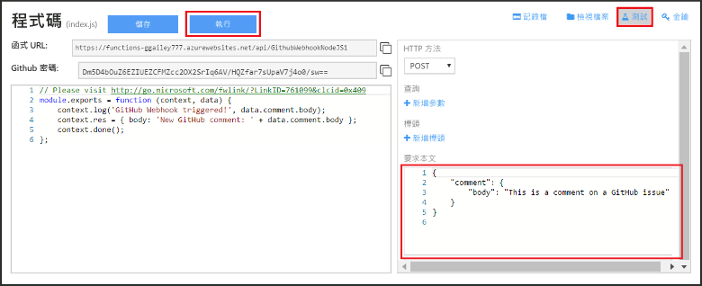

# 建立 Webhook 或 API Azure 函式
Azure Functions 是事件驅動、依需求計算的體驗，可讓您建立以各種程式設計語言實作的排程式或觸發式程式碼單位。 若要深入了解 Azure Functions，請參閱 [Azure Functions 概觀](functions-overview.md)。

本主題說明如何建立由 GitHub Webhook 叫用的 JavaScript 函式。 新的函式是根據 Azure Functions 入口網站中的預先定義範本所建立。 您也可以觀賞短片，了解如何在入口網站中執行這些步驟。

本教學課程中的一般步驟也可用來建立 C# 或 F# 而不是 JavaScript 函式。 

## 觀賞影片
下列影片示範如何執行本教學課程中的基本步驟 

>[!VIDEO https://channel9.msdn.com/Series/Windows-Azure-Web-Sites-Tutorials/Create-a-Web-Hook-or-API-Azure-Function/player]
>
>

## 必要條件

若要完成本教學課程，您需要下列項目：

+ 使用中的 Azure 帳戶。 如果您沒有帳戶，您可以[註冊免費的 Azure 帳戶](https://azure.microsoft.com/free/)。  
 您也可以使用[嘗試函式](https://functions.azure.com/try)經驗來完成此教學課程，而不需要 Azure 帳戶。
+ GitHub 帳戶。 如果您沒有帳戶，您可以[註冊免費的 GitHub 帳戶](https://github.com/join)。 

## 從範本建立 Webhook 觸發函式
函式應用程式可在 Azure 中主控函式的執行。 

1. 移至 [Azure Functions 入口網站](https://functions.azure.com/signin) ，然後以您的 Azure 帳戶登入。

2. 如果您要使用現有的函式應用程式，請從 [您的函式應用程式] 中選取，然後按一下 [開啟]。 若要建立函式應用程式，請輸入新函式應用程式的唯一 [名稱] 或接受所產生的名稱、選取您偏好的 [區域]，然後按一下 [建立 + 開始使用]。 

3. 在函式應用程式中，按一下 [+ 新增函式] > [GitHub Webhook - JavaScript] > [建立]。 此步驟會根據指定的範本以預設名稱建立函式。 您也可以建立 C# 或 F # 函式。
   
     

4. 在 [開發] 中，注意 [程式碼] 視窗中的範例 express.js 函式。 這個函式從問題註解 Webhook 接收 GitHub 要求、記錄問題文字，將回應傳送到 Webhook 當做 `New GitHub comment: <Your issue comment text>`。

     

1. 複製並儲存 [函式 URL] 和 [GitHub 密碼] 值。 您將在下一節中使用這些值，在 GitHub 中設定 webhook。 

2. 按一下 [測試]，注意 [要求主體]中問題註解之預先定義的 JSON 主體，然後按一下 [執行]。 

    
   
    > [!NOTE]
    > 只要提供所有預期主體的 JSON 資料，然後按一下 [執行] 按鈕，就可以在 [開發] 索引標籤中測試新的範本函式。 這樣範本就有問題註解的預先定義主體。 

接下來，您要在 GitHub 存放庫中建立實際的 Webhook。

## 設定 Webhook
1. 在 GitHub 中，瀏覽至您自己的存放庫。 您也可以使用您已分支的任何存放庫。
 
2. 按一下 [設定] > [Webhooks 和服務] > [新增 Webhook]。
   
       

3. 將函式的 URL 和密碼貼到 [承載 URL] 和 [密碼] 中，然後針對 [內容類型] 選取 [應用程式/json]。

4. 按一下 [讓我選擇個別事件]，選取 [問題註解]，然後按一下 [新增 Webhook]。
   
     

此時，GitHub Webhook 會設定成在加入新的問題註解時觸發您的函式。  
現在，請測試它。

## 測試函式
1. 在 GitHub 儲存機制的新瀏覽器視窗中開啟 [問題] 索引標籤。

2. 在新視窗中，按一下 [新增問題]，輸入標題，然後按一下 [提交新問題]。 您也可以開啟現有的問題。

2. 在問題中輸入註解，然後按一下 [註解] 。 

3. 在其他 GitHub 視窗中，按一下新 webhook 旁邊的 [編輯]，向下捲動至 [最近的傳遞]，並確認已傳送 Webhook 要求且回應本文為 `New GitHub comment: <Your issue comment text>`。

3. 回到 Functions 入口網站，向下捲動至記錄檔，查看已觸發的函式和已寫入資料流記錄檔的值 `New GitHub comment: <Your issue comment text>` 。

## 後續步驟
如需 Azure Functions 的詳細資訊，請參閱下列主題。

* [Azure Functions 開發人員參考](functions-reference.md)  
  可供程式設計人員撰寫函式程式碼時參考。
* [測試 Azure Functions](functions-test-a-function.md)  
  說明可用於測試函式的各種工具和技巧。
* [如何調整 Azure 函式](functions-scale.md)  
  討論 Azure Functions 可用的服務方案，包括使用情況主控方案，以及如何選擇正確的方案。  

[!INCLUDE [Getting Started Note](../../includes/functions-get-help.md)]

