# <a name="use-azure-functions-to-create-a-function-that-connects-to-other-azure-services"></a>使用 Azure Functions 來建立連接至其他 Azure 服務的函式

本主題說明如何在 Azure Functions 中建立函式，以接聽 Azure 儲存體佇列上的訊息，以及將訊息複製到 Azure 儲存體資料表中的資料列。 計時器觸發函式用將訊息載入佇列中。 第二個函式會從佇列讀取並將訊息寫入資料表中。 Azure Functions 會根據繫結定義為您建立佇列和資料表。 

更有趣的做法是以 JavaScript 撰寫一個函式，並另以 C# 指令碼撰寫另一個函式。 這可示範函式應用程式如何擁有使用不同語言的函式。 

您可以看到 [Channel 9 影片](https://channel9.msdn.com/Series/Windows-Azure-Web-Sites-Tutorials/Create-an-Azure-Function-which-binds-to-an-Azure-service/player)中示範的這個案例。

## <a name="create-a-function-that-writes-to-the-queue"></a>建立可寫入佇列的函式

您必須先建立可載入訊息佇列的函式，才可以連接到儲存體佇列。 這個 JavaScript 函式使用計時器觸發程序，每隔 10 秒將訊息寫入佇列。 如果您沒有 Azure 帳戶，請查看[試用 Azure Functions](https://functions.azure.com/try) 體驗，或[建立免費的 Azure 帳戶](https://azure.microsoft.com/free/)。

1. 移至 Azure 入口網站，並找出您的函式應用程式。

2. 按一下 [新增函式] > [TimerTrigger JavaScript]。 

3. 將函式命名為 **FunctionsBindingsDemo1**，針對 [排程] 輸入 cron 運算式值 `0/10 * * * * *`，然後按一下 [建立]。
   
    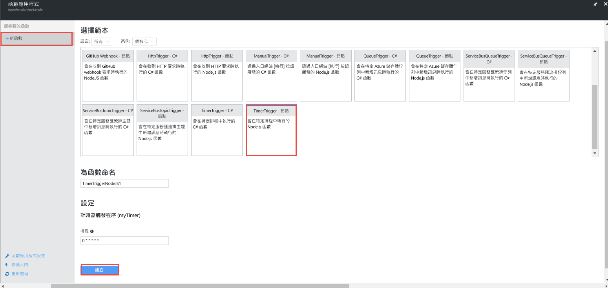

    您現在已建立會每隔 10 秒執行一次的計時器觸發函式。

5. 在 [開發] 索引標籤上，按一下 [記錄檔] 並檢視記錄檔中的活動。 您會看到每隔 10 秒寫入的記錄檔項目。
   
    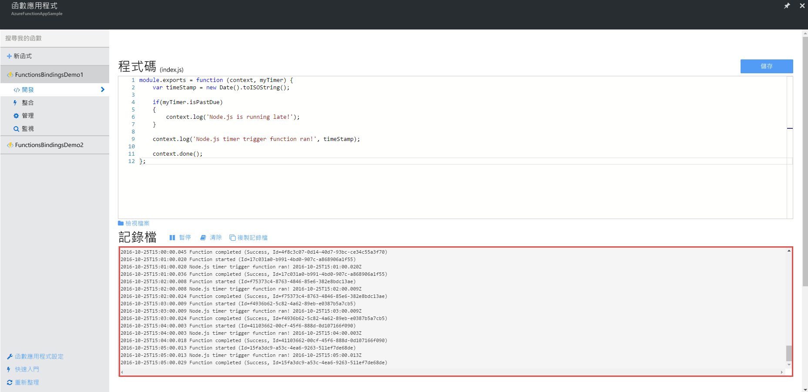

## <a name="add-a-message-queue-output-binding"></a>新增訊息佇列輸出繫結

1. 在 [整合] 索引標籤上，選擇 [新增輸出] > [Azure 佇列儲存體] > [選取]。

    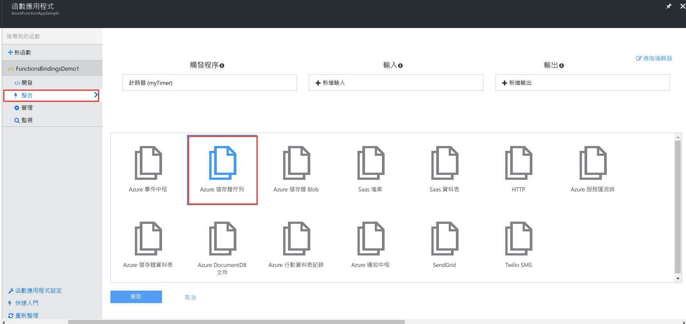

2. 輸入 `myQueueItem` 做為 [訊息參數名稱] 以及輸入 `functions-bindings` 做為 [佇列名稱]，選取現有的 [儲存體帳戶連線]，或按一下 [新增] 以建立儲存體帳戶連線，然後按一下 [儲存]。  

    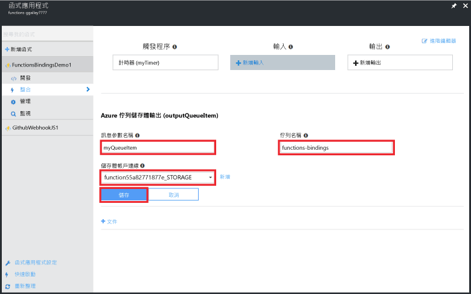

1. 回到 [開發] 索引標籤，將下列程式碼附加至函式︰
   
    ```javascript
   
    function myQueueItem() 
    {
        return {
            msg: "some message goes here",
            time: "time goes here"
        }
    }
   
    ```
2. 找出 if 陳述式 (大約在函式的第 9 行)，並在該陳述式之後插入下列程式碼。
   
    ```javascript
   
    var toBeQed = myQueueItem();
    toBeQed.time = timeStamp;
    context.bindings.myQueueItem = toBeQed;
   
    ```  
   
    此程式碼會建立 **myQueueItem**，並將其 [時間] 屬性設定為目前的 timeStamp。 然後，它會將新的佇列項目新增至內容的 **myQueueItem** 繫結。

3. 按一下 [儲存並執行]。

## <a name="view-storage-updates-by-using-storage-explorer"></a>使用儲存體總管來檢視儲存體更新
您可以檢視您所建立的佇列中的訊息，以確認您的函式運作正常。  您可以使用 Visual Studio 中的雲端總管連接到您的儲存體佇列。 不過，透過入口網站即可輕鬆使用 Microsoft Azure 儲存體總管連接到儲存體帳戶。

1. 在 [整合] 索引標籤中，按一下您的佇列輸出繫結 > [文件]，然後取消隱儲存體帳戶的藏連接字串並複製該值。 您可以使用此值來連接到您的儲存體帳戶。

    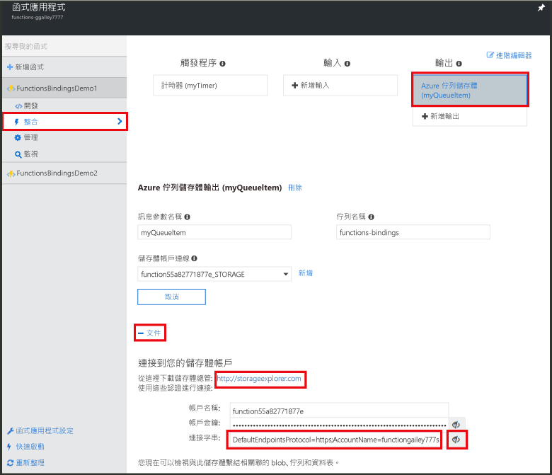


2. 如果您還沒有這麼做，請下載並安裝 [Microsoft Azure 儲存體總管](http://storageexplorer.com)。 
 
3. 在儲存體總管中，按一下連接到 Azure 儲存體圖示，在欄位中貼上連接字串，並完成精靈。

    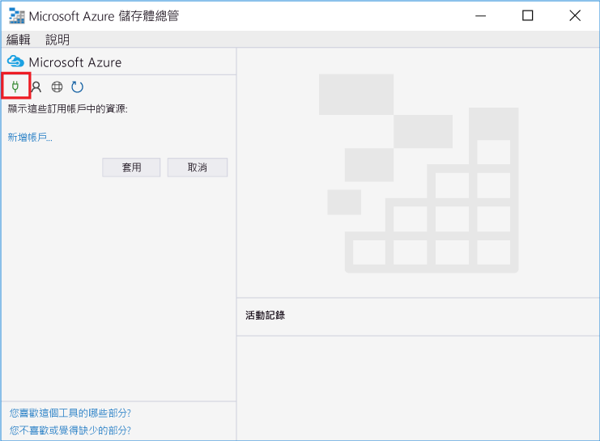

4. 在 [本機和附加] 之下，展開 [儲存體帳戶] > 您的儲存體帳戶 > [佇列] > [functions-bindings]，並確認訊息會寫入佇列。

    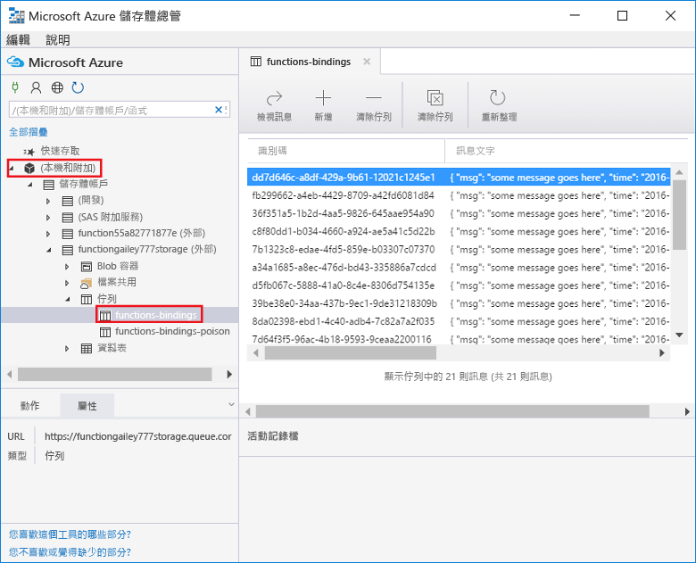

    如果佇列不存在或是空的，很可能是您的函式繫結或程式碼有問題。

## <a name="create-a-function-that-reads-from-the-queue"></a>建立可從佇列讀取訊息的函式

您已將訊息新增至佇列，您可以建立另一個函式，以便從佇列讀取訊息並將訊息永久寫入 Azure 儲存體資料表。

1. 按一下 [新增函式] > [QueueTrigger-CSharp]。 
 
2. 將函式命名為 `FunctionsBindingsDemo2`，在 [佇列名稱] 欄位中輸入 **functions-bindings**，選取現有的儲存體帳戶或加以建立，然後按一下 [建立]。

    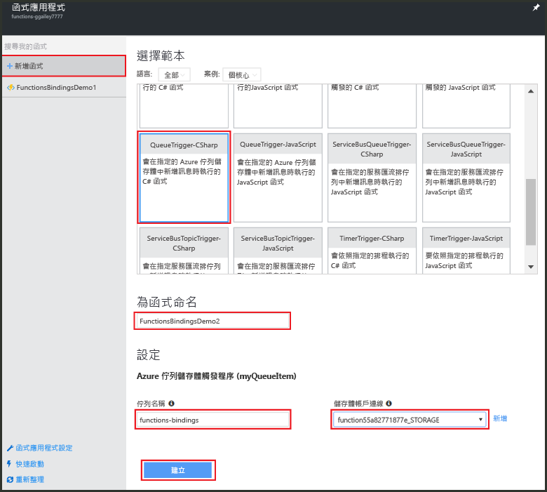 

3. (選擇性) 您可以如先前一樣在儲存體總管中檢視新的佇列，以確認新的函式運作正常。 您也可以使用 Visual Studio 中的雲端總管。  

4. (選擇性) 重新整理 **functions-bindings** 佇列，並請注意已從佇列中移除項目。 發生移除的原因是函式已繫結至 **functions-bindings** 佇列做為輸入觸發程序，而且此函式會讀取佇列。 
 
## <a name="add-a-table-output-binding"></a>新增資料表輸出繫結

1. 在 FunctionsBindingsDemo2 中，按一下 [整合] > [新增輸出] > [Azure 資料表儲存體] > [選取]。

    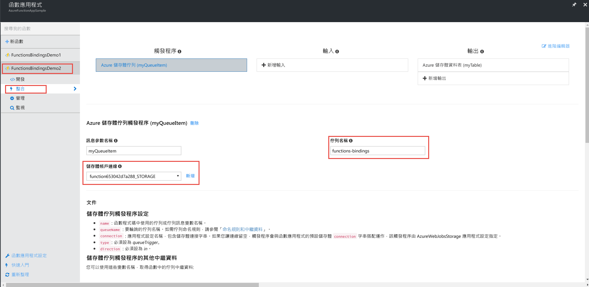 

2. 輸入 `TableItem` 做為 [資料表名稱] 以及輸入 `functionbindings` 做為 [資料表參數名稱]，選擇 [儲存體帳戶連線] 或建立新的連線，然後按一下 [儲存]。

    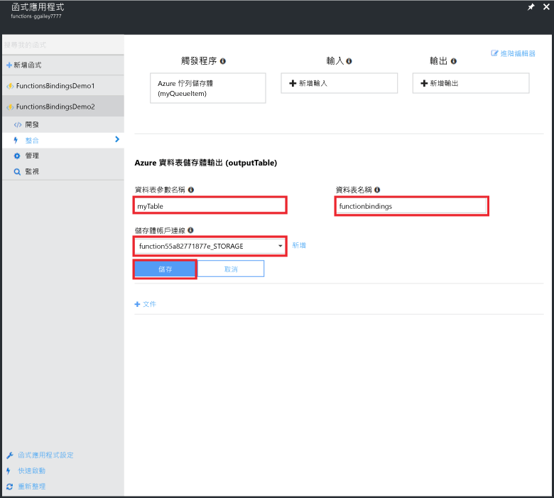
   
3. 在 [開發] 索引標籤中，以下列程式碼取代現有的函式程式碼︰
   
    ```cs
    
    using System;
    
    public static void Run(QItem myQueueItem, ICollector<TableItem> myTable, TraceWriter log)
    {    
        TableItem myItem = new TableItem
        {
            PartitionKey = "key",
            RowKey = Guid.NewGuid().ToString(),
            Time = DateTime.Now.ToString("hh.mm.ss.ffffff"),
            Msg = myQueueItem.Msg,
            OriginalTime = myQueueItem.Time    
        };
        
        // Add the item to the table binding collection.
        myTable.Add(myItem);
    
        log.Verbose($"C# Queue trigger function processed: {myItem.RowKey} | {myItem.Msg} | {myItem.Time}");
    }
    
    public class TableItem
    {
        public string PartitionKey {get; set;}
        public string RowKey {get; set;}
        public string Time {get; set;}
        public string Msg {get; set;}
        public string OriginalTime {get; set;}
    }
    
    public class QItem
    {
        public string Msg { get; set;}
        public string Time { get; set;}
    }
    ```
    **TableItem** 類別代表儲存體資料表中的資料列，而且您將此項目新增至 **TableItem** 物件的 `myTable` 集合。 您必須設定 **PartitionKey** 和 **RowKey** 屬性，才能插入資料表中。

4. 按一下 [儲存] 。  (選擇性) 您可以在儲存體總管或 Visual Studio 雲端總管中檢視資料表，以確認此函式運作正常。

5. (選擇性) 在儲存體總管中您的儲存體帳戶中，展開 [資料表] >  [functionsbindings]，並確認資料列已新增到資料表。 您可以在 Visual Studio 的雲端總管中執行相同作業。

    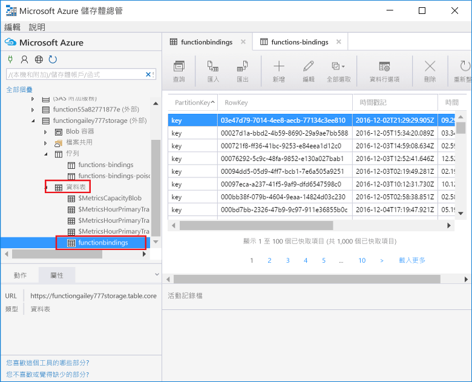

    如果資料表不存在或是空的，很可能是您的函式繫結或程式碼有問題。 
 
[!INCLUDE [More binding information](../../includes/functions-bindings-next-steps.md)]

## <a name="next-steps"></a>後續步驟
如需 Azure Functions 的詳細資訊，請參閱下列主題。

* [Azure Functions 開發人員參考](functions-reference.md)  
  可供程式設計人員撰寫函數程式碼及定義觸發程序和繫結時參考。
* [測試 Azure Functions](functions-test-a-function.md)  
  說明可用於測試函式的各種工具和技巧。
* [如何調整 Azure 函式](functions-scale.md)  
  討論 Azure Functions 可用的服務方案，包括使用情況主控方案，以及如何選擇正確的方案。 

[!INCLUDE [Getting help note](../../includes/functions-get-help.md)]


<!--HONumber=Feb17_HO1-->


