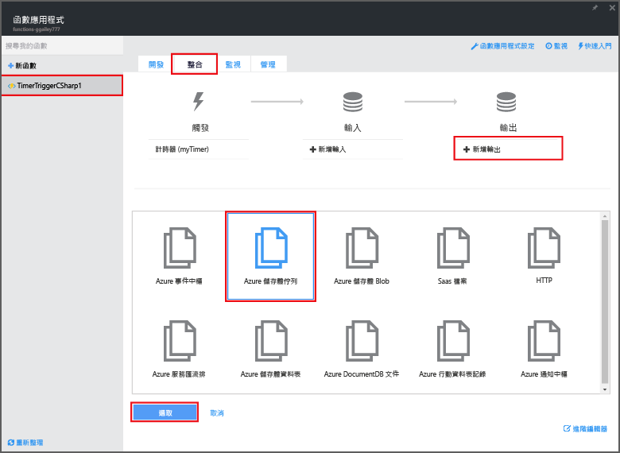
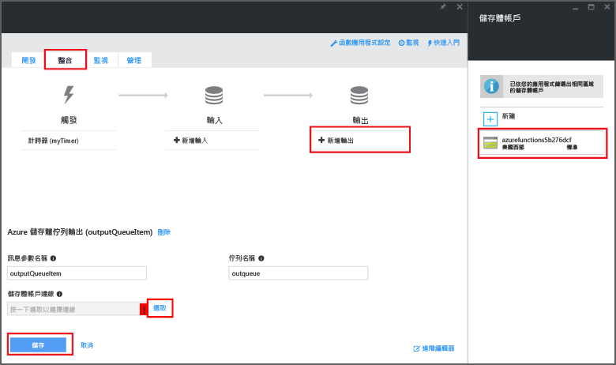

<properties
   pageTitle="建立事件處理函式 | Microsoft Azure"
   description="使用 Azure Functions 建立會根據事件計時器執行的 C# 函式。"
   services="functions"
   documentationCenter="na"
   authors="ggailey777"
   manager="erikre"
   editor=""
   tags=""
   />

<tags
   ms.service="functions"
   ms.devlang="multiple"
   ms.topic="get-started-article"
   ms.tgt_pltfrm="multiple"
   ms.workload="na"
   ms.date="09/25/2016"
   ms.author="glenga"/>
   
# 建立事件處理 Azure 函式

Azure Functions 是事件驅動、依需求計算的體驗，可讓您建立以各種程式設計語言實作的已排程或觸發的程式碼單位。若要深入了解 Azure Functions，請參閱 [Azure Functions 概觀](functions-overview.md)。

本主題說明如何在 C# 中建立新的函式，而該函式以事件計時器為基礎執行，將訊息新增至儲存體佇列。

## 必要條件 

您必須先具備有效的 Azure 帳戶，才可以建立函式。如果您還沒有 Azure 帳戶，[可以使用免費帳戶](https://azure.microsoft.com/free/)。

## 從範本建立計時器觸發函式

函式應用程式可在 Azure 中主控函式的執行。您必須先具備有效的 Azure 帳戶，才可以建立函式。如果您還沒有 Azure 帳戶，[可以使用免費帳戶](https://azure.microsoft.com/free/)。

1. 移至 [Azure Functions 入口網站](https://functions.azure.com/signin)，然後以您的 Azure 帳戶登入。

2. 如果您要使用現有的函式應用程式，請從 [Your function apps]\(函式應用程式) 中選取，然後按一下 [開啟]。若要建立新的函式應用程式，請輸入新函式應用程式的唯一 [名稱] 或接受所產生的名稱，選取您偏好的 [區域]，然後按一下 [Create + get started]\(建立 + 開始)。

3. 在函數應用程式中，按一下 [+ New Function]\(+ 新增函數) > [TimerTrigger - C#] > [建立]。這會以預設名稱建立函數，此函數會以每分鐘一次的預設排程來執行。

	

4. 在新的函數中，按一下 [整合] 索引標籤 > [新輸出] > [Azure 儲存體佇列] > [選取]。

	

5. 在 [Azure 儲存體佇列輸出] 中，選取現有的**儲存體帳戶連線**或建立新的連線，然後按一下 [儲存]。

	

6. 回到 [開發] 索引標籤，以下列程式碼取代 [程式碼] 視窗中現有的 C# 指令碼：

		using System;
		
		public static void Run(TimerInfo myTimer, out string outputQueueItem, TraceWriter log)
		{
		    // Add a new scheduled message to the queue.
		    outputQueueItem = $"Ping message added to the queue at: {DateTime.Now}.";
		    
		    // Also write the message to the logs.
		    log.Info(outputQueueItem);
		}

	此程式碼會將新訊息加入至佇列，並顯示執行函式的最新日期和時間。

7. 按一下 [儲存] 並觀察下一個函式執行的 [記錄] 視窗。

8. (選擇性) 瀏覽至儲存體帳戶，並確認訊息新增至佇列。

9. 返回至 [整合] 索引標籤，並將排程欄位變更為 `0 0 * * * *`。函式現在會每小時執行一次。

這是計時器觸發程序和儲存體佇列輸出繫結非常簡化的範例。如需詳細資訊，請參閱 [Azure Functions 計時器觸發程序](functions-bindings-timer.md)和 [Azure 儲存體的 Azure Functions 觸發程序和繫結](functions-bindings-storage.md)主題。

##後續步驟

如需 Azure Functions 的詳細資訊，請參閱下列主題。

+ [Azure Functions 開發人員參考](functions-reference.md) 可供程式設計人員撰寫函式程式碼及定義觸發程序和繫結時參考。
+ [測試 Azure Functions](functions-test-a-function.md) 說明可用於測試函式的各種工具和技巧。
+ [如何調整 Azure 函式](functions-scale.md)討論 Azure Functions 可用的服務方案，包括動態服務方案，以及如何選擇正確的方案。

[AZURE.INCLUDE [開始使用注意事項](../../includes/functions-get-help.md)]

<!---HONumber=AcomDC_0928_2016-->
