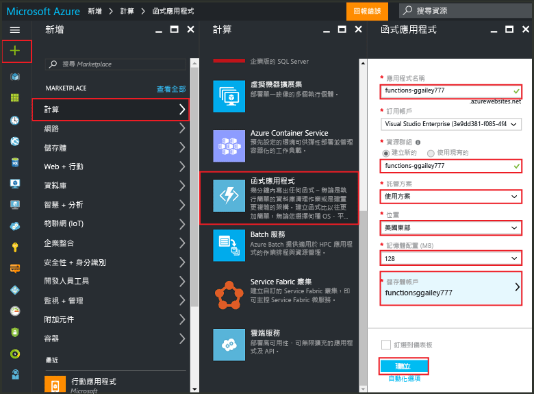
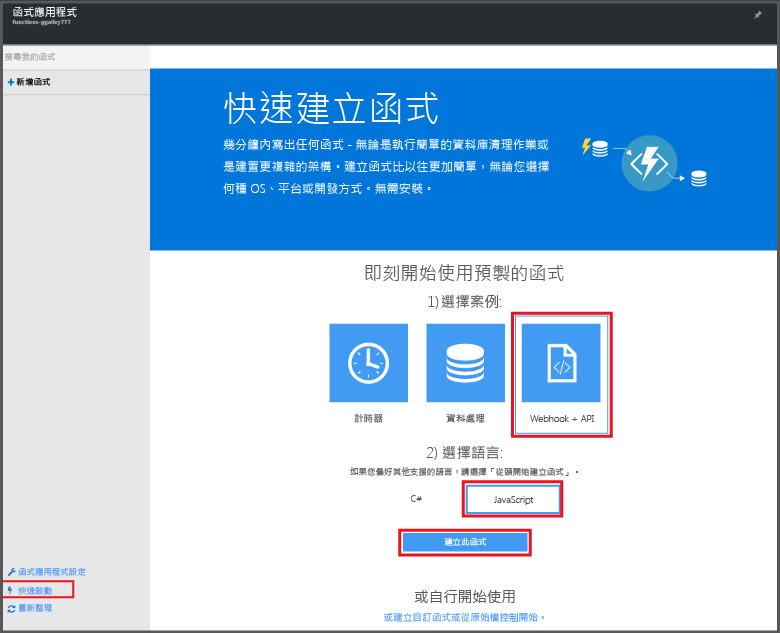

# 從 Azure 入口網站建立函式
## 概觀
Azure Functions 是事件取向的隨選計算體驗並擴充了現有的 Azure 應用程式平台，使其可實作其他 Azure 服務、SaaS 產品和內部部署系統內事件所觸發的程式碼。 透過 Azure Functions，您的應用程式會根據需求調整，而您只需要支付所用資源的費用。 Azure Functions 可您建立以各種程式設計語言實作的已排程或已觸發程式碼單位。 若要深入了解 Azure Functions，請參閱 [Azure Functions 概觀](functions-overview.md)。

本主題說明如何使用 Azure 入口網站建立由 HTTP 觸發程序叫用的簡單 "hello world" Node.js Azure 函式。 在您可以於 Azure 入口網站中建立函式之前，您必須在 Azure App Service 中明確建立一個函數應用程式。 如果要讓系統為您自動建立函數應用程式，請參閱 [另一篇 Azure Functions 快速入門教學課程](functions-create-first-azure-function.md)，該文章提供較為簡單的快速入門體驗，且包含一部影片。

## 建立函數應用程式
函式應用程式可在 Azure 中主控函式的執行。 如果您沒有 Azure 帳戶，請查看[試用 Functions](https://functions.azure.com/try) 體驗或[建立免費的 Azure 帳戶](https://azure.microsoft.com/free/)。 請遵循下列步驟來在 Azure 入口網站中建立函數應用程式。

1. 移至 [Azure 入口網站](https://portal.azure.com) ，然後以您的 Azure 帳戶登入。
2. 按一下 [+新增]  >  [計算]  >  [函式應用程式]，選取您的 [訂用帳戶]，輸入可識別您函式應用程式的唯一 [應用程式名稱]，然後指定下列設定：
   
   * **[資源群組](../azure-resource-manager/resource-group-overview.md)**：選取 [新建] 並為您的新資源群組輸入名稱。 您也可以選擇現有的資源群組，不過您可能無法為函式應用程式建立以取用量為基礎的 App Service 方案。
   * **主控方案**可以是下列其中一項： 
     * **取用方案**：Azure Functions 的預設方案類型。 當您選擇取用方案時，您也必須選擇 [位置] 並設定 [記憶體配置] (以 MB 為單位)。 如需記憶體配置如何影響成本的詳細資訊，請參閱 [Azure Functions 定價](https://azure.microsoft.com/pricing/details/functions/)。 
     * **App Service 方案**：傳統 App Service 方案需要您建立一個 (或選取現有的)「App Service 方案/位置」。 這些設定決定與您的應用程式相關聯的 [位置、功能、成本和計算資源](https://azure.microsoft.com/pricing/details/app-service/) 。  
   * **儲存體帳戶**：每個函數應用程式都需要一個儲存體帳戶。 您可以選擇現有的儲存體帳戶或是建立帳戶。 
     
     

    請注意，您必須輸入有效的「App 名稱」，該名稱只可包含字母、數字和連字號。 不允許使用底線 (**_**) 字元。

3. 按一下 [建立]  以佈建並部署新的函數應用程式。  

佈建函數應用程式之後，您便可以建立您的第一個函式。

## 建立函式
這些步驟會從 Azure Functions 快速入門建立一個函式。

1. 在 [快速入門] 索引標籤中，按一下 [WebHook + API] 及 [JavaScript]，然後按一下 [建立函式]。 隨即建立新的預先定義的 Node.js 函式。 
   
    

2. (選擇性) 此時，您可以在快速入門中，選擇在入口網站中進行 Azure Functions 功能的快速導覽。    完成或跳過本教學課程之後，您可以使用 HTTP 觸發程序來測試新函式。

## 測試函式
[!INCLUDE [Functions quickstart test](../../includes/functions-quickstart-test.md)]

## 後續步驟
[!INCLUDE [Functions quickstart next steps](../../includes/functions-quickstart-next-steps.md)]

[!INCLUDE [Getting Started Note](../../includes/functions-get-help.md)]

