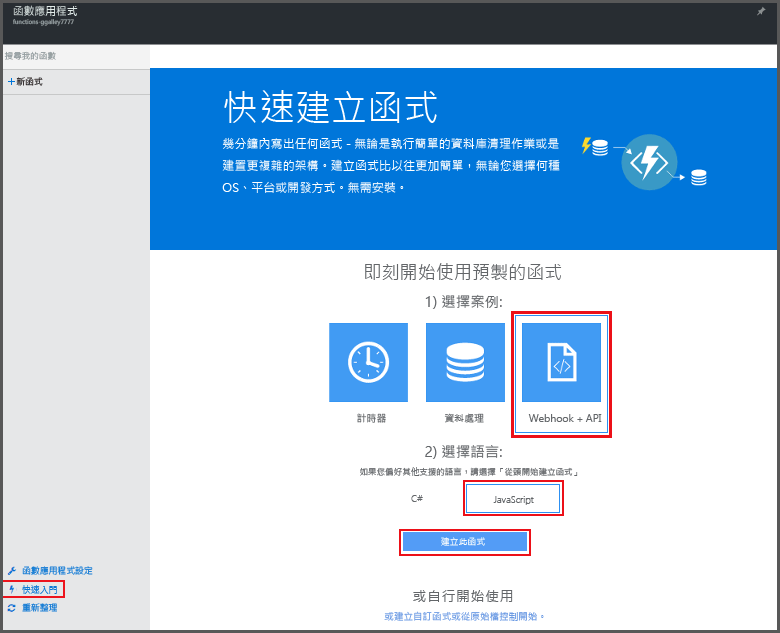

# 建立您的第一個 Azure 函式

本主題說明如何在入口網站中使用 Azure Functions 快速入門，建立由 HTTP 要求叫用的簡單 "hello world" 函式。 若要深入了解 Azure Functions，請參閱 [Azure Functions 概觀](functions-overview.md)。

開始之前，您必須具有 Azure 帳戶。 有[免費帳戶](https://azure.microsoft.com/free/)可供使用。 您也可以[試用 Azure Functions](https://azure.microsoft.com/try/app-service/functions/)，而不需向 Azure 註冊。

## 從入口網站快速入門建立函式

1. 移至 [Azure Functions 入口網站](https://functions.azure.com/signin)，然後以您的 Azure 帳戶登入。 
 
2. 輸入新函式應用程式的唯一 [名稱] 或接受自動產生的名稱，選取您偏好的 [區域]，然後按一下 [建立 + 開始]。 有效名稱只能包含字母、數字和連字號。 不允許使用底線 (**_**) 字元。

3. 在 [快速入門] 索引標籤中，按一下 [WebHook + API] 並選擇您的函式語言，然後按一下 [建立函式]。 隨即以您所選的語言建立新的預先定義函式。 
   
    

4. (選擇性) 此時，您可以在快速入門中，選擇在入口網站中進行 Azure Functions 功能的快速導覽。 完成或跳過本教學課程之後，您可以藉由傳送 HTTP 要求來測試新函式。

## 測試函式
[!INCLUDE [Functions quickstart test](../../includes/functions-quickstart-test.md)]

## 觀賞影片
下列影片示範如何在本教學課程中執行基本步驟。 

> [!VIDEO https://channel9.msdn.com/Series/Windows-Azure-Web-Sites-Tutorials/Create-your-first-Azure-Function-simple/player]
> 

## 後續步驟
[!INCLUDE [Functions quickstart next steps](../../includes/functions-quickstart-next-steps.md)]

[!INCLUDE [Getting Started Note](../../includes/functions-get-help.md)]

