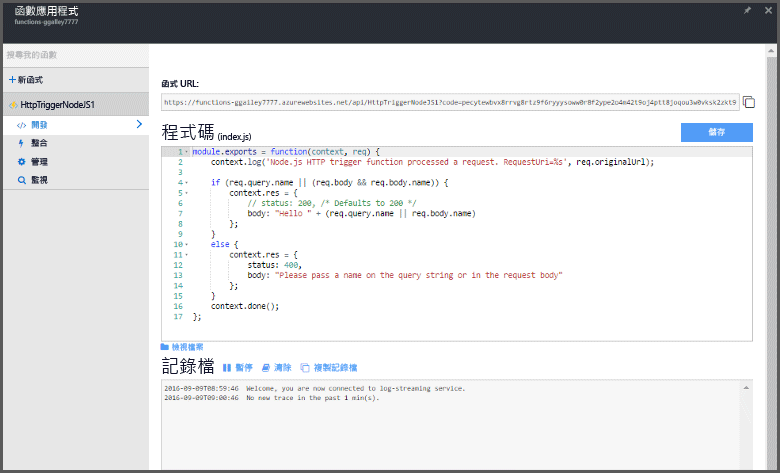

# 在 Azure 入口網站中建立您的第一個函式

本主題顯示如何使用 Azure Functions 來建立由 HTTP 要求所叫用的 "hello world" 函式。 在 Azure 入口網站中建立函式之前，您必須建立函式應用程式，以裝載函式的無伺服器執行。

若要完成此快速入門，您必須有 Azure 帳戶。 有[免費帳戶](https://azure.microsoft.com/free/)可供使用。 您也可以[試用 Azure Functions](https://azure.microsoft.com/try/app-service/functions/)，而不需向 Azure 註冊。

## 登入 Azure

登入 [Azure 入口網站](https://portal.azure.com/)。

## 建立函數應用程式

[!INCLUDE [functions-create-function-app-portal](../../includes/functions-create-function-app-portal.md)]

如需詳細資訊，請參閱[從 Azure 入口網站建立函數應用程式](functions-create-function-app-portal.md).

## 建立函式
透過使用 Azure Functions 快速入門中的這些步驟，在新的函數應用程式中建立函式。

1. 依序按一下 [新增] 按鈕和 [WebHook + API]，並選擇您的函式語言，然後按一下 [建立函式]。 隨即使用 HTTP 觸發的函式範本，以您所選的語言來建立函式。  
   
    

建立函式之後，您可以傳送 HTTP 要求來進行測試。

## 測試函式

因為函式範本包含可運作的程式碼，所以您可以立即在入口網站中測試新函式。

1. 在函式應用程式中，按一下新函式，然後檢閱範本的程式碼。 請注意函式預期 HTTP 要求有在訊息本文或查詢字串中傳遞的 *name* 值。 此函式執行時，回應訊息中會傳回這個值。 所顯示的範例是 JavaScript 函式。
   
2. 按一下 [執行] 來執行函式。 您會看到執行是由測試 HTTP 要求所觸發，資訊會寫入記錄，而 "hello..." 回應會顯示在 [測試] 索引標籤的 [輸出] 中。
 
    

3. 在 [要求本文] 文字方塊中，將 name 屬性的值變更為您的名稱，再按一下 [執行]。 目前，[輸出] 中的回應會包含您的名稱。   

4. 若要從 HTTP 測試工具或另一個瀏覽器視窗觸發相同函式的執行，請按一下 [< /> 取得函式 URL]，並複製要求 URL，然後將它貼到工具或瀏覽器網址列中。 將查詢字串值 `&name=yourname` 附加至 URL 並執行要求。 相同的資訊會寫入記錄，而相同的字串包含在回應訊息的本文中。

    

## 後續步驟
[!INCLUDE [Functions quickstart next steps](../../includes/functions-quickstart-next-steps.md)]

[!INCLUDE [Getting Started Note](../../includes/functions-get-help.md)]

