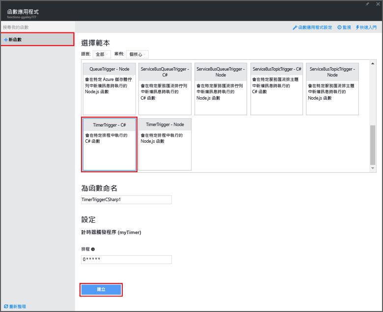

<properties
   pageTitle="使用 Azure Functions 執行排程的清除工作 | Microsoft Azure"
   description="使用 Azure Functions 建立會根據事件計時器執行的 C# 函數。"
   services="azure-functions"
   documentationCenter="na"
   authors="ggailey777"
   manager="erikre"
   editor=""
   tags=""
   />

<tags
   ms.service="functions"
   ms.devlang="multiple"
   ms.topic="article"
   ms.tgt_pltfrm="multiple"
   ms.workload="na"
   ms.date="06/05/2016"
   ms.author="glenga"/>
   
# 使用 Azure Functions 執行排程的清除工作

本主題將示範如何使用 Azure Functions，以 C# 建立可根據事件計時器執行的新函數，來清除資料庫資料表中的資料列。新的函式是根據 Azure Functions 入口網站中的預先定義範本所建立。若要支援此案例，您也必須在函數應用程式中設定資料庫連接字串以做為 App Service 設定。

## 必要條件 

您必須先具備有效的 Azure 帳戶，才可以建立函式。如果您還沒有 Azure 帳戶，[可以使用免費帳戶](https://azure.microsoft.com/free/)。

本主題將示範在 SQL Database 中名為 TodoItems 的資料表中執行大量清除作業的 Transact-SQL 命令。當您完成 [Azure App Service Mobile Apps 快速入門教學課程](../app-service-mobile/app-service-mobile-ios-get-started.md)時，即會建立這個相同的 TodoItems 資料表。您也可以使用範例資料庫，如果您選擇使用不同的資料表，您將需要修改命令。

你可以在入口網站中 [所有設定] > [應用程式設定] > [連接字串] > [顯示連接字串值] > [MS\_TableConnectionString] 下方，取得行動應用程式後端所使用的連接字串。您也可以在入口網站中 [所有設定] > [屬性] > [顯示資料庫連接字串] > [ADO.NET (SQL 驗證)] 下方，直接從 SQL Database 中取得連接字串。

此案例會對資料庫使用大量作業。若要讓您的函數程序在 Mobile Apps 資料表中進行個別的 CRUD 作業，您應該改用行動資料表繫結。

## 在函數應用程式中設定 SQL Database 連接字串

函式應用程式可在 Azure 中主控函式的執行。在函數應用程式設定中儲存連接字串和其他機密資料是最佳做法。這可以避免當您的函數程式碼在儲存機制中的某處結束時發生意外洩漏。

1. 移至 [Azure Functions 入口網站](https://functions.azure.com/signin)，然後以您的 Azure 帳戶登入。

2. 如果您要使用現有的函數應用程式，可從 [Your function apps] (您的函數應用程式) 中加以選取，然後按一下 [開啟]。若要建立新的函數應用程式，可輸入新函數應用程式的唯一**名稱**或接受所產生的名稱、選取您偏好的**區域**，然後按一下 [Create + get started] (建立 + 開始)。

3. 在您的函數應用程式中，按一下 [函數應用程式設定] > [移至 App Service 設定]。

	

4. 在函數應用程式中，按一下 [所有設定]、向下捲動至 [應用程式設定]，然後在 [連接字串] 下方針對**名稱**輸入 `sqldb_connection`、將連接字串貼入 [值] 中、按一下 [儲存]，然後關閉函數應用程式刀鋒視窗以返回 Functions 入口網站。

    

現在，您可以加入 C# 函數程式碼來連接到 SQL Database。

## 從範本建立計時器觸發函數

1. 在函數應用程式中，按一下 [+ New Function] (+ 新增函數) > [TimerTrigger - C#] > [建立]。這會以預設名稱建立函數，此函數會以每分鐘一次的預設排程來執行。 

	

2. 在 [開發] 索引標籤的 [程式碼] 窗格中，在現有的函數程式碼上方加入下列組件參考：

		#r "System.Configuration"
		#r "System.Data"

3. 將下列 `using` 陳述式加入至函數：

		using System.Configuration;
		using System.Data.SqlClient;
		using System.Threading.Tasks; 

4. 使用下列程式碼來取代現有的 **Run** 函數：

		public static async Task Run(TimerInfo myTimer, TraceWriter log)
		{
		    var str = ConfigurationManager.ConnectionStrings["sqldb_connection"].ConnectionString;
		    using (SqlConnection conn = new SqlConnection(str))
		    {
		        conn.Open();
		        var text = "DELETE from dbo.TodoItems WHERE Complete='True'";
		        using (SqlCommand cmd = new SqlCommand(text, conn))
		        {
					// Execute the command and log the # rows deleted.
		            var rows = await cmd.ExecuteNonQueryAsync();
		            log.Info($"{rows} rows were deleted");
		        }
		    }
		}

5. 按一下 [儲存]、針對下一個函數執行監看 [記錄] 視窗，然後記下從 TodoItems 資料表中刪除的資料列數目。

6. (選擇性) 使用 [Mobile Apps 快速入門應用程式](../app-service-mobile/app-service-mobile-ios-get-started.md)、將其他項目標示為「已完成」，然後返回 [記錄] 視窗，並監看在下一個執行期間該函數會刪除同樣數目的資料列。

##後續步驟

如需 Azure Functions 的詳細資訊，請參閱下列主題。

+ [Azure Functions 開發人員參考](functions-reference.md) 可供程式設計人員撰寫函數程式碼及定義觸發程序和繫結時參考。
+ [測試 Azure Functions](functions-test-a-function.md) 說明可用於測試函數的各種工具和技巧。
+ [如何調整 Azure Functions](functions-scale.md) 討論 Azure Functions 可用的服務方案，包括動態服務方案，以及如何選擇正確的方案。  

[AZURE.INCLUDE [開始使用注意事項](../../includes/functions-get-help.md)]

<!---HONumber=AcomDC_0615_2016-->