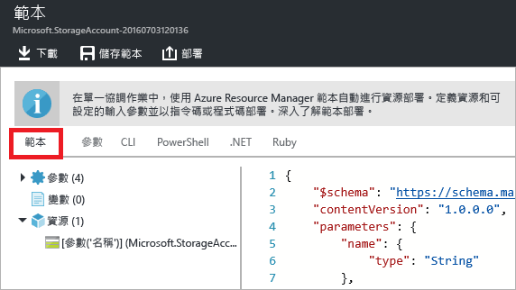
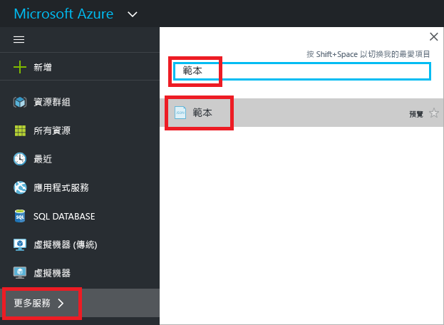
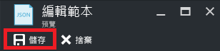

# <a name="export-an-azure-resource-manager-template-from-existing-resources"></a>從現有資源匯出 Azure Resource Manager 範本
在本文中，您將了解如何從您訂用帳戶中的現有資源匯出 Resource Manager 範本。 您可以使用這個產生的範本，來深入了解範本語法。

有兩種方式可以匯出範本：

* 您可以匯出**用於部署的實際範本**。 匯出的範本包含與原始範本完全相同的所有參數和變數。 如果您透過入口網站部署資源，而且想要知道範本如何建立這些資源，則這種方法十分有用。 此範本立即可用。 
* 您可以匯出**代表資源群組目前狀態的已產生範本**。 匯出的範本不是以任何用於部署的範本為基礎。 反而，它所建立的範本是資源群組的快照。 匯出的範本會有許多硬式編碼值，但數量可能不如您通常會定義的參數數量。 當您在部署之後修改資源群組時，這種方法十分有用。 此範本通常需要修改才能使用。

本主題說明透過入口網站的兩種方法。

## <a name="deploy-resources"></a>部署資源
請開始將可用於匯出為範本的資源部署至 Azure。 如果您的訂用帳戶中已有想要匯出至範本的資源群組，就可以略過本節。 本文的其餘部分假設您已部署本節中所顯示的 Web 應用程式和 SQL 資料庫解決方案。 如果您使用不同的解決方案，則體驗可能會稍有不同，但匯出範本的步驟相同。 

1. 在 [Azure 入口網站](https://portal.azure.com)中，選取 [新增]。
   
      ![選取 [新增]](./media/resource-manager-export-template/new.png)
2. 搜尋 **Web 應用程式 + SQL**，並從可用的選項加以選取。
   
      

3. 選取 [ **建立**]。

      ![選取 [建立]](./media/resource-manager-export-template/create.png)

4. 提供 Web 應用程式和 SQL 資料庫的必要值。 選取 [ **建立**]。

      

部署可能需要一會兒的時間。 部署完成後，您的訂用帳戶就會包含解決方案。

## <a name="view-template-from-deployment-history"></a>從部署記錄中檢視範本
1. 移至您的新資源群組的 [資源群組] 刀鋒視窗。 請注意，刀鋒視窗會顯示最後部署的結果。 選取此連結。
   
      
2. 您會看到群組的部署歷程記錄。 在您的案例中，刀鋒視窗可能只列出一個部署。 選取此部署。
   
     
3. 刀鋒視窗會顯示部署的摘要。 摘要包含部署和其作業的狀態，與您為參數所提供的值。 若要查看用於部署的範本，請選取 [檢視範本] 。
   
     
4. Resource Manager 會為您擷取下列七個檔案：
   
   1. **範本** - 用於定義解決方案之基礎結構的範本。 當您透過入口網站建立儲存體帳戶時，Resource Manager 會使用範本來部署它，並且儲存該範本供日後參考。
   2. **參數** - 您可以在部署期間用來傳入值的參數檔案。 它會包含您在第一次部署期間所提供的值。 當您重新部署範本時，即可變更所有這些值。
   3. **CLI** - 您可以為了部署範本而使用的 Azure 令列介面 (CLI) 指令碼檔案。
   3. **CLI 2.0** - 您可以為了部署範本而使用的 Azure 令列介面 (CLI) 指令碼檔案。
   4. **PowerShell** - 您可以為了部署範本而使用的 Azure PowerShell 指令碼檔案。
   5. **.NET** - 您可以為了部署範本而使用的 .NET 類別。
   6. **Ruby** - 您可以為了部署範本而使用的 Ruby 類別。
      
      這些檔案可以透過刀鋒視窗的連結取得。 根據預設，刀鋒視窗會顯示範本。
      
       
      
此範本是用來建立 Web 應用程式和 SQL 資料庫的實際範本。 請注意，其中包含的參數可讓您在部署期間提供不同的值。 若要深入了解範本的結構，請參閱 [編寫 Azure Resource Manager 範本](resource-group-authoring-templates.md)。

## <a name="export-the-template-from-resource-group"></a>從資源群組匯出範本
如果您已手動變更資源或在多個部署中新增資源，則從部署記錄中擷取範本並不會反映資源群組的目前狀態。 本節說明您如何匯出反映資源群組目前狀態的範本。 

> [!NOTE]
> 您無法針對具有超過 200 個資源的資源群組匯出範本。
> 
> 

1. 若要檢視資源群組的範本，請選取 [自動化指令碼] 。
   
      
   
     Resource Manager 會評估資源群組中的資源，並產生這些資源的範本。 並非所有的資源類型都支援匯出範本功能。 您可能會看到一則錯誤，指出匯出發生問題。 您會在 [修正匯出問題](#fix-export-issues) 一節中了解如何處理這些問題。
2. 同樣地，您會看到可用來重新部署解決方案的六個檔案。 不過，此範本目前會稍有不同。 請注意，已產生的範本所包含的參數，會比上一節中範本所包含的參數更少。 此外，許多值 (如位置和 SKU 值) 都是硬式編碼在這個範本中，而不接受參數值。 重複使用此範本之前，您可能會想要編輯範本，以善用參數。 
   
3. 有幾個選項可供您繼續使用此範本。 您可以下載範本，並在本機使用 JSON 編輯器來處理範本。 或者，您可以將範本儲存至程式庫，並透過入口網站處理範本。
   
     如果您熟悉如何使用 JSON 編輯器，例如 [VS Code](https://code.visualstudio.com/) 或 [Visual Studio](vs-azure-tools-resource-groups-deployment-projects-create-deploy.md)，您可能會偏好將範本下載到本機並使用該編輯器。 若要在本機上工作，請選取 [下載]。
   
      
   
     如果您未設定 JSON 編輯器，則可能會偏好透過入口網站來編輯範本。 本主題的其餘部分假設您已將範本儲存至入口網站中的程式庫。 不過，不論是在本機使用 JSON 編輯器進行工作或透過入口網站來進行，您都要對範本進行相同的語法變更。 若要透過入口網站工作，請選取 [新增至程式庫]。
   
      
   
     在程式庫中新增範本時，請為範本提供名稱和描述。 然後選取 [儲存]。
   
     
4. 若要檢視程式庫中儲存的範本，請選取 [更多服務]，輸入**範本**來篩選結果，然後選取 [範本]。
   
      
5. 選取具有您所儲存之名稱的範本。
   
      

## <a name="customize-the-template"></a>自訂範本
如果您想要為每個部署建立相同的 Web 應用程式和 SQL 資料庫，匯出的範本就夠用。 但 Resource Manager 提供了一些選項，以便您可以更有彈性地部署範本。 本文說明如何新增資料庫管理員名稱和密碼的參數。 您可以使用這種相同的方法，為範本中的其他值新增更多彈性。

1. 若要自訂範本，請選取 [編輯]。
   
     
2. 選取範本。
   
     
3. 為了能夠傳遞您可能想要在部署期間指定的值，請將下列兩個參數新增至範本中的 **parameters** 區段：

   ```json
   "administratorLogin": {
       "type": "String"
   },
   "administratorLoginPassword": {
       "type": "SecureString"
   },
   ```

4. 若要使用新的參數，請取代 **resources** 區段中的 SQL Server 定義。 請注意，**administratorLogin** 和 **administratorLoginPassword** 現在使用參數值。

   ```json
   {
       "comments": "Generalized from resource: '/subscriptions/{subscription-id}/resourceGroups/exportsite/providers/Microsoft.Sql/servers/tfserverexport'.",
       "type": "Microsoft.Sql/servers",
       "kind": "v12.0",
       "name": "[parameters('servers_tfserverexport_name')]",
       "apiVersion": "2014-04-01-preview",
       "location": "South Central US",
       "scale": null,
       "properties": {
           "administratorLogin": "[parameters('administratorLogin')]",
           "administratorLoginPassword": "[parameters('administratorLoginPassword')]",
           "version": "12.0"
       },
       "dependsOn": []
   },
   ```

6. 當您編輯好範本時，選取 [確定]。
7. 選取 [儲存] 以儲存對範本所做的變更。
   
     
8. 若要重新部署更新過的範本，請選取 [部署]。
   
     
9. 提供參數值，並選取要在其中部署資源的資源群組。


## <a name="fix-export-issues"></a>修正匯出問題
並非所有的資源類型都支援匯出範本功能。 若要解決此問題，請手動將遺漏的資源新增回您的範本。 此錯誤訊息包含無法匯出的資源類型。 在[範本參考](/azure/templates/)中尋找該資源類型。 例如，若要手動新增虛擬網路閘道，請參閱 [Microsoft.Network/virtualNetworkGateways 範本參考](/azure/templates/microsoft.network/virtualnetworkgateways)。

> [!NOTE]
> 從資源群組 (而非部署歷程記錄) 匯出時，您只會遇到匯出問題。 如果上一次部署精確地表示資源群組的目前狀態，您應該從部署歷程記錄 (而非資源群組) 匯出範本。 只有在變更未定義於單一範本中的資源群組時，才能從資源群組匯出。
> 
> 

## <a name="next-steps"></a>後續步驟
您已經了解如何從您在入口網站中建立的資源匯出範本。

* 您可以透過 [PowerShell](resource-group-template-deploy.md)、[Azure CLI](resource-group-template-deploy-cli.md) 或 [REST API](resource-group-template-deploy-rest.md) 部署範本。
* 若要查看如何透過 PowerShell 匯出範本，請參閱 [搭配使用 Azure PowerShell 與 Azure Resource Manager](powershell-azure-resource-manager.md)。
* 若要查看如何透過 Azure CLI 匯出範本，請參閱 [搭配使用 Mac、Linux 和 Windows 適用的 Azure CLI 與 Azure Resource Manager](xplat-cli-azure-resource-manager.md)。


