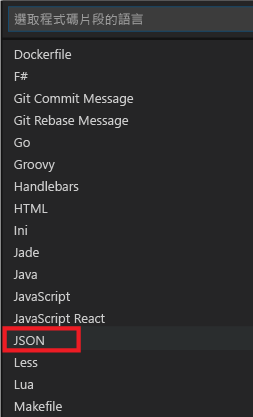
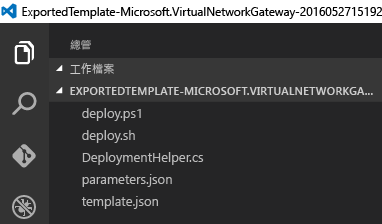

# <a name="working-with-azure-resource-manager-templates-in-visual-studio-code"></a>在 Visual Studio Code 中使用 Azure Resource Manager 範本
Azure Resource Manager 範本是說明資源和相關相依性的 JSON 檔案。 這些檔案有時候可能很大又複雜，所以工具支援非常重要。 Visual Studio Code 是全新的、輕量型、開放原始碼、跨平台程式碼編輯器。 它會透過 [新的擴充功能](https://marketplace.visualstudio.com/items?itemName=msazurermtools.azurerm-vscode-tools)，支援建立和編輯 Resource Manager 範本。 VS Code 可隨處執行，而且只有在您想要部署 Resource Manager 範本至 Azure 訂用帳戶時，才需要網際網路存取。

如果您還沒有 VS Code，可以在 [https://code.visualstudio.com/](https://code.visualstudio.com/)進行安裝。

## <a name="install-the-resource-manager-extension"></a>安裝 Resource Manager 擴充功能
若要在 VS Code 中使用 JSON 範本，您需要安裝擴充功能。 下列步驟可下載並安裝 Resource Manager JSON 範本的語言支援︰

1. 啟動 VS Code 
2. 開啟快速開啟 (Ctrl+P) 
3. 執行以下命令： 
   
        ext install azurerm-vscode-tools
4. 在系統提示時重新啟動 VS Code 以啟用擴充功能。 
   
   作業完成！

## <a name="set-up-resource-manager-snippets"></a>設定 Resource Manager 程式碼片段
先前的步驟已安裝工具支援，但我們現在需要設定 VS Code，才可使用 JSON 範本程式碼片段。

1. 將檔案的內容從 [azure-xplat-arm-tooling](https://raw.githubusercontent.com/Azure/azure-xplat-arm-tooling/master/VSCode/armsnippets.json) 儲存機制複製到剪貼簿。
2. 啟動 VS Code 
3. 在 VS Code 中，您可以開啟 JSON 程式碼片段檔案，方法是瀏覽至 [檔案] -> [喜好設定] -> [使用者程式碼片段] -> [JSON]。 或者，選取 **F1**，然後輸入**喜好設定**，直到您可以選取 [喜好設定︰程式碼片段]。
   
    
   
    從選項中選取 [JSON] 。
   
    
4. 將步驟 1 的檔案內容貼到您的使用者程式碼片段檔案中最後一個 "}" 之前 
5. 請確定 JSON 看起來正常，且任何地方都沒有波浪線。 
6. 儲存並關閉使用者程式碼片段檔案。

這就是開始使用 Resource Manager 程式碼片段所需的檔案。 接下來，我們會測試此安裝程式。

## <a name="work-with-template-in-vs-code"></a>在 VS Code 中使用範本
開始使用範本的最簡單方法是擷取 [Github](https://github.com/Azure/azure-quickstart-templates) 上的其中一個快速啟動範本，或使用您自己的其中一個範本。 您可以透過入口網站輕鬆地針對任何資源群組 [匯出範本](resource-manager-export-template.md) 。 

1. 如果您從資源群組中匯出範本，請在 VS Code 中開啟已解壓縮的檔案。
   
    
2. 開啟 template.json 檔案，以便編輯它並新增一些額外的資源。 在 `"resources": [` 之後按 Enter 鍵，開始新的一行。 如果輸入 **arm**，您會看到選項清單。 這些選項是您安裝的範本程式碼片段。 
   
    
3. 選擇您想要的程式碼片段。 在本文中，我會選擇 **arm-ip** 來建立新的公用 IP 位址。 在新建資源的右括號 `}` 後面加上逗號，確保您的範本語法有效。
   
     
4. VS Code 有內建的 IntelliSense。 當您編輯範本時，VS Code 會建議可用的值。 例如，若要將變數區段加入至您的範本，請新增 `""` (兩個雙引號)，然後選取這兩個引號之間的 **Ctrl+空格鍵**。 您會看到包含**變數**的選項。
   
    
5. IntelliSense 也可以建議可用的值或函式。 若要將屬性設定為參數值，請建立包含 `"[]"` 和 **Ctrl+空格鍵**的運算式。 您可以開始輸入函式的名稱。 當您找到想要的函式時，請選取 **Tab** 。
   
    
6. 若要查看範本內可用的參數清單，請再次選取函式內的 **Ctrl+空格鍵**。
   
    
7. 如果您在範本中有任何結構描述驗證問題，則會在編輯器中看到熟悉的波浪線。 輸入 **Ctrl+Shift+M** 或選取左下方狀態列中的字符 (glyph)，即可檢視錯誤和警告清單。
   
    
   
    驗證範本可協助您偵測語法問題；不過，您也可能看到可以忽略的錯誤。 在某些情況下，編輯器會比較您的範本與不是最新狀態的結構描述，因此會回報即使您已知正確無誤的錯誤。 例如，假設函式最近已加入至 Resource Manager，但尚未更新結構描述。 儘管函式在部署期間正常運作，編輯器仍會回報錯誤。
   
    

## <a name="deploy-your-new-resources"></a>部署新資源
當範本準備就緒時，您可以使用下列指示來部署新資源︰ 

### <a name="windows"></a>Windows
1. 開啟 PowerShell 命令提示字元。 
2. 若要登入類型︰ 
   
  ```powershell
  Login-AzureRmAccount
  ```

3. 如果您有多個訂用帳戶，請透過下列方式取得訂用帳戶清單：

  ```powershell 
  Get-AzureRmSubscription
  ```
   
    以及選取要使用的訂用帳戶。

  ```powershell
  Select-AzureRmSubscription -SubscriptionId <Subscription Id>
  ```

4. 更新 parameters.json 檔案中的參數
5. 執行 Deploy.ps1 以在 Azure 上部署您的範本

### <a name="osxlinux"></a>OSX/Linux
1. 開啟終端機視窗 
2. 若要登入類型︰

  ```azurecli
  azure login
  ```

3. 如果您有多個訂用帳戶，請透過下列方式選取適當的訂用帳戶：

  ```azurecli
  azure account set <subscriptionNameOrId> 
  ```

4. 更新 parameters.json 檔案中的參數。
5. 若要部署範本，請執行：

  ```azurecli 
  azure group deployment create -f <PathToTemplate>
  ``` 

## <a name="next-steps"></a>後續步驟
* 若要了解範本，請參閱 [撰寫 Azure Resource Manager 範本](resource-group-authoring-templates.md)。
* 若要了解範本函式，請參閱 [Azure Resource Manager 範本函式](resource-group-template-functions.md)。
* 如需更多使用 Visual Studio Code 的範例，請參閱來自 [HealthClinic.biz](https://github.com/Microsoft/HealthClinic.biz) 2015 Connect [示範](https://blogs.msdn.microsoft.com/visualstudio/2015/12/08/connectdemos-2015-healthclinic-biz/)的 [Build cloud apps with Visual Studio Code (使用 Visual Studio Code 建置雲端應用程式)](https://github.com/Microsoft/HealthClinic.biz/wiki/Build-cloud-apps-with-Visual-Studio-Code)。 如需來自 HealthClinic.biz 示範的更多快速入門，請參閱 [Azure 開發人員工具快速入門](https://github.com/Microsoft/HealthClinic.biz/wiki/Azure-Developer-Tools-Quickstarts)。


<!--HONumber=Jan17_HO1-->


