<a id="creating-and-deploying-azure-resource-groups-through-visual-studio" class="xliff"></a>

# 透過 Visual Studio 建立與部署 Azure 資源群組
使用 Visual Studio 和 [Azure SDK](https://azure.microsoft.com/downloads/)，您可以建立專案，將您的基礎結構和程式碼部署至 Azure。 例如，您可以為您的應用程式定義 Web 主機、網站和資料庫，並且部署該基礎結構與程式碼。 或者，您可以定義虛擬機器、虛擬網路和儲存體帳戶，並且部署該基礎結構以及在虛擬機器上執行的指令碼。 **Azure 資源群組** 部署專案可讓您在單一、可重複執行的作業中部署所有所需的資源。 如需部署與管理資源的詳細資訊，請參閱 [Azure Resource Manager 概觀](resource-group-overview.md)。

Azure 資源群組專案包含 Azure Resource Manager JSON 範本，可定義部署到 Azure 的資源。 若要了解資源管理員範本的元素，請參閱 [撰寫 Azure 資源管理員範本](resource-group-authoring-templates.md)。 Visual Studio 可讓您編輯這些範本，並提供工具，可簡化範本的使用。

在本文中，您將會部署 Web 應用程式和 SQL Database。 不過對於各種類型的資源來說，其步驟幾乎相同。 您可以輕鬆地部署虛擬機器和其相關的資源。 Visual Studio 針對部署常見案例提供許多不同的入門範本。

本文說明 Visual Studio 2017。 如果您使用 Visual Studio 2015 Update 2 和 Microsoft Azure SDK for .NET 2.9，或 Visual Studio 2013 與 Azure SDK 2.9，您的經驗會大致相同。 您可以使用 Azure SDK 2.6 或更新版本，不過您的使用者介面體驗可能會與本文所示的使用者介面不同。 開始執行步驟前，我們強烈建議您安裝最新版本的 [Azure SDK](https://azure.microsoft.com/downloads/) 。 

<a id="create-azure-resource-group-project" class="xliff"></a>

## 建立 Azure 資源群組專案
在此程序中，您會利用 **Web 應用程式 + SQL** 範本建立 Azure 資源群組專案。

1. 在 Visual Studio 中，選擇 [檔案]、[新增專案]，再選擇 [C#] 或 [Visual Basic]。 然後選擇 [雲端]，再選擇 [Azure 資源群組] 專案。
   
    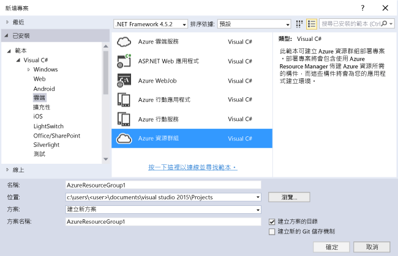
2. 選擇您想要部署至 Azure 資源管理員的範本。 請注意，根據您想要部署的專案類型，有許多不同的選項。 在本文中，我們將選擇 **Web 應用程式 + SQL** 範本。
   
    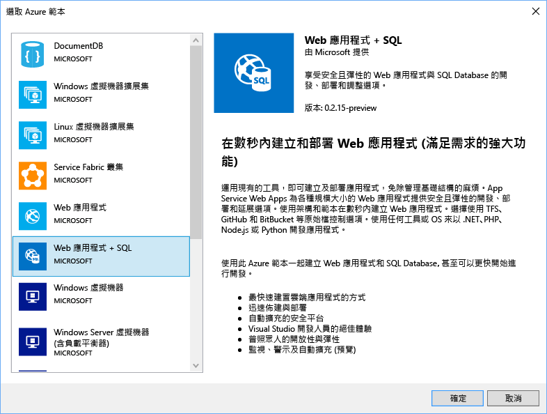
   
    您選擇的範本只是起點；您可以加入和移除資源，以滿足您的案例。
   
   > [!NOTE]
   > Visual Studio 會在線上擷取一份可用範本清單。 清單可能會變更。
   > 
   > 
   
    Visual Studio 會建立 web 應用程式和 SQL Database 的資源群組部署專案。
3. 若要查看建立的內容，請看部署專案中的節點。
   
    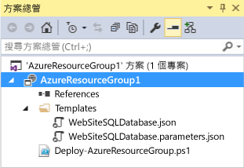
   
    因為我們針對此範例選擇 Web 應用程式 + SQL 範本，所以您會看到下列檔案： 
   
   | 檔案名稱 | 說明 |
   | --- | --- |
   | Deploy-AzureResourceGroup.ps1 |叫用 PowerShell 命令部署至 Azure 資源管理員的 PowerShell 指令碼。<br />**注意** Visual studio 會使用此 PowerShell 指令碼部署您的範本。 對此指令碼所進行的任何變更也會影響 Visual Studio 中的部署，因此請務必小心。 |
   | WebSiteSQLDatabase.json |Resource Manager 範本 (定義您想要部署至 Azure 的基礎結構)，以及在部署期間您可以提供的參數。 同時定義資源之間的相依性，讓 Resource Manager 以正確的順序部署資源。 |
   | WebSiteSQLDatabase.parameters.json |參數檔案，包含範本所需的值。 您可以傳遞參數值以自訂每個部署。 |
   
    所有資源群組部署專案都包含這些基本檔案。 其他專案可能包含其他檔案以支援其他功能。

<a id="customize-the-resource-manager-template" class="xliff"></a>

## 自訂資源管理員範本
您可以藉由修改 JSON 範本 (描述您想要部署的資源) 來自訂部署專案。 JSON 代表 JavaScript 物件標記法，而且是很容易使用的序列化資料格式。 JSON 檔案使用的結構描述在每個檔案的頂端提供做為參考。 如果您想要更了解這個結構描述，您可以下載並分析它。 結構描述會定義哪些是有效項目、欄位的類型和格式、可能的列舉值等等。 若要了解資源管理員範本的元素，請參閱 [撰寫 Azure 資源管理員範本](resource-group-authoring-templates.md)。

若要使用您的範本，請開啟 **WebSiteSQLDatabase.json**。

Visual Studio 編輯器提供工具，協助您編輯 Resource Manager 範本。 [JSON 大綱]  視窗可讓您輕鬆查看在您的範本中定義的元素。

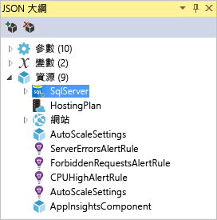

選取大綱中的任何元素，會帶您前往範本的該部分，並且醒目提示對應的 JSON。

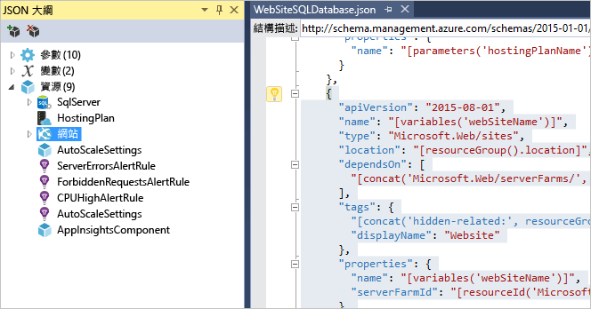

您可以選取 [JSON 大綱] 視窗頂端的 [加入資源] 按鈕，或以滑鼠右鍵按一下 [資源]然後選取 [加入新資源]，藉以加入新資源。


在本教學課程中，選取 [儲存體帳戶]  並提供它的名稱。 提供的名稱不能超過 11 個字元，而且只包含數字和小寫字母。

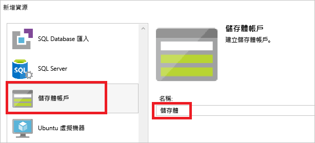

請注意，不只是加入資源，也會加入儲存體帳戶類型的參數，以及儲存體帳戶名稱的變數。

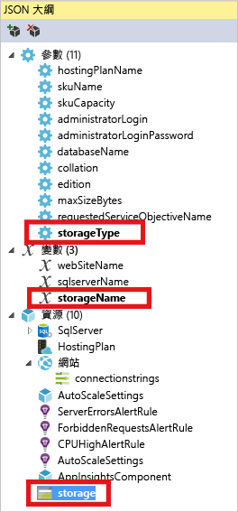

**storageType** 參數是以允許的類型與預設類型預先定義。 您可以保留這些值，或針對您的案例進行編輯。 如果您不想要讓任何人透過此範本部署 **Premium_LRS** 儲存體帳戶，請將它從允許的類型中移除。 

```json
"storageType": {
  "type": "string",
  "defaultValue": "Standard_LRS",
  "allowedValues": [
    "Standard_LRS",
    "Standard_ZRS",
    "Standard_GRS",
    "Standard_RAGRS"
  ]
}
```

Visual Studio 也會提供 Intellisense 以協助您了解編輯範本時可以使用哪些屬性。 例如，若要編輯 App Service 方案的屬性，請瀏覽至 **HostingPlan** 資源，並針對 [屬性] 加入值。 請注意，Intellisense 會顯示可用的值，並提供該值的描述。


您可以將 **numberOfWorkers** 設定為 1。

```json
"properties": {
  "name": "[parameters('hostingPlanName')]",
  "numberOfWorkers": 1
}
```

<a id="deploy-the-resource-group-project-to-azure" class="xliff"></a>

## 將資源群組部署至 Azure
您現在已可開始部署您的專案。 當您部署 Azure 資源群組專案時，您會將它部署至 Azure 資源群組。 資源群組是共用共同生命週期的資源邏輯分組。

1. 在部署專案節點的捷徑功能表上，選擇 [部署] > [新增]。
   
    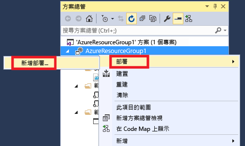
   
    [部署到資源群組]  對話方塊隨即出現。
   
    ![[部署到資源群組] 對話方塊](./media/vs-azure-tools-resource-groups-deployment-projects-create-deploy/show-deployment.png)
2. 在 [資源群組]  下拉式方塊中，選擇現有資源群組或建立新群組。 若要建立資源群組，請開啟 [資源群組] 下拉式方塊，然後選擇 [新建]。
   
    ![[部署到資源群組] 對話方塊](./media/vs-azure-tools-resource-groups-deployment-projects-create-deploy/create-new-group.png)
   
    [建立資源群組]  對話方塊隨即出現。 給予群組名稱與位置，然後選取 [建立]  按鈕。
   
    ![[建立資源群組] 對話方塊](./media/vs-azure-tools-resource-groups-deployment-projects-create-deploy/create-resource-group.png)
3. 選取 [編輯參數]  按鈕，以編輯部署的參數。
   
    ![[編輯參數] 按鈕](./media/vs-azure-tools-resource-groups-deployment-projects-create-deploy/edit-parameters.png)
4. 提供空白參數的值，然後選取 [儲存] 按鈕。 空白參數為 **hostingPlanName**、**administratorLogin**、**administratorLoginPassword** 和 **databaseName**。
   
    **hostingPlanName** 指定要建立之 [App Service 方案](../app-service/azure-web-sites-web-hosting-plans-in-depth-overview.md) 的名稱。 
   
    **administratorLogin** 指定 SQL Server 系統管理員的使用者名稱。 請勿使用常見的系統管理員名稱，例如 **sa** 或 **admin**。 
   
    **AdministratorLoginPassword** 指定 SQL Server 系統管理員的密碼。 [將密碼儲存為參數檔案中的純文字]  選項並不安全；因此，請勿選取此選項。 因為不會以純文字方式儲存密碼，所以您必須在部署期間再次提供此密碼。 
   
    **databaseName** 指定要建立之資料庫的名稱。 
   
    ![[編輯參數] 對話方塊](./media/vs-azure-tools-resource-groups-deployment-projects-create-deploy/provide-parameters.png)
5. 選擇 [部署] 按鈕，將專案部署至 Azure。 PowerShell 主控台會在 Visual Studio 執行個體的外部開啟。 出現提示時，請在 PowerShell 主控台中輸入 SQL Server 系統管理員密碼。 **PowerShell 主控台可能會隱藏在其他項目之後或在工作列中最小化。** 尋找此主控台並加以選取，以便提供密碼。
   
   > [!NOTE]
   > Visual Studio 可能會要求您安裝 Azure PowerShell Cmdlet。 您需要 Azure PowerShell Cmdlet 才能成功部署資源群組。 如果出現提示，請予以安裝。
   > 
   > 
6. 部署可能需要幾分鐘的時間。 您可在 [輸出]  視窗中查看部署的狀態。 部署完成時，最後一則訊息會表示成功部署，如下所示︰
   
        ... 
        18:00:58 - Successfully deployed template 'websitesqldatabase.json' to resource group 'DemoSiteGroup'.
7. 在瀏覽器中，開啟 [Azure 入口網站](https://portal.azure.com/) 並登入您的帳戶。 若要查看資源群組，請選取 [資源群組]  ，然後選取您部署所在的資源群組。
   
    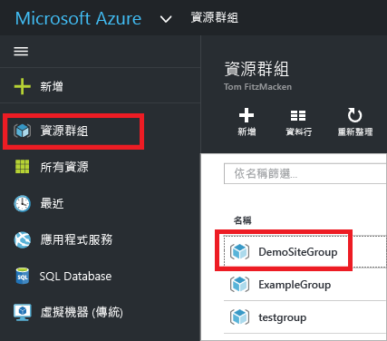
8. 您會看到所有已部署的資源。 請注意，儲存體帳戶的名稱不完全是新增該資源時所指定的名稱。 儲存體帳戶必須是獨一無二的。 範本會在您所提供的名稱中自動新增字元字串，以提供唯一的名稱。 
   
    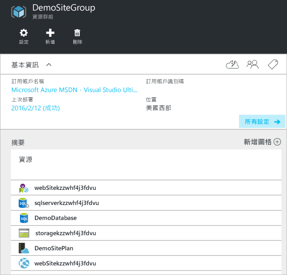
9. 如果您進行變更並想要重新部署專案，可以從 Azure 資源群組專案的捷徑功能表選擇現有的資源群組。 在捷徑功能表上，選擇 [部署] ，然後選擇您部署的資源群組。
   
    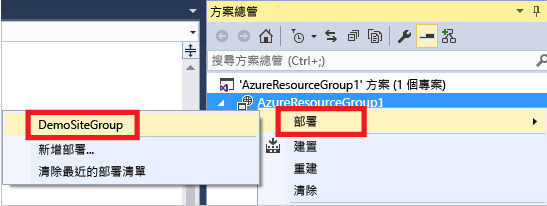

<a id="deploy-code-with-your-infrastructure" class="xliff"></a>

## 以您的基礎結構部署程式碼
此時，您已為您的應用程式部署基礎結構，但是專案尚未部署實際程式碼。 本文說明如何在部署期間部署 Web 應用程式和 SQL Database 資料表。 如果您是部署虛擬機器而不是 Web 應用程式，您想要在機器上執行一些程式碼做為部署的一部分。 部署 Web 應用程式的程式碼或設定虛擬機器的程序幾乎完全相同。

1. 將專案新增至您的 Visual Studio 方案。 以滑鼠右鍵按一下方案，然後選取 [新增] > [新增專案]。
   
    
2. 新增 **ASP.NET Web 應用程式**。 
   
    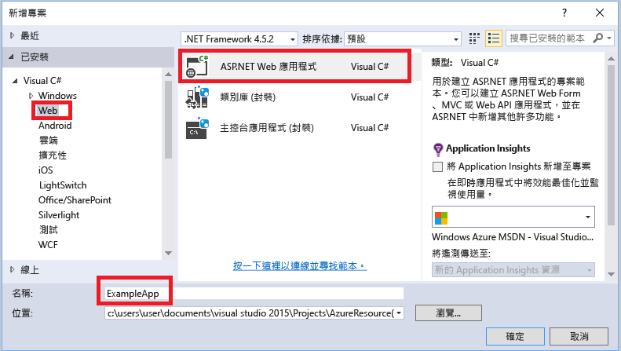
3. 選取 **MVC**。
   
    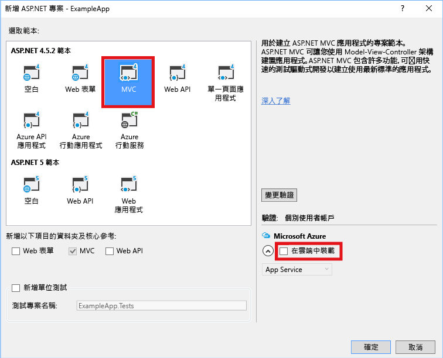
4. 在 Visual Studio 建立 Web 應用程式之後，您會在方案中看到這兩個專案。
   
    
5. 現在，您必須確定資源群組專案已察覺新的專案。 回到您的資源群組專案 (AzureResourceGroup1)。 以滑鼠右鍵按一下 [參考]，然後選取 [新增參考]。
   
    
6. 選取您所建立的 Web 應用程式專案。
   
    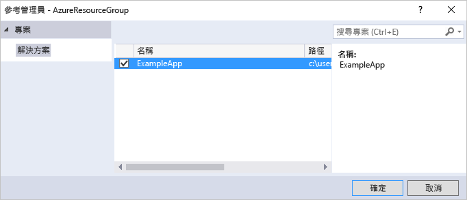
   
    加入參考，您可以將 Web 應用程式專案連結至資源群組專案中，並自動設定三個重要屬性。 您會在參考的 [屬性]  視窗中看到這些屬性。
   
      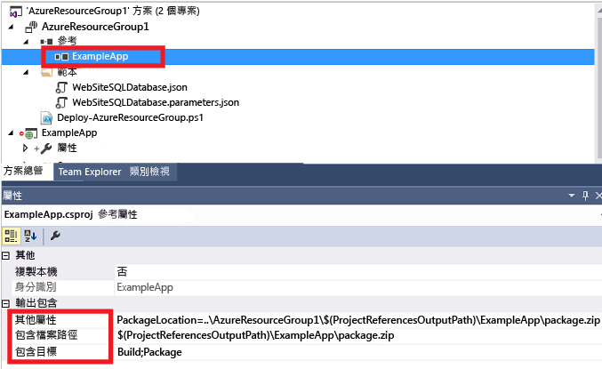
   
    屬性如下︰
   
   * [其他屬性]  包含會推送至 Azure 儲存體的 Web 部署套件預備位置。 請注意資料夾 (ExampleApp) 和檔案 (package.zip)。 您必須知道這些值，因為您會提供這些值做為部署應用程式時的參數。 
   * [包含檔案路徑]  包含建立套件所在的路徑。 [包含目標]  包含部署執行的命令。 
   * 預設值 [建立封裝]  會讓部署建立 Web 部署封裝 (package.zip)。  
     
     您不需要發佈設定檔，因為部署會從屬性取得必要的資訊來建立套件。
7. 請回到 WebSiteSQLDatabase.json，並將資源新增至範本。
   
    
8. 這次請選取 [Web Deploy for Web Apps] 。 
   
    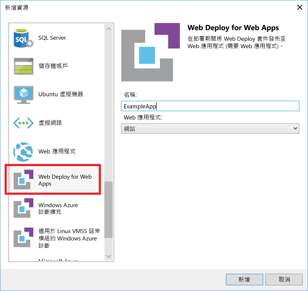
9. 將您的資源群組專案重新部署至資源群組。 這次還有一些新的參數。 您不需要提供 **_artifactsLocation** 或 **_artifactsLocationSasToken** 的值，因為 Visual Studio 會自動產生這些值。 不過，您必須將資料夾和檔案名稱設定為包含部署套件的路徑 (如下圖中顯示的 **ExampleAppPackageFolder** 和 **ExampleAppPackageFileName**)。 提供您稍早在參考屬性 (**ExampleApp** 和 **package.zip**) 中看到的值。
   
    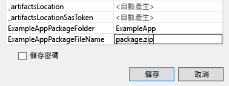
   
    對於 [構件儲存體帳戶] ，選取與此資源群組一起部署的帳戶。
10. 部署完成後，請在入口網站中選取您的 Web 應用程式。 按一下 URL 以瀏覽至此網站。
    
     
11. 請注意，您已成功部署預設的 ASP.NET 應用程式。
    
     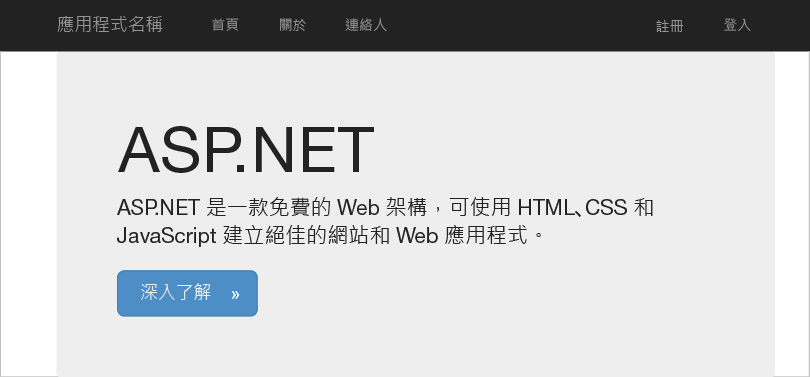

<a id="next-steps" class="xliff"></a>

## 後續步驟
* 若要了解透過入口網站管理資源，請參閱 [使用 Azure 入口網站來管理您的 Azure 資源](resource-group-portal.md)。
* 若要了解範本，請參閱 [撰寫 Azure Resource Manager 範本](resource-group-authoring-templates.md)。


