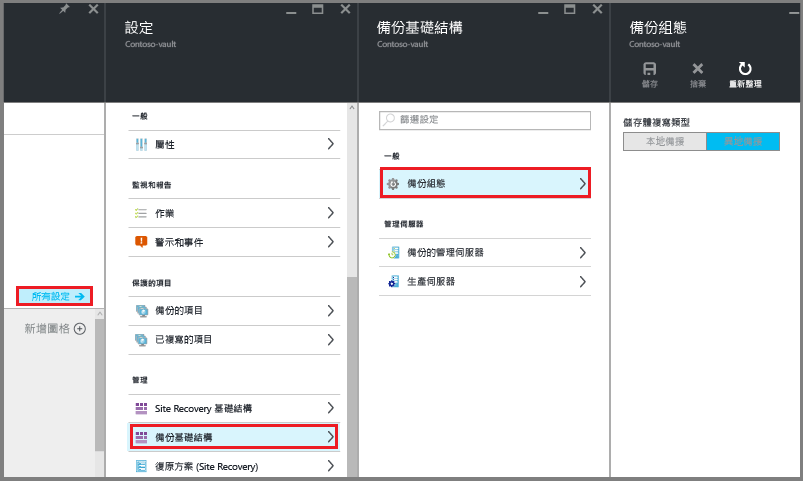

<properties
	pageTitle="準備環境以備份 ARM 虛擬機器 | Microsoft Azure"
	description="確認在 Azure 中備份虛擬機器的環境已準備就緒"
	services="backup"
	documentationCenter=""
	authors="markgalioto"
	manager="jwhit"
	editor=""
	keywords="備份；備份；"/>

<tags
	ms.service="backup"
	ms.workload="storage-backup-recovery"
	ms.tgt_pltfrm="na"
	ms.devlang="na"
	ms.topic="article"
	ms.date="05/03/2016"
	ms.author="trinadhk; jimpark; markgal;"/>


# 準備環境以備份 ARM 虛擬機器

> [AZURE.SELECTOR]
- [資源管理員模型](backup-azure-arm-vms-prepare.md)
- [傳統模型](backup-azure-vms-prepare.md)

本文章提供讓環境做好備份 Azure Resource Manager (ARM) 虛擬機器 (VM) 之準備的步驟。程序中展示的步驟使用 Azure 入口網站。

Azure 備份服務提供兩種類型的保存庫 (備份保存庫和復原服務保存庫) 來保護您的 VM。備份保存庫能保護以傳統部署模型部署的 VM。復原服務保存庫能保護 **傳統部署或 ARM 部署等兩種 VM**。您必須使用復原服務保存庫來保護 ARM 部署 VM。

>[AZURE.NOTE] Azure 有兩種用來建立和使用資源的部署模型：[Resource Manager 和傳統](../resource-manager-deployment-model.md)。如需使用傳統部署模型 VM 的詳細資料，請參閱[準備環境以備份 Azure 虛擬機器](backup-azure-vms-prepare.md)。

在保護或備份 ARM 虛擬機器 (VM) 之前，請確認以下必要條件是否存在︰

- 在與 VM 相同的位置中建立復原服務保存庫 (或識別現有的復原服務保存庫)。
- 選取案例、定義備份原則及定義要保護的項目。
- 檢查虛擬機器上的 VM 代理程式安裝。
- 檢查網路連線

如果您知道環境滿足這些條件，請繼續依[備份 VM 文章](backup-azure-vms.md)中的指示進行。如果您需要設定或檢查前述任何必要條件，本文章會引導您逐步完成必要條件的準備步驟。


## 備份和還原 VM 時的限制

準備環境之前，請先了解限制。

- 不支援備份具有 16 個以上資料磁碟的虛擬機器。
- 不支援備份具有保留的 IP 且沒有已定義之端點的虛擬機器。
- 不支援在還原期間取代現有的虛擬機器。如果您嘗試在 VM 存在時還原 VM，還原作業將會失敗。
- 不支援跨區域備份和還原。
- 您可以在 Azure 的所有公開區域中備份虛擬機器 (請參閱支援之區域的[檢查清單](https://azure.microsoft.com/regions/#services))。如果您尋找的區域目前不受支援，在建立保存庫期間，該區域就不會顯示在下拉式清單中。
- 您只可以備份選定作業系統版本的虛擬機器︰
  - **Linux**：請參閱[經 Azure 背書的散發套件清單](../virtual-machines/virtual-machines-linux-endorsed-distros.md)。只要虛擬機器上有 VM 代理程式，其他「攜帶您自己的 Linux」散發套件應該也可以運作。
  - **Windows Server**：不支援比 Windows Server 2008 R2 更舊的版本。
- 只有透過 PowerShell 才支援還原屬於多網域控制站 (DC) 組態的 DC VM。進一步了解[還原多 DC 網域控制站](backup-azure-restore-vms.md#restoring-domain-controller-vms)。
- 僅支援透過 PowerShell 還原具有以下特殊網路組態的虛擬機器。使用 UI 中還原工作流程所建立的 VM 在完成還原作業之後將不會具有這些網路組態。若要深入了解，請參閱[還原具有特殊網路組態的 VM](backup-azure-restore-vms.md#restoring-vms-with-special-netwrok-configurations)。
  - 負載平衡器組態下的虛擬機器 (內部與外部)
  - 具有多個保留的 IP 位址的虛擬機器
  - 具有多個網路介面卡的虛擬機器

## 建立 VM 的復原服務保存庫。

復原服務保存庫是一個實體，會儲存歷來建立的備份和復原點。復原服務保存庫也包含與受保護虛擬機器相關聯的備份原則。

若要建立復原服務保存庫：

1. 登入 [Azure 入口網站](https://portal.azure.com/)。

2. 在 [中樞] 功能表上按一下 [瀏覽]，然後在資源清單中輸入**復原服務**。當您開始輸入時，清單將會根據您輸入的文字進行篩選。按一下 [復原服務保存庫]。

     <br/>

    隨即會顯示 [復原服務保存庫] 清單。

3. 在 [復原服務保存庫] 功能表上，按一下 [新增]。

    

    [復原服務保存庫] 刀鋒視窗隨即開啟，並提示您提供 [名稱]、[訂用帳戶]、[資源群組] 和 [位置]。

    

4. 在 [名稱] 中，輸入易記名稱來識別保存庫。必須是 Azure 訂用帳戶中唯一的名稱。輸入包含 2 到 50 個字元的名稱。該名稱必須以字母開頭，而且只可以包含字母、數字和連字號。

5. 按一下 [訂用帳戶] 以查看可用的訂用帳戶清單。如果您不確定要使用哪個訂用帳戶，請使用預設 (或建議) 的訂用帳戶。只有在您的組織帳戶與多個 Azure 訂用帳戶相關聯時，才會有多個選擇。

6. 按一下 [資源群組] 以查看可用的資源群組清單，或按一下 [新增] 以建立新的資源群組。如需資源群組的完整資訊，請參閱[使用 Azure 入口網站來部署及管理 Azure 資源](../azure-portal/resource-group-portal.md)。

7. 按一下 [位置] 以選取保存庫的地理區域。保存庫**必須**與您想要保護的虛擬機器位於相同區域。

    >[AZURE.IMPORTANT] 如果您不確定 VM 的所在位置，請關閉保存庫建立對話方塊，並移至入口網站的虛擬機器清單。如果您在多個區域中有虛擬機器，您必須在每個區域中建立復原服務保存庫。請先在第一個位置建立保存庫，再進入下一個位置。儲存備份資料時，不需要指定儲存體帳戶，復原服務保存庫和「Azure 備份」服務會自動處理此作業。

8. 按一下 [建立]。要等復原服務保存庫建立好，可能需要一些時間。請監視入口網站右上方區域中的狀態通知。保存庫一旦建立好，就會出現在 [復原服務保存庫] 的清單中。

    

    現在您已建立好保存庫，接下來要了解如何設定儲存體複寫。

## 設定儲存體複寫

儲存體複寫選項有異地備援儲存體和本地備援儲存體可供您選擇。根據預設，保存庫具有異地備援儲存體。如果這是您的主要備份，請讓選項繼續設定為異地備援儲存體。如果您想要更便宜但不持久的選項，請選擇本地備援儲存體。在 [Azure 儲存體複寫概觀](../storage/storage-redundancy.md)中，深入了解[異地備援](../storage/storage-redundancy.md#geo-redundant-storage)和[本地備援](../storage/storage-redundancy.md#locally-redundant-storage)儲存體選項。

若要編輯儲存體複寫設定︰

1. 選取保存庫以開啟保存庫儀表板和 [設定] 刀鋒視窗。如果 [設定] 刀鋒視窗未開啟，請按一下保存庫儀表板中的 [所有設定]。

2. 在 [設定] 刀鋒視窗上按一下 [備份基礎結構] > [備份組態]，開啟 [備份組態] 刀鋒視窗。在 [備份組態] 刀鋒視窗上，選擇保存庫的儲存體複寫選項。

    

    選擇好保存庫的儲存體選項後，就可以開始建立 VM 與保存庫的關聯。若要開始關聯，請探索及註冊 Azure 虛擬機器。


## 選取備份目標、設定原則及定義要保護的項目

在向保存庫註冊 VM 前，請先執行探索程序，以確保能夠識別任何加入至訂用帳戶的新虛擬機器。此程序會在 Azure 中查詢訂用帳戶中的虛擬機器清單，以及其他資訊，例如雲端服務名稱、區域等。在 Azure 入口網站中，案例是指您要放入復原服務保存庫中的項目。原則是復原點擷取頻率和時間的排程。原則也會包含復原點的保留範圍。

1. 如果您已開啟復原服務保存庫，請繼續步驟 2。如果您並未開啟復原服務保存庫，但位於 Azure 入口網站中，請在 [中樞] 功能表上按一下 [瀏覽]。

  - 在資源清單中輸入**復原服務**。
  - 當您開始輸入時，清單將會根據您輸入的文字進行篩選。當您看到 [復原服務保存庫] 時，請按一下它。

     <br/>

    隨即會出現 [復原服務保存庫] 清單。
  - 在 [復原服務保存庫] 清單中選取保存庫。

    選取的保存庫儀表板隨即開啟。

    ![開啟 [保存庫] 刀鋒視窗](./media/backup-azure-vms-first-look-arm/vault-settings.png)

2. 在保存庫儀表板功能表中按一下 [備份] 以開啟 [備份] 刀鋒視窗。

    ![開啟 [備份] 刀鋒視窗](./media/backup-azure-vms-first-look-arm/backup-button.png)

    刀鋒視窗開啟時，備份服務會搜尋訂用帳戶中的任何新 VM。

    

3. 在 [備份] 刀鋒視窗中，按一下 [備份目標] 以開啟 [備份目標] 刀鋒視窗。

    ![開啟 [案例] 刀鋒視窗](./media/backup-azure-vms-first-look-arm/select-backup-goal-one.png)

4. 在 [備份目標] 刀鋒視窗中，將 [工作負載的執行位置] 設定為 [Azure]，並將 [欲備份的項目] 設定為 [虛擬機器]，然後按一下 [確定]。

    [備份目標] 刀鋒視窗隨即關閉，然後開啟 [備份原則] 刀鋒視窗。

    ![開啟 [案例] 刀鋒視窗](./media/backup-azure-vms-first-look-arm/select-backup-goal-two.png)

5. 在 [備份原則] 刀鋒視窗中選取您要套用至保存庫的備份原則，然後按一下 [確定]。

    

    預設原則的詳細資料便會列在詳細資料中。如果您想要建立新原則，請在下拉式功能表中選取 [建立新的]。下拉式功能表也提供選項，可讓您將快照的擷取時間切換為晚上 7 點。如需定義備份原則的指示，請參閱[定義備份原則](backup-azure-vms-first-look-arm.md#defining-a-backup-policy)。一旦您按一下 [確定] 時，備份原則便會與保存庫建立關聯。

    接下來選擇要與保存庫建立關聯的 VM。

6. 選擇要與指定原則建立關聯的虛擬機器，然後按一下 [選取]。

    

    如果沒看到所需 VM，請確認它是否已存在於相同 Azure 位置中做為復原服務保存庫。

7. 現在您已定義保存庫的所有設定，接下來在 [備份] 刀鋒視窗中按一下頁面底部的 [啟用備份]。這會將原則部署到保存庫和 VM。

    

下一個階段的準備作業是安裝 VM 代理程式，或確定 VM 代理程式已安裝。


## 在虛擬機器中安裝 VM 代理程式

Azure VM 代理程式必須安裝在 Azure 虛擬機器上，備份擴充功能才能運作。如果 VM 是建立自 Azure 資源庫，則 VM 代理程式已存在於虛擬機器上。此處提供的資訊適用於「未使用」從 Azure 映像庫建立之 VM 的情況 (例如，從內部部署資料中心移轉的 VM)。在這種情況下，您需要安裝 VM 代理程式才能保護虛擬機器。

深入了解 [VM 代理程式](https://go.microsoft.com/fwLink/?LinkID=390493&clcid=0x409)和[如何安裝 VM 代理程式](../virtual-machines/virtual-machines-windows-classic-manage-extensions.md)。

如果您在備份 Azure VM 時遇到問題，請先確定已在虛擬機器上正確安裝 Azure VM 代理程式 (請參閱下表)。如果您建立自訂 VM，請先[確定已選取 [安裝 VM 代理程式] 核取方塊](../virtual-machines/virtual-machines-windows-classic-agents-and-extensions.md)，再佈建虛擬機器。

下表提供適用於 Windows 和 Linux VM 之 VM 代理程式的其他資訊。

| **作業** | **Windows** | **Linux** |
| --- | --- | --- |
| 安裝 VM 代理程式 | <li>下載並安裝[代理程式 MSI](http://go.microsoft.com/fwlink/?LinkID=394789&clcid=0x409)。您需要有系統管理員權限，才能完成安裝。<li>[更新 VM 屬性](http://blogs.msdn.com/b/mast/archive/2014/04/08/install-the-vm-agent-on-an-existing-azure-vm.aspx)以表示已安裝代理程式。 | <li>從 GitHub 安裝最新的 [Linux 代理程式](https://github.com/Azure/WALinuxAgent)。您需要有系統管理員權限，才能完成安裝。<li> [更新 VM 屬性](http://blogs.msdn.com/b/mast/archive/2014/04/08/install-the-vm-agent-on-an-existing-azure-vm.aspx)以表示已安裝代理程式。 |
| 更新 VM 代理程式 | 更新 VM 代理程式與重新安裝 [VM 代理程式二進位檔](http://go.microsoft.com/fwlink/?LinkID=394789&clcid=0x409)一樣簡單。<br>確定在更新 VM 代理程式時，沒有任何執行中的備份作業。 | 請遵循[更新 Linux VM 代理程式](../virtual-machines-linux-update-agent.md)的指示。<br>確定在更新 VM 代理程式時，沒有任何執行中的備份作業。 |
| 驗證 VM 代理程式安裝 | <li>瀏覽至 Azure VM 中的 C:\\WindowsAzure\\Packages 資料夾。<li>您應該會發現有 WaAppAgent.exe 檔案。<li> 在該檔案上按一下滑鼠右鍵，移至 [屬性]，然後選取 [詳細資料] 索引標籤。[產品版本] 欄位應為 2.6.1198.718 或更高版本。 | N/A |


### 備份擴充功能

虛擬機器上安裝了 VM 代理程式後，Azure 備份服務就會在 VM 代理程式上安裝備份擴充功能。Azure 備份服務可順暢地升級和修補備份擴充功能。

無論 VM 是否在執行，備份服務都會安裝備份擴充功能。執行中的 VM 提供了取得應用程式一致復原點的絕佳機會。不過，即使 VM 已關閉而無法安裝擴充功能，Azure 備份服務仍會繼續備份 VM。這稱為離線 VM。在此情況下，復原點將會是「當機時保持一致」。


## 網路連線

為了管理 VM 快照，備份擴充功能需要連接 Azure 公用 IP 位址。若無適當的網際網路連線，虛擬機器的 HTTP 要求將會逾時，而備份作業將會失敗。如果您的部署有存取限制 (如透過網路安全性群組 (NSG))，請選擇其中一個選項來為備份流量提供明確的路徑︰

- [將 Azure 資料中心 IP 範圍列入白名單](http://www.microsoft.com/zh-TW/download/details.aspx?id=41653) - 請參閱文章以取得將 IP 位址列入白名單的指示。
- 部署 HTTP Proxy 伺服器來路由傳送流量。

在決定該使用哪個選項時，要取捨的不外乎是可管理性、精確控制及成本等要素。

|選項|優點|缺點|
|------|----------|-------------|
|將 IP 範圍列入允許清單| 沒有額外的成本。<br><br>如需在某個 NSG 中開啟存取權，請使用 <i>Set-AzureNetworkSecurityRule</i> Cmdlet。 | 由於受影響的 IP 範圍會隨著時間改變，因此難以管理。<br><br>提供整個 Azure 的存取權，而不只是「儲存體」的存取權。|
|HTTP Proxy| 可在 Proxy 中精確控制允許的儲存體 URL。<br>為 VM 提供單一網際網路存取點。<br>不受 Azure IP 位址變更影響。| 使用 Proxy 軟體執行 VM 時的額外成本。|

### 將 Azure 資料中心的 IP 範圍列入允許清單

若要將 Azure 資料中心 IP 範圍列入白名單，請參閱 [Azure 網站](http://www.microsoft.com/zh-TW/download/details.aspx?id=41653)以取得 IP 範圍的詳細資料和指示。

### 使用 HTTP Proxy 進行 VM 備份
備份 VM 時，VM 上的備份擴充功能會使用 HTTPS API 將快照管理命令傳送到 Azure 儲存體。透過 HTTP Proxy 路由傳送擴充功能流量，因為它是唯一為了要存取公用網際網路而設定的元件。

>[AZURE.NOTE] 對於應該使用什麼 Proxy 軟體，並無任何建議。請務必挑選與下面設定步驟相容的 Proxy。

以下範例影像示範使用 HTTP Proxy 所需的三個組態步驟︰

- 應用程式 VM 會透過 Proxy VM 路由傳送所有連往公用網際網路的 HTTP 流量。
- Proxy VM 允許從虛擬網路之 VM 傳輸的傳入流量。
- 名為 NSF-lockdown 的網路安全性群組 (NSG) 需要允許從 Proxy VM 傳輸之輸出網際網路流量的安全性規則。


若要使用 HTTP Proxy 來與公用網際網路通訊，請依照下列步驟執行︰

#### 步驟 1.設定連出網路連線

###### Windows 電腦
這會設定本機系統帳戶的 Proxy 伺服器組態。

1. 下載 [PsExec](https://technet.microsoft.com/sysinternals/bb897553)
2. 從提升權限的提示字元執行下列命令。

     ```
     psexec -i -s "c:\Program Files\Internet Explorer\iexplore.exe"
     ```
    它會開啟 Internet Explorer 視窗。
3. 移至 [工具]-> [網際網路選項]-> [連線]-> [區域網路設定]。
4. 確認系統帳戶的 Proxy 設定。設定 Proxy IP 和連接埠。 
5. 關閉 Internet Explorer。

這會設定一個整部機器的 Proxy 設定，並用於任何連出 HTTP/HTTPS 流量。
   
如果您已在目前的使用者帳戶 (非本機系統帳戶) 上設定 Proxy 伺服器，請使用下列指令碼將它們套用至 SYSTEMACCOUNT︰

```
   $obj = Get-ItemProperty -Path Registry::”HKEY_CURRENT_USER\Software\Microsoft\Windows\CurrentVersion\Internet Settings\Connections"
   Set-ItemProperty -Path Registry::”HKEY_USERS\S-1-5-18\Software\Microsoft\Windows\CurrentVersion\Internet Settings\Connections" -Name DefaultConnectionSettings -Value $obj.DefaultConnectionSettings
   Set-ItemProperty -Path Registry::”HKEY_USERS\S-1-5-18\Software\Microsoft\Windows\CurrentVersion\Internet Settings\Connections" -Name SavedLegacySettings -Value $obj.SavedLegacySettings
   $obj = Get-ItemProperty -Path Registry::”HKEY_CURRENT_USER\Software\Microsoft\Windows\CurrentVersion\Internet Settings"
   Set-ItemProperty -Path Registry::”HKEY_USERS\S-1-5-18\Software\Microsoft\Windows\CurrentVersion\Internet Settings" -Name ProxyEnable -Value $obj.ProxyEnable
   Set-ItemProperty -Path Registry::”HKEY_USERS\S-1-5-18\Software\Microsoft\Windows\CurrentVersion\Internet Settings" -Name Proxyserver -Value $obj.Proxyserver
```

>[AZURE.NOTE] 如果您在 Proxy 伺服器記錄檔中發現「(407) 需要 Proxy 驗證」，請檢查驗證設定是否正確。

######Linux 電腦 

在 ```/etc/environment``` 檔案中新增以下文字行：

```
http_proxy=http://<proxy IP>:<proxy port>
```

將下列幾行新增至 ```/etc/waagent.conf``` 檔案：
   
```
HttpProxy.Host=<proxy IP>
HttpProxy.Port=<proxy port>
```

#### 步驟 2.在 Proxy 伺服器上允許連入連線：

1. 在 Proxy 伺服器上，開啟 [Windows 防火牆]。存取防火牆最簡單的方式搜尋「具有進階安全性的 Windows 防火牆」。

    

2. 在 [Windows 防火牆] 對話方塊中，以滑鼠右鍵按一下 [輸入規則] 並按一下 [新增規則...]。

    

3. 在 [新增輸入規則精靈] 中，針對 [規則類型] 選擇 [自訂] 選項，然後按 [下一步]。
4. 在選取 [程式] 的頁面上，選擇 [所有程式]，然後按 [下一步]。

5. 在 [通訊協定和連接埠] 頁面上，輸入下列資訊，然後按一下 [下一步]：

    

    - 針對 [通訊協定類型]，請選擇 [TCP]
    - 針對 [本機連接埠]，請選擇 [特定連接埠]，在下方欄位中指定已經設定的 ```<Proxy Port>```。
    - 針對 [遠端連接埠]，請選取 [所有連接埠]

    在精靈的其餘部分，按一下直到結束為止並指定此規則的名稱。

#### 步驟 3.新增 NSG 例外規則：

在 Azure PowerShell 命令提示字元中，輸入下列命令：

下列命令會新增 NSG 例外狀況。此例外狀況允許從 10.0.0.5 上任何連接埠傳輸至 80 (HTTP) 或 443 (HTTPS) 連接埠上任何網際網路位址的 TCP 流量。如果您需要公用網際網路中的特定連接埠，請務必將該連接埠一併新增至 ```-DestinationPortRange```。

```
Get-AzureNetworkSecurityGroup -Name "NSG-lockdown" |
Set-AzureNetworkSecurityRule -Name "allow-proxy " -Action Allow -Protocol TCP -Type Outbound -Priority 200 -SourceAddressPrefix "10.0.0.5/32" -SourcePortRange "*" -DestinationAddressPrefix Internet -DestinationPortRange "80-443"
```


這些步驟使用範例中的特定名稱和值。在輸入或在將詳細資料剪下貼入程式碼時，請使用您部署的名稱和值。


既然您知道自己已獲得網路連線，現在可以開始備份 VM 了。請參閱[備份 Azure Resource Manager (ARM) VM](backup-azure-arm-vms.md)。

## 有疑問嗎？
如果您有問題，或希望我們加入任何功能，請[傳送意見反應給我們](http://aka.ms/azurebackup_feedback)。

## 後續步驟
您現在已經備妥環境來備份您的 VM，您的下一個邏輯步驟是建立備份。規劃文章會提供備份 VM 的詳細資訊。

- [備份虛擬機器](backup-azure-vms.md)
- [規劃 VM 備份基礎結構](backup-azure-vms-introduction.md)
- [管理虛擬機器備份](backup-azure-manage-vms.md)

<!---HONumber=AcomDC_0518_2016-->