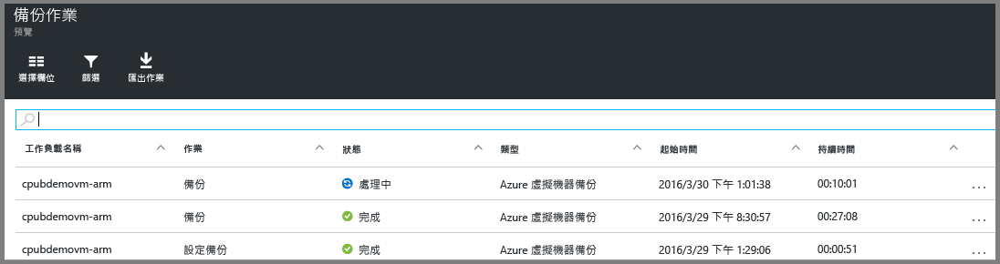

# 將 Azure VM 備份到復原服務保存庫
> [!div class="op_single_selector"]
> * [將 VM 備份到復原服務保存庫](backup-azure-arm-vms.md)
> * [將 VM 備份到備份保存庫](backup-azure-vms.md)
> 
> 

本文提供將 Azure VM (以 Resource Manager 部署的 VM 和傳統部署的 VM) 備份至復原服務保存庫的程序。備份 VM 的主要工作與準備有關。在備份或保護 VM 之前，您必須完成[必要條件](backup-azure-arm-vms-prepare.md)來備妥 VM 的保護環境。完成必要條件後，您就可以起始備份作業來製作 VM 的快照集。

> [!NOTE]
> Azure 有兩種用來建立和使用資源的部署模型：[Resource Manager 和傳統](../resource-manager-deployment-model.md)。您可以使用復原服務保存庫保護 Resource Manager 部署的 VM 和傳統 VM。如需使用傳統部署模型 VM 的詳細資料，請參閱[備份 Azure 虛擬機器](backup-azure-vms.md)。
> 
> 

如需詳細資訊，請參閱[在 Azure 中規劃 VM 備份基礎結構](backup-azure-vms-introduction.md)和 [Azure 虛擬機器](https://azure.microsoft.com/documentation/services/virtual-machines/)的文件。

## 觸發備份作業
與復原服務保存庫相關聯的備份原則能定義備份作業的執行頻率和時間。根據預設，第一個排定的備份是初始備份。在執行初始備份之前，[備份作業] 刀鋒視窗上的 [上次備份狀態] 會顯示為 [警告 (待執行初始備份)]。

除非您的初始備份預計會馬上開始，否則建議您執行 [立即備份]。以下程序從保存庫儀表板開始。當您完成所有必要條件後，此程序可用來執行初始備份作業。如果您已執行過初始備份作業，此程序便不適用。相關聯的備份原則決定後續的備份作業。

若要執行初始備份作業：

1. 在保存庫儀表板的 [備份] 圖格上，按一下 [Azure 虛擬機器]。  
   
    [備份項目] 刀鋒視窗隨即開啟。
2. 在 [備份項目] 刀鋒視窗中，以滑鼠右鍵按一下您要備份的保存庫，然後按一下 [立即備份]。
   
    
   
    備份作業便會觸發。 
   
    
3. 若要檢視初始備份是否已完成，請在保存庫儀表板的 [備份作業] 圖格上按一下 [Azure 虛擬機器]。
   
    
   
    [備份工作] 刀鋒視窗隨即開啟。
4. 在 [備份作業] 刀鋒視窗中，您可以看到所有作業的狀態。
   
    
   
   > [!NOTE]
   > 在備份工作進行時，Azure 備份服務會發出命令給每個虛擬機器中的備份擴充功能，以排清所有寫入並取得一致的快照。
   > 
   > 
   
    當備份作業完成時，狀態會是 [完成]。

## 錯誤疑難排解
如果您在備份虛擬機器時遇到問題，請參閱 [VM 疑難排解文章](backup-azure-vms-troubleshoot.md)以取得說明。

## 後續步驟
既然您已完成 VM 的保護，接下來請參閱以下文章以了解適合 VM 的額外管理工作，以及如何還原 VM。

* [管理和監視虛擬機器](backup-azure-manage-vms.md)
* [還原虛擬機器](backup-azure-arm-restore-vms.md)

<!---HONumber=AcomDC_0803_2016-->