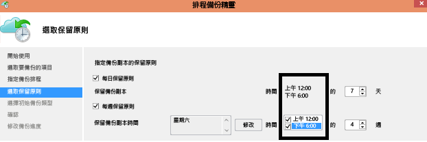

---
title: "Azure 備份常見問題集 | Microsoft Docs"
description: "相關常見問題的解答︰服務的運作方式、Azure 備份代理程式、復原服務保存庫，與備份和保留限制。"
services: backup
documentationcenter: 
author: markgalioto
manager: carmonm
editor: 
keywords: "備份和災害復原; 備份服務"
ms.assetid: 1011bdd6-7a64-434f-abd7-2783436668d7
ms.service: backup
ms.workload: storage-backup-recovery
ms.tgt_pltfrm: na
ms.devlang: na
ms.topic: get-started-article
ms.date: 3/10/2017
ms.author: markgal;giridham;arunak;trinadhk;
translationtype: Human Translation
ms.sourcegitcommit: c1cd1450d5921cf51f720017b746ff9498e85537
ms.openlocfilehash: 463e2a8af1fd319b396c6a769896344cac5f9f32
ms.lasthandoff: 03/14/2017


---
# <a name="questions-about-the-azure-backup-service"></a>關於 Azure 備份服務的問題
本文包含可協助您快速了解 Azure 備份元件常見問題 (與解答) 的章節。 在某些答案中，有具有完整資訊的文章連結。 按一下 [註解] (位於右側)，即可詢問 Azure 備份的相關問題。 註解會出現於文末。 需有 Livefyre 帳戶才能使用註解。 您也可以在 [論壇](https://social.msdn.microsoft.com/forums/azure/home?forum=windowsazureonlinebackup)中張貼有關 Azure 備份服務的問題。

若要快速掃描本文中的各節內容，在**本文**下使用右方連結。


## <a name="recovery-services-vault"></a>復原服務保存庫

### <a name="is-there-any-limit-on-the-number-of-vaults-that-can-be-created-in-each-azure-subscription-br"></a>每個 Azure 訂用帳戶中可以建立的保存庫數目是否有任何限制？ <br/>
是。 自 2016 年 9 月起，您可以為每個訂用帳戶建立 25 個復原服務或保存庫。 您可以為每個訂用帳戶的 Azure 備份支援區域，最多建立 25 個復原服務保存庫。 如果您需要其他保存庫，請建立其他訂用帳戶。

### <a name="are-there-limits-on-the-number-of-serversmachines-that-can-be-registered-against-each-vault-br"></a>針對每個保存庫註冊的伺服器/電腦具有數目限制嗎？ <br/>
是，您可以針對每個保存庫註冊最多 50 個電腦。 對於 Azure IaaS 虛擬機器，限制為每個保存庫 200 個 VM。 如果您需要註冊更多電腦，請建立其他保存庫。

### <a name="how-do-i-register-my-server-to-another-datacenterbr"></a>我如何向其他資料中心註冊我的伺服器？<br/>
備份資料會傳送至保存庫的資料中心以進行註冊。 若要變更資料中心，最簡單的方式是將代理程式解除安裝並重新安裝，然後向所需資料中心的新保存庫進行註冊。

### <a name="if-my-organization-has-one-vault-how-can-i-isolate-one-servers-data-from-another-server-when-restoring-databr"></a>如果我的組織有一個備份保存庫，如何在還原資料時隔離某一部伺服器與另一部伺服器的資料？<br/>
所有向相同保存庫註冊的伺服器都可以復原由「使用相同複雜密碼」 之其他伺服器所備份的資料。 如果您想要隔離您伺服器中的備份資料與您組織中的其他伺服器，請使用這些伺服器的指定複雜密碼。 例如，人力資源伺服器可能使用一組加密複雜密碼，而會計伺服器使用另一組，並且儲存體伺服器使用第三組。

### <a name="whats-the-minimum-size-requirement-for-the-cache-folder-br"></a>什麼是快取資料夾的最低大小需求？ <br/>
快取資料夾的大小可決定您正在備份的資料量。 快取資料夾應該是資料儲存體所需空間的 5%。

### <a name="can-i-migrate-my-backup-data-or-vault-between-subscriptions-br"></a>我可以在訂用帳戶之間「移轉」備份資料或保存庫嗎？ <br/>
否。 保存庫會建立在訂用帳戶層級，並且在建立之後無法重新指派至其他訂用帳戶。

### <a name="recovery-services-vaults-are-resource-manager-based-are-backup-vaults-classic-mode-still-supported-br"></a>復原服務保存庫是以 Resource Manager 為基礎。 備份保存庫 (傳統模式) 是否仍受支援？ <br/>
[傳統入口網站](https://manage.windowsazure.com)中所有現有的備份保存庫會繼續受到支援。 不過，您無法再使用傳統入口網站來部署新的備份保存庫。 Microsoft 建議使用所有部署的復原服務保存庫，因為未來的增強功能僅適用於復原服務保存庫。 如果您嘗試在傳統入口網站中建立備份保存庫，您將重新導向至 [Azure 入口網站](https://portal.azure.com)。

### <a name="can-i-migrate-a-backup-vault-to-a-recovery-services-vault-br"></a>是否可以將備份保存庫移轉至復原服務保存庫？ <br/>
很遺憾，不行，您無法將備份保存庫的內容移轉至復原服務保存庫。 我們正著手新增這項功能，但目前仍未提供。

### <a name="do-recovery-services-vaults-support-classic-vms-or-resource-manager-based-vms-br"></a>復原服務保存庫是否支援傳統 VM 或以 Resource Manager 為基礎的 VM？ <br/>
復原服務保存庫支援兩種模式。  您可以將傳統 VM (建立於傳統入口網站中) 或 Resource Manager VM (建立於 Azure 入口網站中) 備份至復原服務保存庫。

### <a name="i-backed-up-my-classic-vms-in-a-backup-vault-can-i-migrate-my-vms-from-classic-mode-to-resource-manager-mode-and-protect-them-in-a-recovery-services-vault"></a>我已在備份保存庫中備份我的傳統 VM。 我可以將我的 VM 從傳統模式移轉至 Resource Manager 模式，並在復原服務保存庫中保護它們嗎？
當您將 VM 從傳統模式移至 Resource Manager 模式時，備份保存庫中的傳統 VM 復原點不會自動移轉至復原服務保存庫。 請遵循下列步驟來傳輸您的 VM 備份：

1. 在備份保存庫中，移至 [受保護的項目] 索引標籤，然後選取 VM。 按一下[停止保護](backup-azure-manage-vms-classic.md#stop-protecting-virtual-machines)。 讓 [刪除相關聯的備份資料] 選項保持 [未核取] 狀態。
2. 將虛擬機器從傳統模式移轉至 Resource Manager 模式。 確定虛擬機器對應的儲存體和網路資訊也會移轉至 Resource Manager 模式。
3. 建立復原服務保存庫，並使用保存庫儀表板上方的 [備份] 動作，在移轉的虛擬機器上設定備份。 如需將 VM 備份至復原服務保存庫的詳細資訊，請參閱[使用復原服務保存庫保護 Azure VM](backup-azure-vms-first-look-arm.md) 文章。


## <a name="azure-backup-agent"></a>Azure 備份代理程式

### <a name="where-can-i-download-the-latest-azure-backup-agent-br"></a>哪裡可以下載最新的 Azure 備份代理程式？ <br/>
您可以下載最新的代理程式，以便從 [這裡](http://aka.ms/azurebackup_agent)備份 Windows Server、System Center DPM 或 Windows 用戶端。 如果您想要備份虛擬機器，請使用 VM 代理程式 (這會自動安裝適當的擴充功能)。 從 Azure 資源庫建立的虛擬機器上已經有 VM 代理程式。

### <a name="when-configuring-the-azure-backup-agent-i-am-prompted-to-enter-the-vault-credentials-do-vault-credentials-expire"></a>當設定 Azure 備份代理程式時，系統提示我要輸入保存庫認證。 保存庫認證是否過期？
是，保存庫認證將於 48 小時後過期。 若檔案已過期，請登入 Azure 入口網站，並從您的保存庫下載保存庫認證檔。

### <a name="what-happens-if-i-rename-a-windows-server-that-is-backing-up-data-to-azurebr"></a>若重新命名正在將資料備份至 Azure 的 Windows 伺服器，則會發生什麼情況？<br/>
當您重新命名伺服器時，所有目前設定的備份都會停止。
向備份保存庫註冊伺服器的新名稱。 當您向保存庫註冊新名稱時，第一個備份作業是*完整*備份。 如果您需要復原已備份到採用舊伺服器名稱之保存庫的資料，請使用 [復原資料] 精靈中的 [[其他伺服器](backup-azure-restore-windows-server.md#use-instant-restore-to-restore-data-to-an-alternate-machine)] 選項。

### <a name="what-types-of-drives-can-i-back-up-files-and-folders-from-br"></a>我可以從何種類型的磁碟機備份檔案和資料夾？ <br/>
您無法備份下列磁碟機/磁碟區：

* 卸除式媒體：所有備份項目來源必須報告為固定式。
* 唯讀磁碟區：必須為可寫入磁碟區，才能使磁碟區陰影複製服務 (VSS) 正常運作。
* 離線磁碟區：必須為線上磁碟區，才能使 VSS 正常運作。
* 網路共用：必須為本機磁碟區，才能使用線上備份來備份伺服器。
* 受 Bitlocker 保護的磁碟區：磁碟區必須先解除鎖定才能執行備份。
* 檔案系統識別碼：NTFS 是唯一支援的檔案系統。

### <a name="what-file-and-folder-types-can-i-back-up-from-my-serverbr"></a>我可以從伺服器備份何種類型的檔案和資料夾？<br/>
支援下列類型：

* 已加密
* 已壓縮
* 疏鬆
* 已壓縮 + 疏鬆
* 永久連結：不支援並略過
* 重新分析點：不支援並略過
* 已加密 + 疏鬆：不支援並略過
* 已壓縮資料流：不支援並略過
* 疏鬆資料流：不支援並略過

### <a name="what-is-the-maximum-file-path-length-that-can-be-specified-in-backup-policy-using-azure-backup-agent-br"></a>使用 Azure 備份代理程式時，最多可在備份代理程式中指定多長的檔案路徑？ <br/>
Azure 備份代理程式依存於 NTFS。 [檔案路徑長度規格受限於 Windows API](https://msdn.microsoft.com/library/aa365247.aspx#fully_qualified_vs._relative_paths)。 如果您要保護之檔案的檔案路徑長度超過 Windows API 所允許的長度，請備份父資料夾或磁碟機。  

### <a name="what-characters-are-allowed-in-file-path-of-azure-backup-policy-using-azure-backup-agent-br"></a>使用 Azure 備份代理程式時，Azure 備份原則的檔案路徑中允許哪些字元？ <br>
 Azure 備份代理程式依存於 NTFS。 它可讓 [NTFS 支援的字元](https://msdn.microsoft.com/library/aa365247.aspx#naming_conventions) 成為檔案規格的一部分。  

### <a name="how-do-i-change-the-cache-location-specified-for-the-azure-backup-agentbr"></a>如何變更為 Azure 備份代理程式指定的快取位置？<br/>
使用下列清單來變更快取位置。

* 在提高權限的命令提示字元中執行下列命令以停止備份引擎：

```PS C:\> Net stop obengine```
* 請勿移動檔案。 相反地，請將快取空間資料夾複製到具有足夠空間的其他磁碟機。 確認備份使用新的快取空間之後，就可以移除原始的快取空間。
* 更新下列登錄項目，其具備新快取空間資料夾的路徑。<br/>

| 登錄路徑 | 登錄金鑰 | 值 |
| --- | --- | --- |
| `HKEY_LOCAL_MACHINE\SOFTWARE\Microsoft\Windows Azure Backup\Config` |ScratchLocation |*「新的快取資料夾位置」* |
| `HKEY_LOCAL_MACHINE\SOFTWARE\Microsoft\Windows Azure Backup\Config\CloudBackupProvider` |ScratchLocation |*「新的快取資料夾位置」* |

* 在提高權限的命令提示字元中執行下列命令以重新啟動備份引擎：

```PS C:\> Net start obengine```

一旦在新的快取位置成功完成備份建立，您就可以移除原始的快取資料夾。

### <a name="where-can-i-put-the-cache-folder-for-the-azure-backup-agent-to-work-as-expectedbr"></a>我可以把快取資料夾放在何處，以讓 Azure 備份代理程式如預期般運作？<br/>
快取資料夾不建議使用下列位置︰

* 網路共用或卸除式媒體︰快取資料夾必須是在需要使用線上備份進行備份之伺服器的本機位置。 不支援網路位置或卸除式媒體，例如 USB 磁碟機。
* 離線磁碟區︰快取資料夾必須在線上才能使用 Azure 備份代理程式進行預期的備份。

### <a name="are-there-any-attributes-of-the-cache-folder-that-are-not-supportedbr"></a>快取資料夾是否有任何不受支援的屬性？<br/>
快取資料夾不支援下列屬性或其組合︰

* 已加密
* 已刪除重複資料
* 已壓縮
* 疏鬆
* 重新分析點

快取資料夾和中繼資料 VHD 都不具有 Azure 備份代理程式所需的屬性。


## <a name="virtual-machines"></a>虛擬機器

### <a name="can-i-install-the-azure-backup-agent-on-an-azure-vm-already-backed-by-the-azure-backup-service-using-the-vm-extension-br"></a>我可以在已由 Azure 備份服務所備份的 Azure VM 上使用 VM 擴充功能來安裝 Azure 備份代理程式嗎？ <br/>
當然。 Azure 備份使用 VM 擴充功能為 Azure VM 提供 VM 層級備份。 若要保護客體 Windows OS 上的檔案和資料夾﹐請在客體 Windows OS 上安裝 Azure 備份代理程式。

### <a name="can-i-install-the-azure-backup-agent-on-an-azure-vm-to-back-up-files-and-folders-present-on-temporary-storage-provided-by-the-azure-vm-br"></a>我可以在 Azure VM 上安裝 Azure 備份代理程式來備份 Azure VM 所提供的暫存儲存體中存在的檔案和資料夾嗎？ <br/>
是。 在客體 Windows OS 上安裝 Azure 備份代理程式，並將檔案和資料夾備份至暫存儲存體。 一旦抹除暫存儲存體資料，備份工作就會失敗。 此外，如果暫存儲存體資料已遭刪除，您只能還原至非變動性儲存體。


## <a name="azure-backup-server-and-data-protection-manager"></a>Azure 備份伺服器和 Data Protection Manager

### <a name="can-i-use-azure-backup-server-to-create-a-bare-metal-recovery-bmr-backup-for-a-physical-server-br"></a>可以使用 Azure 備份伺服器來為實體伺服器建立裸機復原 (BMR) 備份嗎？ <br/>
是。

### <a name="which-version-of-system-center-data-protection-manager-is-supported-br"></a>支援的 System Center Data Protection Manager 版本為何？ <br/>
我們建議您在 System Center Data Protection Manager (DPM) 的最新更新彙總套件 (UR) 上安裝 [最新](http://aka.ms/azurebackup_agent) 的 Azure 備份代理程式。 截至年 2016 年 8 月，更新彙總套件 11 為最新的更新。

### <a name="i-have-installed-azure-backup-agent-to-protect-my-files-and-folders-can-i-now-install-system-center-dpm-to-work-with-azure-backup-agent-to-protect-on-premises-applicationvm-workloads-to-azure-br"></a>我已安裝 Azure 備份代理程式來保護我的檔案和資料夾。 現在可以安裝 System Center DPM 來與 Azure 備份代理程式搭配使用，以保護內部部署應用程式/VM 對 Azure 的工作負載嗎？ <br/>
若要搭配 System Center Data Protection Manager (DPM) 使用 Azure 備份，請先安裝 DPM，然後安裝 Azure 備份代理程式。 依此順序安裝 Azure 備份元件，可確保 Azure 備份代理程式能搭配 DPM 運作。 不建議或支援在安裝 DPM 之前安裝 Azure 備份代理程式。


## <a name="how-azure-backup-works"></a>Azure 備份的運作方式

### <a name="does-the-azure-backup-agent-work-on-a-server-that-uses-windows-server-2012-deduplication-br"></a>Azure 備份代理程式是否在使用 Windows Server 2012 重複資料刪除的伺服器上運作？ <br/>
是。 當代理程式服務準備備份作業時，會將重複資料刪除的資料轉換成一般資料。 它接著會最佳化資料以備份，加密資料，然後將加密的資料傳送至線上備份服務。

### <a name="if-i-cancel-a-backup-job-once-it-has-started-is-the-transferred-backup-data-deleted-br"></a>如果我在備份作業開始後予以取消，是否會刪除已傳輸的備份資料？ <br/>
否。 在備份作業取消之前﹐傳輸到保存庫的所有資料均保留於保存庫中。 Azure 備份會使用檢查點機制，在備份期間偶爾將檢查點加入至備份資料。 因為備份資料中有檢查點，所以下一個備份程序才可驗證檔案的完整性。 下一個備份工作將會增量到先前備份的資料。 增量備份只會傳輸新資料或變更的資料，相當於具有較佳的頻寬使用率。

如果您取消 Azure VM 的備份工作，則會忽略任何傳輸的資料。 下一個備份工作會傳輸自最後一個成功備份工作之後的增量資料。

### <a name="if-a-backup-job-fails-can-i-configure-the-backup-service-to-send-e-mail-br"></a>在備份作業失敗時，可以設定備份服務以傳送郵件嗎？ <br/>
是，備份服務有多個可與 PowerShell 指令碼搭配使用的事件型警示。 如需完整說明，請參閱 [警示通知](backup-azure-monitor-vms.md#configure-notifications)。

### <a name="are-there-limits-on-when-or-how-many-times-a-backup-job-can-be-scheduledbr"></a>備份作業可排程的時間和次數是否有限制？<br/>
是。 您一天可以在 Windows Server 或 Windows 工作站上執行備份作業最多三次。 您一天可以在 System Center DPM 上執行備份作業最多兩次。 您一天可以執行 IaaS VM 的備份作業一次。 若要指定每日或每週排程，您可以使用 Windows Server 或 Windows 工作站的排程原則。 使用 System Center DPM 時，您可以指定每日、每週、每月和每年排程。

### <a name="why-is-the-size-of-the-data-transferred-to-the-recovery-services-vault-smaller-than-the-data-i-backed-upbr"></a>為何傳輸到復原服務保存庫的資料大小會小於我備份的資料？<br/>
 從 Azure 備份代理程式、SCDPM 或 Azure 備份伺服器備份的所有資料都會在傳輸之前，經過壓縮和加密。 一旦套用壓縮和加密，備份保存庫中的資料會縮小 30-40%。

 ### <a name="is-there-a-way-to-adjust-the-amount-of-bandwidth-used-by-the-backup-servicebr"></a>是否有辦法調整備份服務所使用的頻寬量？<br/>
  是，使用備份代理程式中的 [變更屬性]  選項來調整頻寬。 您可以調整頻寬量以及使用該頻寬的時間。 如需逐步指示，請參閱**[啟用網路節流](backup-configure-vault.md#enable-network-throttling)**。


## <a name="what-can-i-back-up"></a>我可以備份什麼

### <a name="which-operating-systems-do-azure-backup-support-br"></a>Azure 備份支援哪些作業系統？ <br/>
Azure 備份支援下列作業系統清單來備份：使用 Azure 備份伺服器和 System Center Data Protection Manager (DPM) 保護的檔案、資料夾及工作負載應用程式。

| 作業系統 | 平台 | SKU |
|:--- | --- |:--- |
| Windows 8 和最新的 SP |64 位元 |Enterprise、Pro |
| Windows 7 和最新的 SP |64 位元 |Ultimate、Enterprise、Professional、Home Premium、Home Basic、Starter |
| Windows 8.1 和最新的 SP |64 位元 |Enterprise、Pro |
| Windows 10 |64 位元 |企業版、專業版、家用版 |
| Windows Server 2016 |64 位元 |Standard、Datacenter、Essentials |
| Windows Server 2012 R2 和最新的 SP |64 位元 |Standard、Datacenter、Foundation |
| Windows Server 2012 和最新的 SP |64 位元 |Datacenter、Foundation、Standard |
| Windows Storage Server 2012 R2 和最新的 SP |64 位元 |Standard、Workgroup |
| Windows Storage Server 2012 和最新的 SP |64 位元 |Standard、Workgroup |
| Windows Server 2012 R2 和最新的 SP |64 位元 |Essential |
| Windows Server 2008 R2 SP1 |64 位元 |Standard、Enterprise、Datacenter、Foundation |
| Windows Server 2008 SP2 |64 位元 |Standard、Enterprise、Datacenter、Foundation |

**Azure VM 備份：**

* **Linux**：Azure 備份支援 [Azure 所背書的散發套件清單](../virtual-machines/virtual-machines-linux-endorsed-distros.md) ，但核心作業系統 Linux 除外。  只要虛擬機器上有 VM 代理程式並且可支援 Python，其他「攜帶您自己的 Linux」散發套件可能也可以運作。
* **Windows Server**：不支援比 Windows Server 2008 R2 更舊的版本。


### <a name="is-there-a-limit-on-the-size-of-each-data-source-being-backed-up-br"></a>正在備份的每個資料來源是否有大小限制？ <br/>
您可備份到保存庫的資料量並無任何限制。 Azure 備份會限制資料來源的大小上限，不過，這些限制很大。 截至 2015 年 8 月，適用於支援作業系統的資料來源大小上限為：

| S.No | 作業系統 | 資料來源的大小上限 |
|:---:|:--- |:--- |
| 1 |Windows Server 2012 或更新版本 |54,400 GB |
| 2 |Windows 8 或更新版本 |54,400 GB |
| 3 |Windows Server 2008、Windows Server 2008 R2 |1700 GB |
| 4 |Windows 7 |1700 GB |

下表說明如何決定每個資料來源大小。

| 資料來源 | 詳細資料 |
|:---:|:--- |
| 磁碟區 |從伺服器或用戶端電腦的單一磁碟區備份的資料量。 |
| Hyper-V 虛擬機器 |要備份的虛擬機器上所有 VHD 的資料總和 |
| Microsoft SQL Server 資料庫 |要備份的單一 SQL 資料庫大小的大小 |
| Microsoft SharePoint |在要備份的 SharePoint 伺服陣列中內容和組態資料庫的總和 |
| Microsoft Exchange |在要備份的 Exchange Server 中所有 Exchange 資料庫的總和 |
| BMR/系統狀態 |在要備份的電腦上 BMR 或系統狀態的每個個別複本 |


## <a name="retention-policy-and-recovery-points"></a>保留原則和復原點

### <a name="is-there-a-difference-between-the-retention-policy-for-dpm-and-windows-serverclient-that-is-on-windows-server-without-dpmbr"></a>DPM 和 Windows Server/用戶端 (亦即在不含 DPM 的 Windows Server 上) 的保留原則是否具有差異？<br/>
否，DPM 和 Windows Server/用戶端均有每日、每週、每月和每年保留原則。

### <a name="can-i-configure-my-retention-policies-selectively--ie-configure-weekly-and-daily-but-not-yearly-and-monthlybr"></a>我可以選擇性設定保留原則，例如設定每週和每日，但不包含每年和每月嗎？<br/>
是的，Azure 備份保留結構讓您可以依照您的需求，彈性定義保留原則。

### <a name="can-i-schedule-a-backup-at-6pm-and-specify-retention-policies-at-a-different-timebr"></a>我可以在下午 6:00「排程備份」，並在不同的時間指定「保留原則」嗎？<br/>
不可以。 保留原則僅能套用在復原點上。 在以下影像中，將於上午 12:00 和下午 6:00 進行備份時指定保留原則。 <br/>


<br/>

### <a name="is-an-incremental-copy-transferred-for-the-retention-policies-scheduled-br"></a>增量複本會根據已排程保留原則進行傳輸嗎？ <br/>
否，增量複本會根據備份排程頁面中所述的時間進行傳送。 可以保留的復原點取決於保留原則。

### <a name="if-a-backup-is-retained-for-a-long-duration-does-it-take-more-time-to-recover-an-older-data-point-br"></a>如果備份保留了很長一段時間，是否需要更多時間才能復原較舊的資料點？ <br/>
否，復原最舊或最新時間點所需的時間都相同。 每個復原點的功能就像一個完整的復原點。

### <a name="if-each-recovery-point-is-like-a-full-point-does-it-impact-the-total-billable-backup-storagebr"></a>若每個復原點就像一個完整的復原點，則其是否會影響可計費的備份儲存體總數？<br/>
典型的長期保留復原點產品會將備份資料儲存為完整的復原點。 完整的復原點是「效率不佳的」  儲存體，但可以更輕鬆且更快速地進行還原。 增量複本是「有效率的」  儲存體，但會要求您還原一連串的資料，而這會影響復原時間。 Azure 備份的儲存體架構透過最佳化儲存資料以進行快速還原，並降低儲存體成本支出，可讓您魚與熊掌兼得。 此資料儲存方法可確保有效率地使用您的輸入和輸出頻寬。 資料儲存體數量和復原資料所需的時間都會降到最低。 深入了解 [增量備份](https://azure.microsoft.com/blog/microsoft-azure-backup-save-on-long-term-storage/) 有何效用。

### <a name="is-there-a-limit-on-the-number-of-recovery-points-that-can-be-createdbr"></a>可建立的復原點數目有限制嗎？<br/>
您可以為每個受保護的執行個體最多建立 9999 個復原點。 受保護的執行個體可以是電腦、(實體或虛擬) 伺服器，或設定為將資料備份至 Azure 的工作負載。 每個備份保存庫的受保護執行個體數目沒有限制。 如需詳細資訊，請參閱[備份和保留](./backup-introduction-to-azure-backup.md#backup-and-retention)和[什麼是受保護的執行個體？](./backup-introduction-to-azure-backup.md#what-is-a-protected-instance)

### <a name="how-many-recoveries-can-i-perform-on-the-data-that-is-backed-up-to-azurebr"></a>我可以在備份至 Azure 的資料上執行幾次復原？<br/>
從 Azure 備份進行復原的次數沒有任何限制。

### <a name="when-restoring-data-do-i-pay-for-the-egress-traffic-from-azure-br"></a>還原資料時，我需要支付來自 Azure 的輸出流量嗎？ <br/>
不可以。 您的復原作業完全免費，且輸出流量不計費。

### <a name="i-receive-the-warning-azure-backups-have-not-been-configured-for-this-server-even-though-i-configured-a-backup-policy-br"></a>我收到「Azure 備份尚未針對此伺服器設定」警告，即使我已設定備份原則 <br/>
當本機伺服器儲存的備份排程設定與備份保存庫儲存的設定不同時，會發生此警告。 當伺服器或設定已復原至已知的良好狀態時，備份排程可能會失去同步處理。 如果您收到此警告，請[重新設定備份原則](backup-azure-manage-windows-server.md)，然後 [立即執行備份] 以重新同步處理本機伺服器與 Azure。


## <a name="azure-backup-encryption"></a>Azure 備份加密

### <a name="is-the-data-sent-to-azure-encrypted-br"></a>傳送至 Azure 的資料會經過加密嗎？ <br/>
是。 資料會使用 AES256 在內部部署伺服器/用戶端/SCDPM 電腦上進行加密，且資料會透過安全的 HTTPS 連結進行傳送。

### <a name="is-the-backup-data-on-azure-encrypted-as-wellbr"></a>位於 Azure 的備份資料也會經過加密嗎？<br/>
是。 傳送至 Azure 的資料仍會維持加密 (靜止) 狀態。 Microsoft 不會解密在任何時間點所備份的資料。 備份 Azure VM 時，Azure 備份會依賴虛擬機器的加密。 例如，如果使用 Azure 磁碟加密或一些其他加密技術來加密您的 VM，Azure 備份會使用該加密來保護您的資料。

### <a name="what-is-the-minimum-length-of-encryption-key-used-to-encrypt-backup-data-br"></a>什麼是用來加密備份資料之加密金鑰的最小長度？ <br/>
加密金鑰應該至少包含 16 個字元。

### <a name="what-happens-if-i-misplace-the-encryption-key-can-i-recover-the-data-or-can-microsoft-recover-the-data-br"></a>如果我錯置加密金鑰，則會發生什麼情況？ 我可以復原資料 (或者) Microsoft 可以復原資料嗎？ <br/>
用來加密備份資料的金鑰僅存在於客戶組織內部。 Microsoft 不會維護 Azure 中的複本，且無法存取金鑰。 若客戶錯置金鑰，則 Microsoft 無法復原備份資料。

