# 將 Azure 虛擬機器備份到復原服務保存庫
> [!div class="op_single_selector"]
> * [使用復原服務保存庫保護 VM](backup-azure-vms-first-look-arm.md)
> * [使用備份保存庫保護 VM](backup-azure-vms-first-look.md)
>
>

本教學課程會帶領您完成步驟以建立復原服務保存庫和備份 Azure 虛擬機器 (VM)。 復原服務保存庫可保護︰

* Azure Resource Manager 部署的 VM
* 傳統 VM
* 標準儲存體 VM
* 進階儲存體 VM
* 在受控磁碟上執行的 VM
* 使用 Azure 磁碟加密，搭配 BEK 與 KEK 來加密的 VM

如需保護進階儲存體 VM 的詳細資訊，請參閱[備份和還原進階儲存體 VM](backup-introduction-to-azure-backup.md#using-premium-storage-vms-with-azure-backup)一文。 如需受控磁碟 VM 支援的詳細資訊，請參閱[備份及還原受控磁碟上的 VM](backup-introduction-to-azure-backup.md#using-managed-disk-vms-with-azure-backup)。

> [!NOTE]
> 本教學課程假設您的 Azure 訂用帳戶中已有 VM，且您已採取措施以允許備份服務存取 VM。
>
>

[!INCLUDE [learn-about-Azure-Backup-deployment-models](../../includes/backup-deployment-models.md)]

根據您想要保護的虛擬機器數目，您可以從不同的起始點開始。 如果您想要以單一作業備份多個虛擬機器，請移至復原服務保存庫，然後[從保存庫儀表板起始備份工作](backup-azure-vms-first-look-arm.md#configure-the-backup-job-from-the-recovery-services-vault)。 如果您想要備份單一虛擬機器，您可以從 VM 管理刀鋒視窗上起始備份工作。

## 從 VM 管理刀鋒視窗設定備份工作

使用下列步驟在 Azure 入口網站的虛擬機器管理刀鋒視窗中，設定備份作業。 這些步驟不適用於傳統入口網站中的虛擬機器。

1. 登入 [Azure 入口網站](https://portal.azure.com/)。
2. 在 [中樞] 功能表上按一下 [更多服務]，然後在 [篩選] 對話方塊中輸入**虛擬機器**。 當您輸入時，會一邊篩選資源清單。 當您看到虛擬機器時，請選取它。

  ![在 [中樞] 功能表上，按一下 [更多服務]，以開啟 [文字] 對話方塊中，然後輸入虛擬機器](./media/backup-azure-vms-first-look-arm/open-vm-from-hub.png)

  訂用帳戶中的虛擬機器 (VM) 清單隨即出現。

  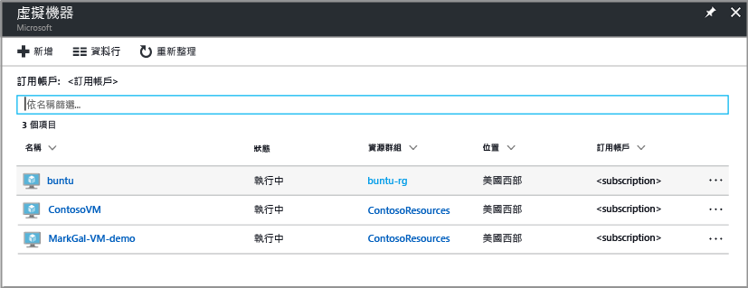

3. 從清單中選取要備份的 VM。

  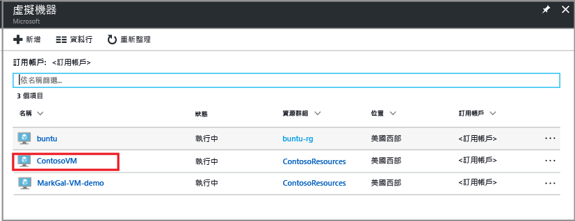

  當您選取 VM 時，虛擬機器清單便會轉移至左邊，並開啟虛擬機器管理刀鋒視窗和虛擬機器儀表板。  
 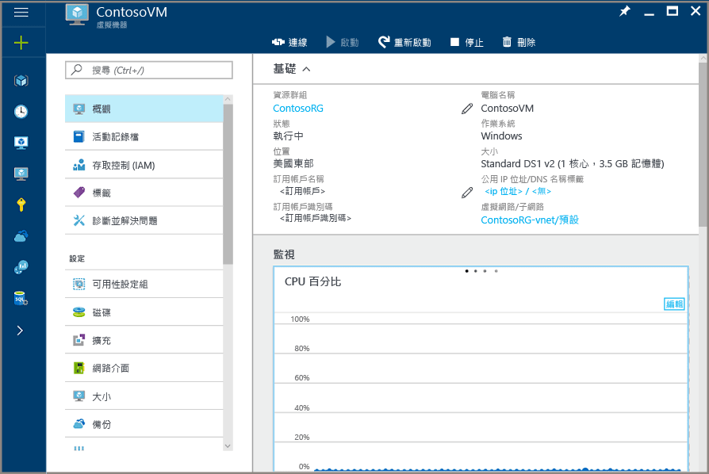

4. 在 VM 管理刀鋒視窗的 [設定] 區段中，按一下 [備份]。  

  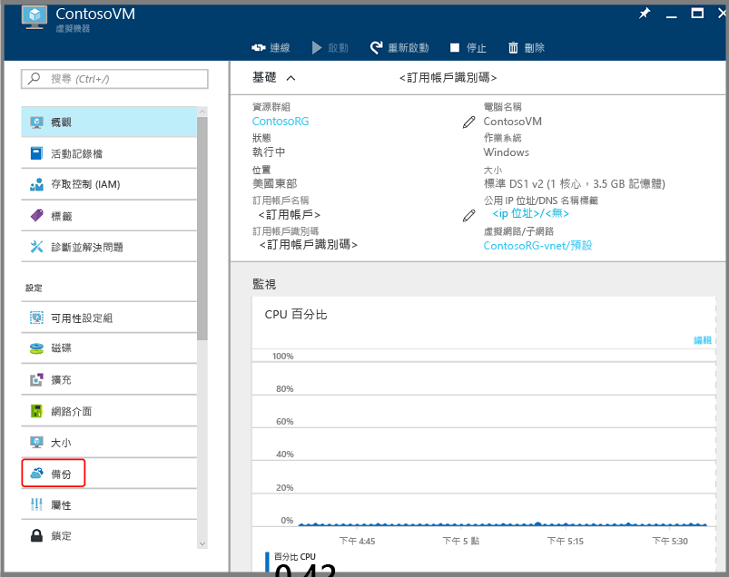

  [啟用備份] 刀鋒視窗隨即開啟。

  

5. 對於復原服務保存庫，按一下 [選取現有]，然後從下拉式清單中選擇保存庫。

  

  如果沒有復原服務保存庫，或您想要使用新的保存庫，請按一下 [新建]，並提供新保存庫的名稱。 新保存庫已在與虛擬機器相同的資源群組和相同位置中建立。 如果您想要使用不同的值建立復原服務保存庫，請參閱如何[建立復原服務保存庫](backup-azure-vms-first-look-arm.md#create-a-recovery-services-vault-for-a-vm)一節。

6. 若要檢視備份原則的詳細資料，請按一下 [備份原則]。

  [備份原則] 刀鋒視窗隨即開啟，並提供所選原則的詳細資料。 如果有其他原則存在，請使用下拉式功能表來選擇不同的備份原則。 如果您想要建立原則，請在下拉式功能表中選取 [建立新的]  。 如需定義備份原則的指示，請參閱 [定義備份原則](backup-azure-vms-first-look-arm.md#defining-a-backup-policy)。 若要將變更儲存至備份原則，並返回 [啟用備份] 刀鋒視窗，請按一下 [確定]。

  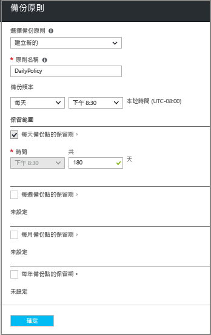

7. 在 [啟用備份] 刀鋒視窗上，按一下 [啟用備份] 以部署原則。 部署原則以讓它與保存庫和虛擬機器產生關聯。

  

8. 您可以透過出現在入口網站的通知來追蹤組態進度。 下列範例顯示部署已經開始。

  

9. 組態進度完成之後，在 VM 管理刀鋒視窗上，按一下 [備份] 以開啟 [備份項目] 刀鋒視窗並檢視詳細資料。

  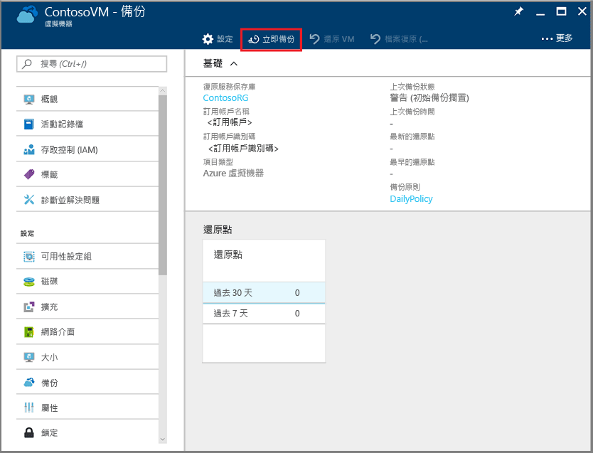

  在完成初始備份之前，[上次備份狀態] 會顯示為 [警告 (待執行初始備份)]。 若要查看下一個排定的備份工作何時發生，請在 [備份原則] 下按一下原則的名稱。 [備份原則] 刀鋒視窗隨即開啟，並顯示已排定備份的時間。

10. 若要執行備份工作，並建立初始復原點，請在 [備份保存庫] 刀鋒視窗中，按一下 [立即備份]。

  ![按一下 [立即備份] 以執行初始備份](./media/backup-azure-vms-first-look-arm/backup-now.png)

  [立即備份] 刀鋒視窗隨即開啟。

  ![顯示 [立即備份] 刀鋒視窗](./media/backup-azure-vms-first-look-arm/backup-now-blade-short.png)

11. 在 [立即備份] 刀鋒視窗上，按一下日曆圖示，使用日曆控制項選取此復原點保留的最後一天，然後按一下 [備份]。

  ![設定 [立即備份] 復原點保留的最後一天](./media/backup-azure-vms-first-look-arm/backup-now-blade-calendar.png)

  部署通知可讓您知道已觸發備份工作，而且您可以在 [備份工作] 頁面上監視作業的進度。

## 設定復原服務保存庫中的備份工作
若要設定備份作業，請完成下列步驟。  

1. 建立虛擬機器的復原服務保存庫。
2. 使用 Azure 入口網站選取案例、設定備份原則，以及識別要保護的項目。
3. 執行初始備份。

## 建立 VM 的復原服務保存庫。
復原服務保存庫是一個實體，會儲存歷來建立的所有備份和復原點。 復原服務保存庫也包含套用至受保護 VM 的備份原則。

> [!NOTE]
> 備份 VM 是本機程序。 您無法將某個位置的 VM 備份到另一個位置的復原服務保存庫。 因此，對於每個具有要備份之 VM 的 Azure 位置，該位置至少必須有一個復原服務保存庫。
>
>

若要建立復原服務保存庫：

1. 如果您尚未這麼做，請使用 Azure 訂用帳戶登入 [Azure 入口網站](https://portal.azure.com/)。
2. 在 [中樞] 功能表上按一下 [更多服務]，然後在 [篩選] 對話方塊中輸入**復原服務**。 當您輸入時，會一邊篩選資源清單。 當您在清單中看到 [復原服務保存庫] 時，請按一下它。

      

    如果訂用帳戶中有復原服務保存庫，則會列出保存庫。

    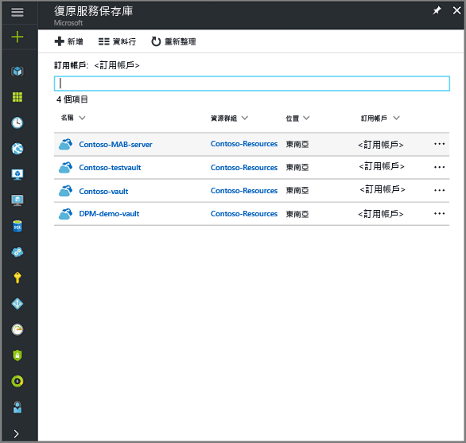
3. 在 [復原服務保存庫] 功能表上，按一下 [新增]。

    

    [復原服務保存庫] 刀鋒視窗隨即開啟，並提示您提供 [名稱]、[訂用帳戶]、[資源群組] 和 [位置]。

    

4. 在 [名稱] 中，輸入易記名稱來識別保存庫。 必須是 Azure 訂用帳戶中唯一的名稱。 輸入包含 2 到 50 個字元的名稱。 該名稱必須以字母開頭，而且只可以包含字母、數字和連字號。

5. 在 [訂用帳戶] 區段中，使用下拉式功能表來選擇 Azure 訂用帳戶。 如果您只使用一個訂用帳戶，該訂用帳戶會出現，您可以跳到下一個步驟。 如果您不確定要使用哪個訂用帳戶，請使用預設 (或建議) 的訂用帳戶。 只有在您的組織帳戶與多個 Azure 訂用帳戶相關聯時，才會有多個選擇。

6. 在 [資源群組] 區段中︰

    * 如果您想建立新的資源群組，請選取 [新建]。
    或
    * 選取 [使用現有的]﹐然後按一下下拉式功能表，以查看可用的資源群組清單。

  如需資源群組的完整資訊，請參閱 [Azure Resource Manager 概觀](../azure-resource-manager/resource-group-overview.md)。

7. 按一下 [位置]  以選取保存庫的地理區域。 此選項會決定您的備份資料要傳送到哪個地理區域。

  > [!IMPORTANT]
  > 如果您不確定 VM 的所在位置，請關閉保存庫建立對話方塊，並移至入口網站的虛擬機器清單。 如果您在多個區域中有虛擬機器，請在每個區域中建立復原服務保存庫。 請先在第一個位置建立保存庫，再進入下一個位置。 儲存備份資料時，不需要指定儲存體帳戶，復原服務保存庫和「Azure 備份」服務會自動處理儲存體。
  >

8. 按一下 [復原服務保存庫] 刀鋒視窗底部的 [建立]。

    建立復原服務保存庫可能需要一些時間。 請監視入口網站右上方區域中的狀態通知。 保存庫一旦建立好，就會出現在 [復原服務保存庫] 的清單中。 在數分鐘之後﹐如果您沒有看到您的保存庫，請按一下 [重新整理]。

    ![按一下 [重新整理] 按鈕。](./media/backup-try-azure-backup-in-10-mins/refresh-button.png) 

    一旦在復原服務保存庫清單中看到您的保存庫，您即可開始設定儲存體備援。

現在您已建立好保存庫，接下來要了解如何設定儲存體複寫。

### 設定儲存體複寫
儲存體複寫選項有異地備援儲存體和本地備援儲存體可供您選擇。 根據預設，保存庫具有異地備援儲存體。 如果復原服務保存庫是您的主要備份，請將儲存體複寫選項設為異地備援儲存體。 如果您想要更便宜但不持久的選項，請選擇本地備援儲存體。 在 [Azure 儲存體複寫概觀](../storage/storage-redundancy.md)中，深入了解[異地備援](../storage/storage-redundancy.md#geo-redundant-storage)和[本地備援](../storage/storage-redundancy.md#locally-redundant-storage)儲存體選項。

若要編輯儲存體複寫設定︰

1. 從 [復原服務保存庫] 刀鋒視窗，選取 [新增保存庫]。

  

  當您選取保存庫時，[設定] 刀鋒視窗 (頂端有保存庫名稱) 和 [保存庫詳細資料] 刀鋒視窗隨即開啟。

  

2. 在新保存庫的 [設定] 刀鋒視窗中，使用垂直滑桿捲動至 [管理] 區段，然後按一下 [備份基礎結構]。
    [備份基礎結構] 刀鋒視窗隨即開啟。
3. 在 [備份基礎結構] 刀鋒視窗中，按一下 [備份設定]開啟 [備份設定] 刀鋒視窗。

    
4. 為保存庫選擇適當的儲存體複寫選項。

    

    根據預設，保存庫具有異地備援儲存體。 如果您使用 Azure 做為主要的備份儲存體端點，請繼續使用 [異地備援]。 如果您未使用 Azure 做為主要的備份儲存體端點，則選擇 [本地備援]，以減少 Azure 儲存體成本。 在此[儲存體備援概觀](../storage/storage-redundancy.md)中，深入了解[異地備援](../storage/storage-redundancy.md#geo-redundant-storage)和[本地備援](../storage/storage-redundancy.md#locally-redundant-storage)儲存體選項。

## 選取備份目標、設定原則及定義要保護的項目
在向保存庫註冊 VM 前，請先執行探索程序，以確保能夠識別任何新增至訂用帳戶的新虛擬機器。 此程序會在 Azure 中查詢訂用帳戶中的虛擬機器清單，以及其他資訊，例如雲端服務名稱、區域等。 在 Azure 入口網站中，案例是指您要放入復原服務保存庫中的項目。 原則是復原點擷取頻率和時間的排程。 原則也會包含復原點的保留範圍。

1. 如果您已開啟復原服務保存庫，請繼續步驟 2。 否則，請在 [中樞] 功能表上按一下 [更多服務]，在資源清單中輸入**復原服務**，然後按一下 [復原服務保存庫]。

      

    復原服務保存庫清單隨即出現。

    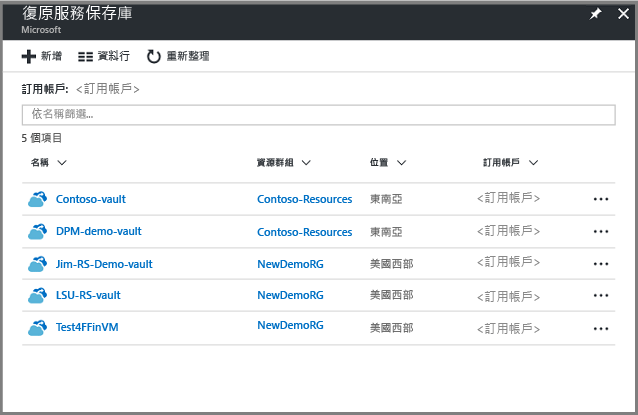

    在復原服務保存庫清單中，選取保存庫以開啟其儀表板。

     ![開啟 [保存庫] 刀鋒視窗](./media/backup-azure-arm-vms-prepare/new-vault-settings-blade.png)

2. 在 [保存庫儀表板] 功能表中，按一下 [備份] 以開啟 [備份] 刀鋒視窗。

    ![開啟 [備份] 刀鋒視窗](./media/backup-azure-arm-vms-prepare/backup-button.png)

    [備份] 和 [備份目標] 刀鋒視窗隨即開啟。

    ![開啟 [案例] 刀鋒視窗](./media/backup-azure-arm-vms-prepare/select-backup-goal-1.png)
3. 在 [備份目標] 刀鋒視窗中，從 [您的工作負載在何處執行] 下拉式功能表中，選取 [Azure]。 從 [欲備份的項目] 下拉式清單，選擇 [虛擬機器]，然後按一下 [確定]。

    這些動作會向保存庫註冊 VM 擴充功能。 [備份目標] 刀鋒視窗隨即關閉，然後開啟 [備份原則] 刀鋒視窗。

    ![開啟 [案例] 刀鋒視窗](./media/backup-azure-arm-vms-prepare/select-backup-goal-2.png)

4. 在 [備份原則] 刀鋒視窗中，選取您要套用至保存庫的備份原則。

    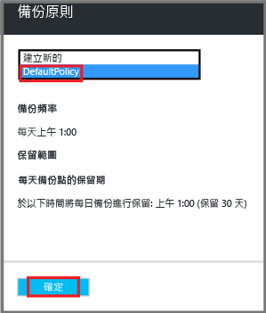

    預設原則的詳細資料便會列在下拉式功能表之下。 如果您想要建立原則，請在下拉式功能表中選取 [建立新的]  。 如需定義備份原則的指示，請參閱 [定義備份原則](backup-azure-vms-first-look-arm.md#defining-a-backup-policy)。
    按一下 [確定] 讓備份原則與保存庫建立關聯。

    [備份原則] 刀鋒視窗隨即關閉，然後開啟 [選取虛擬機器] 刀鋒視窗。
5. 在 [選取虛擬機器] 刀鋒視窗中，選擇要與指定原則建立關聯的虛擬機器，然後按一下 [確定]。

    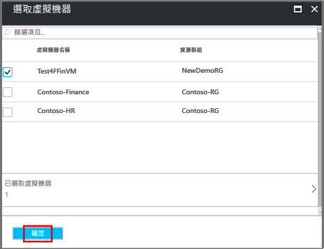

    選取的虛擬機器便會接受驗證。 如果沒看到應該要有的虛擬機器，請確認其是否位於和復原服務保存庫相同的 Azure 位置。 復原服務保存庫的位置會顯示在保存庫儀表板上。

6. 現在您已定義保存庫的所有設定，接下來在 [備份] 刀鋒視窗中按一下 [啟用備份]，以將原則部署至保存庫和 VM。 部署備份原則不會建立虛擬機器的初始復原點。

    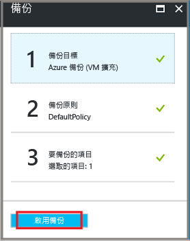

成功啟用備份後，備份原則就會依排程執行。 不過，請繼續初始化第一個備份工作。

## 初始備份
在虛擬機器上部署好備份原則後，並不表示您已備份好資料。 根據預設，第一個排定的備份 (如備份原則中所定義) 即為初始備份。 在執行初始備份之前，[備份作業] 刀鋒視窗上的 [上次備份狀態] 會顯示為 [警告 (待執行初始備份)]。

除非您的初始備份預計會馬上開始，否則建議您執行 [立即備份] 。

若要執行初始備份作業：

1. 在保存庫儀表板中，按一下 [備份項目] 下的數字，或按一下 [備份項目] 圖格。  
  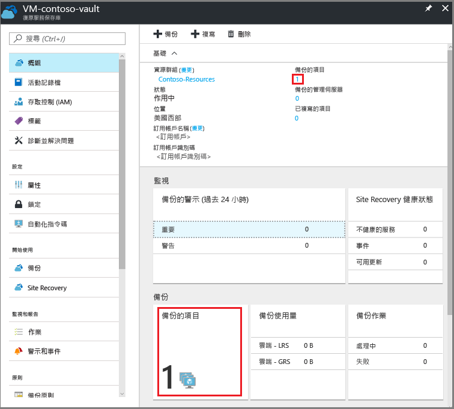

  [備份項目]  刀鋒視窗隨即開啟。

  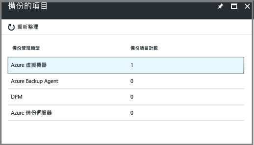

2. 在 [備份項目] 刀鋒視窗中，選取該項目。

  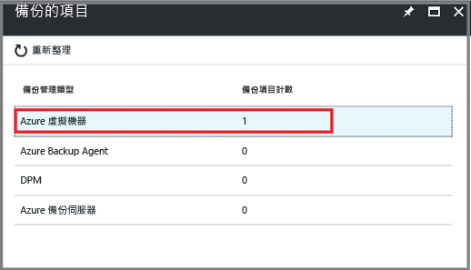

  [備份項目] 清單隨即開啟。  

  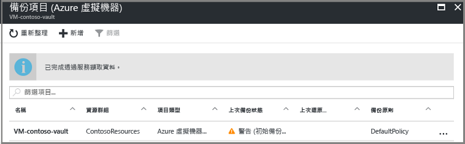

3. 在 [備份項目] 清單上，按一下省略符號 **...** 以開啟操作功能表。

  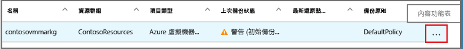

  操作功能表隨即出現。

  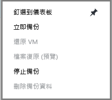

4. 在操作功能表上，按一下 [立即備份]。

  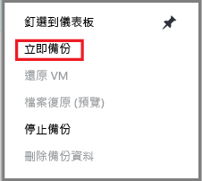

  [立即備份] 刀鋒視窗隨即開啟。

  ![顯示 [立即備份] 刀鋒視窗](./media/backup-azure-vms-first-look-arm/backup-now-blade-short.png)

5. 在 [立即備份] 刀鋒視窗上，按一下日曆圖示，使用日曆控制項選取此復原點保留的最後一天，然後按一下 [備份]。

  ![設定 [立即備份] 復原點保留的最後一天](./media/backup-azure-vms-first-look-arm/backup-now-blade-calendar.png)

  部署通知可讓您知道已觸發備份工作，而且您可以在 [備份工作] 頁面上監視作業的進度。 根據您的 VM 大小，建立初始備份可能需要花一點時間。

6. 若要在保存庫儀表板上檢視或追蹤初始備份的狀態，請在 [備份工作] 圖格上，按一下 [進行中]。

  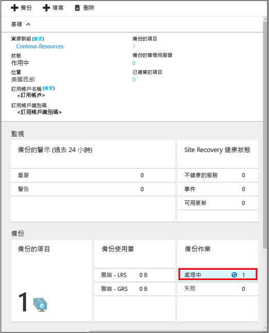

  [備份工作] 刀鋒視窗隨即開啟。

  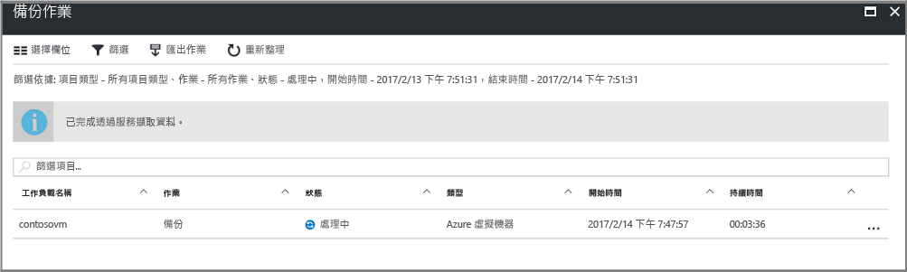

  在 [備份作業]  刀鋒視窗中，您可以看到所有作業的狀態。 檢查您 VM 的備份作業是否仍在進行中或已經完成。 當備份工作完成時，狀態會是「完成」 。

  > [!NOTE]
  > 在備份工作進行時，Azure 備份服務會對每個 VM 中的備份擴充功能發出命令，以排清所有寫入並取得一致的快照。
  >
  >

[!INCLUDE [backup-create-backup-policy-for-vm](../../includes/backup-create-backup-policy-for-vm.md)]

## 在虛擬機器中安裝 VM 代理程式
如果需要便會提供此資訊。 Azure VM 代理程式必須安裝在 Azure 虛擬機器上，備份擴充功能才能運作。 不過，如果 VM 是建立自 Azure 資源庫，則 VM 代理程式已存在於虛擬機器上。 從內部部署資料中心移轉的 VM 不會安裝 VM 代理程式。 在這種情況下，必須安裝 VM 代理程式。 如果您在備份 Azure VM 時遇到問題，請先確定已在虛擬機器上正確安裝 Azure VM 代理程式 (請參閱下表)。 如果您建立自訂 VM，請先[確定已選取 [安裝 VM 代理程式] 核取方塊](../virtual-machines/virtual-machines-windows-classic-agents-and-extensions.md?toc=%2fazure%2fvirtual-machines%2fwindows%2fclassic%2ftoc.json)，再佈建虛擬機器。

深入了解 [VM 代理程式](https://go.microsoft.com/fwLink/?LinkID=390493&clcid=0x409)和[如何安裝](../virtual-machines/virtual-machines-windows-classic-manage-extensions.md?toc=%2fazure%2fvirtual-machines%2fwindows%2fclassic%2ftoc.json)。

下表提供適用於 Windows 和 Linux VM 之 VM 代理程式的其他資訊。

| **作業** | **Windows** | **Linux** |
| --- | --- | --- |
| 安裝 VM 代理程式 |<li>下載並安裝 [代理程式 MSI](http://go.microsoft.com/fwlink/?LinkID=394789&clcid=0x409)。 您需要有系統管理員權限，才能完成安裝。 <li>[更新 VM 屬性](http://blogs.msdn.com/b/mast/archive/2014/04/08/install-the-vm-agent-on-an-existing-azure-vm.aspx) 以表示已安裝代理程式。 |<li> 從 GitHub 安裝最新的 [Linux 代理程式](https://github.com/Azure/WALinuxAgent) 。 您需要有系統管理員權限，才能完成安裝。 <li> [更新 VM 屬性](http://blogs.msdn.com/b/mast/archive/2014/04/08/install-the-vm-agent-on-an-existing-azure-vm.aspx) 以表示已安裝代理程式。 |
| 更新 VM 代理程式 |更新 VM 代理程式與重新安裝 [VM 代理程式二進位檔](http://go.microsoft.com/fwlink/?LinkID=394789&clcid=0x409)一樣簡單。  確定在更新 VM 代理程式時，沒有任何執行中的備份作業。 |請遵循[更新 Linux VM 代理程式](../virtual-machines/virtual-machines-linux-update-agent.md?toc=%2fazure%2fvirtual-machines%2flinux%2ftoc.json)的指示。  確定在更新 VM 代理程式時，沒有任何執行中的備份作業。 |
| 驗證 VM 代理程式安裝 |<li>瀏覽至 Azure VM 中的 C:\WindowsAzure\Packages 資料夾。 <li>您應該會發現 WaAppAgent.exe 檔案已存在。<li> 在該檔案上按一下滑鼠右鍵，前往 [屬性]，然後選取 [詳細資料] 索引標籤。 [產品版本] 欄位應為 2.6.1198.718 或更高版本。 |N/A |

### 備份擴充功能
虛擬機器上安裝了 VM 代理程式後，Azure 備份服務就會在 VM 代理程式上安裝備份擴充功能。 Azure 備份服務無需使用者介入，即可順暢地升級和修補備份擴充功能。

備份服務會安裝備份擴充功能，即使 VM 並未執行。 執行中的 VM 提供了取得應用程式一致復原點的絕佳機會。 不過，即使 VM 已關閉而無法安裝擴充功能，Azure 備份服務仍會繼續備份 VM。 這種類型的備份稱為離線 VM，復原點是「當機時保持一致」。

## 疑難排解資訊
如果您在完成本文中的某些工作時遇到問題，請參閱 [疑難排解指引](backup-azure-vms-troubleshoot.md)。

## 價格
備份 Azure VM 的成本是根據受保護執行個體的數目。 如需受保護執行個體的定義，請參閱[什麼是受保護執行個體](backup-introduction-to-azure-backup.md#what-is-a-protected-instance)。 如需計算備份虛擬機器成本的範例，請參閱[如何計算受保護執行個體](backup-azure-vms-introduction.md#calculating-the-cost-of-protected-instances)。 請參閱 Azure 備份定價頁面以取得[備份定價](https://azure.microsoft.com/pricing/details/backup/)的相關資訊。

## 有疑問嗎？
如果您有問題，或希望我們加入任何功能，請 [傳送意見反應給我們](http://aka.ms/azurebackup_feedback)。

