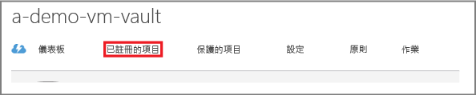
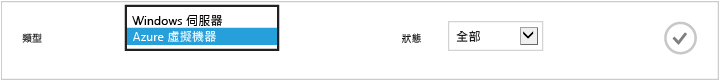
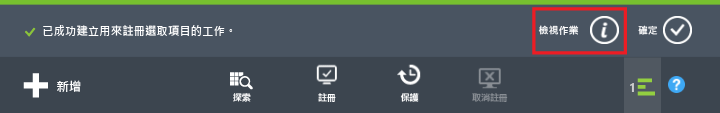
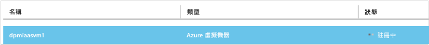
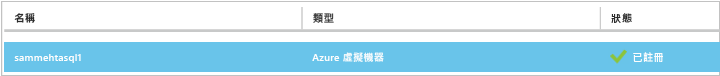
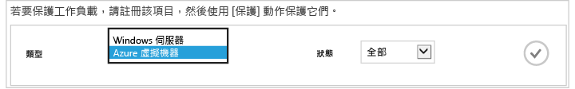
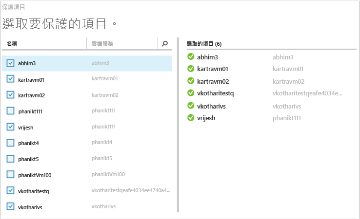
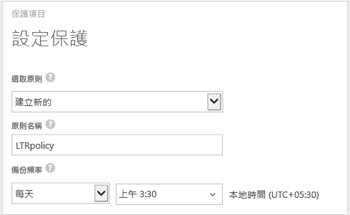
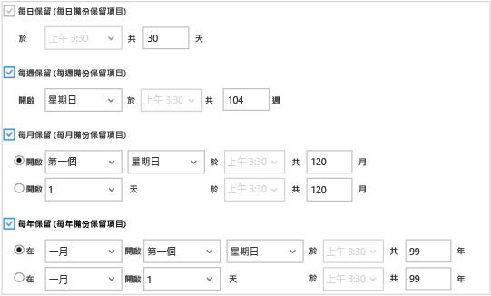
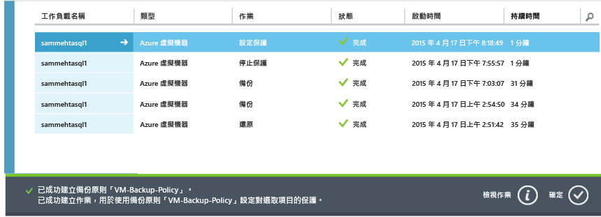

# 先睹為快：備份 Azure 虛擬機器
> [!div class="op_single_selector"]
> * [使用復原服務保存庫保護 VM](backup-azure-vms-first-look-arm.md)
> * [使用備份保存庫保護 Azure VM](backup-azure-vms-first-look.md)
>
>

本教學課程會帶領您逐步完成將 Azure 虛擬機器 (VM) 備份至 Azure 備份保存庫的步驟。 這篇文章說明用來備份 VM 的傳統模型或 Service Manager 部署模型。 下列步驟只適用於在傳統入口網站中建立的備份保存庫。 Microsoft 建議讓大部分的新部署使用資源管理員模式。

如果您有興趣將 VM 備份至屬於資源群組的復原服務保存庫，請參閱 [初步了解：使用復原服務保存庫保護 VM](backup-azure-vms-first-look-arm.md)。

若要成功完成本教學課程，必須先滿足下列先決條件︰

* 您已在 Azure 訂用帳戶中建立 VM。
* VM 可連線到 Azure 公用 IP 位址。 如需其他資訊，請參閱[網路連線](backup-azure-vms-prepare.md#network-connectivity)。

> [!NOTE]
> Azure 有兩種用來建立和使用資源的部署模型： [Resource Manager 和傳統](../azure-resource-manager/resource-manager-deployment-model.md)。 本教學課程適用於在傳統入口網站中建立的虛擬機器。
>
>

## 建立備份保存庫
備份保存庫是一個實體，儲存隨著時間建立的所有備份和復原點。 備份保存庫也包含備份虛擬機器時將套用的備份原則。

> [!IMPORTANT]
> 從 2017 年 3 月開始，您無法再使用傳統入口網站來建立備份保存庫。
> 您可以將備份保存庫升級至復原服務保存庫。 如需詳細資訊，請參閱[將備份保存庫升級至復原服務保存庫](backup-azure-upgrade-backup-to-recovery-services.md)文章。 Microsoft 鼓勵您將備份保存庫升級至復原服務保存庫。  在 2017 年 10 月 15 日之後，您就不能使用 PowerShell 建立備份保存庫。 **在 2017 年 11 月 1 日以前**：
>- 所有其餘的備份保存庫都會自動升級至復原服務保存庫。
>- 您將無法在傳統入口網站中存取您的備份資料。 相反地，使用 Azure 入口網站來存取您在復原服務保存庫中的備份資料。
>

## 探索及註冊 Azure 虛擬機器
向保存庫註冊 VM 前，請執行探索程序以識別任何新的 VM。 這會傳回訂用帳戶中的虛擬機器清單以及其他資訊，例如雲端服務名稱和區域。

1. 登入 [Azure 傳統入口網站](http://manage.windowsazure.com/)
2. 在 Azure 傳統入口網站中，按一下 [復原服務]  以開啟復原服務保存庫清單。
    
3. 在保存庫清單中，選取要備份 VM 的保存庫。

    當您選取保存庫時，它會開啟在 [快速啟動]  頁面中
4. 在保存庫功能表中，按一下 [已註冊的項目] 。

    
5. 在 [類型] 功能表中選取 [Azure 虛擬機器]。

    
6. 按一下頁面底部的 [ **探索** ]。
    

    在列表顯示虛擬機器時，探索程序可能需花費幾分鐘的時間。 畫面底部會有通知讓您知道程序正在執行中。

    

    程序完成時，通知隨即變更。

    
7. 按一下頁面底部的 [註冊]  。
    
8. 在 [註冊項目]  捷徑功能表中，選取您想要註冊的虛擬機器。

   > [!TIP]
   > 您可以同時註冊多個虛擬機器。
   >
   >

    系統會為您所選取的每個虛擬機器建立一個工作。
9. 按一下通知中的 [檢視作業]，以移至 [作業] 頁面。

    

    虛擬機器也會連同註冊作業的狀態，出現在已註冊的項目清單中。

    

    作業完成時，狀態會改變以反映「已註冊」  狀態。

    

## 在虛擬機器中安裝 VM 代理程式
Azure VM 代理程式必須安裝在 Azure 虛擬機器上，備份擴充功能才能運作。 如果 VM 是建立自 Azure 資源庫，則 VM 代理程式已存在於 VM；您可以跳到[保護您的 VM](backup-azure-vms-first-look.md#create-the-backup-policy)。

如果您的 VM 是從內部部署資料中心進行移轉，VM 可能還未安裝 VM 代理程式。 您必須先在虛擬機器上安裝 VM 代理程式，再繼續進行保護 VM。 如需安裝 VM 代理程式的詳細步驟，請參閱 [《備份 VM》文章的＜VM 代理程式＞一節](backup-azure-vms-prepare.md#vm-agent)。

## 建立備份原則
觸發初始備份作業之前，請先設定備份快照擷取時間排程。 備份快照擷取時間排程以及快照保留時間長度是備份原則。 保留資訊是以 Grandfather-father-son 備份輪替配置為基礎。

1. 在 Azure 傳統入口網站中，瀏覽至 [復原服務] 下的備份保存庫，然後按一下 [註冊的項目]。
2. 從下拉式選單中選取 [Azure 虛擬機器]  。

    
3. 按一下頁面底部的 [保護]  。
    ![按一下 [保護]](./media/backup-azure-vms-first-look/protect-icon.png)

    [保護項目精靈] 隨即出現，並「只」列出已註冊但未受保護的虛擬機器。

    
4. 選取您要保護的虛擬機器。

    如果有兩個以上同名的虛擬機器，請使用雲端服務來區別虛擬機器。
5. 在 [設定保護]  功能表上，選取現有原則或建立新原則，以保護您所識別的虛擬機器。

    新的備份保存庫擁有與保存庫相關聯的預設原則。 這項原則會在每晚擷取每日快照，並將每日快照保留 30 天。 每一個備份原則可以有多個相關聯的虛擬機器。 但虛擬機器一次只能與一個原則相關聯。

    

   > [!NOTE]
   > 備份原則中包含排定備份的保留配置。 如果您選取現有的備份原則，將無法在下一個步驟中修改保留選項。
   >
   >
6. 在 [保留範圍]  上，定義特定備份點的每日、每週、每月和每年範圍。

    

    保留期原則會指定儲存備份的時間長度。 您可以根據進行備份的時間指定不同的保留原則。
7. 按一下 [作業] 以檢視 [設定保護] 作業的清單。

    

    現在您已建立原則，接下來請移至下一個步驟，並執行初始備份。

## 初始備份
在虛擬機器受到原則保護後，您可以在 [受保護項目]  索引標籤上檢視該關聯性。 在執行初始備份前，[保護狀態] 會顯示為 [受保護 - (待執行初始備份)]。 根據預設，第一個排定的備份是 *初始備份*。

若要立即啟動初始備份︰

1. 在 [受保護的項目] 頁面上，按一下頁面底部的 [立即備份]。
    ![[立即備份] 圖示](./media/backup-azure-vms-first-look/backup-now-icon.png)

    Azure 備份服務會初始備份作業建立備份工作。
2. 按一下 [工作]  索引標籤來檢視工作清單。

    

    初始備份完成後，[受保護的項目] 索引標籤中的虛擬機器狀態為 [受保護]。

    

   > [!NOTE]
   > 備份虛擬機器是本機的程序。 您無法將虛擬機器從一個區域備份到另一個區域中的備份保存庫。 因此，對於每一個有 VM 需要備份的 Azure 區域，必須在該區域中至少建立一個備份保存庫。
   >
   >

## 後續步驟
現在您已成功備份 VM，接下來有幾個可能相關的步驟。 最合乎邏輯的步驟是讓自己熟悉如何將資料還原到 VM。 不過，也有能夠幫助您了解如何確保資料安全無虞以及將成本降至最低的管理工作。

* [管理和監視虛擬機器](backup-azure-manage-vms.md)
* [還原虛擬機器](backup-azure-restore-vms.md)
* [疑難排解指引](backup-azure-vms-troubleshoot.md)

## 有疑問嗎？
如果您有問題，或希望我們加入任何功能，請 [傳送意見反應給我們](http://aka.ms/azurebackup_feedback)。

