# 使用資源管理員部署模型將 Windows Server 或用戶端備份至 Azure
> [!div class="op_single_selector"]
> * [Azure 入口網站](backup-configure-vault.md)
> * [傳統入口網站](backup-configure-vault-classic.md)
>
>

本文說明如何 Resource Manager 部署模型將 Windows Server (或 Windows 用戶端) 檔案和資料夾備份至 Azure。

[!INCLUDE [learn-about-deployment-models](../../includes/backup-deployment-models.md)]

## 開始之前
若要將伺服器或用戶端備份至 Azure，您需要 Azure 帳戶。 如果您沒有帳戶，只需要幾分鐘的時間就可以建立 [免費帳戶](https://azure.microsoft.com/free/) 。

## 建立復原服務保存庫
復原服務保存庫是一個實體，會儲存歷來建立的所有備份和復原點。 復原服務保存庫也包含套用至受保護檔案和資料夾的備份原則。 當您建立復原服務保存庫時，也應該選取適當的儲存體備援選項。

### 建立復原服務保存庫
1. 如果您尚未這麼做，請使用 Azure 訂用帳戶登入 [Azure 入口網站](https://portal.azure.com/) 。
2. 在 [中樞] 功能表上按一下 [更多服務]，在資源清單中輸入**復原服務**，然後按一下 [復原服務保存庫]。

    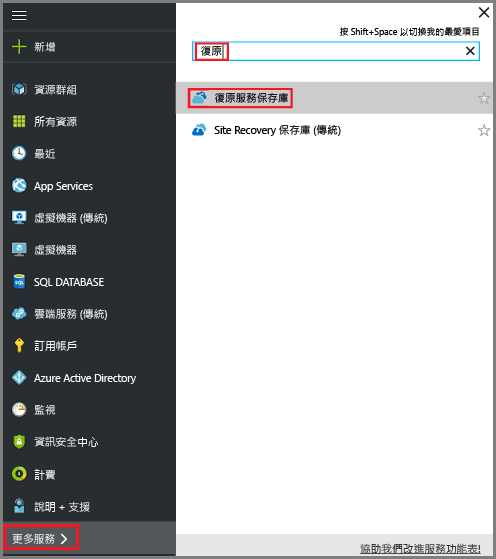  

    如果訂用帳戶中有復原服務保存庫，則會列出保存庫。

3. 在 [復原服務保存庫] 功能表上，按一下 [新增]。

    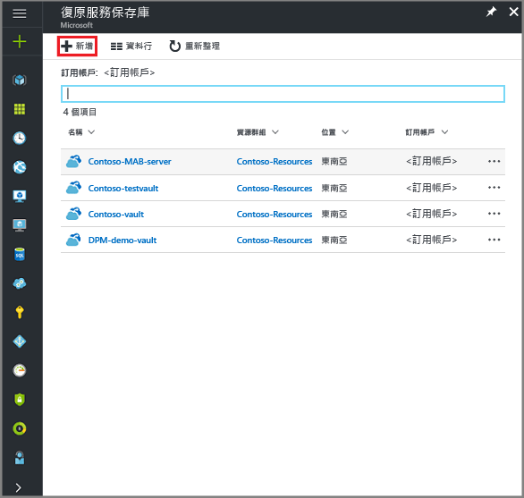

    [復原服務保存庫] 刀鋒視窗隨即開啟，並提示您提供 [名稱]、[訂用帳戶]、[資源群組] 和 [位置]。

    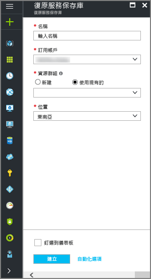

4. 在 [名稱] 中，輸入易記名稱來識別保存庫。 必須是 Azure 訂用帳戶中唯一的名稱。 輸入包含 2 到 50 個字元的名稱。 該名稱必須以字母開頭，而且只可以包含字母、數字和連字號。

5. 在 [訂用帳戶] 區段中，使用下拉式功能表來選擇 Azure 訂用帳戶。 如果您只使用一個訂用帳戶，該訂用帳戶會出現，您可以跳到下一個步驟。 如果您不確定要使用哪個訂用帳戶，請使用預設 (或建議) 的訂用帳戶。 只有在您的組織帳戶與多個 Azure 訂用帳戶相關聯時，才會有多個選擇。

6. 在 [資源群組] 區段中︰

    * 如果您想建立新的資源群組，請選取 [新建]。
    或
    * 選取 [使用現有的]﹐然後按一下下拉式功能表，以查看可用的資源群組清單。

  如需資源群組的完整資訊，請參閱 [Azure Resource Manager 概觀](../azure-resource-manager/resource-group-overview.md)。

7. 按一下 [位置]  以選取保存庫的地理區域。 此選項會決定您的備份資料要傳送到哪個地理區域。

8. 按一下 [復原服務保存庫] 刀鋒視窗底部的 [建立]。

  建立復原服務保存庫可能需要一些時間。 請監視入口網站右上方區域中的狀態通知。 保存庫一旦建立好，就會出現在 [復原服務保存庫] 的清單中。 在數分鐘之後﹐如果您沒有看到您的保存庫，請按一下 [重新整理]。

  ![按一下 [重新整理] 按鈕。](./media/backup-try-azure-backup-in-10-mins/refresh-button.png) 

  一旦在復原服務保存庫清單中看到您的保存庫，您即可開始設定儲存體備援。

### 設定儲存體備援
首次建立復原服務保存庫時會決定儲存體的複寫方式。

1. 從 [復原服務保存庫] 刀鋒視窗，按一下 [新增保存庫]。

    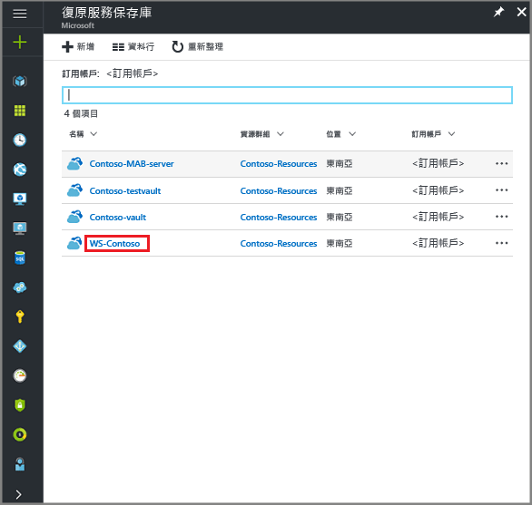

    當您選取保存庫時，[復原服務保存庫] 刀鋒視窗會縮小﹐而 [設定] 刀鋒視窗 (頂端有保存庫名稱) 和 [保存庫詳細資料] 刀鋒視窗隨即開啟。

    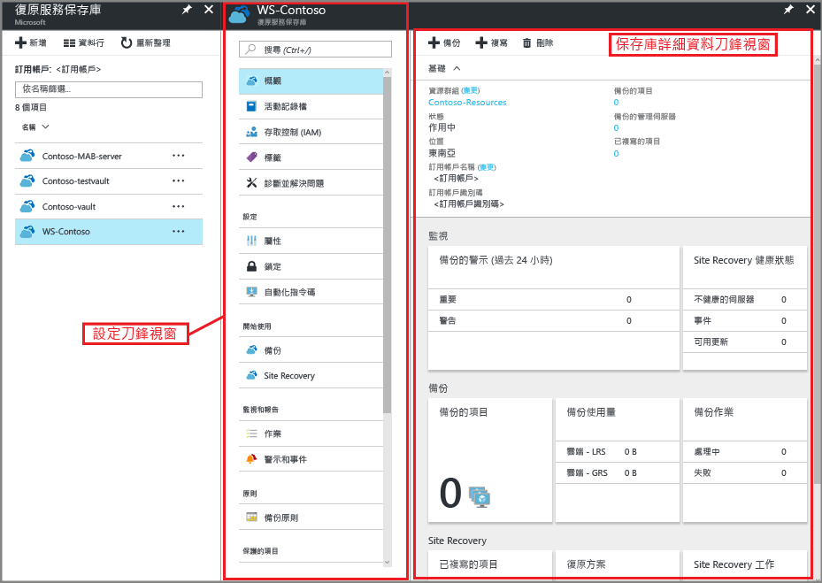

2. 在新保存庫的 [設定] 刀鋒視窗中，使用垂直滑桿捲動至 [管理] 區段，然後按一下 [備份基礎結構]。

  [備份基礎結構] 刀鋒視窗隨即開啟。

3. 在 [備份基礎結構] 刀鋒視窗中，按一下 [備份設定]開啟 [備份設定] 刀鋒視窗。

  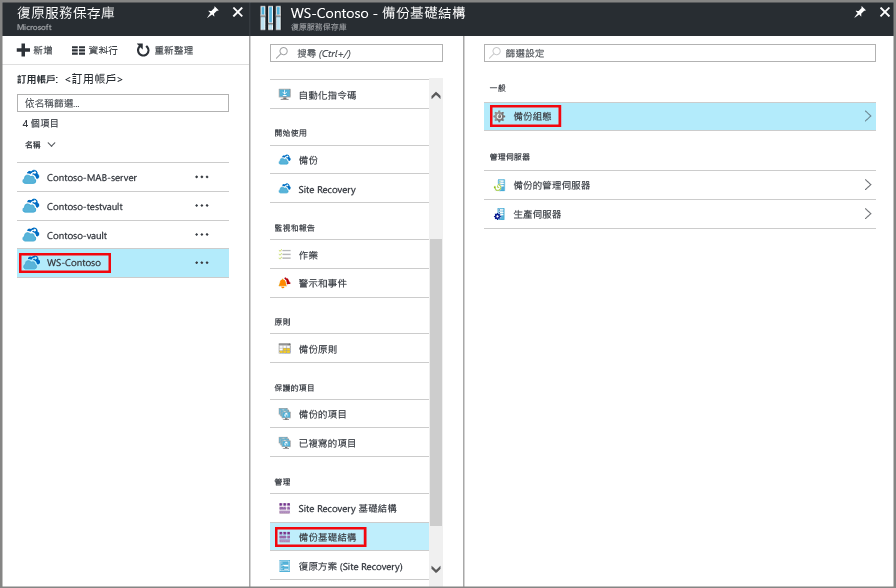

4. 為保存庫選擇適當的儲存體複寫選項。

  

  根據預設，保存庫具有異地備援儲存體。 如果您使用 Azure 做為主要的備份儲存體端點，請繼續使用 [異地備援]。 如果您未使用 Azure 做為主要的備份儲存體端點，則選擇 [本地備援]，以減少 Azure 儲存體成本。 在此[儲存體備援概觀](../storage/storage-redundancy.md)中，深入了解[異地備援](../storage/storage-redundancy.md#geo-redundant-storage)和[本地備援](../storage/storage-redundancy.md#locally-redundant-storage)儲存體選項。

現在您已建立保存庫，接下來請下載及安裝 Microsoft Azure 復原服務代理程式、下載保存庫認證，以及使用這些認證向保存庫註冊代理程式，讓基礎結構做好備份檔案和資料夾的準備。

## 設定保存庫

1. 在 [復原服務保存庫] 刀鋒視窗上 (針對剛建立的保存庫)，在 [開始使用] 區段中按一下 [備份]，然後在 [開始使用備份功能] 刀鋒視窗上，選取 [備份目標]。

  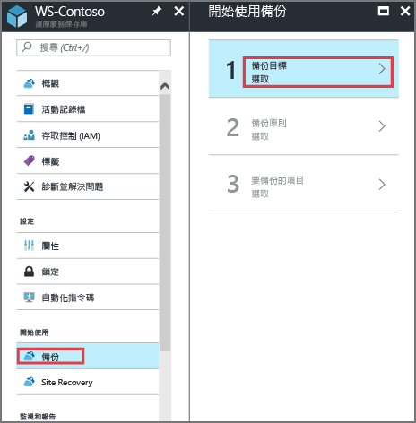

  [備份目標] 刀鋒視窗隨即開啟。 如果先前已設定過復原服務保存庫，當您按一下 [復原服務保存庫] 刀鋒視窗上的 [備份] 時，便會開啟 [備份目標] 刀鋒視窗。

  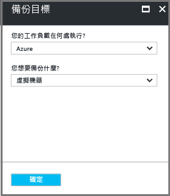

2. 從 [您的工作負載在何處執行?] 下拉式功能表中，選取 [內部部署]。

  因為您的 Windows Server 或 Windows 電腦是不在 Azure 中的實體電腦，所以您選擇 [內部部署]。

3. 從 [您要備份什麼?] 功能表中，選取 [檔案和資料夾]，然後按一下 [確定]。

  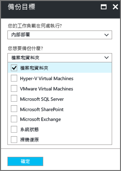

  按一下 [確定] 後，[備份目標] 旁會出現勾選記號，且 [準備基礎結構] 刀鋒視窗隨即開啟。

  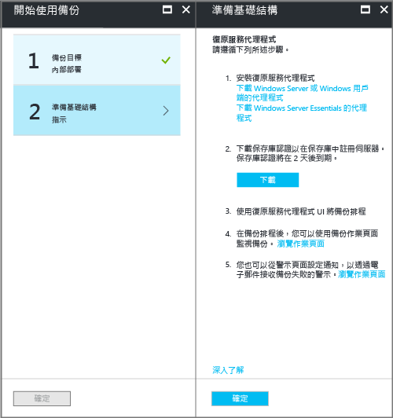

4. 在 [準備基礎結構] 刀鋒視窗上，按 [下載 Windows Server 或 Windows Client 的代理程式]。

  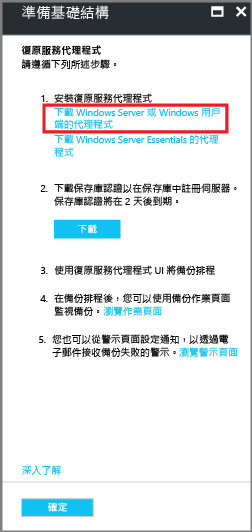

  如果您使用 Windows Server Essential，請選擇下載 Windows Server Essential 的代理程式。 快顯功能表會提示您執行或儲存 MARSAgentInstaller.exe。

  

5. 在下載快顯功能表中，按一下 [儲存]。

  根據預設，**MARSagentinstaller.exe** 檔案會儲存至 [下載] 資料夾。 安裝程式完成時，您會看到快顯視窗，詢問您是否要執行安裝程式，或開啟資料夾。

  

  您還不需要安裝代理程式。 您可以在下載保存庫認證之後﹐安裝代理程式。

6. 在 [準備基礎結構] 刀鋒視窗上，按 [下載]。

  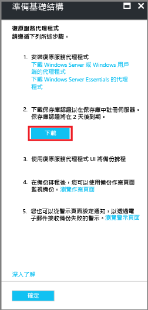

  保存庫認證會下載至「下載」資料夾。 保存庫認證下載完成之後，您會看到快顯視窗，詢問您是否要開啟或儲存認證。 按一下 [儲存] 。 如果您不小心按到 [開啟]，請讓嘗試開啟保存庫認證的對話方塊失敗。 您無法開啟保存庫認證。 請繼續進行下一個步驟。 保存庫認證位於 [下載] 資料夾中。   

  

## 安裝和註冊代理程式

> [!NOTE]
> 透過 Azure 入口網站啟用備份的功能尚未推出。 使用 Microsoft Azure 復原服務代理程式來備份檔案和資料夾。
>

1. 在 [下載] 資料夾 (或其他儲存位置) 中找到 **MARSagentinstaller.exe** 並對其按兩下。

  安裝程式在擷取、安裝和註冊復原服務代理程式時會提供一系列訊息。

  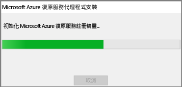

2. 完成 Microsoft Azure 復原服務代理程式安裝精靈。 若要完成精靈，您需要︰

  * 選擇安裝和快取資料夾的位置。
  * 如果您使用 Proxy 伺服器來連線到網際網路，請提供您的 Proxy 伺服器資訊。
  * 如果您使用已驗證的 Proxy，請提供您的使用者名稱和密碼詳細資料。
  * 提供下載的保存庫認證
  * 將加密複雜密碼存放在安全的位置。

  > [!NOTE]
  > 如果遺失或忘記複雜密碼，Microsoft 將無法協助您復原備份資料。 將檔案存放在安全的位置。 必須有此檔案才能還原備份。
  >
  >

現已安裝代理程式，且已向保存庫註冊您的電腦。 您已準備好可以設定及排程備份。

## 建立備份原則
備份原則就是復原點擷取排程以及復原點保留時間長度。 請使用 Microsoft Azure 備份代理程式來為檔案和資料夾建立備份原則。

### 建立備份排程
1. 開啟 Microsoft Azure 備份代理程式。 您可以透過在您的電腦中搜尋 **Microsoft Azure 備份**來找出備份。

    
2. 在備份代理程式的 [動作] 窗格中，按一下 [排程備份] 以啟動「排程備份精靈」。

    

3. 在排程備份精靈的 [開始使用] 頁面上，按 [下一步]。
4. 在 [選取要備份的項目] 頁面上，按一下 [新增項目]。

  [選取項目] 對話方塊隨即開啟。

5. 選取您要保護的檔案和資料夾，然後按一下 [確定]。
6. 在 [選取要備份的項目] 頁面上，按 [下一步]。
7. 在 [指定備份排程] 頁面上，指定備份排程並按 [下一步]。

    您可以排程每日 (一天最多三次) 或每週備份。

    

   > [!NOTE]
   > 如需如何指定備份排程的相關詳細資訊，請參閱 [使用 Azure 備份來取代您的磁帶基礎結構](backup-azure-backup-cloud-as-tape.md)一文。
   >
   >

8. 在 [選取保留原則] 頁面上，選擇用於備份複本的特定保留原則，然後按 [下一步]。

    保留原則會指定備份的儲存持續期間。 除了僅針對所有備份點指定「一般原則」之外，您可以指定在進行備份時根據不同的保留原則。 您可以修改每日、每週、每月和每年保留原則，以符合您的需求。
9. 在 [選擇初始備份類型] 頁面上，選擇初始備份類型。 讓 [自動透過網路] 選項保持已選取狀態，然後按 [下一步]。

    您可以透過網路自動備份，也可以離線備份。 這篇文章的其餘部分說明自動備份的程序。 如果您想要執行離線備份，請檢閱 [在 Azure Backup 中離線備份工作流程](backup-azure-backup-import-export.md) 一文以了解其他資訊。
10. 在 [確認] 頁面上檢閱資訊，然後按一下 [完成] 。
11. 當精靈建立好備份排程時，請按一下 [關閉] 。

### 啟用網路節流
Microsoft Azure 備份代理程式提供網路節流。 節流會控制資料傳輸期間的網路頻寬使用方式。 如果您需要在上班時間內備份資料，但不希望備份程序干擾其他網際網路流量，這樣的控制會很有幫助。 節流適用於備份和還原活動。

> [!NOTE]
> 網路節流不適用於 Windows Server 2008 R2 SP1、Windows Server 2008 SP2 或 Windows 7 (含 service pack)。 Azure 備份網路節流功能可保證本機作業系統上的服務品質 (QoS)。 雖然 Azure 備份可保護這些作業系統，但這些平台上可用的 QoS 版本無法與 Azure 備份網路節流搭配使用。 網路節流可使用於所有其他 [支援的作業系統](backup-azure-backup-faq.md)。
>
>

**啟用網路節流**

1. 在 Microsoft Azure 備份代理程式中，按一下 [變更屬性]。

    
2. 在 [節流] 索引標籤上，選取 [啟用備份作業的網際網路頻寬使用節流功能] 核取方塊。

    
3. 在您啟用節流之後，請指定允許的頻寬進行 [工作時間] 和 [非工作時間] 期間的備份資料傳輸。

    頻寬值從每秒 512 KB (Kbps) 開始，並可高達每秒 1023 MB (Mbps)。 您也可以指定 [工作時間] 的開始和完成時間，以及一週中有哪幾天視為工作天。 指定之工作時間以外的時間則視為非工作時間。
4. 按一下 [確定] 。

### 第一次備份檔案和資料夾
1. 在備份代理程式中，按一下 [立即備份]  ，以透過網路完成初始植入。

    
2. 在 [確認] 頁面上，檢閱立即備份精靈將用於備份電腦的設定。 然後按一下 [備份] 。
3. 按一下 [關閉]  即可關閉精靈。 如果您在備份程序完成之前關閉精靈，精靈會繼續在背景中執行。

完成初始備份之後，備份主控台中會顯示 [作業已完成]  狀態。

## 有疑問嗎？
如果您有問題，或希望我們加入任何功能，請 [傳送意見反應給我們](http://aka.ms/azurebackup_feedback)。

## 後續步驟
如需備份 VM 或其他工作負載的詳細資訊，請參閱︰

* 現在您已備份好檔案和資料夾，接下來您可以 [管理您的保存庫和伺服器](backup-azure-manage-windows-server.md)。
* 如果您需要還原備份，請使用本文來 [還原檔案到 Windows 電腦](backup-azure-restore-windows-server.md)。

