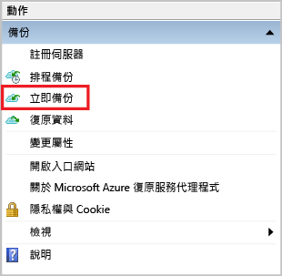

<properties
   pageTitle="了解如何使用 Azure 備份與 Resource Manager 部署模型將檔案和資料夾從 Windows 備份到 Azure | Microsoft Azure"
   description="了解如何透過建立保存庫、安裝復原服務代理程式，以及將檔案和資料夾備份到 Azure，以備份 Windows Server 資料。"
   services="backup"
   documentationCenter=""
   authors="markgalioto"
   manager="cfreeman"
   editor=""
   keywords="如何備份; 如何備份"/>

<tags
   ms.service="backup"
   ms.workload="storage-backup-recovery"
   ms.tgt_pltfrm="na"
   ms.devlang="na"
   ms.topic="hero-article"
   ms.date="09/27/2016"
   ms.author="markgal;"/>

# 初步了解：使用 Azure 備份與 Resource Manager 部署模型備份檔案和資料夾

本文說明如何使用 Azure 備份與 Resource Manager 將 Windows Server (或 Windows 用戶端) 的檔案和資料夾備份至 Azure。本文中的教學課程是要讓您逐步了解基本概念。如果您想要開始使用 Azure 備份，請閱讀本文的內容。

如果您想要深入了解 Azure 備份，請閱讀此[概觀](backup-introduction-to-azure-backup.md)。

將檔案和資料夾備份至 Azure 需要進行下列活動︰

取得 Azure 訂用帳戶 (如果您還沒有的話)。   建立復原服務保存庫。   下載必要檔案。   安裝並註冊復原服務代理程式。   備份檔案和資料夾。

## 步驟 1：建立 Azure 訂用帳戶

如果您沒有 Azure 訂用帳戶，請建立[免費帳戶](https://azure.microsoft.com/free/)，以便存取任何 Azure 服務。

## 步驟 2：建立復原服務保存庫

若要備份檔案與資料夾，您必須在要儲存這些資料的區域中建立復原服務保存庫。您也需要決定儲存體的複寫方式。

### 建立復原服務保存庫

1. 如果您尚未這麼做，請使用 Azure 訂用帳戶登入 [Azure 入口網站](https://portal.azure.com/)。

2. 在 [中樞] 功能表上按一下 [瀏覽]，然後在資源清單中輸入**復原服務**，接著按一下 [復原服務保存庫]。

      

3. 在 [復原服務保存庫] 功能表上，按一下 [新增]。

    

    [復原服務保存庫] 刀鋒視窗隨即開啟，並提示您提供 [名稱]、[訂用帳戶]、[資源群組] 和 [位置]。

    

4. 在 [名稱] 中，輸入易記名稱來識別保存庫。

5. 按一下 [訂用帳戶] 以查看可用的訂用帳戶清單。

6. 按一下 [資源群組] 以查看可用的資源群組清單，或按一下 [新增] 以建立新的資源群組。

7. 按一下 [位置] 以選取保存庫的地理區域。此選項會決定您的備份資料要傳送到哪個地理區域。

8. 按一下 [建立]。

    如果保存庫在完成之後並沒有在清單中列出，請按一下 [重新整理]。清單重新整理之後，按一下保存庫的名稱。

### 決定儲存體備援
首次建立復原服務保存庫時會決定儲存體的複寫方式。

1. 按一下新的保存庫以開啟儀表板。

2. 在保存庫儀表板會自動開啟的 [設定] 刀鋒視窗中，按一下 [備份基礎結構]。

3. 在 [備份基礎結構] 刀鋒視窗中，按一下 [備份組態] 以檢視 [儲存體複寫類型]。

    

4. 為保存庫選擇適當的儲存體複寫選項。

    

    根據預設，保存庫具有異地備援儲存體。如果您使用 Azure 做為主要的備份儲存體端點，請繼續使用異地備援儲存體。如果您使用 Azure 做為非主要的備份儲存體端點，則請選擇本地備援儲存體，以減少在 Azure 中儲存資料的成本。在此[概觀](../storage/storage-redundancy.md)中，深入了解[異地備援](../storage/storage-redundancy.md#geo-redundant-storage)和[本地備援](../storage/storage-redundancy.md#locally-redundant-storage)儲存體選項。

現在您已建立保存庫，接下來您要下載 Microsoft Azure 復原服務代理程式和保存庫認證，讓基礎結構做好備份檔案和資料夾的準備。

## 步驟 3 - 下載檔案

1. 按一下復原服務保存庫儀表板上的 [設定]。

    

2. 按一下 [設定] 刀鋒視窗上的 [開始使用] > [備份]。

    

3. 按一下 [備份] 刀鋒視窗上的 [備份目標]。

    

4. 在 [工作負載的執行位置?] 功能表中選取 [內部部署]。

5. 在 [欲備份的項目?] 功能表中選取 [檔案和資料夾]，然後按一下 [確定]。

### 下載復原服務代理程式

1. 按一下 [準備基礎結構] 刀鋒視窗中的 [下載適用於 Windows Server 或 Windows 用戶端的代理程式]。

    

2. 按一下下載快顯視窗中的 [儲存]。根據預設，**MARSagentinstaller.exe** 檔案會儲存至 [下載] 資料夾。

### 下載保存庫認證

1. 按一下 [準備基礎結構] 刀鋒視窗上的 [下載] > [儲存]。

    

## 步驟 4 - 安裝並註冊代理程式

>[AZURE.NOTE] 透過 Azure 入口網站進行備份的功能很快就會推出。目前，您可以在內部部署使用 Microsoft Azure 復原服務代理程式來備份檔案和資料夾。

1. 在 [下載] 資料夾 (或其他儲存位置) 找到 **MARSagentinstaller.exe** 並對其按兩下。

2. 完成 Microsoft Azure 復原服務代理程式安裝精靈。若要完成精靈，您需要︰

    - 選擇安裝和快取資料夾的位置。
    - 如果您使用 Proxy 伺服器來連線到網際網路，請提供您的 Proxy 伺服器資訊。
    - 如果您使用已驗證的 Proxy，請提供您的使用者名稱和密碼詳細資料。
    - 提供下載的保存庫認證
    - 將加密複雜密碼存放在安全的位置。

    >[AZURE.NOTE] 如果遺失或忘記複雜密碼，Microsoft 將無法協助您復原備份資料。請將檔案存放在安全的位置。必須有此檔案才能還原備份。

現已安裝代理程式，且已向保存庫註冊您的電腦。您已準備好可以設定及排程備份。

## 步驟 5︰備份檔案和資料夾

初始備份包括兩項重要工作：

- 排程備份
- 第一次備份檔案和資料夾

若要完成初始備份，您可以使用 Microsoft Azure 復原服務代理程式。

### 排程備份

1. 開啟 Microsoft Azure 復原服務代理程式。您可以透過在您的電腦中搜尋 **Microsoft Azure 備份**來找出備份。

    

2. 在復原服務代理程式中，按一下 [排程備份]。

    

3. 在排程備份精靈的 [開始使用] 頁面上，按 [下一步]。

4. 在 [選取要備份的項目] 頁面上，按一下 [新增項目]。

5. 選取您要備份的檔案和資料夾，然後按一下 [確定]。

6. 按 [下一步]。

7. 在 [指定備份排程] 頁面上，指定[備份排程]，然後按一下 [下一步]。

    您可以排程每日 (一天最多三次) 或每週備份。

    

    >[AZURE.NOTE] 如需如何指定備份排程的相關詳細資訊，請參閱[使用 Azure 備份來取代您的磁帶基礎結構](backup-azure-backup-cloud-as-tape.md)一文。

8. 在 [選取保留原則] 頁面上，選取 [保留原則] 做為備份複本。

    保留原則會指定備份將儲存的期間。除了僅針對所有備份點指定「一般原則」之外，您可以指定在進行備份時根據不同的保留原則。您可以修改每日、每週、每月和每年保留原則，以符合您的需求。

9. 在 [選擇初始備份類型] 頁面上，選擇初始備份類型。讓 [自動透過網路] 選項保持已選取狀態，然後按一下 [下一步]。

    您可以透過網路自動備份，也可以離線備份。這篇文章的其餘部分說明自動備份的程序。如果您想要執行離線備份，請檢閱[在 Azure Backup 中離線備份工作流程](backup-azure-backup-import-export.md)一文以了解其他資訊。

10. 在 [確認] 頁面上檢閱資訊，然後按一下 [完成]。

11. 當精靈建立好備份排程時，請按一下 [關閉]。

### 第一次備份檔案和資料夾

1. 在復原服務代理程式中按一下 [立即備份]，以透過網路完成初始植入。

    

2. 在 [確認] 頁面上，檢閱立即備份精靈將用於備份電腦的設定。然後按一下 [備份]。

3. 按一下 [關閉] 即可關閉精靈。如果您在備份程序完成之前關閉精靈，精靈會繼續在背景中執行。

完成初始備份之後，備份主控台中會顯示 [作業已完成] 狀態。

## 有疑問嗎？
如果您有問題，或希望我們加入任何功能，請[傳送意見反應給我們](http://aka.ms/azurebackup_feedback)。

## 後續步驟
- 詳細了解如何[備份 Windows 電腦](backup-configure-vault.md)。
- 現在您已備份好檔案和資料夾，接下來您可以[管理您的保存庫和伺服器](backup-azure-manage-windows-server.md)。
- 如果您需要還原備份，請使用本文來[還原檔案到 Windows 電腦](backup-azure-restore-windows-server.md)。

<!---HONumber=AcomDC_0928_2016-->