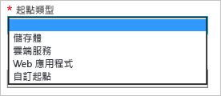

# 使用 Azure CDN
本主題將逐步解說如何透過建立新的 CDN 設定檔和端點來啟用 Azure CDN。

> [!IMPORTANT]
> 如需 CDN 運作方式的簡介以及功能清單，請參閱 [CDN 概觀](cdn-overview.md)。
> 
> 

## 建立新的 CDN 設定檔
CDN 設定檔就是 CDN 端點的集合。每個設定檔皆包含一或多個 CDN 端點。您可能會想要使用多個設定檔，依網際網路網域、Web 應用程式或其他準則來組織您的 CDN 端點。

> [!NOTE]
> 依預設，一個 Azure 訂用帳戶只能擁有八個 CDN 設定檔。而每個 CDN 設定檔則只能擁有十個 CDN 端點。
> 
> CDN 定價是根據 CDN 設定檔層級來套用的。如果您想要混合使用 Azure CDN 定價層，您需要擁有多個 CDN 設定檔。
> 
> 

[!INCLUDE [cdn-create-profile](../../includes/cdn-create-profile.md)]

## 建立新的 CDN 端點
**建立新的 CDN 端點**

1. 在 [Azure 入口網站](https://portal.azure.com)中，瀏覽到您的 CDN 設定檔。您可能已在先前步驟中將其釘選至儀表板。若否，則您可依序按一下 [瀏覽]、[CDN 設定檔] 尋找該設定檔，然後再按一下您要在其中加入端點的設定檔。
   
    此時會顯示 [CDN 設定檔] 刀鋒視窗。
   
    ![CDN 設定檔][cdn-profile-settings]
2. 按一下 [新增端點] 按鈕。
   
    ![[加入端點] 按鈕][cdn-new-endpoint-button]
   
    此時會顯示 [加入端點] 刀鋒視窗。
   
    ![[加入端點] 刀鋒視窗][cdn-add-endpoint]
3. 輸入這個 CDN 端點的 [名稱]。此名稱會用於存取位於網域 `<endpointname>.azureedge.net` 的快取資源。
4. 在 [原始來源類型] 下拉式清單中，選取您的原始來源類型。Azure 儲存體帳戶請選取 [儲存體]、Azure 雲端服務請選取 [雲端服務]、Azure Web 應用程式請選取 [Web 應用程式]，若為其他任何可公開存取的 Web 伺服器來源 (裝載於 Azure 或其他位置)，則請選取 [自訂原始來源]。
   
    
5. 在 [原始主機名稱] 下拉式清單中，選取您的原始網域類型。下拉式清單會列出您在步驟 4 中指定之類型的所有可用原始來源。如果您選取 [自訂原始來源] 作為您的 [原始來源類型]，您將會輸入自訂原始來源的網域。
6. 在 [原始路徑] 文字方塊中，輸入您要快取的資源路徑，或保留空白以允許快取位於您在步驟 5 中指定之網域中的任何資源。
7. 在 [原始主機標頭] 中，輸入您要 CDN 連同每個要求一起傳送的主機標頭，或保留預設值。
   
   > [!WARNING]
   > 某些類型的原始來源 (例如 Azure 儲存體和 Web Apps) 要求主機標頭必須符合原始來源的網域。除非您的原始來源需要與其網域不同的主機標頭，否則您應該保留預設值。
   > 
   > 
8. 在 [通訊協定] 和 [原始連接埠] 中，指定用來存取原始來源之資源的通訊協定和連接埠。至少必須選取一個通訊協定 (HTTP 或 HTTPS)。
   
   > [!NOTE]
   > [原始連接埠] 只會影響端點用來從原始來源擷取資訊的連接埠。不論 [原始連接埠] 為何，端點本身只會透過預設 HTTP 和 HTTPS 連接埠 (80 和 443) 提供給終端用戶端使用。
   > 
   > **來自 Akamai 的 Azure CDN** 端點不允許原始來源的完整 TCP 連接埠範圍。如需不允許的原始連接埠清單，請參閱[來自 Akamai 的 Azure CDN 允許的原始連接埠](https://msdn.microsoft.com/library/mt757337.aspx)。
   > 
   > 使用 HTTPS 存取 CDN 內容具有下列限制：
   > 
   > * 您必須使用 CDN 所提供的 SSL 憑證。不支援第三方憑證。
   > * 您必須使用 CDN 提供的網域 (`<endpointname>.azureedge.net`) 來存取 HTTPS 內容。因為 CDN 目前不支援自訂憑證，所以自訂網域名稱 (CNAME) 不提供 HTTPS 支援。
   > 
   > 
9. 按一下 [加入] 按鈕，以建立新的端點。
10. 端點建立完畢之後，即會出現在設定檔的端點清單中。此清單檢視會顯示用來存取所快取內容的 URL 以及原始網域。
    
    ![CDN 端點][cdn-endpoint-success]
    
    > [!IMPORTANT]
    > 端點不會立即可供使用，因為註冊資訊需要一段時間才能傳遍 CDN。若為<b>來自 Akamai 的 Azure CDN</b> 設定檔，通常會在一分鐘之內完成傳播。若為<b>來自 Verizon 的 Azure CDN</b> 設定檔，則通常會在 90 分鐘之內完成傳播，但在某些情況下可能會更久。
    > 
    > 嘗試在端點組態傳播到 POP 之前就使用 CDN 網域名稱的使用者會收到 HTTP 404 回應碼。如果在端點建立好後已過了好幾個小時，而您仍然收到 404 回應，請參閱[針對傳回 404 狀態的 CDN 端點進行疑難排解](cdn-troubleshoot-endpoint.md)。
    > 
    > 

## 另請參閱
* [使用查詢字串控制 CDN 要求的快取行為](cdn-query-string.md)
* [如何將 CDN 內容對應至自訂網域](cdn-map-content-to-custom-domain.md)
* [在 Azure CDN 端點上預先載入資產](cdn-preload-endpoint.md)
* [清除 Azure CDN 端點](cdn-purge-endpoint.md)
* [針對傳回 404 狀態的 CDN 端點進行疑難排解](cdn-troubleshoot-endpoint.md)

[cdn-profile-settings]: ./media/cdn-create-new-endpoint/cdn-profile-settings.png
[cdn-new-endpoint-button]: ./media/cdn-create-new-endpoint/cdn-new-endpoint-button.png
[cdn-add-endpoint]: ./media/cdn-create-new-endpoint/cdn-add-endpoint.png
[cdn-endpoint-success]: ./media/cdn-create-new-endpoint/cdn-endpoint-success.png

<!---HONumber=AcomDC_0803_2016-->