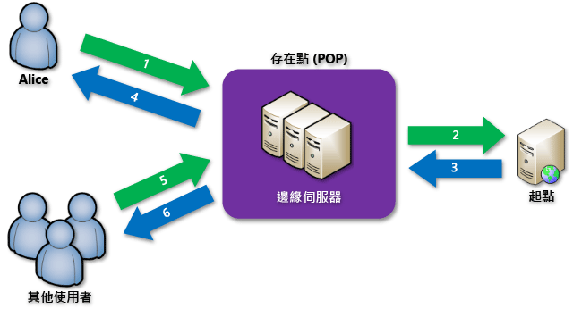

# Azure 內容傳遞網路 (CDN) 概觀
> [!NOTE]
> 本文件說明 Azure 內容傳遞網路 (CDN) 是什麼、其運作方式與每項 Azure CDN 產品的功能。  如果您想要跳過這項資訊，直接進入如何建立 CDN 端點的教學課程，請參閱 [使用 Azure CDN](cdn-create-new-endpoint.md)。  如果您想要查看目前的 CDN 節點位置清單，請參閱 [Azure CDN POP 位置](cdn-pop-locations.md)。
> 
> 

Azure 內容傳遞網路 (CDN) 會在策略性放置的位置上快取靜態 Web 內容，以提供最大輸送量來將內容傳遞給使用者。  CDN 為開發人員提供一套全球解決方案，以在全球實體節點上快取內容來傳遞高頻寬內容。 

使用 CDN 來快取網站資產的優點包括：

* 讓使用者享有更好的效能和使用者經驗，尤其是當使用的應用程式需要反覆存取多次才能載入內容時。
* 可進行大幅調整以更妥善地處理瞬間大量負載 (例如產品上市事件的開始)。
* 透過分散使用者要求以及從 Edge Server 提供內容，傳送至原始來源的流量將會減少。

## 運作方式

1. 使用者 (Alice) 使用具有特殊網域名稱的 URL (例如 `<endpointname>.azureedge.net`) 要求檔案 (也稱為資產)。  DNS 將要求路由傳送到最佳的存在點 (POP) 位置。  這通常是地理位置最接近使用者的 POP。
2. 如果 POP 中的 Edge Server 在其快取中沒有該檔案，Edge Server 便會從原始來源要求檔案。  原始來源可以是 Azure Web 應用程式、Azure 雲端服務、Azure 儲存體帳戶或任何可公開存取的 Web 伺服器。
3. 原始來源將檔案傳回給 Edge Server，包括描述檔案存留時間 (TTL) 的選擇性 HTTP 標頭。
4. Edge Server 快取檔案，並將檔案傳回給原始要求者 (Alice)。  在 TTL 到期之前，檔案會一直快取在 Edge Server 上。  如果原始來源未指定 TTL，預設 TTL 為&7; 天。
5. 其他使用者後來可能會使用相同 URL 要求相同檔案，而且也可能導向至該相同 POP。
6. 如果檔案的 TTL 尚未過期，Edge Server 便會從快取傳回檔案。  這會產生更快、更靈敏回應的使用者經驗。

## Azure CDN 功能
共有三種 Azure CDN 產品︰**來自 Akamai 的 Azure CDN 標準**、**來自 Verizon 的 Azure CDN 標準**和**來自 Verizon 的 Azure CDN 進階**。  下表列出每種產品的可用功能。

|  | 標準 Akamai | 標準 Verizon | 進階 Verizon |
| --- | --- | --- | --- |
| 很容易與[儲存體](cdn-create-a-storage-account-with-cdn.md)、[雲端服務](cdn-cloud-service-with-cdn.md)、[Web Apps](../app-service-web/cdn-websites-with-cdn.md) 和[媒體服務](../media-services/media-services-portal-manage-streaming-endpoints.md)等 Azure 服務整合 |**&#x2713;** |**&#x2713;** |**&#x2713;** |
| 透過 [REST API](https://msdn.microsoft.com/library/mt634456.aspx)、[.NET](cdn-app-dev-net.md)、[Node.js](cdn-app-dev-node.md) 或 [PowerShell](cdn-manage-powershell.md) 管理。 |**&#x2713;** |**&#x2713;** |**&#x2713;** |
| CDN 端點的 HTTPS 支援 |**&#x2713;** |**&#x2713;** |**&#x2713;** |
| 自訂網域 HTTPS | |**&#x2713;** |**&#x2713;** |
| 負載平衡 |**&#x2713;** |**&#x2713;** |**&#x2713;** |
| [DDOS](https://www.us-cert.gov/ncas/tips/ST04-015) 保護 |**&#x2713;** |**&#x2713;** |**&#x2713;** |
| IPv4/IPv6 雙重堆疊 |**&#x2713;** |**&#x2713;** |**&#x2713;** |
| [自訂網域名稱支援](cdn-map-content-to-custom-domain.md) |**&#x2713;** |**&#x2713;** |**&#x2713;** |
| [查詢字串快取](cdn-query-string.md) |**&#x2713;** |**&#x2713;** |**&#x2713;** |
| [地理位置篩選](cdn-restrict-access-by-country.md) |**&#x2713;** |**&#x2713;** |**&#x2713;** |
| [快速清除](cdn-purge-endpoint.md) |**&#x2713;** |**&#x2713;** |**&#x2713;** |
| [資產預先載入](cdn-preload-endpoint.md) | |**&#x2713;** |**&#x2713;** |
| [核心分析](cdn-analyze-usage-patterns.md) | |**&#x2713;** |**&#x2713;** |
| [HTTP/2 支援](https://msdn.microsoft.com/library/mt762901.aspx) |**&#x2713;** | | |
| [進階 HTTP 報告](cdn-advanced-http-reports.md) | | |**&#x2713;** |
| [即時統計資料](cdn-real-time-stats.md) | | |**&#x2713;** |
| [即時警示](cdn-real-time-alerts.md) | | |**&#x2713;** |
| [可自訂的、規則式內容傳遞引擎](cdn-rules-engine.md) | | |**&#x2713;** |
| 快取/標頭設定 (使用 [規則引擎](cdn-rules-engine.md)) | | |**&#x2713;** |
| URL 重新導向/重寫 (使用 [規則引擎](cdn-rules-engine.md)) | | |**&#x2713;** |
| 行動裝置規則 (使用 [規則引擎](cdn-rules-engine.md)) | | |**&#x2713;** |
| [權杖驗證](cdn-token-auth.md)|  |  |**&#x2713;**| 

> [!TIP]
> 您是否有想要在 Azure CDN 中看到的功能？  [請不吝提供意見](https://feedback.azure.com/forums/169397-cdn)！ 
> 
> 

## 後續步驟
若要開始使用 CDN，請參閱 [使用 Azure CDN](cdn-create-new-endpoint.md)。

如果您是現有的 CDN 客戶，現在可以透過 [Microsoft Azure 入口網站](https://portal.azure.com)或 [PowerShell](cdn-manage-powershell.md) 管理您的 CDN 端點。

若要查看作用中的 CDN，請參閱 [2016 組建會議的影片](https://azure.microsoft.com/documentation/videos/build-2016-leveraging-the-new-azure-cdn-apis-to-build-wicked-fast-applications/)。

了解如何透過 [.NET](cdn-app-dev-net.md) 或 [Node.js](cdn-app-dev-node.md) 自動化 Azure CDN。

如需價格資訊，請參閱 [CDN 價格](https://azure.microsoft.com/pricing/details/cdn/)。

