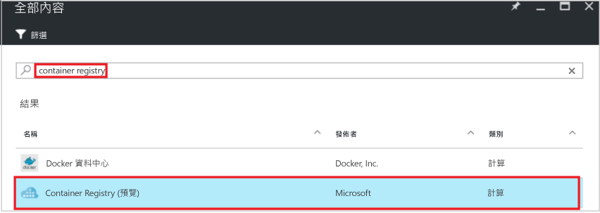
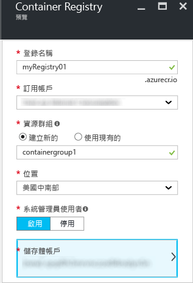
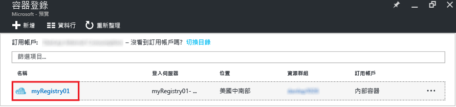
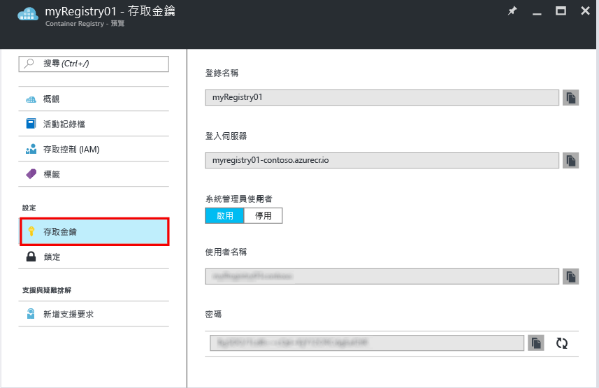

---
標題︰建立 Azure 容器登錄庫 - 入口網站 | Microsoft Docs 說明：使用 Azure 入口網站開始建立及管理 Azure 容器登錄庫 服務：容器登錄庫 documentationcenter：'' 作者：stevelas 管理員：balans 編輯：dlepow 標籤：''關鍵字：''

ms.assetid: 53a3b3cb-ab4b-4560-bc00-366e2759f1a1 ms.service: container-registry ms.devlang: na ms.topic: get-started-article ms.tgt_pltfrm: na ms.workload: na ms.date: 11/14/2016 ms.author: stevelas ---# 使用 Azure 入口網站建立容器登錄庫 使用 Azure 入口網站來建立容器登錄庫及管理其設定。 您也可以使用 [Azure CLI 2.0 命令](container-registry-get-started-azure-cli.md)或以程式設計方式用容器登錄庫 [REST API](https://go.microsoft.com/fwlink/p/?linkid=834376) 來建立及管理容器登錄庫。

如需背景和概念，請參閱[什麼是 Azure 容器登錄庫？](container-registry-intro.md)

> [!NOTE]
> 容器登錄庫目前為預覽版本。

## 建立容器登錄庫
1. 在 [入口網站](https://portal.azure.com) 中按一下 [+ 新增]。
2. 在 Marketplace 中搜尋 **container registry**。
3. 選取 **Container Registry (preview)**，其發佈者為 **Microsoft**。 
    
4. 按一下 [建立] 。 [容器登錄庫] 刀鋒視窗隨即出現。

    
5. 在 [容器登錄庫] 刀鋒視窗中，輸入下列資訊。 完成後按一下 [建立]。
   
    a. **登錄庫名稱** - 登錄庫的全域唯一最上層網域名稱。 此範例中的登錄庫名稱是 *myRegistry01*，請換成您自己的唯一名稱。 此名稱只能包含字母和數字。
   
    b.這是另一個 C# 主控台應用程式。 **資源群組** - 選取現有的[資源群組](../azure-resource-manager/resource-group-overview.md#resource-groups)，或輸入新群組的名稱。 
   
    c. **位置** -選取[可使用](https://azure.microsoft.com/regions/services/)此服務的 Azure 資料中心位置，例如 [美國中南部]。 
   
    d. **管理員使用者** - 如果您想要，可啟用管理員使用者存取登錄庫。 您可以在建立登錄庫後變更此設定。
   
   > [!IMPORTANT]
   > 除了透過管理員使用者帳戶存取，容器登錄庫還支援 Azure Active Directory 服務主體所支援的驗證。 如需詳細資訊和考量事項，請參閱[驗證容器登錄庫](container-registry-authentication.md)。
   

    e. **儲存體帳戶** - 使用預設設定建立[儲存體帳戶](../storage/storage-introduction.md)，或選取相同位置中的現有儲存體帳戶。 目前不支援進階儲存體。

## 管理登錄庫設定
建立登錄庫之後，在入口網站中啟動 [容器登錄庫] 刀鋒視窗，以尋找登錄庫的設定。 例如，您可能需要用這些設定來登入您的登錄庫，或者您可能想要啟用或停用管理員使用者。

1. 在 [容器登錄庫] 刀鋒視窗中，按一下您的登錄庫名稱。
   
    
2. 若要管理存取設定，按一下 [存取金鑰]。
   
    
3. 請注意下列設定︰
   
   * **登入伺服器** - 您用來登入登錄庫的完整名稱。 在此範例中為 `myregistry01-contoso.azurecr.io`。
   * **管理員使用者** -切換以啟用或停用登錄庫的管理員使用者帳戶。
   * **使用者名稱**和**密碼** - 管理員使用者帳戶 (若有啟用) 的認證，您可用來登入登錄庫。 您也可以選擇重新產生密碼。

## 後續步驟
* [使用 Docker CLI 推送您的第一個映像](container-registry-get-started-docker-cli.md)

