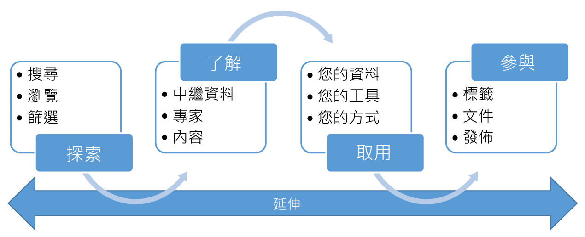

<properties
   pageTitle="什麼是 Azure 資料目錄？ | Microsoft Azure"
   description="本文提供 Microsoft Azure 資料目錄的概觀，包括其具備的功能以及專門解決的問題。資料目錄可讓任何使用者 – 從分析師、資料科學家到開發人員 – 註冊、探索、了解及取用資料來源。"
   services="data-catalog"
   documentationCenter=""
   authors="steelanddata"
   manager="NA"
   editor=""
   tags=""/>
<tags
   ms.service="data-catalog"
   ms.devlang="NA"
   ms.topic="get-started-article"
   ms.tgt_pltfrm="NA"
   ms.workload="data-catalog"
   ms.date="05/26/2016"
   ms.author="maroche"/>

# 什麼是 Azure 資料目錄？

Azure 資料目錄是完全受管理的雲端服務，可讓使用者探索所需的資料來源，並了解他們找到的資料來源，同時協助組織從現有的投資中獲得更多價值。資料目錄可讓任何使用者 – 包括分析師、資料科學家及開發人員 – 探索、了解及取用資料來源。資料目錄包含中繼資料和註解的群眾外包模型，並可讓所有使用者提供他們的知識來建置資料的社群和文化特性。

## 探索資料取用者面臨的挑戰

傳統上，探索企業資料來源一向都是根據部落知識的一項有機程序。對於想要充分利用其資訊資產的公司，這帶來許多挑戰。

-	除非使用者在另一個程序中接觸到資料來源，否則並不知道有此資料來源。沒有一個可註冊資料來源的中央位置。
-	除非使用者知道資料來源的位置，否則無法利用用戶端應用程式連接到資料。使用者必須知道連接字串或路徑，才能取用資料。
-	除非使用者知道資料來源的文件位置，否則無法了解資料的用途。資料來源和文件位於不同的地方，需要透過不同的方式才能取得。
-	如果使用者對資訊資產有疑問，他必須找到負責資料的專家或小組，並在離線狀態下請教這些專家。在資料與資料用途上具備專業觀點的專家之間，未建立明確的銜接管道。
-  除非使用者了解要求存取資料來源的程序，否則，探索資料來源及其文件仍無法讓他存取所需的資料。

## 探索資料產生者面臨的挑戰

雖然資料取用者面臨這些挑戰，但負責產生和維護的資訊資產的使用者本身也面臨挑戰。

-	使用描述性中繼資料加註資料來源往往白費心力。用戶端應用程式通常會忽略儲存在資料來源中的描述。
-	建立資料來源的文件通常是白費心力。保持文件與資料來源同步是一種持續性的責任，使用者總是認為文件過時，所以都不信任文件。
- 限制對資料來源的存取，並確保資料取用者知道如何要求存取是一項持續的挑戰。

建立和維護資料來源的文件既複雜又耗時。為了讓使用資料來源的每個使用者可隨時取得文件，所面臨的挑戰通常更艱鉅。

這些挑戰結合起來形成更大的障礙，使得公司難以鼓勵和推動使用和了解企業資料。

## Azure 資料目錄能提供協助

資料目錄的設計就是為了解決這些問題，讓企業能夠充分利用現有的資訊資產。透過讓需要所管理之資料的使用者能夠輕鬆地探索和了解資料來源，資料目錄可提供協助。

資料目錄提供雲端型服務，其中可以註冊資料來源。資料會保留在現有的位置，但中繼資料的複本會連同資料來源位置的參考，一起加入至資料目錄。此中繼資料也會編製索引，能夠透過搜尋輕鬆找到每個資料來源，並讓探索資料來源的使用者了解。

註冊資料來源之後，即可由執行註冊的使用者或企業中的其他使用者來充實其中繼資料。任何使用者都可以提供描述、標記或其他中繼資料 (例如要求資料來源存取的文件和程序) 來加註資料來源。此描述性中繼資料可補充資料來源中已註冊的結構化中繼資料 (例如資料行名稱和資料類型)。

註冊來源的主要目的是為了探索和了解資料來源及其用途。當企業使用者在工作上需要用到資料時 (可能是商業智慧、應用程式開發、資料科學，或任何其他需要正確資料的工作)，他們可以透過資料目錄探索體驗，快速找到符合需求的資料、了解資料以評估其適用性，以及在他們選擇的工具中開啟資料來源來使用該資料。在此同時，資料目錄讓使用者能夠藉由標記、記錄及註解已經註冊的資料來源，以及註冊新的資料來源來參與目錄，而目錄使用者社群接著可以探索、了解及取用新的資料來源。

## 開始使用資料目錄

若要立即開始使用資料目錄，請造訪 [www.azuredatacatalog.com](https://www.azuredatacatalog.com)。

[這裡](data-catalog-get-started.md)有提供入門指南。

## 深入了解資料目錄

若要深入了解資料目錄的功能，請參閱︰

* [如何註冊資料來源](data-catalog-how-to-register.md)
* [如何探索資料來源](data-catalog-how-to-discover.md)
* [如何註解資料來源](data-catalog-how-to-annotate.md)
* [如何記載資料來源](data-catalog-how-to-documentation.md)
* [如何連接到資料來源](data-catalog-how-to-connect.md)
* [如何使用巨量資料](data-catalog-how-to-big-data.md)
* [如何管理資料資產](data-catalog-how-to-manage.md)
* [如何設定商務詞彙](data-catalog-how-to-business-glossary.md)
* [常見問題集](data-catalog-frequently-asked-questions.md)

<!---HONumber=AcomDC_0601_2016-->