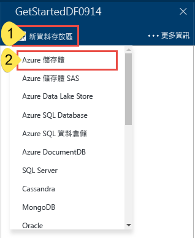
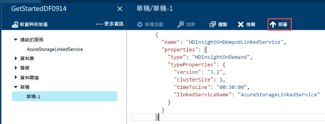
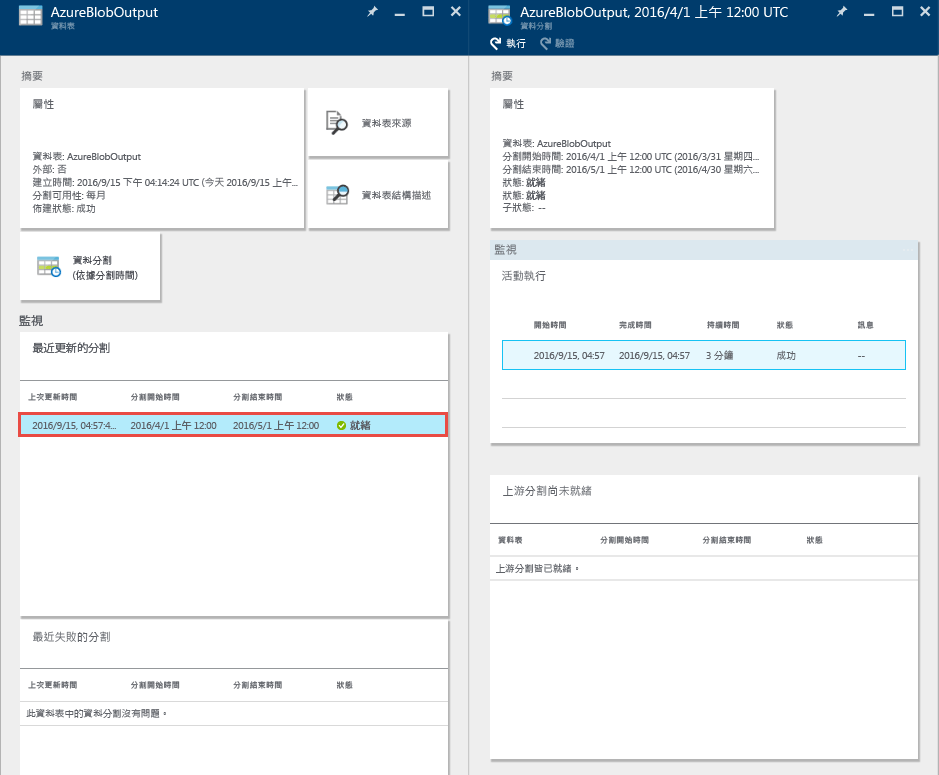

# 教學課程：使用 Azure 入口網站建置您的第一個 Azure Data Factory
> [!div class="op_single_selector"]
> * [概觀和必要條件](data-factory-build-your-first-pipeline.md)
> * [Azure 入口網站](data-factory-build-your-first-pipeline-using-editor.md)
> * [Visual Studio](data-factory-build-your-first-pipeline-using-vs.md)
> * [PowerShell](data-factory-build-your-first-pipeline-using-powershell.md)
> * [Resource Manager 範本](data-factory-build-your-first-pipeline-using-arm.md)
> * [REST API](data-factory-build-your-first-pipeline-using-rest-api.md)
> 
> 

在本文中，您會了解如何使用 [Azure 入口網站](https://portal.azure.com/) 來建立您的第一個 Azure Data Factory。 

## 必要條件
1. 詳讀 [教學課程概觀](data-factory-build-your-first-pipeline.md) 一文並完成 **必要** 步驟。
2. 本文不提供 Azure Data Factory 服務的概念性概觀。 建議您詳讀 [Azure Data Factory 簡介](data-factory-introduction.md) 一文，了解服務的詳細概觀。  

## 建立 Data Factory
資料處理站可以有一或多個管線。 其中的管線可以有一或多個活動。 例如，「複製活動」會從來源複製資料到目的地資料存放區，HDInsight Hive 活動則是執行 Hive 指令碼轉換輸入資料以產生輸出資料。 讓我們在這個步驟中開始建立 Data Factory。 

1. 登入 [Azure 入口網站](https://portal.azure.com/)。
2. 按一下左側功能表上的 [新增]、[資料 + 分析]，再按一下 [Data Factory]。
   
   
3. 在 [新增 Data Factory] 刀鋒視窗中，輸入 **GetStartedDF** 做為 [名稱]。
   
   
   
   > [!IMPORTANT]
   > Azure Data Factory 的名稱必須是 **全域唯一的**。 如果您收到錯誤： **Data Factory 名稱 “GetStartedDF” 無法使用**。 請變更 Data Factory 名稱 (例如 yournameGetStartedDF)，然後嘗試重新建立。 請參閱 [Data Factory - 命名規則](data-factory-naming-rules.md) 主題，以了解 Data Factory 成品的命名規則。
   > 
   > Data Factory 的名稱未來可能會註冊為 **DNS** 名稱，因此會變成公開可見的名稱。
   > 
   > 
4. 選取您想要建立 Data Factory 的 [Azure 訂用帳戶]  。 
5. 請選取現有的 **資源群組** ，或建立資源群組。 在教學課程中，建立名稱如下的資源群組： **ADFGetStartedRG**。 
6. 按一下 [新增 Data Factory] 刀鋒視窗上的 [建立]。
   
   > [!IMPORTANT]
   > 若要建立 Data Factory 執行個體，您必須是訂用帳戶/資源群組層級的 [Data Factory 參與者](../active-directory/role-based-access-built-in-roles.md#data-factory-contributor) 角色成員。 
   > 
   > 
7. 您會看到 Data Factory 建立在 Azure 入口網站的「開始面板」  中，如下所示：   
   
   
8. 恭喜！ 您已成功建立您的第一個 Data Factroy。 在 Data Factory 成功建立後，您會看到 Data Factory 頁面，顯示 Data Factory 的內容。     
   
    

在 Data Factory 中建立管線之前，您必須先建立一些 Data Factory 項目。 首先，您要先建立連結的服務，以便將資料存放區/電腦連結到您的資料存放區；並定義輸入和輸出資料集，表示位於連結的資料存放區中的輸入/輸出資料，然後建立具有使用這些資料集的活動之管線。 

## 建立連結服務
在此步驟中，您會將您的 Azure 儲存體帳戶和隨選 Azure HDInsight 叢集連結到您的 Data Factory。 Azure 儲存體帳戶會保留此範例中管線的輸入和輸出資料。 HDInsight 連結服務會用來執行此範例中管線活動指定的 Hive 指令碼。 識別案例中使用的[資料存放區](data-factory-data-movement-activities.md)/[計算服務](data-factory-compute-linked-services.md)，並建立連結的服務將這些服務連結到 Data Factory。  

### 建立 Azure 儲存體連結服務
在此步驟中，您會將您的 Azure 儲存體帳戶連結到您的 Data Factory。 在本教學課程中，您會使用相同的 Azure 儲存體帳戶來存放輸入/輸出資料及 HQL 指令碼檔案。 

1. 在適用於 **GetStartedDF** 的 [DATA FACTORY] 刀鋒視窗中，按一下 [製作和部署]。 您應該會看到 Data Factory 編輯器。 
   
   ![[製作和部署] 圖格](./media/data-factory-build-your-first-pipeline-using-editor/data-factory-author-deploy.png)
2. 按一下 [新增資料存放區] 並選擇 [Azure 儲存體]。
   
   
3. 在編輯器中，您應該會看到用來建立 Azure 儲存體連結服務的 JSON 指令碼。 
   
   
4. 以您的 Azure 儲存體帳戶名稱取代**帳戶名稱**，並以 Azure 儲存體帳戶的存取金鑰取代**帳戶金鑰**。 若要了解如何取得儲存體存取金鑰，請參閱 [檢視、複製和重新產生儲存體存取金鑰](../storage/storage-create-storage-account.md#view-copy-and-regenerate-storage-access-keys)
5. 按一下命令列的 [部署]  ，部署連結服務。
   
    ![[部署] 按鈕](./media/data-factory-build-your-first-pipeline-using-editor/deploy-button.png)
   
   成功部署連結的服務之後，應該會出現 **Draft-1** 視窗，而且您會在左側的樹狀檢視中看到 **AzureStorageLinkedService**。 
        

### 建立 Azure HDInsight 連結服務
在此步驟中，您可將隨選 HDInsight 叢集連結至 Data Factory。 HDInsight 叢集會在執行階段自動建立，並在處理完成之後刪除，且會閒置一段時間。 

1. 在 [Data Factory 編輯器] 中，按一下命令列上的 [...更多]，按一下 [新增計算]，然後選取 [HDInsight 隨選叢集]。
   
    
2. 複製下列程式碼片段並貼到 [Draft-1]  視窗。 此 JSON 程式碼片段描述用來建立隨選 HDInsight 叢集的屬性。 
   
        {
          "name": "HDInsightOnDemandLinkedService",
          "properties": {
            "type": "HDInsightOnDemand",
            "typeProperties": {
              "version": "3.2",
              "clusterSize": 1,
              "timeToLive": "00:30:00",
              "linkedServiceName": "AzureStorageLinkedService"
            }
          }
        }
   
    下表提供程式碼片段中所使用之 JSON 屬性的描述：
   
   | 屬性 | 說明 |
   |:--- |:--- |
   | 版本 |指定所建立的 HDInsight 版本為 3.2。 |
   | ClusterSize |指定 HDInsight 叢集的大小。 |
   | TimeToLive |指定 HDInsight 叢集在被刪除之前的閒置時間。 |
   | linkedServiceName |指定用來儲存 HDInsight 產生之記錄檔的儲存體帳戶。 |
   
    請注意下列幾點： 
   
   * Data Factory 會使用 JSON 為您建立**以 Windows 為基礎的**HDInsight 叢集。 您也可以讓它建立**以 Linux 為基礎的** HDInsight 叢集。 如需詳細資訊，請參閱 [HDInsight 隨選連結服務](data-factory-compute-linked-services.md#azure-hdinsight-on-demand-linked-service) 。 
   * 您可以使用 **自己的 HDInsight 叢集** ，不必使用隨選的 HDInsight 叢集。 如需詳細資訊，請參閱 [HDInsight 連結服務](data-factory-compute-linked-services.md#azure-hdinsight-linked-service) 。
   * HDInsight 叢集會在您於 JSON 中指定的 Blob 儲存體 (**linkedServiceName**) 建立**預設容器**。 HDInsight 不會在刪除叢集時刪除此容器。 這是設計的行為。 在使用 HDInsight 隨選連結服務時，除非有現有的即時叢集 (**timeToLive**)，否則每次處理配量時，就會建立 HDInsight 叢集。 此叢集會在處理完成時自動刪除。
     
       隨著處理的配量越來越多，您會在 Azure Blob 儲存體中看到許多容器。 如果在疑難排解作業時不需要這些容器，建議您加以刪除以降低儲存成本。 這些容器的名稱遵循下列模式："adf**yourdatafactoryname**-**linkedservicename**-datetimestamp"。 請使用 [Microsoft 儲存體總管](http://storageexplorer.com/) 之類的工具刪除 Azure Blob 儲存體中的容器。
     
     如需詳細資訊，請參閱 [HDInsight 隨選連結服務](data-factory-compute-linked-services.md#azure-hdinsight-on-demand-linked-service) 。
3. 按一下命令列的 [部署]  ，部署連結服務。 
   
    
4. 確認您有在左側的樹狀檢視中看到 **AzureStorageLinkedService** 和 **HDInsightOnDemandLinkedService**。
   
    

## 建立資料集
在此步驟中，您會建立資料集來代表 Hive 處理的輸入和輸出資料。 這些資料集是您稍早在本教學課程中建立的 **AzureStorageLinkedService** 。 連結的服務會指向 Azure 儲存體帳戶，而資料集則會指定保留輸入和輸出資料儲存體中的容器、資料夾和檔案名稱。   

### 建立輸入資料集
1. 在 [Data Factory 編輯器] 中，按一下命令列上的 [...其他]，按一下 [新增資料集]，然後選取 [Azure Blob 儲存體]。
   
    
2. 複製下列程式碼片段並貼到 [Draft-1] 視窗。 在 JSON 程式碼片段中，您會建立名為 **AzureBlobInput** 的資料集，代表管線中活動的輸入資料。 此外，您指定將輸入資料放在名為 **adfgetstarted** 的 Blob 容器及名為 **inputdata** 的資料夾中。
   
        {
            "name": "AzureBlobInput",
            "properties": {
                "type": "AzureBlob",
                "linkedServiceName": "AzureStorageLinkedService",
                "typeProperties": {
                    "fileName": "input.log",
                    "folderPath": "adfgetstarted/inputdata",
                    "format": {
                        "type": "TextFormat",
                        "columnDelimiter": ","
                    }
                },
                "availability": {
                    "frequency": "Month",
                    "interval": 1
                },
                "external": true,
                "policy": {}
            }
        } 
   
    下表提供程式碼片段中所使用之 JSON 屬性的描述：
   
   | 屬性 | 說明 |
   |:--- |:--- |
   | 類型 |類型屬性設為 AzureBlob，因為資料位於 Azure Blob 儲存體。 |
   | linkedServiceName |表示您稍早建立的 AzureStorageLinkedService。 |
   | fileName |這是選用屬性。 如果您省略此屬性，會挑選位於 folderPath 的所有檔案。 在這種情況下，只會處理 input.log。 |
   | 類型 |記錄檔為文字格式，因此我們會使用 TextFormat。 |
   | columnDelimiter |記錄檔案中的資料行會以逗號字元 (,) 分隔 |
   | frequency/interval |頻率設為「每月」且間隔為 1，表示每個月都會可取得輸入配量。 |
   | external |如果輸入資料不是由 Data Factory 服務產生，此屬性會設為 true。 |
3. 按一下命令列的 [部署]  以部署新建立的資料集。 您應該會看到左側樹狀檢視中的資料集。 

### 建立輸出資料集
現在，您會建立輸出資料集來代表 Azure Blob 儲存體中儲存的輸出資料。 

1. 在 [Data Factory 編輯器] 中，按一下命令列上的 [...其他]，按一下 [新增資料集]，然後選取 [Azure Blob 儲存體]。  
2. 複製下列程式碼片段並貼到 [Draft-1] 視窗。 在 JSON 程式碼片段中，建立名為 **AzureBlobOutput**的資料集，並指定由 Hive 指令碼產生的資料結構。 此外，指定將結果儲存在名為 **adfgetstarted** 的 Blob 容器及名為 **partitioneddata** 的資料夾中。 **availability** 區段指定每個月產生一次輸出資料集。
   
        {
          "name": "AzureBlobOutput",
          "properties": {
            "type": "AzureBlob",
            "linkedServiceName": "AzureStorageLinkedService",
            "typeProperties": {
              "folderPath": "adfgetstarted/partitioneddata",
              "format": {
                "type": "TextFormat",
                "columnDelimiter": ","
              }
            },
            "availability": {
              "frequency": "Month",
              "interval": 1
            }
          }
        }
   
    請參閱 **建立輸入資料集** 一節，了解這些屬性的說明。 您並未在輸出資料集上設定外部屬性，因為資料集是由 Data Factory 服務產生。
3. 按一下命令列的 [部署]  以部署新建立的資料集。
4. 驗證資料集已成功建立。
   
    

## 建立管線
在此步驟中，您會建立第一個具有 **HDInsightHive** 活動的管線。 您每個月都可取得輸入配量資訊 (頻率：每月，間隔：1)，輸出配量則是每用產生，而活動的排程器屬性也設為每月。 輸出資料集設定及活動排程器必須相符。 目前，輸出資料集會影響排程，因此即使活動並未產生任何輸出，您都必須建立輸出資料集。 如果活動沒有任何輸入，您可以略過建立輸入資料集。 本節結尾會說明下列 JSON 中使用的屬性。 

1. 在 [Data Factory 編輯器] 中，按一下 [省略符號 (…) 其他命令]，然後按一下 [新增管線]。
   
    
2. 複製下列程式碼片段並貼到 [Draft-1] 視窗。
   
   > [!IMPORTANT]
   > 在 JSON 中使用您的儲存體帳戶名稱取代 **storageaccountname** 。
   > 
   > 
   
        {
            "name": "MyFirstPipeline",
            "properties": {
                "description": "My first Azure Data Factory pipeline",
                "activities": [
                    {
                        "type": "HDInsightHive",
                        "typeProperties": {
                            "scriptPath": "adfgetstarted/script/partitionweblogs.hql",
                            "scriptLinkedService": "AzureStorageLinkedService",
                            "defines": {
                                "inputtable": "wasb://adfgetstarted@<storageaccountname>.blob.core.windows.net/inputdata",
                                "partitionedtable": "wasb://adfgetstarted@<storageaccountname>.blob.core.windows.net/partitioneddata"
                            }
                        },
                        "inputs": [
                            {
                                "name": "AzureBlobInput"
                            }
                        ],
                        "outputs": [
                            {
                                "name": "AzureBlobOutput"
                            }
                        ],
                        "policy": {
                            "concurrency": 1,
                            "retry": 3
                        },
                        "scheduler": {
                            "frequency": "Month",
                            "interval": 1
                        },
                        "name": "RunSampleHiveActivity",
                        "linkedServiceName": "HDInsightOnDemandLinkedService"
                    }
                ],
                "start": "2016-04-01T00:00:00Z",
                "end": "2016-04-02T00:00:00Z",
                "isPaused": false
            }
        }
   
    您會在 JSON 程式碼片段中建立一個管線，其中包括在 HDInsight 叢集上使用 Hive 處理「資料」的單一活動。
   
    Hive 指令碼檔案 **partitionweblogs.hql** 儲存於 Azure 儲存體帳戶 (透過名為 **AzureStorageLinkedService** 的 scriptLinkedService 指定)，且位於 **adfgetstarted** 容器的 **script** 資料夾中。
   
    **defines** 區段可用來指定執行階段設定，該設定將傳遞到 Hive 指令碼做為 Hive 設定值 (例如 ${hiveconf:inputtable}、${hiveconf:partitionedtable})。
   
    管線的 **start** 和 **end** 屬性會指定管線的作用中期間。
   
    在活動 JSON 中，您會指定 Hive 指令碼要在透過 **linkedServiceName** – **HDInsightOnDemandLinkedService** 指定的計算上執行。
   
   > [!NOTE]
   > 如需範例中使用的 JSON 屬性的詳細資訊，請參閱 [管線的剖析](data-factory-create-pipelines.md#anatomy-of-a-pipeline) 。 
   > 
   > 
3. 確認下列項目： 
   
   1. **input.log** 檔案存在於 Azure Blob 儲存體中 **adfgetstarted** 容器的 **inputdata** 資料夾中
   2. **partitionweblogs.hql** 檔案存在於 Azure Blob 儲存體中 **adfgetstarted** 容器的 **script** 資料夾中。 如果您沒有看見這些檔案，請完成 [教學課程概觀](data-factory-build-your-first-pipeline.md) 中的先決條件步驟。 
   3. 確認在管線 JSON 中使用您的儲存體帳戶名稱取代 **storageaccountname** 。 
4. 按一下命令列上的 [部署]  ，部署管線。 由於 **start** 和 **end** 時間設定在過去，且 **isPaused** 設為 false，管線 (管線中的活動) 會在部署之後立即執行。 
5. 確認您在樹狀檢視中看到管線。
   
    
6. 恭喜，您已經成功建立您的第一個管線！

## 監視管線
### 使用圖表檢視監視管線
1. 按一下 **X** 以關閉 [Data Factory 編輯器] 刀鋒視窗、瀏覽回 [Data Factory] 刀鋒視窗，然後按一下 [圖表]。
   
    ![[圖表] 磚](./media/data-factory-build-your-first-pipeline-using-editor/diagram-tile.png)
2. 在 [圖表檢視] 中，您會看到管線的概觀，以及在本教學課程中使用的資料集。
   
     
3. 若要檢視管線中的所有活動，以滑鼠右鍵按一下圖表中的管線，再按一下 [開啟管線]。 
   
    
4. 確認您在管線中看到了 HDInsightHive 活動。 
   
    
   
    若要瀏覽回上一個檢視，請按一下上方麵包屑導航功能表中的 [Data Factory]  。 
5. 在 [圖表檢視] 中，按兩下 [AzureBlobInput] 資料集。 確認配量為 [就緒] 狀態。 可能需要數分鐘的時間，配量才會顯示為「就緒」狀態。 如果一段時間之後還未顯示，請查看輸入檔案 (input.log) 是否放置在正確的容器 (adfgetstarted) 和資料夾 (inputdata) 中。
   
   
6. 按一下 **X** 關閉 **AzureBlobInput** 刀鋒視窗。 
7. 在 [圖表檢視] 中，按兩下 **AzureBlobOutput** 資料集。 您會看到目前正在處理的配量。
   
   
8. 處理完成時，您會看到配量處於 [就緒]  狀態。

> [!IMPORTANT]
> 建立隨選 HDInsight 叢集通常需要一些時間 (大約 20 分鐘)。 因此，管線預計需要 **大約 30 分鐘** 的時間來處理配量。    
> 
> 

        

1. 當配量處於 [就緒] 狀態時，檢查您 Blob 儲存體中 **adfgetstarted** 容器內 **partitioneddata** 資料夾的輸出資料。  
   
   
2. 按一下配量，以在 [資料配量]  刀鋒視窗中查看其詳細資料。
   
     
3. 按一下 [活動執行清單] 中的活動執行，以在 [活動執行詳細資料] 視窗中查看活動執行 (我們的案例中的 Hive 活動) 的詳細資料。   
   
       
   
   從記錄檔中，您可以看到所執行的 Hive 查詢和狀態資訊。 這些記錄檔適合用來排解任何疑難問題。
   如需詳細資訊，請參閱 [使用 Azure 入口網站刀鋒視窗監視及管理管線](data-factory-monitor-manage-pipelines.md) 一文。 

> [!IMPORTANT]
> 配量處理成功時就會刪除輸入檔案。 因此，如果您想要重新執行配量或再次進行本教學課程，請將輸入檔案 (input.log) 上傳至 adfgetstarted 容器的 inputdata 資料夾。
> 
> 

### 使用監視及管理應用程式來監視管線
您也可以使用「監視及管理應用程式」來監視您的管線。 如需使用此應用程式的詳細資訊，請參閱 [使用監視及管理應用程式來監視和管理 Azure Data Factory 管線](data-factory-monitor-manage-app.md)。

1. 在 Data Factory 首頁上按一下 [監視及管理] 圖格。
   
     
2. 您應該會看到 [監視及管理] 應用程式。 變更 [開始時間] 和 [結束時間] 以符合您的管線的開始 (04-01-2016 12:00 AM) 和結束時間 (04-02-2016 12:00 AM)，然後按一下 [套用]。
   
     
3. 選取 [活動時段]  清單中的活動時段以查看其詳細資料。 
    

## 摘要
在本教學課程中，您會在 HDInsight hadoop 叢集上執行 Hive 指令碼，以建立 Azure Data Factory 來處理資料。 您會在使用 Azure 入口網站中使用 Data Factory 編輯器來執行下列步驟︰  

1. 建立 Azure **Data Factory**。
2. 建立兩個 **連結服務**：
   1. **Azure 儲存體** 連結服務可將保留輸入/輸出檔案的 Azure Blob 儲存體連結至 Data Factory。
   2. **Azure HDInsight** 隨選連結服務可將 HDInsight Hadoop 隨選叢集連結至 Data Factory。 Azure Data Factory 會即時建立 HDInsight Hadoop 叢集以處理輸入資料及產生輸出資料。 
3. 建立兩個 **資料集**，以說明管線中 HDInsight Hive 活動的輸入和輸出資料。 
4. 建立具有 **HDInsight Hive** 活動的**管線**。 

## 後續步驟
在本文中，您已經建立可在隨選 HDInsight 叢集上執行 Hive 指令碼，含有轉換活動 (HDInsight 活動) 的管線。 若要了解如何使用「複製活動」從 Azure Blob 將資料複製到 Azure SQL，請參閱 [教學課程：從 Azure Blob 將資料複製到 Azure SQL](data-factory-copy-data-from-azure-blob-storage-to-sql-database.md)。

## 另請參閱
| 主題 | 說明 |
|:--- |:--- |
| [資料轉換活動](data-factory-data-transformation-activities.md) |本文提供 Azure Data Factory 所支援的資料轉換活動清單 (例如您在本教學課程中使用的 HDInsight Hive 轉換)。 |
| [排程和執行](data-factory-scheduling-and-execution.md) |本文說明 Azure Data Factory 應用程式模型的排程和執行層面。 |
| [管線](data-factory-create-pipelines.md) |本文協助您了解 Azure Data Factory 中的管線和活動，以及如何使用這些來為您的案例或業務建構端對端的資料導向工作流程。 |
| [資料集](data-factory-create-datasets.md) |本文協助您了解 Azure Data Factory 中的資料集。 |
| [使用監視應用程式來監視和管理管線](data-factory-monitor-manage-app.md) |本文說明如何使用監視及管理應用程式，來監視、管理管線及進行偵錯。 |

<!--HONumber=Nov16_HO2-->

