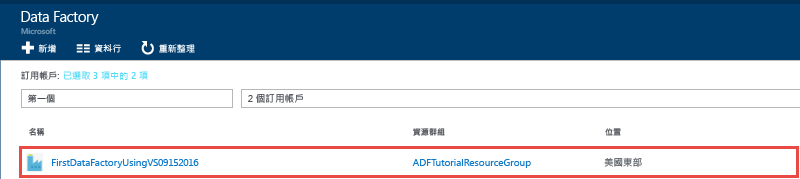
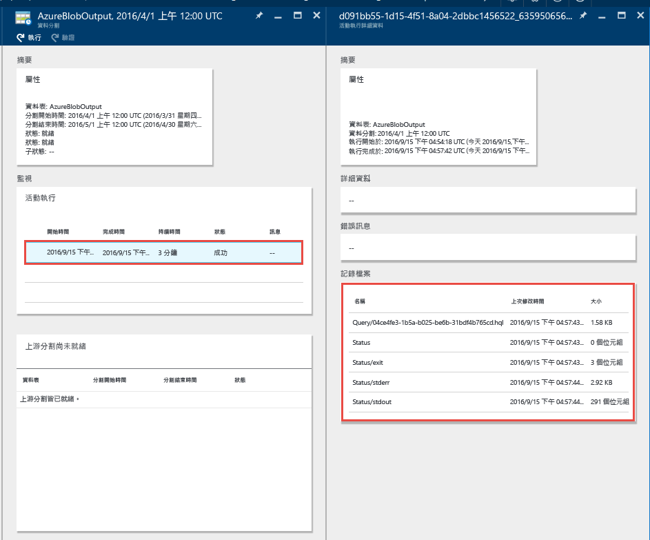
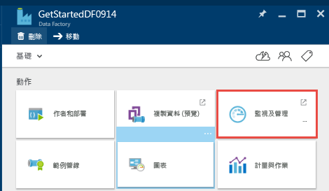
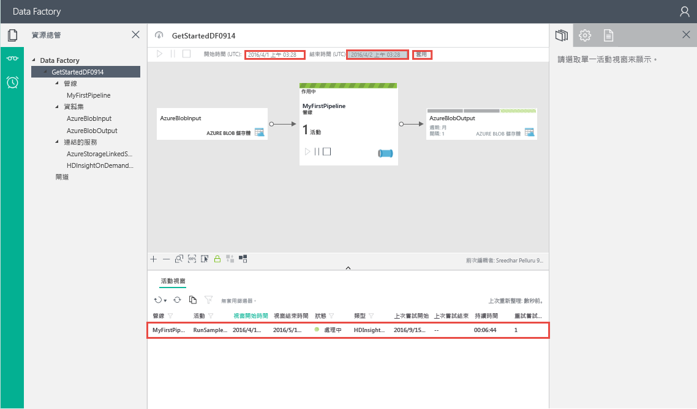
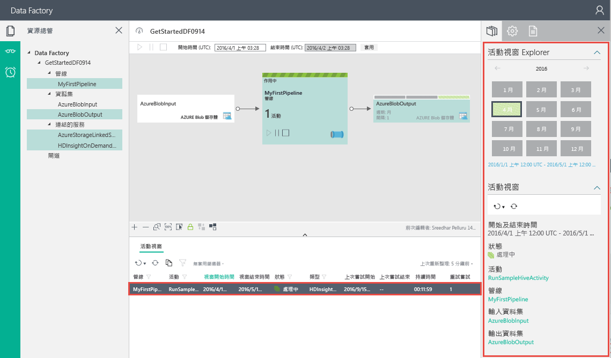

# <a name="tutorial-create-a-data-factory-by-using-visual-studio"></a>教學課程：使用 Visual Studio 建立資料處理站
> [!div class="op_single_selector" title="Tools/SDKs"]
> * [概觀和必要條件](data-factory-build-your-first-pipeline.md)
> * [Azure 入口網站](data-factory-build-your-first-pipeline-using-editor.md)
> * [Visual Studio](data-factory-build-your-first-pipeline-using-vs.md)
> * [PowerShell](data-factory-build-your-first-pipeline-using-powershell.md)
> * [Resource Manager 範本](data-factory-build-your-first-pipeline-using-arm.md)
> * [REST API](data-factory-build-your-first-pipeline-using-rest-api.md)

本教學課程示範如何使用 Visual Studio 建立 Azure Data Factory。 您可使用 Data Factory 專案範本建立 Visual Studio 專案，以 JSON 格式定義 Data Factory 實體 (連結服務、資料集和管線)，然後將這些實體發佈/部署至雲端。 

本教學課程中的管線有一個活動︰**HDInsight Hive 活動**。 此活動會在 Azure HDInsight 叢集上執行 Hive 指令碼，以轉換輸入資料來產生輸出資料。 管線已排定每個月在指定的開始與結束時間之間執行一次。 

> [!NOTE]
> 本教學課程不會顯示如何使用 Azure Data Factory 複製資料。 如需說明如何使用 Azure Data Factory 複製資料的教學課程，請參閱[教學課程：將資料從 Blob 儲存體複製到 SQL Database](data-factory-copy-data-from-azure-blob-storage-to-sql-database.md)。
> 
> 一個管線中可以有多個活動。 您可以將一個活動的輸出資料集設為另一個活動的輸入資料集，藉此鏈結兩個活動 (讓一個活動接著另一個活動執行)。 如需詳細資訊，請參閱 [Data Factory 排程和執行](data-factory-scheduling-and-execution.md#multiple-activities-in-a-pipeline)。


## <a name="walkthrough-create-and-publish-data-factory-entities"></a>逐步解說︰建立和發佈 Data Factory 實體
以下是您會在本逐步解說中執行的步驟：

1. 建立兩個連結服務：**AzureStorageLinkedService1** 和 **HDInsightOnDemandLinkedService1**。 
   
    在本教學課程中，Hive 活動的輸入和輸出資料都在相同的 Azure Blob 儲存體中。 您可以使用隨選 HDInsight 叢集來處理現有的輸入資料，進而產生輸出資料。 當輸入資料準備要進行處理時，Azure Data Factory 會在執行階段自動為您建立隨選 HDInsight 叢集。 您需要將資料存放區或計算連結至資料處理站，以便 Data Factory 服務在執行階段連線至這些項目。 因此，您會使用 AzureStorageLinkedService1 將 Azure 儲存體帳戶連結到資料處理站，並使用 HDInsightOnDemandLinkedService1 連結隨選 HDInsight 叢集。 在發佈時，您會指定所要建立的資料處理站名稱或現有的資料處理站。  
2. 建立兩個資料集：**InputDataset** 和 **OutputDataset**，分別代表儲存在 Azure Blob 儲存體中的輸入/輸出資料。 
   
    這些資料集定義會參考您在前一個步驟中建立的 Azure 儲存體連結服務。 針對 InputDataset，指定 Blob 容器 (adfgetstarted) 以及所含 Blob 具有輸入資料的資料夾 (inptutdata)。 對於 OutputDataset，指定 blob 容器 (adfgetstarted) 以及保存輸出資料的資料夾 (partitioneddata)。 您也會指定其他屬性，例如結構、可用性和原則。
3. 建立名為 **MyFirstPipeline** 的管線。 
  
    在本逐步解說中，管線只有一個活動︰**HDInsight Hive 活動**。 此活動會在隨選 HDInsight 叢集上執行 Hive 指令碼，藉此轉換輸入資料以產生輸出資料。 若要深入了解 Hive 活動，請參閱 [Hive 活動](data-factory-hive-activity.md) 
4. 建立名為 **DataFactoryUsingVS** 的資料處理站。 部署 Data Factory 和所有 Data Factory 實體 (連結的服務、資料表和管線)。
5. 發佈之後，您可使用 Azure 入口網站刀鋒視窗和「監視及管理應用程式」來監視管線。 
  
### <a name="prerequisites"></a>必要條件
1. 詳讀 [教學課程概觀](data-factory-build-your-first-pipeline.md) 一文並完成 **必要** 步驟。 您也可以選取頂端下拉式清單中的 [概觀和必要條件] 選項來切換文章。 完成必要條件之後，選取下拉式清單中的 [Visual Studio] 選項，以切換回這篇文章。
2. 若要建立 Data Factory 執行個體，您必須是訂用帳戶/資源群組層級的 [Data Factory 參與者](../active-directory/role-based-access-built-in-roles.md#data-factory-contributor) 角色成員。  
3. 您必須已在電腦上安裝下列項目：
   * Visual Studio 2013 或 Visual Studio 2015
   * 下載 Azure SDK for Visual Studio 2013 或 Visual Studio 2015。 瀏覽至 [Azure 下載頁面](https://azure.microsoft.com/downloads/)，然後按一下 [.NET] 區段中的 [VS 2013] 或 [VS 2015]。
   * 下載適用於 Visual Studio 的最新 Azure Data Factory 外掛程式：[VS 2013](https://visualstudiogallery.msdn.microsoft.com/754d998c-8f92-4aa7-835b-e89c8c954aa5) 或 [VS 2015](https://visualstudiogallery.msdn.microsoft.com/371a4cf9-0093-40fa-b7dd-be3c74f49005)。 您也可以執行下列步驟來更新外掛程式：在功能表中按一下 [工具] -> [擴充功能和更新] -> [線上] -> [Visual Studio 組件庫] -> [Microsoft Azure Data Factory Tools for Visual Studio] -> [更新]。

現在，讓我們使用 Visual Studio 來建立 Azure Data Factory。

### <a name="create-visual-studio-project"></a>建立 Visual Studio 專案
1. 啟動 **Visual Studio 2013** 或 **Visual Studio 2015**。 按一下 [檔案]，指向 [新增]，然後按一下 [專案]。 您應該會看到 [新增專案]  對話方塊。  
2. 在 [新增專案] 對話方塊中，選取 **DataFactory** 範本，然後按一下 [空白 Data Factory 專案]。   

    ![[新增專案] 對話方塊](./media/data-factory-build-your-first-pipeline-using-vs/new-project-dialog.png)
3. 輸入專案的**名稱**、**位置**和**方案**的名稱，然後按一下 [確定]。

    

### <a name="create-linked-services"></a>建立連結服務
在此步驟中，您會建立兩個連結服務：**Azure 儲存體**和**隨選 HDInsight**。 

Azure 儲存體連結服務會提供連線資訊，以將 Azure 儲存體帳戶連結至資料處理站。 Data Factory 服務會使用連結服務設定中的連接字串，在執行階段連線至 Azure 儲存體。 此儲存體可保存管線的輸入和輸出資料，以及 Hive 活動所使用的 Hive 指令碼檔案。 

透過隨選 HDInsight 連結服務，當輸入資料準備要進行處理時，會在執行階段自動建立 HDInsight 叢集。 HDInsight 叢集會在處理完成且閒置達到指定的時間量之後刪除。 

> [!NOTE]
> 您可指定資料處理站名稱並在發佈 Data Factory 解決方案時進行設定，以建立資料處理站。

#### <a name="create-azure-storage-linked-service"></a>建立 Azure 儲存體連結服務
1. 以滑鼠右鍵按一下 [方案總管] 中的 [連結服務]，指向 [新增]，然後按一下 [新增項目]。      
2. 在 [新增新項目] 對話方塊中，從清單選取 [Azure 儲存體連結服務]，然後按一下 [新增]。
    
3. 使用 Azure 儲存體帳戶的名稱及其金鑰來取代 `<accountname>` 和 `<accountkey>`。 若要了解如何取得您的儲存體存取金鑰，請參閱[管理儲存體帳戶](../storage/storage-create-storage-account.md#manage-your-storage-account)中說明如何檢視、複製和重新產生儲存體存取金鑰的資訊。
    
4. 儲存 **AzureStorageLinkedService1.json** 檔案。

#### <a name="create-azure-hdinsight-linked-service"></a>建立 Azure HDInsight 連結服務
1. 以滑鼠右鍵按一下 [方案總管] 中的 [連結服務]，指向 [新增]，然後按一下 [新增項目]。
2. 選取 [HDInsight 隨選連結服務]，然後按一下 [新增]。
3. 使用下列 JSON 來取代 **JSON**：

     ```json
    {
        "name": "HDInsightOnDemandLinkedService",
        "properties": {
        "type": "HDInsightOnDemand",
            "typeProperties": {
                "version": "3.5",
                "clusterSize": 1,
                "timeToLive": "00:05:00",
                "osType": "Linux",
                "linkedServiceName": "AzureStorageLinkedService1"
            }
        }
    }
    ```

    下表提供程式碼片段中所使用之 JSON 屬性的描述：

    屬性 | 說明
    -------- | ----------- 
    ClusterSize | 指定 HDInsight Hadoop 叢集的大小。
    TimeToLive | 指定 HDInsight 叢集在被刪除之前的閒置時間。
    linkedServiceName | 指定用來儲存 HDInsight Hadoop 產生之記錄的儲存體帳戶。 

    > [!IMPORTANT]
    > HDInsight 叢集會在您於 JSON (linkedServiceName) 指定的 Blob 儲存體中建立**預設容器**。 HDInsight 不會在刪除叢集時刪除此容器。 這是設計的行為。 在使用 HDInsight 隨選連結服務時，除非有現有的即時叢集 (timeToLive)，否則每次處理配量時，就會建立 HDInsight 叢集。 此叢集會在處理完成時自動刪除。
    > 
    > 隨著處理的配量越來越多，您會在 Azure Blob 儲存體中看到許多容器。 如果在疑難排解作業時不需要這些容器，建議您加以刪除以降低儲存成本。 這些容器的名稱會遵循模式︰`adf<yourdatafactoryname>-<linkedservicename>-datetimestamp`。 請使用 [Microsoft 儲存體總管](http://storageexplorer.com/) 之類的工具刪除 Azure Blob 儲存體中的容器。

    如需 JSON 屬性的詳細資訊，請參閱[計算已連結的服務](data-factory-compute-linked-services.md#azure-hdinsight-on-demand-linked-service)一文。 
4. 儲存 **HDInsightOnDemandLinkedService1.json** 檔案。

### <a name="create-datasets"></a>建立資料集
在此步驟中，您會建立資料集來代表 Hive 處理的輸入和輸出資料。 這些資料集是您稍早在本教學課程中建立的 **AzureStorageLinkedService1** 。 連結的服務會指向 Azure 儲存體帳戶，而資料集則會指定保留輸入和輸出資料儲存體中的容器、資料夾和檔案名稱。   

#### <a name="create-input-dataset"></a>建立輸入資料集
1. 以滑鼠右鍵按一下 [方案總管] 中的 [資料表]，指向 [新增]，然後按一下 [新增項目]。
2. 從清單中選取 [Azure Blob]，將檔案名稱變更為 **InputDataSet.json**，再按一下 [新增]。
3. 使用下列 JSON 程式碼片段取代編輯器中的 **JSON**：

    ```json
    {
        "name": "AzureBlobInput",
        "properties": {
            "type": "AzureBlob",
            "linkedServiceName": "AzureStorageLinkedService1",
            "typeProperties": {
                "fileName": "input.log",
                "folderPath": "adfgetstarted/inputdata",
                "format": {
                    "type": "TextFormat",
                    "columnDelimiter": ","
                }
            },
            "availability": {
                "frequency": "Month",
                "interval": 1
            },
            "external": true,
            "policy": {}
        }
    }
    ```
    此 JSON 程式碼片段會定義名為 **AzureBlobInput** 的資料集，代表管線中 Hive 活動的輸入資料。 您指定將輸入資料放在名為 `adfgetstarted` 的 Blob 容器及名為 `inputdata` 的資料夾中。

    下表提供程式碼片段中所使用之 JSON 屬性的描述：

    屬性 | 說明 |
    -------- | ----------- |
    類型 |類型屬性會設為 **AzureBlob**，因為資料位於 Azure Blob 儲存體。
    linkedServiceName | 表示您稍早建立的 AzureStorageLinkedService1。
    fileName |這是選用屬性。 如果您省略此屬性，會挑選位於 folderPath 的所有檔案。 在這種情況下，只會處理 input.log。
    類型 | 記錄檔為文字格式，因此我們會使用 TextFormat。 |
    columnDelimiter | 記錄檔案中的資料行會以逗號字元 (`,`) 分隔
    frequency/interval | 頻率設為「每月」且間隔為 1，表示每個月都會可取得輸入配量。
    external | 如果活動的輸入資料不是由管線產生，此屬性會設為 true。 此屬性只會指定於輸入資料集。 對於第一個活動的輸入資料集，一律設為 true。
4. 儲存 **InputDataset.json** 檔案。

#### <a name="create-output-dataset"></a>建立輸出資料集
現在，您會建立輸出資料集來代表 Azure Blob 儲存體中儲存的輸出資料。

1. 以滑鼠右鍵按一下 [方案總管] 中的 [資料表]，指向 [新增]，然後按一下 [新增項目]。
2. 從清單中選取 [Azure Blob]，將檔案名稱變更為 **OutputDataset.json**，再按一下 [新增]。
3. 使用下列 JSON 取代編輯器中的 **JSON**：
    
    ```json
    {
        "name": "AzureBlobOutput",
        "properties": {
            "type": "AzureBlob",
            "linkedServiceName": "AzureStorageLinkedService1",
            "typeProperties": {
                "folderPath": "adfgetstarted/partitioneddata",
                "format": {
                    "type": "TextFormat",
                    "columnDelimiter": ","
                }
            },
            "availability": {
                "frequency": "Month",
                "interval": 1
            }
        }
    }
    ```
    此 JSON 程式碼片段會定義名為 **AzureBlobOutput** 的資料集，代表管線中 Hive 活動所產生的輸出資料。 您指定將 Hive 活動所產生的輸出資料放在名為 `adfgetstarted` 的 Blob 容器及名為 `partitioneddata` 的資料夾中。 
    
    **availability** 區段指定每個月產生一次輸出資料集。 輸出資料集可以驅動管線的排程。 管線會每個月在其開始與結束時間之間執行。 

    請參閱 **建立輸入資料集** 一節，了解這些屬性的說明。 您並未在輸出資料集上設定外部屬性，因為資料集是由管線所產生。
4. 儲存 **OutputDataset.json** 檔案。

### <a name="create-pipeline"></a>建立管線
到目前為止，您已建立 Azure 儲存體連結服務，以及輸入和輸出資料集。 現在，建立具有 **HDInsightHive** 活動的管線。 Hive 活動的 **input** 會設為 **AzureBlobInput**，而 **output** 則設為 **AzureBlobOutput**。 每個月都可取得輸入資料集的配量 (頻率：每月，間隔：1)，而且也會每個月產生輸出配量。 

1. 以滑鼠右鍵按一下 [方案總管] 中的 [管線]，指向 [新增]，然後按一下 [新增項目]。
2. 從清單中選取 [Hive 轉換管線]，然後按一下 [新增]。
3. 使用下列程式碼片段來取代 **JSON**：

    > [!IMPORTANT]
    > 使用您的儲存體帳戶名稱取代 `<storageaccountname>`。

    ```json
    {
        "name": "MyFirstPipeline",
        "properties": {
            "description": "My first Azure Data Factory pipeline",
            "activities": [
                {
                    "type": "HDInsightHive",
                    "typeProperties": {
                        "scriptPath": "adfgetstarted/script/partitionweblogs.hql",
                        "scriptLinkedService": "AzureStorageLinkedService1",
                        "defines": {
                            "inputtable": "wasb://adfgetstarted@<storageaccountname>.blob.core.windows.net/inputdata",
                            "partitionedtable": "wasb://adfgetstarted@<storageaccountname>.blob.core.windows.net/partitioneddata"
                        }
                    },
                    "inputs": [
                        {
                            "name": "AzureBlobInput"
                        }
                    ],
                    "outputs": [
                        {
                            "name": "AzureBlobOutput"
                        }
                    ],
                    "policy": {
                        "concurrency": 1,
                        "retry": 3
                    },
                    "scheduler": {
                        "frequency": "Month",
                        "interval": 1
                    },
                    "name": "RunSampleHiveActivity",
                    "linkedServiceName": "HDInsightOnDemandLinkedService"
                }
            ],
            "start": "2016-04-01T00:00:00Z",
            "end": "2016-04-02T00:00:00Z",
            "isPaused": false
        }
    }
    ```

    > [!IMPORTANT]
    > 使用您的儲存體帳戶名稱取代 `<storageaccountname>`。

    JSON 程式碼片段會定義由單一活動 (Hive 活動) 組成的管線。 此活動會執行 Hive 指令碼以在隨選 HDInsight 叢集上處理輸入資料，進而產生輸出資料。 在管線 JSON 的活動區段中，您會在陣列中看到只有一個類型設定為 **HDInsightHive** 的活動。 

    在 HDInsight Hive 活動特有的類型屬性中，您會指定哪個 Azure 儲存體連結服務具有 Hive 指令碼檔案、指令碼檔案的路徑，以及指令碼檔案的路徑。 

    Hive 指令碼檔案 (**partitionweblogs.hql**) 會儲存於 Azure 儲存體帳戶 (由 scriptLinkedService 指定)，以及容器 `adfgetstarted` 的 `script` 資料夾中。

    `defines` 區段可用來指定執行階段設定，該設定將傳遞到 Hive 指令碼作為 Hive 設定值 (`${hiveconf:inputtable}`、`${hiveconf:partitionedtable})`)。

    管線的 **start** 和 **end** 屬性會指定管線的作用中期間。 您將資料集設定為每個月產生，因此，管線只會產生一個配量 (因為開始和結束日期的月份相同)。

    在活動 JSON 中，您會指定 Hive 指令碼要在透過 **linkedServiceName** – **HDInsightOnDemandLinkedService** 指定的計算上執行。
4. 儲存 **HiveActivity1.json** 檔案。

### <a name="add-partitionweblogshql-and-inputlog-as-a-dependency"></a>將 partitionweblogs.hql 新增為相依性
1. 以滑鼠右鍵按一下 [方案總管] 視窗中的 [相依性]，指向 [新增]，按一下 [現有項目]。  
2. 瀏覽至 **C:\ADFGettingStarted**、選取 **partitionweblogs.hql** 及 **input.log** 檔案，然後按一下 [新增]。 您建立了兩個檔案，作為一部分的 [教學課程概觀](data-factory-build-your-first-pipeline.md)必要條件。

當您在下一個步驟中發佈方案時，已將 **partitionweblogs.hql** 檔案上傳到 `adfgetstarted` Blob 容器中的**指令碼**資料夾。   

### <a name="publishdeploy-data-factory-entities"></a>發佈/部署 Data Factory 實體
在此步驟中，您會將專案中的 Data Factory 實體 (連結的服務、資料集和管線) 發佈至 Azure Data Factory 服務。 在發佈過程中，您可指定資料處理站的名稱。 

1. 在 [方案總管] 中，以滑鼠右鍵按一下專案，再按一下 [發佈] 。
2. 如果您看到 [登入您的 Microsoft 帳戶] 對話方塊，請輸入具有 Azure 訂用帳戶的帳戶認證，然後按一下 [登入]。
3. 您應該會看到下列對話方塊：

   
4. 在 [設定 Data Factory] 頁面中，執行下列步驟：

    

   1. 選取 [建立新的 Data Factory]  選項。
   2. 輸入 Data Factory 的唯一**名稱**。 例如：**DataFactoryUsingVS09152016**。 此名稱必須是全域唯一的。
   3. 針對 [訂用帳戶]  欄位選取適當的訂用帳戶。 
        > [!IMPORTANT]
        > 如果看不到任何訂用帳戶，請確定您是使用訂用帳戶的管理員或共同管理員的帳戶進行登入。
   4. 針對要建立的 Data Factory 選取 [資源群組]  。
   5. 選取 Data Factory 的 [區域]  。
   6. 按 [下一步]，切換至 [發佈項目] 頁面。 (如果 [下一步] 按鈕已停用，請按 **TAB** 來移出 [名稱] 欄位)。

    > [!IMPORTANT]
    > 如果您在發佈時收到錯誤：「Data Factory 名稱 “DataFactoryUsingVS” 無法使用」，請變更名稱 (例如 yournameDataFactoryUsingVS)。 請參閱 [Data Factory - 命名規則](data-factory-naming-rules.md) 主題，以了解 Data Factory 成品的命名規則。   
1. 在 [發佈項目] 頁面上，確認所有 Data Factory 實體都已選取，並按 [下一步] 切換至 [摘要] 頁面。

         
2. 檢閱摘要，然後按 [下一步] 開始部署程序，並檢視 [部署狀態]。

    
3. 在 [部署狀態]  頁面上，您應該會看到部署程序的狀態。 部署完成後按一下 [完成]。

需要注意的重點：

- 如果您收到錯誤：「此訂用帳戶未註冊為使用命名空間 Microsoft.DataFactory」，請執行下列其中一項，然後嘗試再次發佈︰
    - 在 Azure PowerShell 中，執行下列命令以註冊 Data Factory 提供者。
        ```PowerShell   
        Register-AzureRmResourceProvider -ProviderNamespace Microsoft.DataFactory
        ```
        您可以執行下列命令來確認已註冊 Data Factory 提供者。

        ```PowerShell
        Get-AzureRmResourceProvider
        ```
    - 使用 Azure 訂用帳戶登入 [Azure 入口網站](https://portal.azure.com) 並瀏覽至 [Data Factory] 刀鋒視窗 (或) 在 Azure 入口網站中建立 Data Factory。 此動作會自動為您註冊提供者。
- Data Factory 的名稱未來可能會註冊為 DNS 名稱，因此會變成公開可見的名稱。
- 若要建立 Data Factory 執行個體，您必須是 Azure 訂用帳戶的管理員或共同管理員

### <a name="monitor-pipeline"></a>監視管線
在此步驟中，您會使用資料處理站的「圖表檢視」來監視管線。 

#### <a name="monitor-pipeline-using-diagram-view"></a>使用圖表檢視監視管線
1. 登入 [Azure 入口網站](https://portal.azure.com/)，執行下列步驟：
   1. 按一下 [更多服務]，然後按一下 [Data Factory]。
       
        
   2. 從資料處理站清單中選取您的資料處理站名稱 (例如︰**DataFactoryUsingVS09152016**)。
   
       
2. 在您 Data Factory 的首頁中，按一下 [圖表] 。

    ![[圖表] 圖格](./media/data-factory-build-your-first-pipeline-using-vs/diagram-tile.png)
3. 在 [圖表檢視] 中，您會看到管線的概觀，以及在本教學課程中使用的資料集。

    
4. 若要檢視管線中的所有活動，以滑鼠右鍵按一下圖表中的管線，再按一下 [開啟管線]。

    
5. 確認您在管線中看到了 HDInsightHive 活動。

    

    若要瀏覽回上一個檢視，請按一下上方麵包屑導航功能表中的 [Data Factory]  。
6. 在 [圖表檢視] 中，按兩下 [AzureBlobInput] 資料集。 確認配量為 [就緒] 狀態。 可能需要數分鐘的時間，配量才會顯示為「就緒」狀態。 如果一段時間之後還未顯示，請查看輸入檔案 (input.log) 是否放置在正確的容器 (`adfgetstarted`) 和資料夾 (`inputdata`) 中。 此外，確定輸入資料集的 **external** 屬性已設為 **true**。 

   
7. 按一下 **X** 關閉 **AzureBlobInput** 刀鋒視窗。
8. 在 [圖表檢視] 中，按兩下 **AzureBlobOutput** 資料集。 您會看到目前正在處理的配量。

   
9. 處理完成時，您會看到配量處於 [就緒]  狀態。

   > [!IMPORTANT]
   > 建立隨選 HDInsight 叢集通常需要一些時間 (大約 20 分鐘)。 因此，管線預計需要 **大約 30 分鐘** 的時間來處理配量。  
   
        
10. 當配量處於**就緒**狀態時，檢查您 blob 儲存體中 `adfgetstarted` 容器內 `partitioneddata` 資料夾的輸出資料。  

    
11. 按一下配量，以在 [資料配量]  刀鋒視窗中查看其詳細資料。

      
12. 按一下 [活動執行清單] 中的活動執行，以在 [活動執行詳細資料] 視窗中查看活動執行 (我們的案例中的 Hive 活動) 的詳細資料。 
  
        

    從記錄檔中，您可以看到所執行的 Hive 查詢和狀態資訊。 這些記錄檔適合用來排解任何疑難問題。  

如需如何使用 Azure 入口網站來監視您在本教學課程中建立的管線和資料集的指示，請參閱 [監視資料集和管線](data-factory-monitor-manage-pipelines.md) 。

#### <a name="monitor-pipeline-using-monitor--manage-app"></a>使用監視及管理應用程式來監視管線
您也可以使用「監視及管理應用程式」來監視您的管線。 如需使用此應用程式的詳細資訊，請參閱 [使用監視及管理應用程式來監視和管理 Azure Data Factory 管線](data-factory-monitor-manage-app.md)。

1. 按一下 [監視及管理] 圖格。

    
2. 您應該會看到 [監視及管理] 應用程式。 變更 [開始時間] 和 [結束時間] 以符合您的管線的開始 (04-01-2016 12:00 AM) 和結束時間 (04-02-2016 12:00 AM)，然後按一下 [套用]。

    
3. 若要查看活動時段的詳細資料，請在 [活動時段] 清單中加以選取，以查看其詳細資料。
    

> [!IMPORTANT]
> 配量處理成功時就會刪除輸入檔案。 因此，如果您想要重新執行配量或再次進行本教學課程，請將輸入檔案 (input.log) 上傳至 `adfgetstarted` 容器的 `inputdata` 資料夾。

### <a name="additional-notes"></a>其他注意事項
- 資料處理站可以有一或多個管線。 其中的管線可以有一或多個活動。 例如，「複製活動」會從來源將資料複製到目的地資料存放區，HDInsight Hive 活動則是執行 Hive 指令碼來轉換輸入資料。 如需複製活動支援的所有來源和接收，請參閱 [支援的資料存放區](data-factory-data-movement-activities.md#supported-data-stores-and-formats) 。 如需 Data Factory 支援的計算服務清單，請參閱 [計算連結服務](data-factory-compute-linked-services.md) 。
- 連結服務會將資料存放區或計算服務連結至 Azure Data Factory。 如需複製活動支援的所有來源和接收，請參閱 [支援的資料存放區](data-factory-data-movement-activities.md#supported-data-stores-and-formats) 。 如需 Data Factory 支援的計算服務清單以及可在其上執行的[轉換活動](data-factory-data-transformation-activities.md)，請參閱[計算連結服務](data-factory-compute-linked-services.md)。
- 如需使用於 Azure 儲存體連結服務定義之 JSON 屬性的詳細資料，請參閱[從 Azure Blob 移入/移出資料](data-factory-azure-blob-connector.md#azure-storage-linked-service)。
- 您可以使用自己的 HDInsight 叢集，不必使用隨選的 HDInsight 叢集。 請參閱 [計算連結服務](data-factory-compute-linked-services.md) 以取得詳細資料。
-  Data Factory 會使用先前的 JSON 為您建立**以 Linux 為基礎的** HDInsight 叢集。 如需詳細資訊，請參閱 [HDInsight 隨選連結服務](data-factory-compute-linked-services.md#azure-hdinsight-on-demand-linked-service) 。
- HDInsight 叢集會在您於 JSON (linkedServiceName) 指定的 Blob 儲存體中建立**預設容器**。 HDInsight 不會在刪除叢集時刪除此容器。 這是設計的行為。 在使用 HDInsight 隨選連結服務時，除非有現有的即時叢集 (timeToLive)，否則每次處理配量時，就會建立 HDInsight 叢集。 此叢集會在處理完成時自動刪除。
    
    隨著處理的配量越來越多，您會在 Azure Blob 儲存體中看到許多容器。 如果在疑難排解作業時不需要這些容器，建議您加以刪除以降低儲存成本。 這些容器的名稱會遵循模式︰`adf**yourdatafactoryname**-**linkedservicename**-datetimestamp`。 請使用 [Microsoft 儲存體總管](http://storageexplorer.com/) 之類的工具刪除 Azure Blob 儲存體中的容器。
- 目前，輸出資料集會影響排程，因此即使活動並未產生任何輸出，您都必須建立輸出資料集。 如果活動沒有任何輸入，您可以略過建立輸入資料集。 
- 本教學課程不會顯示如何使用 Azure Data Factory 複製資料。 如需說明如何使用 Azure Data Factory 複製資料的教學課程，請參閱[教學課程：將資料從 Blob 儲存體複製到 SQL Database](data-factory-copy-data-from-azure-blob-storage-to-sql-database.md)。


## <a name="use-server-explorer-to-view-data-factories"></a>使用伺服器總管檢視 Data Factory
1. 在 **Visual Studio** 中，按一下功能表上的 [檢視]，然後按一下 [伺服器總管]。
2. 在 [伺服器總管] 視窗中，依序展開 **Azure** 和 **Data Factory**。 如果您看到 [登入 Visual Studio]，請輸入和 Azure 訂用帳戶相關聯的**帳戶**，然後按一下 [繼續]。 輸入**密碼**，然後按一下 [登入]。 Visual Studio 會嘗試取得訂用帳戶中所有 Azure Data Factory 的相關資訊。 您會在 [Data Factory 工作清單] 視窗中看到這項作業的狀態。

    
3. 您可以在 Data Factory 上按一下滑鼠右鍵，並選取 [將 Data Factory 匯出至新的專案]  ，以便根據現有的 Data Factory 建立 Visual Studio 專案。

    

## <a name="update-data-factory-tools-for-visual-studio"></a>更新 Visual studio 的 Data Factory 工具
若要更新 Visual Studio 的 Azure Data Factory 工具，請執行下列步驟：

1. 按一下功能表上的 [工具]，然後選取 [擴充功能和更新]。
2. 選取左窗格中的 [更新]，然後選取 [Visual Studio 組件庫]。
3. 選取 [Visual Studio 的 Azure Data Factory 工具] 並按一下 [更新]。 如果您看不到此項目，代表您已經有最新版本的工具。

## <a name="use-configuration-files"></a>使用組態檔
您可以在 Visual Studio 中使用組態檔，針對各個環境分別設定連結服務/資料表/管線的屬性。

請針對 Azure 儲存體連結服務考量下列 JSON 定義。 根據您部署 Data Factory 實體的環境 (開發/測試/生產)，針對 accountname 和 accountkey 指定具有不同值的 **connectionString** 。 您可以針對每個環境使用個別的組態檔來達成此行為。

```json
{
    "name": "StorageLinkedService",
    "properties": {
        "type": "AzureStorage",
        "description": "",
        "typeProperties": {
            "connectionString": "DefaultEndpointsProtocol=https;AccountName=<accountname>;AccountKey=<accountkey>"
        }
    }
}
```

### <a name="add-a-configuration-file"></a>新增組態檔
藉由執行下列步驟來新增每個環境的組態檔：   

1. 在 Visual Studio 解決方案中以滑鼠右鍵按一下 Data Factory 專案，指向 [新增]，然後按一下 [新增項目]。
2. 從左側的已安裝範本清單中選取 [設定]、選取 [設定檔]、輸入設定檔的 [名稱]，然後按一下 [新增]。

    
3. 以下列格式新增設定參數和其值：

    ```json
    {
        "$schema": "http://datafactories.schema.management.azure.com/vsschemas/V1/Microsoft.DataFactory.Config.json",
        "AzureStorageLinkedService1": [
            {
                "name": "$.properties.typeProperties.connectionString",
                "value": "DefaultEndpointsProtocol=https;AccountName=<accountname>;AccountKey=<accountkey>"
            }
        ],
        "AzureSqlLinkedService1": [
            {
                "name": "$.properties.typeProperties.connectionString",
                "value":  "Server=tcp:spsqlserver.database.windows.net,1433;Database=spsqldb;User ID=spelluru;Password=Sowmya123;Trusted_Connection=False;Encrypt=True;Connection Timeout=30"
            }
        ]
    }
    ```

    這個範例會設定 Azure 儲存體連結服務和 Azure SQL 連結服務的 connectionString 屬性。 請注意，指定名稱的語法是 [JsonPath](http://goessner.net/articles/JsonPath/)。   

    如果 JSON 具有屬性，該屬性具有如下列程式碼所示的值陣列：  

    ```json
    "structure": [
          {
              "name": "FirstName",
            "type": "String"
          },
          {
            "name": "LastName",
            "type": "String"
        }
    ],
    ```

    設定如下列組態檔所示的屬性 (使用以零為起始的索引)︰

    ```json
    {
        "name": "$.properties.structure[0].name",
        "value": "FirstName"
    }
    {
        "name": "$.properties.structure[0].type",
        "value": "String"
    }
    {
        "name": "$.properties.structure[1].name",
        "value": "LastName"
    }
    {
        "name": "$.properties.structure[1].type",
        "value": "String"
    }
    ```

### <a name="property-names-with-spaces"></a>包含空格的屬性名稱
如果屬性名稱內含空格，請使用如下列範例 (資料庫伺服器名稱) 中所示的方括號：

```json
 {
     "name": "$.properties.activities[1].typeProperties.webServiceParameters.['Database server name']",
     "value": "MyAsqlServer.database.windows.net"
 }
```

### <a name="deploy-solution-using-a-configuration"></a>使用組態部署解決方案
當您在 VS 中發佈 Azure Data Factory 實體時，您可以指定想要用於該發佈作業的組態。

若要使用組態檔在 Azure Data Factory 專案中發佈實體：   

1. 以滑鼠右鍵按一下 Data Factory 專案，然後按一下 [發佈] 以查看 [發佈項目] 對話方塊。
2. 選取現有的 Data Factory，或指定值以在 [設定 Data Factory] 頁面上建立 Data Factory，然後按 [下一步]。   
3. 在 [發佈項目] 頁面：您會看到下拉式清單，其中具有 [選取部署設定] 欄位的可用設定。

    
4. 選取您想要使用的**設定檔**，然後按 [下一步]。
5. 確認您在 [摘要] 頁面上看到 JSON 檔案的名稱，然後按 [下一步]。
6. 部署作業完成後按一下 [完成]  。

部署時，在將實體部署至 Azure Data Factory 服務之前，會使用組態檔的值來設定 JSON 檔案中的屬性值。   

## <a name="use-azure-key-vault"></a>使用 Azure 金鑰保存庫
不建議認可機密資料 (例如將字串連線至程式碼存放庫)，且通常會違反安全性原則。 請參閱 GitHub 上的 [ADF 安全發佈](https://github.com/Azure/Azure-DataFactory/tree/master/Samples/ADFSecurePublish)範例，了解在 Azure Key Vault 中儲存機密資訊和在發行 Data Factory 實體時使用它。 Visual Studio 的安全發佈擴充功能可在 Key Vault 中儲存機密資料，且僅在連結服務 / 部署組態中指定時才予以參考。 當您將 Data Factory 實體發佈至 Azure 時，會解析這些參考。 接著這些檔案可以認可至來源存放庫而不公開任何機密資訊。

## <a name="summary"></a>摘要
在本教學課程中，您會在 HDInsight hadoop 叢集上執行 Hive 指令碼，以建立 Azure Data Factory 來處理資料。 您會在使用 Azure 入口網站中使用 Data Factory 編輯器來執行下列步驟︰  

1. 建立 Azure **Data Factory**。
2. 建立兩個 **連結服務**：
   1. **Azure 儲存體** 連結服務可將保留輸入/輸出檔案的 Azure Blob 儲存體連結至 Data Factory。
   2. **Azure HDInsight** 隨選連結服務可將 HDInsight Hadoop 隨選叢集連結至 Data Factory。 Azure Data Factory 會即時建立 HDInsight Hadoop 叢集以處理輸入資料及產生輸出資料。
3. 建立兩個 **資料集**，以說明管線中 HDInsight Hive 活動的輸入和輸出資料。
4. 建立具有 **HDInsight Hive** 活動的**管線**。  

## <a name="next-steps"></a>後續步驟
在本文中，您已經建立可在隨選 HDInsight 叢集上執行 Hive 指令碼，含有轉換活動 (HDInsight 活動) 的管線。 若要了解如何使用「複製活動」從 Azure Blob 將資料複製到 Azure SQL，請參閱 [教學課程：從 Azure Blob 將資料複製到 Azure SQL](data-factory-copy-data-from-azure-blob-storage-to-sql-database.md)。

您可以將一個活動的輸出資料集設為另一個活動的輸入資料集，藉此鏈結兩個活動 (讓一個活動接著另一個活動執行)。 如需詳細資訊，請參閱[在 Data Factory 中排程和執行](data-factory-scheduling-and-execution.md)。 


## <a name="see-also"></a>另請參閱
| 主題 | 說明 |
|:--- |:--- |
| [管線](data-factory-create-pipelines.md) |本文協助您了解 Azure Data Factory 中的管線和活動，以及如何使用這些來為您的案例或業務建構資料導向工作流程。 |
| [資料集](data-factory-create-datasets.md) |本文協助您了解 Azure Data Factory 中的資料集。 |
| [資料轉換活動](data-factory-data-transformation-activities.md) |本文提供 Azure Data Factory 所支援的資料轉換活動清單 (例如您在本教學課程中使用的 HDInsight Hive 轉換)。 |
| [排程和執行](data-factory-scheduling-and-execution.md) |本文說明 Azure Data Factory 應用程式模型的排程和執行層面。 |
| [使用監視應用程式來監視和管理管線](data-factory-monitor-manage-app.md) |本文說明如何使用監視及管理應用程式，來監視、管理管線及進行偵錯。 |

