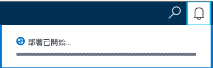
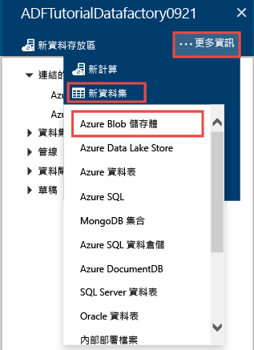
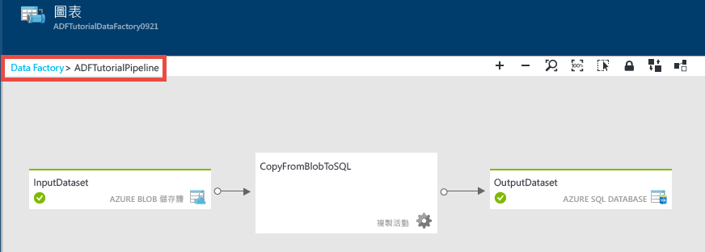
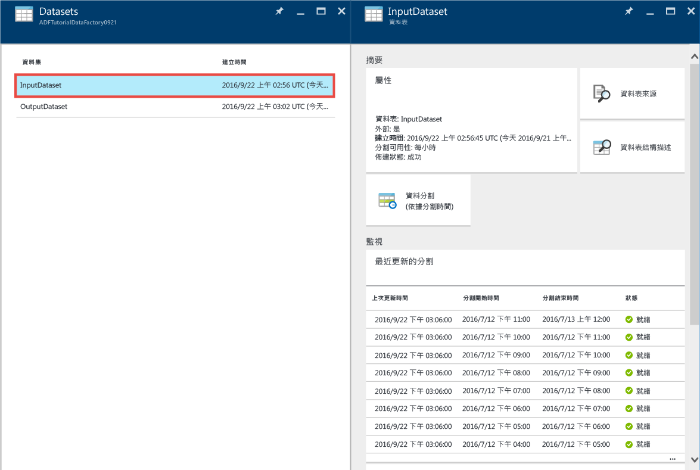
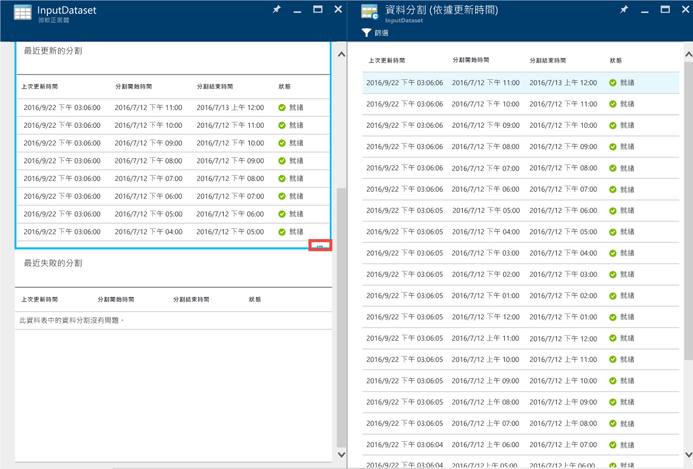
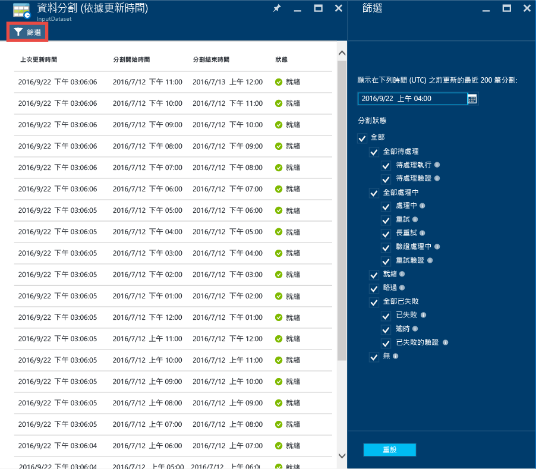
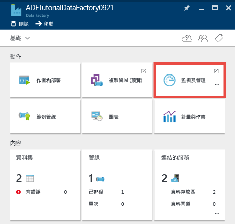
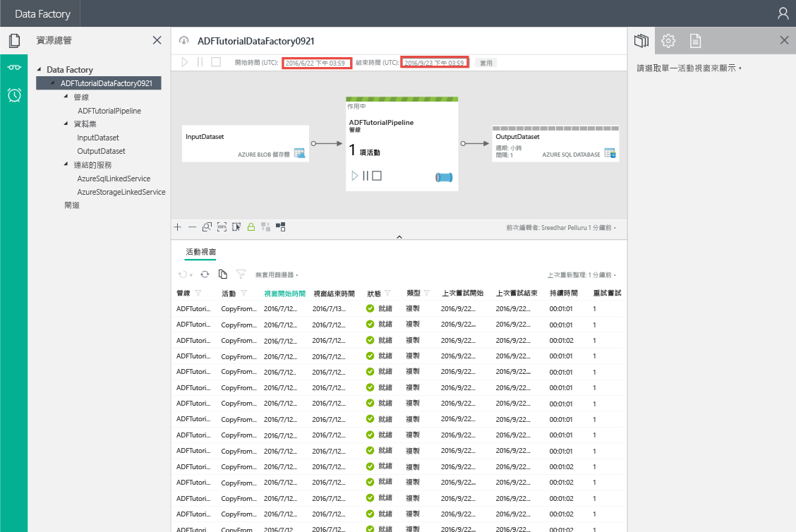
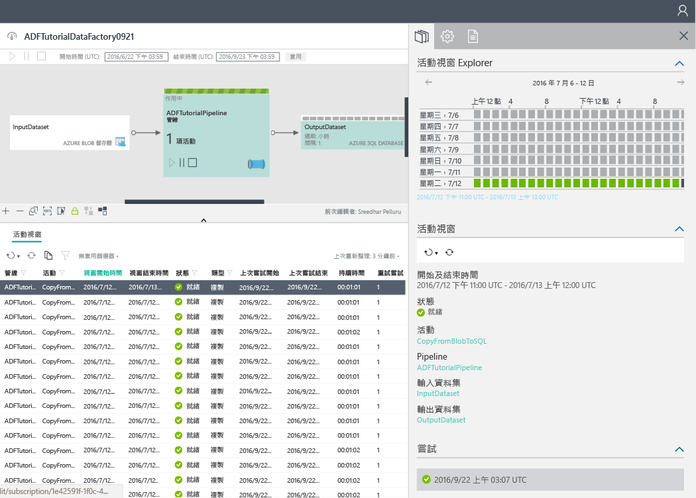

<properties 
	pageTitle="教學課程：使用 Azure 入口網站建立具有複製活動的管線 | Microsoft Azure" 
	description="在本教學課程中，您會使用 Azure 入口網站中的 Data Factory 編輯器，建立具有複製活動的 Azure Data Factory 管線。" 
	services="data-factory" 
	documentationCenter="" 
	authors="spelluru" 
	manager="jhubbard" 
	editor="monicar"/>

	ms.service="data-factory" 
	ms.workload="data-services" 
	ms.tgt_pltfrm="na" 
	ms.devlang="na" 
	ms.topic="get-started-article" 
	ms.date="09/16/2016" 
	ms.author="spelluru"/>

# 教學課程：使用 Azure 入口網站建立具有複製活動的管線
> [AZURE.SELECTOR]
- [概觀和必要條件](data-factory-copy-data-from-azure-blob-storage-to-sql-database.md)
- [Azure 入口網站](data-factory-copy-activity-tutorial-using-azure-portal.md)
- [Visual Studio](data-factory-copy-activity-tutorial-using-visual-studio.md)
- [PowerShell](data-factory-copy-activity-tutorial-using-powershell.md)
- [REST API](data-factory-copy-activity-tutorial-using-rest-api.md)
- [.NET API](data-factory-copy-activity-tutorial-using-dotnet-api.md)
- [複製精靈](data-factory-copy-data-wizard-tutorial.md)

本教學課程示範如何使用 Azure 入口網站建立和監視 Azure Data Factory。Data Factory 中的管線會使用複製活動將資料從 Azure Blob 複製到 Azure SQL Database。

以下是您會在本教學課程中執行的步驟：

步驟 | 說明
-----| -----------
[建立 Azure Data Factory](#create-data-factory) | 在此步驟中，您會建立名為 **ADFTutorialDataFactory** 的 Azure Data Factory。  
[建立連結服務](#create-linked-services) | 在此步驟中，您將建立兩個連結服務：**AzureStorageLinkedService** 和 **AzureSqlLinkedService**。  AzureStorageLinkedService 會連結 Azure 儲存體，而 AzureSqlLinkedService 會將 Azure SQL Database 連結至 ADFTutorialDataFactory。管線的輸入資料位於 Azure Blob 儲存體的 Blob 容器中，輸出資料則儲存在 Azure SQL Database 的資料表中。因此，您可以將這兩個資料存放區以連結服務的形式新增至 Data Factory。      
[建立輸入和輸出資料集](#create-datasets) | 在上一個步驟中，您所建立的連結服務參照含有輸入/輸出資料的資料存放區。在此步驟中，您會定義兩個資料集 (**InputDataset** 和 **OutputDataset**)，它們分別代表儲存在資料存放區的輸入/輸出資料。  針對 InputDataset，您需要指定所含 Blob 具有來源資料的 Blob 容器，而針對 OutputDataset，則需要指定可儲存輸出資料的 SQL 資料表。您也會指定其他屬性，例如結構、可用性和原則。 
[建立管線](#create-pipeline) | 在此步驟中，您會在 ADFTutorialDataFactory 中建立名為 **ADFTutorialPipeline** 的管線。  管線新增**複製活動**，以將輸入資料從 Azure Blob 複製到輸出 Azure SQL 資料表。複製活動會在 Azure Data Factory 中執行資料移動。此活動是由全域可用的服務所提供，可以使用安全、可靠及可調整的方式，在各種不同的資料存放區之間複製資料。如需複製活動的詳細資訊，請參閱[資料移動活動](data-factory-data-movement-activities.md)文章。 
[監視管線](#monitor-pipeline) | 在此步驟中，您會使用 Azure 入口網站來監視輸入和輸出資料表的配量。

## 必要條件 
請先完成[教學課程概觀](data-factory-copy-data-from-azure-blob-storage-to-sql-database.md)一文中列出的必要條件，再執行本教學課程。

## 建立 Data Factory
在此步驟中，您會使用 Azure 入口網站來建立名為 **ADFTutorialDataFactory** 的 Azure Data Factory。

1.	登入 [Azure 入口網站](https://portal.azure.com/)之後，按一下 [新增]，選取 [智慧 + 分析]，然後按一下 [Data Factory]。

	

6. 在 [新增 Data Factory] 刀鋒視窗中：
	1. 輸入 **ADFTutorialDataFactory** 做為名稱。
	
  		

		Azure Data Factory 的名稱必須是**全域唯一的**。如果您收到錯誤，請變更 Data Factory 名稱 (例如 yournameADFTutorialDataFactory)，然後試著重新建立。請參閱 [Data Factory - 命名規則](data-factory-naming-rules.md)主題，以了解 Data Factory 成品的命名規則。
	
			Data factory name “ADFTutorialDataFactory” is not available  
	 
		
	2. 選取您的 Azure **訂用帳戶**。
	3. 針對資源群組，請執行下列步驟︰
		1. 選取 [使用現有的]，然後從下拉式清單選取現有的資源群組。
		2. 選取 [建立新的]，然後輸入資源群組的名稱。
	
			本教學課程的某些步驟是假設您使用 **ADFTutorialResourceGroup** 做為資源群組名稱。若要了解資源群組，請參閱[使用資源群組管理您的 Azure 資源](../resource-group-overview.md)。
	4. 選取 Data Factory 的 [位置]。下拉式清單中只會顯示 Data Factory 服務支援的區域。
	5. 選取 [**釘選到「開始面板」**]。
	6. 按一下 [建立]。

		> [AZURE.IMPORTANT] 若要建立 Data Factory 執行個體，您必須是訂用帳戶/資源群組層級的 [Data Factory 參與者](../active-directory/role-based-access-built-in-roles.md/#data-factory-contributor)角色成員。
		>  
		>  Data Factory 的名稱未來可能會註冊為 DNS 名稱，因此會變成公開可見的名稱。
9.  若要查看狀態/通知訊息，請按一下工具列上的鈴鐺圖示。

	
10. 建立完成之後，您會看到如圖所示的 [Data Factory] 刀鋒視窗。

    

## 建立連結服務
連結服務會將資料存放區或計算服務連結至 Azure Data Factory。如需複製活動支援的所有來源和接收，請參閱[支援的資料存放區](data-factory-data-movement-activities.md##supported-data-stores-and-formats)。如需 Data Factory 支援的計算服務清單，請參閱[計算連結服務](data-factory-compute-linked-services.md)。在本教學課程中，您不會使用任何計算服務。

在此步驟中，您將建立兩個連結服務：**AzureStorageLinkedService** 和 **AzureSqlLinkedService**。AzureStorageLinkedService 連結服務會連結 Azure 儲存體帳戶，AzureSqlLinkedService 則會將 Azure SQL Database 連結至 **ADFTutorialDataFactory**。您稍後會在本教學課程中建立管線，以將資料從 AzureStorageLinkedService 中的 Blob 容器複製到 AzureSqlLinkedService 中的 SQL 資料表。

### 建立 Azure 儲存體帳戶的連結服務
1.	在 [Data Factory] 刀鋒視窗中，按一下 [製作和部署] 圖格來啟動 Data Factory 的 [編輯器]。

	![[製作和部署] 磚](./media/data-factory-copy-activity-tutorial-using-azure-portal/getstarted-author-deploy-tile.png)
5. 在 [編輯器] 中，按一下工具列上的 [新增資料存放區] 按鈕，然後從下拉式功能表中選取 [Azure 儲存體]。在右窗格中，您應該會看到用來建立 Azure 儲存體連結服務的 JSON 範本。

	![編輯器 [新增資料存放區] 按鈕](./media/data-factory-copy-activity-tutorial-using-azure-portal/getstarted-editor-newdatastore-button.png)
6. 將 `<accountname>` 和 `<accountkey>` 取代為 Azure 儲存體帳戶的帳戶名稱和帳戶金鑰值。

	
6. 按一下工具列上的 [部署]。您現在應該會在樹狀檢視中看到已部署的 **AzureStorageLinkedService**。

	

> [AZURE.NOTE]
如需 JSON 屬性的詳細資訊，請參閱[在 Azure Blob 來回移動資料](data-factory-azure-blob-connector.md#azure-storage-linked-service)。

### 建立 Azure SQL Database 的連結服務
1. 在 [Data Factory 編輯器] 中，按一下工具列上的 [新增資料存放區] 按鈕，然後從下拉式功能表中選取 [Azure SQL Database]。在右窗格中，您應該會看到用來建立 Azure SQL 連結服務的 JSON 範本。
2. 以您的 Azure SQL Server 名稱、資料庫名稱、使用者帳戶名稱和密碼取代 `<servername>`、`<databasename>`、`<username>@<servername>` 和 `<password>`。
3. 按一下工具列上的 [部署]，以建立並部署 **AzureSqlLinkedService**。
4. 確認您已在樹狀檢視中看到 **AzureSqlLinkedService**。

> [AZURE.NOTE]
如需 JSON 屬性的詳細資訊，請參閱[在 Azure SQL Database 來回移動資料](data-factory-azure-sql-connector.md#azure-sql-linked-service-properties)。

## 建立資料集
在上一個步驟中，您已建立連結服務 **AzureStorageLinkedService** 和 **AzureSqlLinkedService**，將 Azure 儲存體帳戶和 Azure SQL Database 連結至 Data Factory：**ADFTutorialDataFactory**。在此步驟中，您會定義兩個資料集 (**InputDataset** 和 **OutputDataset**)，它們分別代表 AzureStorageLinkedService 和 AzureSqlLinkedService 所參照資料存放區中所儲存的輸入/輸出資料。針對 InputDataset，您需要指定所含 Blob 具有來源資料的 Blob 容器，而針對 OutputDataset，則需要指定可儲存輸出資料的 SQL 資料表。

### 建立輸入資料集 
在此步驟中，您將在 **AzureStorageLinkedService** 連結服務所代表的 Azure 儲存體中，建立指向 Blob 容器的 **InputDataset** 資料集。

1. 在 Data Factory 的**編輯器**中，依序按一下下拉式功能表中的 [... 更多]、[新增資料集] 和 [Azure Blob 儲存體]。

	
2. 將右窗格中的 JSON 替換為以下 JSON 片段：

		{
		  "name": "InputDataset",
		  "properties": {
		    "structure": [
		      {
		        "name": "FirstName",
		        "type": "String"
		      },
		      {
		        "name": "LastName",
		        "type": "String"
		      }
		    ],
		    "type": "AzureBlob",
		    "linkedServiceName": "AzureStorageLinkedService",
		    "typeProperties": {
		      "folderPath": "adftutorial/",
			  "fileName": "emp.txt",
		      "format": {
		        "type": "TextFormat",
		        "columnDelimiter": ","
		      }
		    },
		    "external": true,
		    "availability": {
		      "frequency": "Hour",
		      "interval": 1
		    }
		  }
		}
		
     請注意下列幾點：
	
	- 資料集 **type** 設為 **AzureBlob**。
	- **linkedServiceName** 設為 **AzureStorageLinkedService**。您已在步驟 2 中建立此連結服務。
	- **folderPath** 設為 **adftutorial** 容器。您也可以使用 **fileName** 屬性指定資料夾內 Blob 的名稱。由於您未指定 Blob 的名稱，容器中所有 Blob 的資料都會被視為輸入資料。
	- 格式 **type** 設為 **TextFormat**
	- 文字檔中有兩個欄位 (**FirstName** 和 **LastName**)，以逗號字元分隔 (**columnDelimiter**)
	- **availability** 設定為**每小時** (**frequency** 設定為**小時**，**interval** 設定為 **1**)。因此，Data Factory 會每小時都在您指定之 Blob 容器 (**adftutorial**) 的根資料夾中尋找輸入資料。
	
	如果您未指定**輸入**資料集的 **fileName**，則輸入資料夾 (**folderPath**) 中的所有檔案/Blob 都會被視為輸入。如果您在 JSON 中指定 fileName，則只有指定的檔案/Blob 會被視為輸入。
 
	如果您未指定輸出資料表的 **fileName**，**folderPath** 中產生的檔案會依照下列格式命名：Data.&lt;Guid&gt;.txt (範例：Data.0a405f8a-93ff-4c6f-b3be-f69616f1df7a.txt)。

	若要根據 **SliceStart** 時間動態設定 **folderPath** 和 **fileName**，請使用 **partitionedBy** 屬性。在下列範例中，folderPath 使用 SliceStart (所處理配量的開始時間) 中的年、月和日，fileName 使用 SliceStart 中的小時。例如，如果配量產生於 2016-09-20T08:00:00，folderName 設定為 wikidatagateway/wikisampledataout/2016/09/20，而 fileName 設定為 08.csv。

			"folderPath": "wikidatagateway/wikisampledataout/{Year}/{Month}/{Day}",
	        "fileName": "{Hour}.csv",
	        "partitionedBy": 
	        [
	        	{ "name": "Year", "value": { "type": "DateTime", "date": "SliceStart", "format": "yyyy" } },
	            { "name": "Month", "value": { "type": "DateTime", "date": "SliceStart", "format": "MM" } }, 
	            { "name": "Day", "value": { "type": "DateTime", "date": "SliceStart", "format": "dd" } }, 
	            { "name": "Hour", "value": { "type": "DateTime", "date": "SliceStart", "format": "hh" } } 
	        ],
2. 按一下工具列上的 [部署]，以建立並部署 **InputDataset** 資料集。確認您已在樹狀檢視中看到 **InputDataset**。

> [AZURE.NOTE]
如需 JSON 屬性的詳細資訊，請參閱[在 Azure Blob 來回移動資料](data-factory-azure-blob-connector.md#azure-blob-dataset-type-properties)。

### 建立輸出資料集
在此步驟的這個部分中，您會建立名為 **OutputDataset** 的輸出資料集。此資料集指向 Azure SQL Database 中 **AzureSqlLinkedService** 所代表的 SQL 資料表。

1. 在 Data Factory 的**編輯器**中，依序按一下下拉式功能表中的 [... 更多]、[新增資料集] 和 [Azure SQL]。
2. 將右窗格中的 JSON 替換為以下 JSON 片段：

		{
		  "name": "OutputDataset",
		  "properties": {
		    "structure": [
		      {
		        "name": "FirstName",
		        "type": "String"
		      },
		      {
		        "name": "LastName",
		        "type": "String"
		      }
		    ],
		    "type": "AzureSqlTable",
		    "linkedServiceName": "AzureSqlLinkedService",
		    "typeProperties": {
		      "tableName": "emp"
		    },
		    "availability": {
		      "frequency": "Hour",
		      "interval": 1
		    }
		  }
		}
		
     請注意下列幾點：
	
	- 資料集 **type** 設為 **AzureSQLTable**。
	- **linkedServiceName** 設為 **AzureSqlLinkedService** (您已在步驟 2 中建立此連結服務)。
	- **tablename** 設為 **emp**。
	- 資料庫的 emp 資料表中有三個資料行 – **ID**、**FirstName** 和 **LastName**。ID 是識別資料行，所以您只需在此指定 **FirstName** 和 **LastName**。
	- **availability** 設定為**每小時**，且 (**frequency** 設定為**小時**，**interval** 設定為 **1**)。Data Factory 服務會每隔一小時在 Azure SQL Database 的 **emp** 資料表中產生輸出資料配量。

3. 按一下工具列上的 [部署]，以建立並部署 **OutputDataset** 資料集。確認您已在樹狀檢視中看到 **OutputDataset**。

> [AZURE.NOTE]
如需 JSON 屬性的詳細資訊，請參閱[在 Azure SQL Database 來回移動資料](data-factory-azure-sql-connector.md#azure-sql-linked-service-properties)。

## 建立管線
在此步驟中您會建立管線，其中含有使用 **InputDataset** 做為輸入和使用 **OutputDataset** 做為輸出的**複製活動**。

1. 在 Data Factory 的**編輯器**中，依序按一下 [... 更多] 和 [新增管線]。或者，您也可以在樹狀檢視中，以滑鼠右鍵按一下 [管線]，再按一下 [**新增管線**]。
2. 將右窗格中的 JSON 替換為以下 JSON 片段：
		
		{
		  "name": "ADFTutorialPipeline",
		  "properties": {
		    "description": "Copy data from a blob to Azure SQL table",
		    "activities": [
		      {
		        "name": "CopyFromBlobToSQL",
		        "type": "Copy",
		        "inputs": [
		          {
		            "name": "InputDataset"
		          }
		        ],
		        "outputs": [
		          {
		            "name": "OutputDataset"
		          }
		        ],
		        "typeProperties": {
		          "source": {
		            "type": "BlobSource"
		          },
		          "sink": {
		            "type": "SqlSink",
		            "writeBatchSize": 10000,
		            "writeBatchTimeout": "60:00:00"
		          }
		        },
		        "Policy": {
		          "concurrency": 1,
		          "executionPriorityOrder": "NewestFirst",
		          "retry": 0,
		          "timeout": "01:00:00"
		        }
		      }
		    ],
		    "start": "2016-07-12T00:00:00Z",
		    "end": "2016-07-13T00:00:00Z"
		  }
		} 

	請注意下列幾點：

	- 在活動區段中，只會有一個 **type** 設為 **Copy** 的活動。
	- 活動的輸入設定為 **InputDataset**，活動的輸出則設定為 **OutputDataset**。
	- 在 **transformation** 區段中，來源類型指定為 **BlobSource**，接收類型指定為 **SqlSink**。

	將 **start** 屬性的值替換為目前日期，並將 **end** 值替換為隔天的日期。在日期時間中，您只指定日期部分，並略過時間部分。例如，"2016-02-03"，這相當於 "2016-02-03T00:00:00Z"
	
	開始和結束日期時間都必須是 [ISO 格式](http://en.wikipedia.org/wiki/ISO_8601)。例如：2016-10-14T16:32:41Z。**end** 時間為選擇性項目，但在本教學課程中會用到。
	
	如果您未指定 **end** 屬性的值，則會以「**start + 48 小時**」計算。若要無限期地執行管線，請指定 **9999-09-09** 做為 **end** 屬性的值。
	
	在上述範例中，由於每小時即產生一個資料配量，共會有 24 個資料配量。
	
4. 按一下工具列上的 [部署]，建立並部署 **ADFTutorialPipeline**。確認您在樹狀檢視中看到管線。
5. 現在，按一下 **X** 關閉 [編輯器] 刀鋒視窗。再次按一下 **X**，以查看 **ADFTutorialDataFactory** 的 **Data Factory** 首頁。

**恭喜！** 您已成功建立 Azure Data Factory、連結服務、資料表和管線，以及排定的管線。
 
### 在圖表檢視中檢視 Data Factory 
1. 在 [Data Factory] 刀鋒視窗中，按一下 [圖表]。

	
2. 您應該會看到如下圖所示的圖表：

	

	您可以將管線和資料表放大、縮小、放大到 100%、縮放至適當比例和自動定位，以及顯示歷程資訊 (反白顯示所選取項目的上游和下游項目)。您可以按兩下物件 (輸入/輸出資料表或管線) 查看其屬性。
3. 在圖表檢視中的 **ADFTutorialPipeline** 上按一下滑鼠右鍵，然後按一下 [開啟管線]。

	
4. 您應該會看到管線中的活動，以及活動的輸入和輸出資料集。在本教學課程中，管線中只能有一個活動 (複製活動) 將 InputDataset 做為輸入資料集，並將 OutputDataset 做為輸出資料集。

	
5. 按一下左上角階層連結中的 [Data Factory]，回到圖表檢視。圖表檢視會顯示所有管線。在此範例中，您只建立了一個管線。
 

## 監視管線
在此步驟中，您會使用 Azure 入口網站來監視 Azure Data Factory 的運作情形。

### 使用圖表檢視監視管線

1. 按一下 **X** 關閉 [圖表] 檢視，以查看 Data Factory 首頁上的 Data Factory。如果您已關閉網頁瀏覽器，請執行下列步驟︰
	2. 瀏覽至 [Azure 入口網站](https://portal.azure.com/)。
	2. 按兩下 [開始面板] 上的 [ADFTutorialDataFactory]\(或) 按一下左側功能表上的 [Data Factory]，然後搜尋 ADFTutorialDataFactory。
3. 您應該會看到您在此分頁上建立之資料表和管線的計數和名稱。

	
4. 現在，按一下 [資料集] 磚。
5. 在 [資料集] 刀鋒視窗中，按一下 [InputDataset]。此資料集是 **ADFTutorialPipeline** 的輸入資料集。

	
5. 按一下 **…** (省略符號) 檢視所有資料配量。

	

	請注意，截至目前為止的資料配量都已**就緒**，因為 **emp.txt** 檔案一直都存在於 Blob 容器中：**adftutorial\\input**。確認下方的 [最近失敗的配量] 區段中沒有任何配量。

	[最近更新的配量] 和 [最近失敗的配量] 清單都依照 [上次更新時間] 排序。
    
	按一下工具列上的 [篩選] 以篩選配量。
	
	
6. 一直關閉刀鋒視窗，直到您看到 [資料集] 刀鋒視窗。按一下 [OutputDataset]。此資料集是 **ADFTutorialPipeline** 的輸出資料集。

	
6. 您應會看到如下圖所示的 **OutputDataset** 刀鋒視窗：

	
7. 請注意，到目前為止已經產生資料配量，且它們的狀態為 [就緒]。底部的 [問題配量] 區段中沒有顯示任何配量。
8. 按一下 **…** (省略符號) 檢視所有配量。

	
9. 按一下清單中的任何資料配量，您應該會看到 [資料配量] 刀鋒視窗。

	
  
	如果配量不是 [就緒] 狀態，您可以在 [未就緒的上游配量] 清單中看到未就緒且阻礙目前配量執行的上游配量。
11. 在 [資料配量] 刀鋒視窗中，您應該會看到底部清單中的所有活動執行。按一下 [活動執行] 查看 [活動執行詳細資料] 刀鋒視窗。

	
12. 按一下 **X** 關閉所有刀鋒視窗，直到您回到 **ADFTutorialDataFactory** 的起始刀鋒視窗。
14. (選擇性) 在 **ADFTutorialDataFactory** 的起始刀鋒視窗上按一下 [**管線**]，再按一下 [**管線**] 刀鋒視窗中的 **ADFTutorialPipeline**，然後深入檢視輸入資料表 (**已取用**) 或輸出資料表 (**已產生**)。
15. 啟動 **SQL Server Management Studio**，並連接到 Azure SQL Database，然後確認資料列已插入資料庫的 **emp** 資料表中。

	

### 使用監視及管理應用程式來監視管線
您也可以使用「監視及管理應用程式」來監視您的管線。如需使用此應用程式的詳細資訊，請參閱[使用監視及管理應用程式來監視和管理 Azure Data Factory 管線](data-factory-monitor-manage-app.md)。

1. 在 Data Factory 首頁上按一下 [監視及管理] 圖格。

	
2. 您應該會看到 [監視及管理] 應用程式。變更 [開始時間] 和 [結束時間] 以包含您管線的開始 (2016-07-12) 和結束時間 (2016-07-13)，然後按一下 [套用]。

	
3. 選取 [活動時段] 清單中的活動時段以查看其詳細資料。

## 摘要 
在本教學課程中，您已建立要將資料從 Azure Blob 複製到 Azure SQL 資料庫的 Azure Data Factory。您已使用 Azure 入口網站建立 Data Factory、連結服務、資料集和管線。以下是您在本教學課程中執行的高階步驟：

1.	建立 Azure **Data Factory**。
2.	建立**連結服務**：
	1. **Azure 儲存體**連結服務可連結保留輸入資料的 Azure 儲存體帳戶。
	2. **Azure SQL** 連結服務可連結保留輸出資料的 Azure SQL Database。
3.	建立可描述管線輸入資料和輸出資料的**資料集**。
4.	建立具有**複製活動**的**管線**，以 **BlobSource** 做為來源並以 **SqlSink** 做為接收器。

## 另請參閱
| 主題 | 說明 |
| :---- | :---- |
| [資料移動活動](data-factory-data-movement-activities.md) | 本文提供您在本教學課程中使用的複製活動詳細資訊。 |
| [排程和執行](data-factory-scheduling-and-execution.md) | 本文說明 Azure Data Factory 應用程式模型的排程和執行層面。 |
| [管線](data-factory-create-pipelines.md) | 本文協助您了解 Azure Data Factory 中的管線和活動。 |
| [資料集](data-factory-create-datasets.md) | 本文協助您了解 Azure Data Factory 中的資料集。
| [使用監視應用程式來監視和管理管線](data-factory-monitor-manage-app.md) | 本文說明如何使用監視及管理應用程式，來監視、管理管線及進行偵錯。 

<!---HONumber=AcomDC_0928_2016-->
