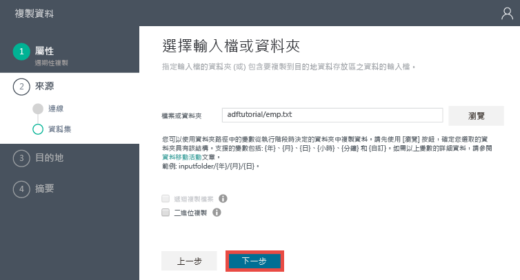
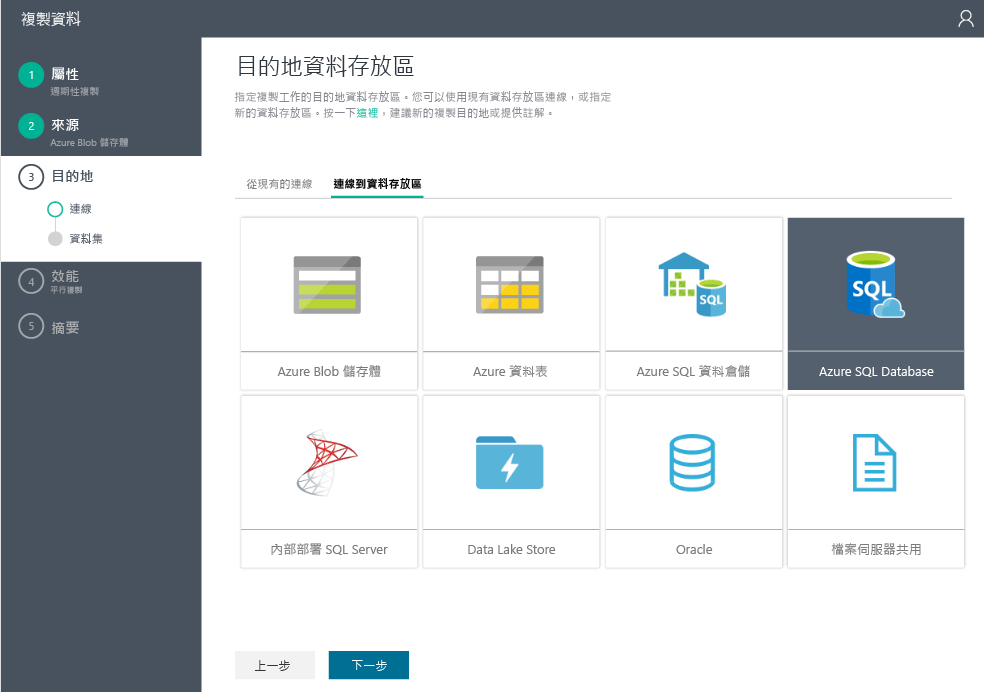
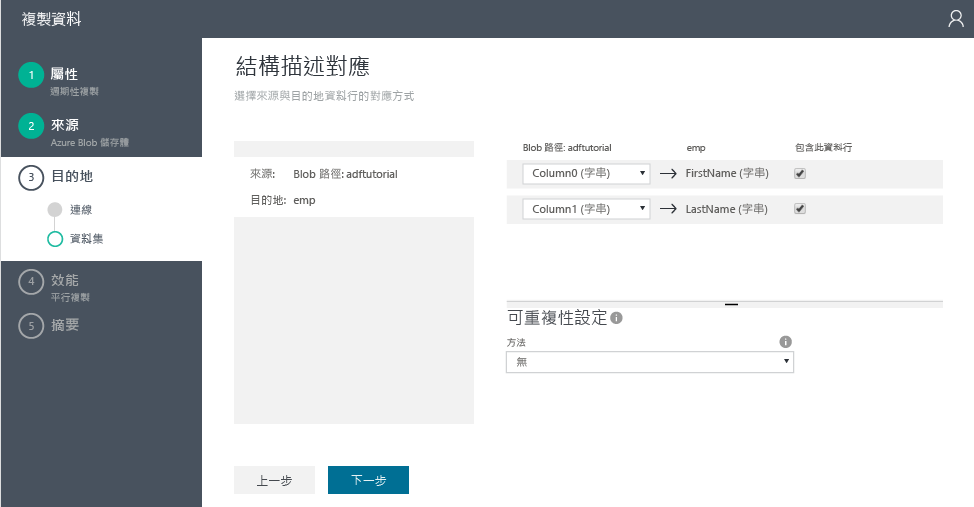
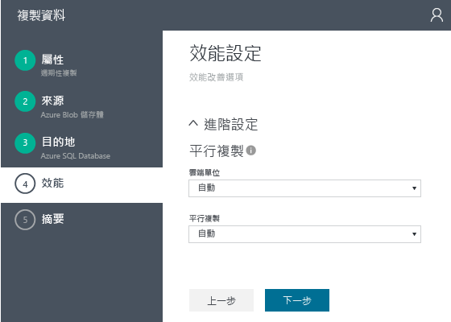
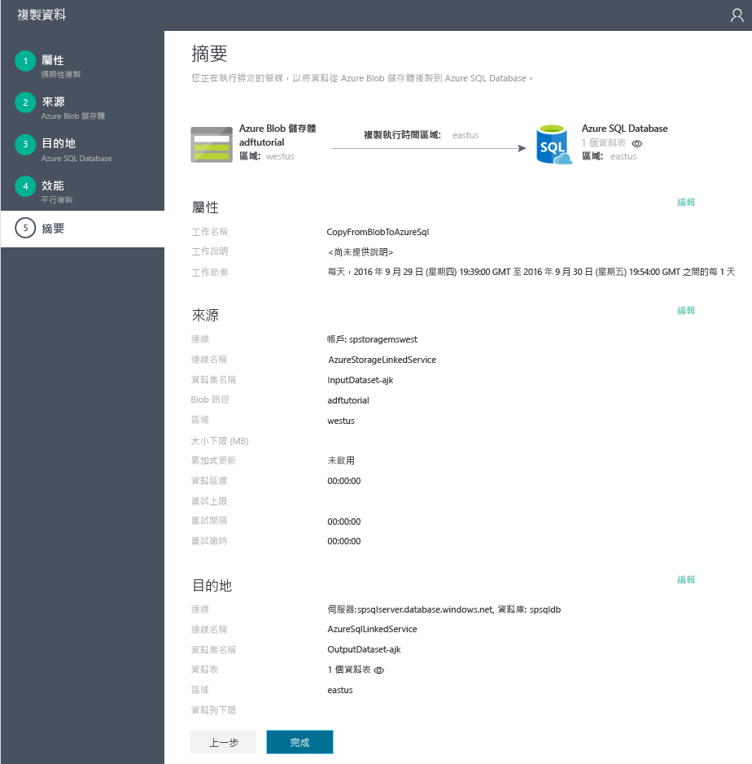

# 教學課程：使用 Data Factory 複製精靈建立具有複製活動的管線
> [!div class="op_single_selector"]
> * [概觀和必要條件](data-factory-copy-data-from-azure-blob-storage-to-sql-database.md)
> * [複製精靈](data-factory-copy-data-wizard-tutorial.md)
> * [Azure 入口網站](data-factory-copy-activity-tutorial-using-azure-portal.md)
> * [Visual Studio](data-factory-copy-activity-tutorial-using-visual-studio.md)
> * [PowerShell](data-factory-copy-activity-tutorial-using-powershell.md)
> * [Azure Resource Manager 範本](data-factory-copy-activity-tutorial-using-azure-resource-manager-template.md)
> * [REST API](data-factory-copy-activity-tutorial-using-rest-api.md)
> * [.NET API](data-factory-copy-activity-tutorial-using-dotnet-api.md)

本教學課程說明如何使用**複製精靈**，將資料從 Azure Blob 儲存體複製到 Azure SQL Database。 

Azure Data Factory 的[複製精靈] 可讓您快速建立資料管線，以將資料從支援的來源資料存放區複製到支援的目的地資料存放區。 因此，建議在第一個步驟中使用精靈來建立資料移動案例的範例管線。 如需作為來源和目的地支援的資料存放區清單，請參閱[支援的資料存放區](data-factory-data-movement-activities.md#supported-data-stores-and-formats)。  

本教學課程說明如何建立 Azure data factory、啟動 [複製精靈]、執行一系列的步驟，以提供有關資料擷取/移動案例的詳細資料。 當您完成精靈中的步驟時，精靈會自動建立具有複製活動的管線，以將資料從 Azure Blob 儲存體複製到 Azure SQL Database。 如需複製活動的詳細資訊，請參閱[資料移動活動](data-factory-data-movement-activities.md)。

## 必要條件
請先完成 [教學課程概觀](data-factory-copy-data-from-azure-blob-storage-to-sql-database.md) 一文中列出的必要條件，再執行本教學課程。

## 建立 Data Factory
在此步驟中，您會使用 Azure 入口網站來建立名為 **ADFTutorialDataFactory**的 Azure Data Factory。

1. 登入 [Azure 入口網站](https://portal.azure.com)。
2. 按一下左上角的 [+ 新增]，並按一下 [資料 + 分析]，然後按一下 [Data Factory]。 
   
   
2. 在 [ **新增 Data Factory** ] 刀鋒視窗中：
   
   1. 輸入 **ADFTutorialDataFactory** 做為**名稱**。
       Azure Data Factory 的名稱在全域必須是唯一的。 如果您收到錯誤：`Data factory name “ADFTutorialDataFactory” is not available`，請變更資料處理站名稱 (例如 yournameADFTutorialDataFactoryYYYYMMDD)，然後試著重新建立。 請參閱 [Data Factory - 命名規則](data-factory-naming-rules.md) 主題，以了解 Data Factory 成品的命名規則。  
      
           
   2. 選取您的 Azure **訂用帳戶**。
   3. 針對資源群組，請執行下列其中一個步驟︰ 
      
      - 選取 [使用現有的] 以選取現有的資源群組。
      - 選取 [建立新的] 以輸入資源群組的名稱。
          
        本教學課程的某些步驟是假設您使用 **ADFTutorialResourceGroup** 做為資源群組名稱。 若要了解資源群組，請參閱 [使用資源群組管理您的 Azure 資源](../azure-resource-manager/resource-group-overview.md)。
   4. 選取 Data Factory 的 [位置]。
   5. 選取刀鋒視窗底部的 [釘選到儀表板] 核取方塊。  
   6. 按一下 [建立] 。
      
                   
3. 建立完成之後，您會看到 [Data Factory] 刀鋒視窗，如下圖所示：
   
   

## 啟動複製精靈
1. 在 Data Factory 刀鋒視窗上，按一下 [複製資料 (預覽)] 來啟動 [複製精靈]。 
   
   > [!NOTE]
   > 如果您看到網頁瀏覽器停留在「授權中...」，請停用/取消核取瀏覽器設定中的 [封鎖第三方 Cookie 和站台資料] 設定 (或) 將它保持啟用並為 **login.microsoftonline.com** 建立例外狀況，然後再次嘗試啟動精靈。
2. 在 [屬性]  頁面︰
   
   1. 輸入 **CopyFromBlobToAzureSql** 做為 [工作名稱]
   2. 輸入 **說明** (選擇性)。
   3. 變更 [開始日期時間] 和 [結束日期時間]，讓結束日期設為今天，而開始日期設為五天前。  
   4. 按一下 [下一步] 。  
      
       
3. 在 [來源資料存放區] 頁面上，按一下 [Azure Blob 儲存體] 圖格。 您可以使用此頁面來指定複製工作的來源資料存放區。 
   
    
4. 在 [指定 Azure Blob 儲存體帳戶]  頁面︰
   
   1. 輸入 **AzureStorageLinkedService** 做為 [連結服務名稱]。
   2. 確認已針對 [帳戶選取方法] 選取 [從 Azure 訂用帳戶] 選項。
   3. 選取您的 Azure **訂用帳戶**。  
   4. 從所選訂用帳戶中可用的 Azure 儲存體帳戶清單中，選取 [Azure 儲存體帳戶]。 您也可以選擇手動輸入儲存體帳戶設定，其做法是選取 [帳戶選取方法] 的 [手動輸入] 選項，然後按 [下一步]。 
      
      
5. 在 [選擇輸入檔案或資料夾]  頁面︰
   
   1. 按兩下 **adftutorial** (資料夾)。
   2. 選取 **emp.txt**，然後按一下 [選擇]
      
      
6. 在 [選擇輸入檔案或資料夾] 頁面上，按 [下一步]。 請勿選取 [二進位複本] 。 
   
     
7. 在 [檔案格式設定] 頁面上，您會看到分隔符號以及精靈藉由剖析檔案自動偵測到的結構描述。 您也可以手動輸入複製精靈的分隔符號，以停止自動偵測或進行覆寫。 檢閱分隔符號並預覽資料之後，請按 [下一步]。 
   
      
8. 在 [目的地資料存放區] 頁面上，選取 [Azure SQL Database]，然後按 [下一步]。
   
    
9. 在 [指定 Azure SQL Database]  頁面︰
   
   1. 針對 [連線名稱] 欄位輸入 **AzureSqlLinkedService**。
   2. 確認已針對 [伺服器 / 資料庫選取方法] 選取 [從 Azure 訂用帳戶] 選項。
   3. 選取您的 Azure **訂用帳戶**。  
   4. 選取 [伺服器名稱] 和 [資料庫]。
   5. 輸入 [使用者名稱] 和 [密碼]。
   6. 按一下 [下一步] 。  
      
      
10. 在 [資料表對應] 頁面上，從 [目的地] 欄位的下拉式清單中選取 **emp**，按一下**向下箭號** (選擇性) 以查看結構描述及預覽資料。
    
      
11. 在 [結構描述對應] 頁面上，按 [下一步]。
    
    
12. 在 [效能設定] 頁面上，按 [下一步]。 
    
    
13. 在 [摘要] 頁面中檢閱資訊，然後按一下 [完成]。 此精靈會在 Data Factory (從您啟動複製精靈的位置) 中建立兩個連結服務、兩個資料集 (輸入和輸出)，以及一個管線。 
    
    

## 啟動監視及管理應用程式
1. 在 [部署] 頁面上，按一下連結︰`Click here to monitor copy pipeline`。
   
     
2. 監視應用程式會在網頁瀏覽器中的個別索引標籤中啟動。   
   
      
3. 若要查看每小時配量的最新狀態，請按一下底部 [活動時段] 清單中的 [重新整理] 按鈕。 您可看到介於管線開始與結束時間之間五天的五個活動時段。 此清單不會自動重新整理，所以您可能需要按一下 [重新整理] 數次，才能看見處於 [就緒] 狀態的所有活動時段。 
4. 選取清單中的活動時段。 請參閱右側 [活動時段總管] 中的相關詳細資料。

        

    請注意，日期 11、12、13、14 及 15 均為綠色，這表示已經產生這些日期的每日輸出配量。 您也可在圖表檢視中的管線和輸出資料集上看到此色彩編碼。 在上一個步驟中，請注意，已經產生兩個配量，有一個配量目前處理中，還有其他兩個配量等待處理 (根據色彩編碼)。 

    如需使用此應用程式的詳細資訊，請參閱[使用監視應用程式來監視和管理管線](data-factory-monitor-manage-app.md)。

## 後續步驟
在本教學課程中，您可使用 Azure Blob 儲存體作為來源資料存放區以及使用 Azure SQL Database 作為複製作業的目的地資料存放區。 下表提供複製活動所支援作為來源或目的地的資料存放區清單： 

[!INCLUDE [data-factory-supported-data-stores](../../includes/data-factory-supported-data-stores.md)]

如需您在資料存放區的複製精靈中看到的欄位/屬性詳細資訊，請按一下資料表中資料存放區的連結。 
