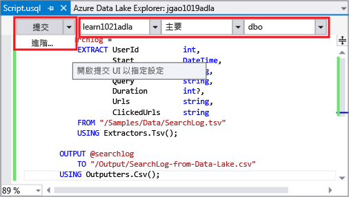
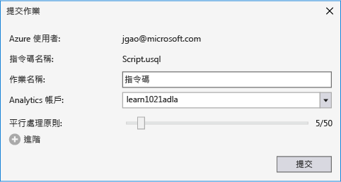
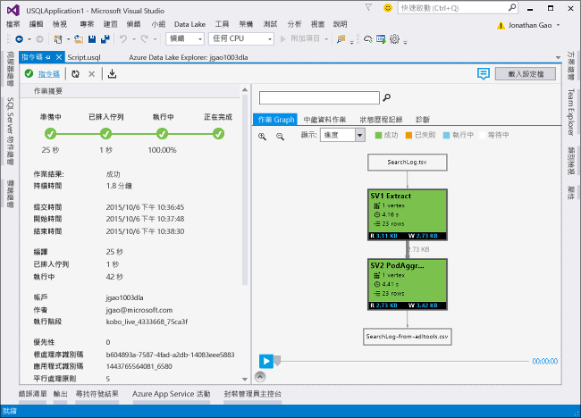

# <a name="develop-u-sql-scripts-by-using-data-lake-tools-for-visual-studio"></a>使用適用於 Visual Studio 的 Data Lake 工具來開發 U-SQL 指令碼
[!INCLUDE [get-started-selector](../../includes/data-lake-analytics-selector-get-started.md)]


了解如何使用 Visual Studio 建立 Azure Data Lake Analytics 帳戶、在 [U-SQL](data-lake-analytics-u-sql-get-started.md) 中定義作業，以及將作業提交至 Data Lake Analytics 服務。 如需有關 Data Lake Analytics 的詳細資訊，請參閱 [Azure Data Lake Analytics 概觀](data-lake-analytics-overview.md)。


## <a name="prerequisites"></a>必要條件

* **Visual Studio**：支援 Express 以外的所有版本。
    * Visual Studio 2017
    * Visual Studio 2015
    * Visual Studio 2013
* **Microsoft Azure SDK for .NET** 2.7.1 版或更新版本。  使用 [Web Platform Installer](http://www.microsoft.com/web/downloads/platform.aspx) 來進行安裝。
* **Data Lake Analytics** 帳戶。 如需建立帳戶，請參閱[使用 Azure 入口網站開始使用 Azure Data Lake Analytics](data-lake-analytics-get-started-portal.md)。

## <a name="install-azure-data-lake-tools-for-visual-studio"></a>安裝 Azure Data Lake Tools for Visual Studio 

[從下載中心](http://aka.ms/adltoolsvs)下載並安裝 Azure Data Lake Tools for Visual Studio。 安裝後，請注意：
* **伺服器總管** > **Azure** 節點包含 **Data Lake Analytics** 節點。 
* [工具] 功能表包含 [Data Lake] 項目。

## <a name="connect-to-an-azure-data-lake-analytics-account"></a>連線至 Azure Data Lake Analytics 帳戶

1. 開啟 Visual Studio。
2. 選取 [檢視] > [伺服器總管] 可開啟伺服器總管。
3. 以滑鼠右鍵按一下 [Azure]。 然後選取 [連線到 Microsoft Azure 訂用帳戶]並遵循指示進行。
4. 在 [伺服器總管] 中，選取 **Azure** > **Data Lake Analytics**。 您會看到 Data Lake Analytics 帳戶的清單。


## <a name="write-your-first-u-sql-script"></a>撰寫第一個 U-SQL 指令碼

下列文字是簡單的 U-SQL 指令碼。 它會定義小型資料集，並將該資料集寫入預設 Data Lake Store 中，作為名為 `/data.csv` 的檔案。

```
@a  = 
    SELECT * FROM 
        (VALUES
            ("Contoso", 1500.0),
            ("Woodgrove", 2700.0)
        ) AS 
              D( customer, amount );
OUTPUT @a
    TO "/data.csv"
    USING Outputters.Csv();
```

### <a name="submit-a-data-lake-analytics-job"></a>提交資料湖分析作業

1. 選取 [檔案] > [新增] > [專案]。

2. 選取 [U-SQL 專案] 類型，然後按一下 [確定]。 Visual Studio 會建立具有 **Script.usql** 檔案的解決方案。

3. 將先前的指令碼貼上 **Script.usql** 視窗。

4. 在 **Script.usql** 視窗的左上角中，指定 Data Lake Analytics 帳戶。

    

5. 在 **Script.usql** 視窗的左上角中，選取 [提交]。
6. 確認 **Analytics 帳戶**，然後選取 [提交]。 提交作業完成時，適用於 Visual Studio 結果的 Data Lake 工具中便會出現提交結果。

    
7. 按一下 [重新整理]，可查看最新的作業狀態並重新整理畫面。 當作業成功時，它會顯示**作業圖形**、**中繼資料作業**、**狀態記錄**和**診斷**：

    

   * **作業摘要**會顯示作業的摘要。   
   * **作業詳細資料**會顯示更多作業的相關資訊，包括指令碼、資源和頂點。
   * **作業圖形**會以視覺化方式檢視作業的進度。
   * **中繼資料作業**會顯示 U-SQL 目錄上所執行的所有動作。
   * **資料**會顯示所有的輸入和輸出。
   * **診斷**會提供作業執行和效能最佳化的進階分析。

### <a name="to-check-job-state"></a>檢查作業狀態

1. 在 [伺服器總管] 中，選取 **Azure** > **Data Lake Analytics**。 
2. 展開 Data Lake Analytics 帳戶名稱。
3. 按兩下 [作業]。
4. 選取您先前提交的作業。

### <a name="to-see-the-output-of-a-job"></a>若要查看作業的輸出

1. 在伺服器總管中，瀏覽至您所提交的作業。
2. 按一下 [資料]  索引標籤。
3. 在 [作業輸出] 索引標籤中，選取 `"/data.csv"` 檔案。

## <a name="next-steps"></a>後續步驟

* 使用 [Azure 入口網站](data-lake-analytics-get-started-portal.md)開始使用 Data Lake Analytics | [Azure PowerShell](data-lake-analytics-get-started-powershell.md) 
* [在 U-SQL 作業中進行 C# 程式碼偵錯](data-lake-analytics-debug-u-sql-jobs.md)
* [使用 Azure Data Lake Tools for Visual Studio Code](data-lake-analytics-data-lake-tools-for-vscode.md)

