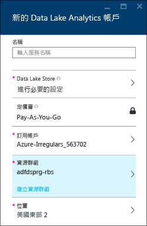
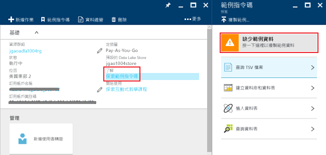
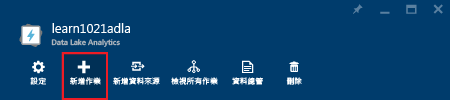
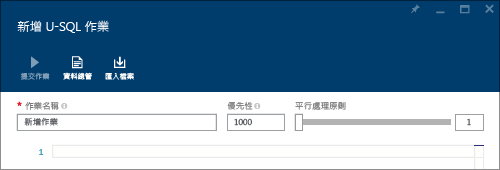
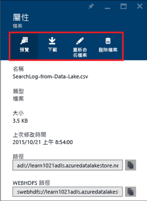

# 教學課程：使用 Azure 入口網站開始使用 Azure Data Lake Analytics
[!INCLUDE [get-started-selector](../../includes/data-lake-analytics-selector-get-started.md)]

了解如何使用 Azure 入口網站建立 Azure Data Lake Analytics 帳戶、在 [U-SQL](data-lake-analytics-u-sql-get-started.md)中定義作業，以及將作業提交至 Data Lake Analytics 服務。 如需有關 Data Lake Analytics 的詳細資訊，請參閱 [Azure Data Lake Analytics 概觀](data-lake-analytics-overview.md)。

在本教學課程中，您將會開發一個作業以讀取定位鍵分隔值 (TSV) 檔案，並將該檔案轉換為逗點分隔值 (CSV) 檔案。 若要使用其他支援的工具進行同一個教學課程，請按一下此區段最上方的索引標籤。 當第一個工作成功完成時，您便可開始使用 U SQL 撰寫更複雜的資料轉換。

## 必要條件
開始進行本教學課程之前，您必須具備下列項目：

* **Azure 訂用帳戶**。 請參閱 [取得 Azure 免費試用](https://azure.microsoft.com/pricing/free-trial/)。

## 建立 Data Lake Analytics 帳戶
您必須擁有 Data Lake Analytics 帳戶，才能執行工作。

每個 Data Lake Analytics 帳戶有 Azure Data Lake Store 帳戶相依性。  這個帳戶稱為預設 Data Lake Store 帳戶。  您可以事先或當您建立 Data Lake Analytics 帳戶時，建立 Data Lake Store 帳戶。 在本教學課程中，您將建立具有 Data Lake Analytics 帳戶的 Data Lake Store 帳戶。

**建立 Data Lake Analytics 帳戶**

1. 登入 [Azure 入口網站](https://portal.azure.com)。
2. 依序按一下 [新增]、[智慧 + 分析] 及 [Data Lake Analytics]。
3. 輸入或選取下列值：

    

   * **名稱**：替 Data Lake Analytics 帳戶命名 (只允許小寫字母和數字)。
   * **訂用帳戶**：選擇用於分析帳戶的 Azure 訂用帳戶。
   * **資源群組**。 選取現有的 Azure 資源群組，或建立一個新的群組。 Azure 資源管理員可讓您將應用程式中的資源做為群組使用。 如需詳細資訊，請參閱 [Azure 資源管理員概觀](../azure-resource-manager/resource-group-overview.md)。
   * **位置**。 為 Data Lake Analytics 帳戶選取 Azure 資料中心。
   * **Data Lake Store**：按一下 [進行必要設定]。 請依照指示來建立新的 Data Lake Store 帳戶，或選取現有的帳戶。 每個 Data Lake Analytics 帳戶都有相依的 Data Lake Store 帳戶。 Data Lake Analytics 帳戶和相依的 Data Lake Store 帳戶必須位於同一個 Azure 資料中心。
4. 選取定價層  
5. 按一下 [建立] 。 它會讓您回到入口網站的主畫面，其中會出現新圖格，顯示「部署 Azure Data Lake Analytics」。 部署程序會花費幾分鐘的時間來建立 Data Lake Analytics 帳戶。 當建立帳戶之後，入口網站就會在新的刀鋒視窗上開啟帳戶。

建立 Data Lake Analytics 之後，您可以新增其他 Data Lake Store 帳戶和 Azure 儲存體帳戶。 如需詳細指示，請參閱[管理 Data Lake Analytics 帳戶資料來源](data-lake-analytics-manage-use-portal.md#manage-account-data-sources)。

## 準備來源資料
在本教學課程中，您將會處理搜尋記錄。  搜尋記錄檔可以儲存在 Data Lake 存放區或 Azure Blob 儲存體中。

Azure 入口網站會提供使用者介面，可將範例資料檔案複製到預設的 Data Lake Store 存放區帳戶，其中包括搜尋記錄檔案。

**複製範例資料檔案**

1. 從 [Azure 入口網站](https://portal.azure.com)開啟 Data Lake Analytics 帳戶。  請參閱[管理 Data Lake Analytics 帳戶](data-lake-analytics-get-started-portal.md#create-data-lake-analytics-account)，以在入口網站中建立和開啟帳戶。
2. 展開 [Essentials] 窗格，然後按一下 [探索範例指令碼]。 這會開啟另一個名為 [範例指令碼] 的刀鋒視窗。

    
3. 按一下 [範例資料遺失] 以複製範例資料檔案。 完成時，入口網站會顯示 [範例資料更新成功]。
4. 按一下 [Data Lake Analytics 帳戶] 刀鋒視窗頂端的 [資料總管]  。

    

    這會開啟兩個刀鋒視窗。 其中一個是 [資料總管] ，另一個則是預設的 Data Lake Store 帳戶。
5. 在預設的 [Data Lake Store 存放區帳戶] 刀鋒視窗中，按一下 [範例] 展開資料夾，然後再按一下 [資料] 以展開該資料夾。 您會看見下列檔案和資料夾：

   * AmbulanceData /
   * AdsLog.tsv
   * SearchLog.tsv
   * version.txt
   * WebLog.log

     在本教學課程中，您會使用 SearchLog.tsv。

在實務上，您可編寫應用程式以將資料寫入至連結的儲存體帳戶，或是上傳資料。 如需有關上傳檔案的詳細資訊，請參閱[將資料上傳至 Data Lake Store](data-lake-analytics-manage-use-portal.md#upload-data-to-adls) 或[將資料上傳至 Blob 儲存體](data-lake-analytics-manage-use-portal.md#upload-data-to-wasb)。

## 建立並提交 Data Lake Analytics 作業
在您備妥來源資料後，您可以開始開發 U SQL 指令碼。  

**提交作業**

1. 從入口網站上的 [Data Lake Analytics 帳戶] 刀鋒視窗，按一下 [新增作業]。

    

    若您未看見該刀鋒視窗，請參閱[從入口網站開啟 Data Lake Analytics 帳戶](data-lake-analytics-manage-use-portal.md#access-adla-account)。
2. 輸入 [作業名稱] 與下列 U-SQL 指令碼：

        @searchlog =
            EXTRACT UserId          int,
                    Start           DateTime,
                    Region          string,
                    Query           string,
                    Duration        int?,
                    Urls            string,
                    ClickedUrls     string
            FROM "/Samples/Data/SearchLog.tsv"
            USING Extractors.Tsv();

        OUTPUT @searchlog   
            TO "/Output/SearchLog-from-Data-Lake.csv"
        USING Outputters.Csv();

    

    此 U-SQL 指令碼會使用 **Extractors.Tsv()** 讀取來源資料檔案，然後使用 **Outputters.Csv()** 建立 csv 檔案。

    除非您將來源檔案複製到其他位置，否則請勿修改這兩個路徑。  Data Lake Analytics 會建立輸出資料夾 (若尚未建立)。  在此情況中，我們會使用簡單且相對的路徑。  

    使用儲存在預設 Data Lake 帳戶中檔案的相對路徑，是比較容易的方法。 您也可以使用絕對路徑。  例如

        adl://<Data LakeStorageAccountName>.azuredatalakestore.net:443/Samples/Data/SearchLog.tsv

    若要深入了解 U-SQL，請參閱[開始使用 Azure Data Lake Analytics U-SQL 語言](data-lake-analytics-u-sql-get-started.md)和 [U-SQL 語言參考](http://go.microsoft.com/fwlink/?LinkId=691348)。

1. 按一下最上方的 [ **提交作業** ]。   
2. 請等待直到工作狀態變為 [成功] 。 您可以看到作業大約需要一分鐘的時間才能完成。

    假設作業失敗，請參閱[監視和移難排解 Data Lake Analytics 作業](data-lake-analytics-monitor-and-troubleshoot-jobs-tutorial.md)。
3. 在刀鋒視窗底端，按一下 [輸出] 刀鋒視窗，然後按一下 [SearchLog-from-Data-Lake.csv]。 您可以預覽、下載、重新命名和刪除輸出檔案。

    

## 另請參閱
* 若要了解更複雜的查詢，請參閱 [使用 Azure Data Lake Analytics 來分析網站記錄檔](data-lake-analytics-analyze-weblogs.md)。
* 若要開始開發 U-SQL 應用程式，請參閱 [使用適用於 Visual Studio 的 Data Lake 工具開發 U-SQL 指令碼](data-lake-analytics-data-lake-tools-get-started.md)。
* 若要了解 U-SQL，請參閱 [開始使用 Azure Data Lake Analytics U-SQL 語言](data-lake-analytics-u-sql-get-started.md)。
* 針對管理工作，請參閱 [使用 Azure 入口網站管理 Azure Data Lake Analytics](data-lake-analytics-manage-use-portal.md)。
* 若要取得 Data Lake Analytics 概觀，請參閱 [Azure Data Lake Analytics 概觀](data-lake-analytics-overview.md)。
* 若要使用其他工具檢視同一個教學課程，請按一下頁面最上方的索引標籤選取器。
* 若要記錄診斷資訊，請參閱 [為 Azure Data Lake Analytics 存取診斷記錄檔](data-lake-analytics-diagnostic-logs.md)

