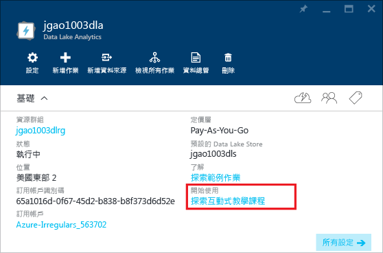

# 使用 Azure 資料湖分析互動式教學課程
Azure 入口網站提供您開始使用 Data Lake Analytics 的互動式教學課程。 本文會示範如何逐步完成分析網站記錄的教學課程。

## 執行網站記錄分析互動式教學課程

1. 在入口網站中，按一下左側功能表中的 [ **Microsoft Azure** ] 以開啟「開始面板」。
2. 按一下連結至您的資料湖分析帳戶的磚。
3. 從 [Essentials] 列按一下 [探索互動式教學課程]。
   
    
4. 如果您看到橘色警告，顯示「範例未設定，按一下...」，請按一下 [複製範例資料]  以將範例資料複製到預設資料湖存放區帳戶。 互動式教學課程需要資料才能執行。
5. 在 [互動式教學課程] 刀鋒視窗中，按一下 [網站記錄分析]。 入口網站會在新的入口網站刀鋒視窗中開啟教學課程。
6. 按一下 [簡介]，然後依照指示進行

## 後續步驟
* [Microsoft Azure Data Lake Analytics 概觀](data-lake-analytics-overview.md)
* [透過 Azure 入口網站開始使用 Data Lake Analytics](data-lake-analytics-get-started-portal.md)
* [使用 Azure 資料湖分析來分析網站記錄](data-lake-analytics-analyze-weblogs.md)

