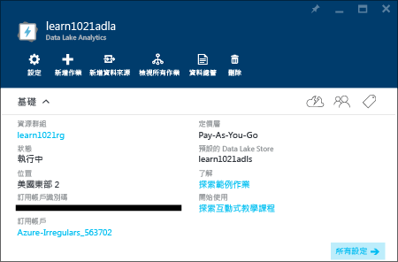

# 使用 Azure 資料湖分析互動式教學課程
Azure 入口網站提供您開始使用 Data Lake Analytics 的互動式教學課程。 本文會示範如何逐步完成分析網站記錄的教學課程。

如需其他教學課程，請參閱：

* [使用 Azure 入口網站開始使用 Data Lake Analytics](data-lake-analytics-get-started-portal.md)
* [使用 Azure PowerShell 開始使用 Data Lake Analytics](data-lake-analytics-get-started-powershell.md)
* [使用 .NET SDK 開始使用資料湖分析](data-lake-analytics-get-started-net-sdk.md)
* [使用適用於 Visual Studio 的資料湖工具開發 U-SQL 指令碼](data-lake-analytics-data-lake-tools-get-started.md) 

**必要條件**

開始進行本教學課程之前，您必須具備下列條件：

* **資料湖分析帳戶**。  請參閱[使用 Azure 入口網站開始使用 Azure Data Lake Analytics](data-lake-analytics-get-started-portal.md)。

## 建立 Data Lake Analytics 帳戶
您必須擁有 Data Lake Analytics 帳戶，才能執行工作。

每個 Data Lake Analytics 帳戶有 [Azure Data Lake Store](../data-lake-store/data-lake-store-overview.md) 帳戶相依性，及預設的 Data Lake Store 帳戶。  在此教學課程中，您將建立具有 Analytics 帳戶的預設 Data Lake Store 帳戶，但您也可以事先建立。

**建立 Data Lake Analytics 帳戶**

1. 登入 [Azure 入口網站](https://portal.azure.com/signin/index/?Microsoft_Azure_Kona=true&Microsoft_Azure_DataLake=true&hubsExtension_ItemHideKey=AzureDataLake_BigStorage%2cAzureKona_BigCompute)。
2. 按一下左上角的 **Microsoft Azure** 以開啟「開始面板」。
3. 按一下 **Marketplace** 磚。  
4. 在 [所有項目] 刀鋒視窗的搜尋方塊中輸入 [Azure Data Lake Analytics]，然後按 **ENTER**。 您應該會在清單中看到 [Azure 資料湖分析]  。
5. 按一下清單中的 [ **Azure 資料湖分析** ]。
6. 按一下刀鋒視窗底部的 [ **建立** ]。
7. 輸入或選取：
   
    
   
   * **名稱**：為分析帳戶命名。
   * **資料湖存放區**：每個資料湖分析帳戶都有相依的資料湖存放區帳戶。 資料湖分析帳戶和相依的資料湖存放區帳戶必須位於同一個 Azure 資料中心。 請依照指示來建立 Data Lake Store 帳戶，或選取現有的帳戶。
   * **訂用帳戶**：選擇用於分析帳戶的 Azure 訂用帳戶。
   * **資源群組**。 選取現有的 Azure 資源群組，或建立一個新的群組。 應用程式通常由許多元件組成，例如 Web 應用程式、資料庫、資料庫伺服器、儲存體及協力廠商服務。 Azure 資源管理員 (ARM) 可讓您將應用程式中的資源做為群組使用，稱為 Azure 資源群組。 您可以透過單一、協調的作業，來部署、更新、監視或刪除應用程式的資源。 您會使用部署的範本，且該範本可以用於不同的環境，例如測試、預備和生產環境。 您可以檢視整個群組的彙總成本，為您的組織釐清計費。 如需詳細資訊，請參閱 [Azure 資源管理員概觀](../azure-resource-manager/resource-group-overview.md)。 
   * **位置**。 為資料湖分析帳戶選取 Azure 資料中心。 
8. 選取 [ **釘選到「開始面板」**]。 這是遵循本教學課程的必要步驟。
9. 按一下 [建立] 。 它會帶領您前往入口網站「開始面板」。 新的圖格會新增至首頁，具有顯示「部署 Azure Data Lake Analytics」的標籤。 建立資料湖分析帳戶需要幾分鐘的時間。 當建立帳戶之後，入口網站就會在新的刀鋒視窗上開啟帳戶。
   
    

## 執行網站記錄分析互動式教學課程
**開啟網站記錄分析互動式教學課程**

1. 在入口網站中，按一下左側功能表中的 [ **Microsoft Azure** ] 以開啟「開始面板」。
2. 按一下連結至您的資料湖分析帳戶的磚。
3. 從 [Essentials] 列按一下 [探索互動式教學課程]。
   
    
4. 如果您看到橘色警告，顯示「範例未設定，按一下...」，請按一下 [複製範例資料]  以將範例資料複製到預設資料湖存放區帳戶。 互動式教學課程需要資料才能執行。
5. 在 [互動式教學課程] 刀鋒視窗中，按一下 [網站記錄分析]。 入口網站會在新的入口網站刀鋒視窗中開啟教學課程。
6. 按一下 [簡介]，然後依照指示進行

## 另請參閱
* [Microsoft Azure Data Lake Analytics 概觀](data-lake-analytics-overview.md)
* [使用 Azure 入口網站開始使用 Data Lake Analytics](data-lake-analytics-get-started-portal.md)
* [使用 Azure PowerShell 開始使用資料湖分析](data-lake-analytics-get-started-powershell.md)
* [使用適用於 Visual Studio 的資料湖工具開發 U-SQL 指令碼](data-lake-analytics-data-lake-tools-get-started.md)
* [使用 Azure 資料湖分析來分析網站記錄](data-lake-analytics-analyze-weblogs.md)

