<properties
   pageTitle="Data Lake Store 中的存取控制概觀 | Microsoft Azure"
   description="了解 Azure Data Lake Store 中的存取控制方式"
   services="data-lake-store"
   documentationCenter=""
   authors="nitinme"
   manager="jhubbard"
   editor="cgronlun"/>

<tags
   ms.service="data-lake-store"
   ms.devlang="na"
   ms.topic="get-started-article"
   ms.tgt_pltfrm="na"
   ms.workload="big-data"
   ms.date="09/06/2016"
   ms.author="nitinme"/>

# Azure Data Lake Store 中的存取控制

Data Lake Store 實作的存取控制模型依序衍生自 HDFS 和 POSIX 存取控制模型。本文摘要說明 Data Lake Store 存取控制模型的基本概念。若要深入了解 HDFS 存取控制模型，請參閱 [HDFS 權限指南](https://hadoop.apache.org/docs/current/hadoop-project-dist/hadoop-hdfs/HdfsPermissionsGuide.html)。

## 檔案和資料夾的存取控制清單

存取控制清單 (ACL) 有兩種類型 - [存取 ACL] 和 [預設 ACL]。

* **存取 ACL** – 這些控制物件的存取權。檔案和資料夾均有存取 ACL。

* **預設 ACL** – 與資料夾相關聯之 ACL 的「範本」，用以判斷再該資料夾下建立的任何子項目的存取 ACL。檔案沒有預設 ACL。

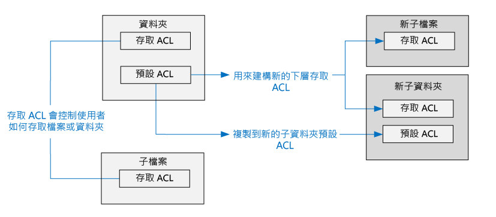

存取 ACL 和預設 ACL 有相同的結構。

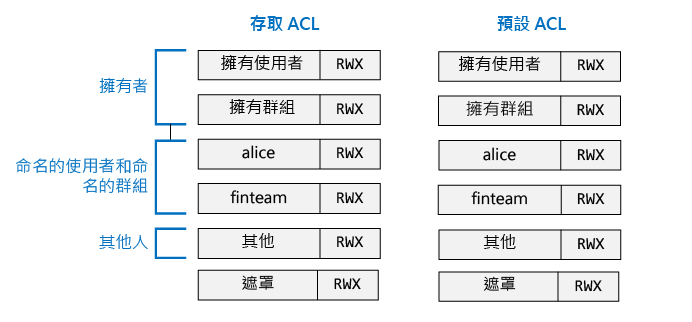

>[AZURE.NOTE] 變更父代的預設 ACL 並不會影響現存子項目的存取 ACL 或預設 ACL。

## 使用者和身分識別

每個檔案和資料夾都有這些身分識別的不同權限︰

* 檔案的擁有使用者
* 擁有群組
* 具名使用者
* 具名群組
* 所有其他使用者

使用者和群組的身分識別是 Azure Active Directory (AAD) 身分識別，因此除非另外註明「使用者」，否則在 Data Lake Store 的內容中可能表示 AAD 使用者或 AAD 安全性群組。

## 權限

檔案系統物件的權限為 [讀取]、[寫入] 和 [執行]，這些權限可以用於下表所示的檔案和資料夾。

| | 檔案 | 資料夾 |
|------------|-------------|----------|
| **讀取 (R)** | 可以讀取檔案的內容 | 需要 [讀取] 和 [執行] 才能列出資料夾內容。|
| **寫入 (W)** | 可寫入或附加至檔案 | 需要 [寫入與執行] 才能在資料夾中建立子項目。 |
| **執行 (X)** | 不表示 Data Lake Store 的內容中的任何項目 | 需要周遊資料夾的子項目。 |

### 權限的簡短形式

**RWX** 用來表示 [讀取 + 寫入 + 執行]。有更壓縮的數字形式存在，[讀取 = 4]、[寫入 = 2] 和 [執行 = 1] 及其總和代表各種權限。以下是一些範例。

| 數值形式 | 簡短形式 | 意義 |
|--------------|------------|------------------------|
| 7 | RWX | 讀取 + 寫入 + 執行 |
| 5 | R-X | 讀取 + 執行 |
| 4 | R-- | 讀取 |
| 0 |--- | 沒有權限 |

### 不會繼承權限

在 Data Lake Store 所使用的 POSIX 樣式模型中，項目的權限會儲存在項目本身。換句話說，無法從父項目繼承項目的權限。

## 權限相關的常見案例

以下是一些常見的案例，用以了解在 Data Lake Store 帳戶上執行某些作業所需的權限。

### 讀取檔案所需的權限

* 對於要讀取的檔案 - 呼叫端需要 [讀取] 權限
* 對於資料夾結構中內含檔案的所有資料夾 - 呼叫端需要 [執行] 權限

### 附加至檔案所需的權限

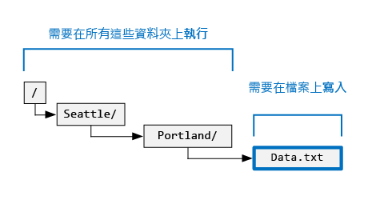

* 對於要附加的檔案 - 呼叫端需要 [寫入] 權限
* 對於內含檔案的所有資料夾 - 呼叫端需要 [執行] 權限

### 刪除檔案所需的權限

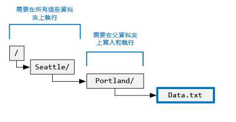

* 對於父資料夾 - 呼叫端需要 [寫入 + 執行] 權限
* 對於檔案路徑中的所有其他資料夾 - 呼叫端需要 [執行] 權限

>[AZURE.NOTE] 只要以上兩個條件成立，刪除檔案時就不需要檔案的寫入權限。

### 列舉資料夾所需的權限

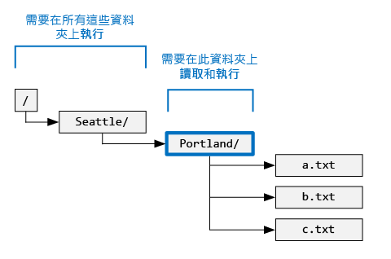

* 對於要列舉的資料夾 - 呼叫端需要 [讀取 + 執行] 權限
* 對於所有上階資料夾 - 呼叫端需要 [執行] 權限

## 在 Azure 入口網站中檢視權限

從 Data Lake Store 帳戶的 [資料總管] 刀鋒視窗，按一下 [存取] 以查看檔案或資料夾的 ACL。在下面的螢幕擷取畫面中，按一下 [存取] 以查看 **mydatastore** 帳戶之下的 **catalog** 資料夾。

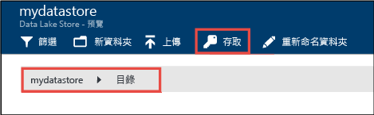

接下來，從 [存取] 刀鋒視窗，按一下 [簡單檢視] 可查看更簡單的檢視。

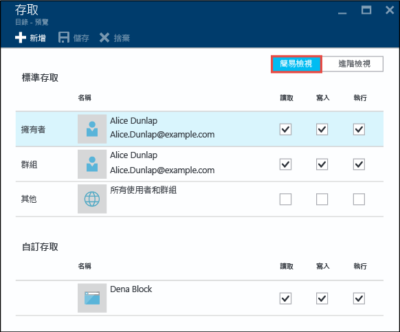

按一下 [進階檢視] 可查看更進階的檢視。

## 超級使用者

超級使用者具有 Data Lake Store 中所有使用者的大多數權限。超級使用者：

* 具有**所有**檔案和資料夾的 RWX 權限
* 可以變更任何檔案或資料夾的權限。
* 可以變更任何檔案或資料夾的擁有使用者或擁有群組。

在 Azure 中，Data Lake Store 帳戶具有數個 Azure 角色︰

* 擁有者
* 參與者
* 讀取者
* 等等

具備 Data Lake Store 帳戶的 [擁有者] 角色的每個人都會自動成為該帳戶的超級使用者。若要深入了解 Azure 角色型存取控制 (RBAC)，請參閱[角色型存取控制](../active-directory/role-based-access-control-configure.md)。

## 擁有使用者

建立項目的使用者會自動成為項目的擁有使用者。擁有使用者可以︰

* 變更所擁有檔案的權限
* 只要擁有使用者也是目標群組的成員，請變更所擁有檔案的擁有群組。

>[AZURE.NOTE] 擁有使用者**無法**變更另一個所擁有檔案的擁有使用者。只有超級使用者可以變更檔案或資料夾的擁有使用者。

## 擁有群組

在 POSIX ACL 中，每個使用者都與「主要群組」相關聯。例如，使用者 "alice" 可能屬於 "finance" 群組。Alice 可能屬於多個群組，但一定有一個群組指定為其主要群組。在 POSIX 中，當 Alice 會建立檔案時，該檔案的擁有群組會設定為她的主要群組，在此案例中為 "finance"。
 
建立新的檔案系統項目時，Data Lake Store 會指派值給擁有群組。

* **案例 1** - 根資料夾 "/"。建立 Data Lake Store 帳戶時，會建立這個資料夾。在此情況下，擁有群組會設定為建立帳戶的使用者。
* **案例 2** (其他所有案例) - 建立新項目時，會從父資料夾複製擁有群組。

可以變更擁有群組的對象︰
* 任何超級使用者
* 擁有使用者，如果擁有使用者也是目標群組的成員。

## 存取檢查演算法

下圖代表 Data Lake Store 帳戶的存取檢查演算法。

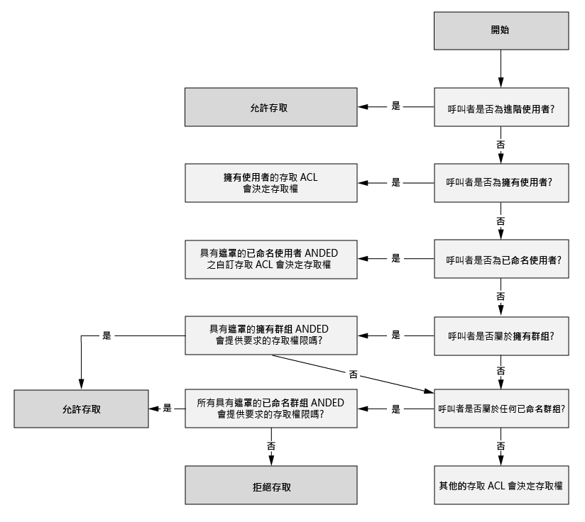

## 遮罩和「有效權限」

**遮罩**是一個 RWX 值，在執行存取檢查演算法時，用來限制**具名使用者**、**擁有群組**和**具名群組**的存取權。以下是遮罩的重要概念。

* 遮罩可建立「有效權限」，也就是它會在存取檢查時修改權限。
* 檔案擁有者和任何超級使用者都可以直接編輯遮罩。
* 遮罩能夠移除權限，以建立有效的權限。遮罩**無法**將權限新增至有效的權限。

讓我們看看一些範例。下面的遮罩已設定為 **RWX**，這表示遮罩不會移除任何權限。請注意，在存取檢查期間，不會改變具名使用者、擁有群組和具名群組的有效權限。

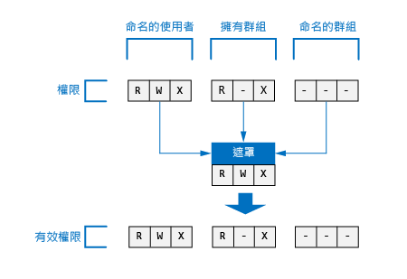

在下列範例中，遮罩已設定為 **R-X**。因此，它會在存取檢查時**關閉下列各項的寫入權限**：**具名使用者**、**擁有群組**和**具名群組**。

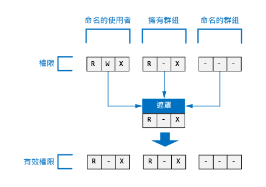

以下是檔案或資料夾的遮罩出現在 Azure 入口網站中的位置，可供參考。

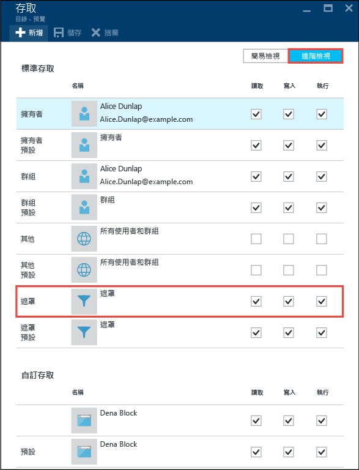

>[AZURE.NOTE] 對於新的 Data Lake Store 帳戶，根資料夾 ("/") 的存取 ACL 和預設 ACL 的遮罩會預設為 RWX。

## 新檔案和資料夾的權限

在現有資料夾之下建立新檔案或資料夾時，父資料夾的預設 ACL 可決定︰

* 子資料夾的預設 ACL 與存取 ACL
* 子檔案的存取 ACL (檔案沒有預設 ACL)

### 子檔案或資料夾的存取 ACL

建立子檔案或資料夾時，父項的預設 ACL 會複製成為子檔案或資料夾的存取 ACL。此外，如果**其他**使用者具有父項的預設 ACL 的 RWX 權限，則會從子項目的存取 ACL 中將它完全移除。

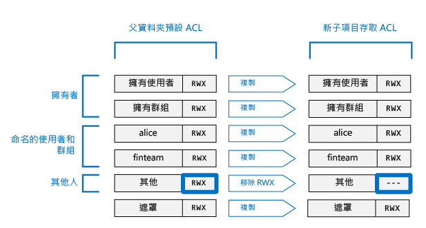

在大部分情況下，您只需要上述資訊，即可了解如何決定子項目的存取 ACL。不過，如果您很熟悉 POSIX 系統，而且想要深入了解如何達成此轉換，請參閱本文後面的[為新檔案和資料夾建立存取 ACL 時的 Umask 角色](#umasks-role-in-creating-the-access-acl-for-new-files-and-folders)一節。
 

### 子資料夾的預設 ACL

在父資料夾下建立子資料夾時，父資料夾的預設 ACL 會依照原狀複製到子資料夾的預設 ACL。

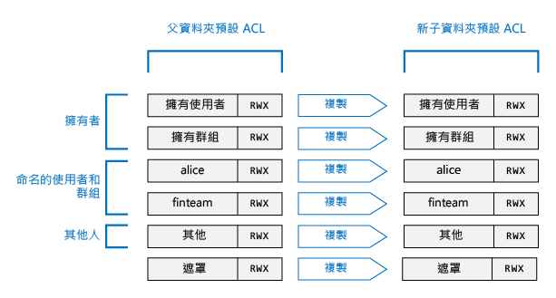

## 可供了解 Data Lake Store 中 ACL 的進階主題

以下幾個進階主題可協助您了解如何決定 Data Lake Store 檔案或資料夾的 ACL。

### 為新檔案和資料夾建立存取 ACL 時的 Umask 角色

在 POSIX 相容系統中，一般概念是 umask 是父資料夾上的一個 9 位元值，用來轉換**擁有使用者**、**擁有群組**和**其他**使用者對於新的子檔案或資料夾之存取 ACL 的權限。Umask 的位元可識別在子項目的存取 ACL 中所要關閉的位元。因此可用來選擇性地防止擁有使用者、擁有群組和其他使用者的權限傳播。
  
在 HDFS 系統中，umask 通常是由系統管理員所控制的全網站組態選項。Data Lake Store 會使用無法變更的**全帳戶 umask**。下表顯示 Data Lake Store 的 umask。

| 使用者群組 | 設定 | 對新的子項目的存取 ACL 的影響 |
|------------ |---------|---------------------------------------|
| 擁有使用者 |--- | 沒有影響 | | 擁有群組 |--- | 沒有影響 | | 其他 | RWX |移除讀取 + 寫入 + 執行 |

下圖顯示此 umask 作用中。實質效果是移除**其他**使用者的 [讀取 + 寫入 + 執行]。由於 umask 未指定**擁有使用者**和**擁有群組**的位元，因此不會轉換這些權限。

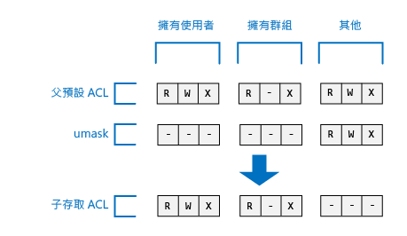

### 黏性位元

黏性位元是 POSIX 檔案系統的更進階功能。在 Data Lake Store 的內容中，不太可能需要黏性位元。

下表顯示黏性位元在 Data Lake Store 中的運作方式。

| 使用者群組 | 檔案 | 資料夾 |
|--------------------|---------|-------------------------|
| 黏性位元 **OFF** | 沒有影響 | 沒有影響 |
| 黏性位元 **ON** | 沒有影響 | 防止任何人 (子項目的**超級使用者**和**擁有使用者**除外) 刪除或重新命名該子項目。 |

黏性位元不會顯示在 Azure 入口網站中。

## Data Lake Store 中的 ACL 常見問題

以下是有關 Data Lake Store 中 ACL 的一些常見問題。

### 我必須啟用 ACL 的支援嗎？

否。Data Lake Store 帳戶一律會啟用透過 ACL 的存取控制。

### 若要以遞迴方式刪除資料夾與其內容，需要哪些權限？

* 父資料夾必須具有 [寫入 + 執行]。
* 要刪除的資料夾及其中的每個資料夾，都需要 [讀取 + 寫入 + 執行]。
>[AZURE.NOTE] 刪除資料夾中的檔案時不需要這些檔案的寫入權限。此外，**決不**會刪除根資料夾 "/"。

### 誰會設定為檔案或資料夾的擁有者？

檔案或資料夾的建立者會成為擁有者。

### 誰會在建立時設定為檔案或資料夾的擁有群組？

這從新檔案或資料夾建立所在父資料夾的擁有群組複製而來。

### 我是檔案的擁有使用者，但沒有我需要的 RWX 權限。該怎麼辦？

擁有使用者只要變更檔案的權限，即可取得本身所需的任何 RWX 權限。

### Data Lake Store 是否支援 ACL 的繼承？

否。

### 遮罩與 umask 之間的差異為何？

| 遮罩 | umask|
|------|------|
| **遮罩**屬性適用於每個檔案和資料夾。 | **umask** 是 Data Lake Store 帳戶的屬性。因此，Data Lake Store 中只有一個 umask。 |
| 檔案的擁有使用者或擁有群組或超級使用者都可以改變檔案或資料夾的遮罩屬性。 | 任何使用者 (甚至是超級使用者) 都不能修改 umask 屬性。這是不能變更的常數值。|
| 在存取檢查演算法的執行階段，遮罩屬性用來判斷使用者是否具有在檔案或資料夾上執行作業的權限。遮罩的角色就是在存取檢查時建立「有效權限」。 | 存取檢查期間完全不會使用 umask。Umask 用來決定資料夾的新子項目的存取 ACL。 |
| 遮罩是一個 3 位元的 RWX 值，在存取檢查時會套用至具名使用者、具名群組及擁有使用者。| Umask 是一個 9 位元值，會套用至新子系的擁有使用者、擁有群組及其他使用者。| 

### 何處可以進一步了解 POSIX 存取控制模型？

* [http://www.vanemery.com/Linux/ACL/POSIX\_ACL\_on\_Linux.html](http://www.vanemery.com/Linux/ACL/POSIX_ACL_on_Linux.html)

* [HDFS 權限指南](http://hadoop.apache.org/docs/current/hadoop-project-dist/hadoop-hdfs/HdfsPermissionsGuide.html)

* [POSIX 常見問題集](http://www.opengroup.org/austin/papers/posix_faq.html)

* [POSIX 1003.1 2008](http://standards.ieee.org/findstds/standard/1003.1-2008.html)

* [POSIX 1003.1e 1997](http://users.suse.com/~agruen/acl/posix/Posix_1003.1e-990310.pdf)

* [Linux 上的 POSIX ACL](http://users.suse.com/~agruen/acl/linux-acls/online/)

* [Linux 上使用存取控制清單的 ACL](http://bencane.com/2012/05/27/acl-using-access-control-lists-on-linux/)

## 另請參閱

* [Azure 資料湖儲存區概觀](data-lake-store-overview.md)

* [開始使用 Azure 資料湖分析](../data-lake-analytics/data-lake-analytics-get-started-portal.md)

<!---HONumber=AcomDC_0914_2016-->