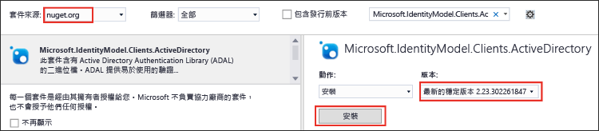

<properties
   pageTitle="使用資料湖存放區 .NET SDK 來開發應用程式 | Azure"
   description="使用 Azure 資料湖存放區 .NET SDK 來開發應用程式"
   services="data-lake-store"
   documentationCenter=""
   authors="nitinme"
   manager="paulettm"
   editor="cgronlun"/>

<tags
   ms.service="data-lake-store"
   ms.devlang="na"
   ms.topic="get-started-article"
   ms.tgt_pltfrm="na"
   ms.workload="big-data"
   ms.date="07/18/2016"
   ms.author="nitinme"/>

# 使用 .NET SDK 開始使用 Azure 資料湖存放區

> [AZURE.SELECTOR]
- [入口網站](data-lake-store-get-started-portal.md)
- [PowerShell](data-lake-store-get-started-powershell.md)
- [.NET SDK](data-lake-store-get-started-net-sdk.md)
- [Java SDK](data-lake-store-get-started-java-sdk.md)
- [REST API](data-lake-store-get-started-rest-api.md)
- [Azure CLI](data-lake-store-get-started-cli.md)
- [Node.js](data-lake-store-manage-use-nodejs.md)

了解如何使用 Azure 資料湖存放區 .NET SDK 以建立 Azure 資料湖帳戶並執行基本作業，例如建立資料夾、上傳和下載資料檔案、刪除您的帳戶等等。如需有關資料湖的詳細資訊，請參閱 [Azure 資料湖存放區](data-lake-store-overview.md)。

## 必要條件

* Visual Studio 2013 或 2015。以下指示使用 Visual Studio 2015。
* **Azure 訂用帳戶**。請參閱[取得 Azure 免費試用](https://azure.microsoft.com/pricing/free-trial/)。
* **啟用您的 Azure 訂用帳戶**以使用資料湖存放區公開預覽版。請參閱[指示](data-lake-store-get-started-portal.md#signup)。
* **建立 Azure Active Directory 應用程式**。有兩種方式可使用 Azure Active Direcotry 來進行驗證 - **互動式**和**非互動式**。根據您要進行驗證的方式，會有不同的必要條件。
	* **針對互動式驗證** (本文所使用的方式) - 在 Azure Active Directory 中，您必須建立**原生用戶端應用程式**。一旦您建立應用程式，請擷取與下列應用程式相關的值。
		- 取得應用程式的**用戶端識別碼**和**重新導向 URI**
		- 設定委派權限

	* **針對非互動式驗證** - 在 Azure Active Directory 中，您必須建立 **Web 應用程式**。一旦您建立應用程式，請擷取與下列應用程式相關的值。
		- 取得應用程式的**用戶端識別碼**、**用戶端密碼**和**重新導向 URI**
		- 設定委派權限
		- 將 Azure Active Directory 應用程式指派給角色。角色可以在您要授與權限給 Azure Active Directory 應用程式的範圍層級。例如，您可以在訂用帳戶層級或資源群組的層級指派應用程式。

	如需有關如何擷取這些值、設定權限和指派角色的指示，請參閱[使用入口網站建立 Active Directory 應用程式和服務主體](../resource-group-create-service-principal-portal.md)。

## 建立 .NET 應用程式

1. 開啟 Visual Studio，建立主控台應用程式。

2. 從 [檔案] 功能表中，按一下 [新增]，再按 [專案]。

3. 在 [新增專案] 中，輸入或選取下列值：

	| 屬性 | 值 |
	|----------|-----------------------------|
	| 類別 | 範本/Visual C#/Windows |
	| 範本 | 主控台應用程式 |
	| 名稱 | CreateADLApplication |

4. 按一下 [確定] 以建立專案。

5. 將 Nuget 封裝新增至您的專案。

	1. 在方案總管中以滑鼠右鍵按一下專案名稱，然後按一下 [管理 NuGet 封裝]。
	2. 在 [Nuget 封裝管理員] 索引標籤中，確定 [封裝來源] 設為 [nuget.org]，且已選取 [包含發行前版本] 核取方塊。
	3. 搜尋並安裝下列資料湖存放區封裝：

		* `Microsoft.Azure.Management.DataLake.Store`
		* `Microsoft.Azure.Management.DataLake.StoreUploader`

		

	4. 亦請安裝 Azure Active Directory 驗證的 `Microsoft.IdentityModel.Clients.ActiveDirectory` 封裝。確定您會「清除」[包括發行前版本] 核取方塊，如此一來，您就能安裝此封裝的穩定版本。

		

	5. 關閉 [Nuget 封裝管理員]。

7. 開啟 **Program.cs**，刪除現有的程式碼，然後納入下列陳述式以加入命名空間的參考。

		using System;
        using System.IO;
        using System.Security;
        using System.Text;
        using System.Collections.Generic;
        using System.Linq;

        using Microsoft.Azure.Management.DataLake.Store;
        using Microsoft.Azure.Management.DataLake.Store.Models;
        using Microsoft.Azure.Management.DataLake.StoreUploader;
        using Microsoft.IdentityModel.Clients.ActiveDirectory;
        using Microsoft.Rest;

8. 如下所示宣告變數，並提供 Data Lake Store 名稱和資源群組名稱的值。您提供的 Data Lake Store 名稱將由應用程式建立。您在此處提供的資源群組應已存在。此外，請確定您在此處提供的本機路徑和檔案名稱必須存在於電腦。將下列程式碼片段加在命名空間宣告之後。

		namespace SdkSample
        {
            class Program
            {
                private static DataLakeStoreAccountManagementClient _adlsClient;
                private static DataLakeStoreFileSystemManagementClient _adlsFileSystemClient;

                private static string _adlsAccountName;
                private static string _resourceGroupName;
                private static string _location;

                private static void Main(string[] args)
                {
                    _adlsAccountName = "<DATA-LAKE-STORE-NAME>"; // TODO: Replace this value with the name for a NEW Store account.
                    _resourceGroupName = "<RESOURCE-GROUP-NAME>"; // TODO: Replace this value. This resource group should already exist.
                    _location = "East US 2";

                    string localFolderPath = @"C:\local_path"; // TODO: Make sure this exists and can be overwritten.
                    string localFilePath = localFolderPath + "file.txt"; // TODO: Make sure this exists and can be overwritten.
                    string remoteFolderPath = "/data_lake_path/";
                    string remoteFilePath = remoteFolderPath + "file.txt";
				}
			}
		}

在本文的其餘章節中，您可以了解如何使用可用的 .NET 方法來執行一些作業，例如驗證使用者、建立 Data Lake Store 帳戶、上載檔案等。如果您要尋找有關如何使用 Data Lake Store 的完整範例，請參閱本文最後面的[附錄](#appendix-sample-code)。

## 驗證使用者

使用 Azure Active Directory 進行驗證的方法有兩種：

* **互動式**，使用者透過應用程式登入。這在下列程式碼片段的方法 `AuthenticateUser` 中實作。

* **非互動式**，應用程式自行提供認證。這在下列程式碼片段的方法 `AuthenticateAppliaction` 中實作。

### 互動式驗證

下列程式碼片段顯示您可用於互動式登入體驗的 `AuthenticateUser` 方法。

 	// Authenticate the user with AAD through an interactive popup.
    // You need to have an application registered with AAD in order to authenticate.
    //   For more information and instructions on how to register your application with AAD, see:
    //   https://azure.microsoft.com/zh-TW/documentation/articles/resource-group-create-service-principal-portal/
	public static TokenCredentials AuthenticateUser(string tenantId, string resource, string appClientId, Uri appRedirectUri, string userId = "")
	{
	    var authContext = new AuthenticationContext("https://login.microsoftonline.com/" + tenantId);
	
	    var tokenAuthResult = authContext.AcquireToken(resource, appClientId, appRedirectUri,
	        PromptBehavior.Auto, UserIdentifier.AnyUser);
	
	    return new TokenCredentials(tokenAuthResult.AccessToken);
	}

### 非互動式驗證

下列程式碼片段顯示您可用於非互動式登入體驗的 `AuthenticateApplication` 方法。

	// Authenticate the application with AAD through the application's secret key.
	// You need to have an application registered with AAD in order to authenticate.
	//   For more information and instructions on how to register your application with AAD, see:
	//   https://azure.microsoft.com/zh-TW/documentation/articles/resource-group-create-service-principal-portal/
	public static TokenCredentials AuthenticateApplication(string tenantId, string resource, string appClientId, Uri appRedirectUri, SecureString clientSecret)
	{
	    var authContext = new AuthenticationContext("https://login.microsoftonline.com/" + tenantId);
	    var credential = new ClientCredential(appClientId, clientSecret);
	
	    var tokenAuthResult = authContext.AcquireToken(resource, credential);
	
	    return new TokenCredentials(tokenAuthResult.AccessToken);
	}
	
## 建立 Data Lake Store 帳戶

下列程式碼片段顯示的 `CreateAccount` 方法可用於建立 Data Lake Store 帳戶。

	// Create Data Lake Store account
    public static void CreateAccount()
    {
        var adlsParameters = new DataLakeStoreAccount(location: _location);
        _adlsClient.Account.Create(_resourceGroupName, _adlsAccountName, adlsParameters);
    } 

## 列出訂用帳戶內的所有 Data Lake Store 帳戶

下列程式碼片段顯示的 `ListAdlStoreAccounts` 方法可用於列出指定的 Azure 訂用帳戶中的所有 Data Lake Store 帳戶。

	// List all ADLS accounts within the subscription
	public static List<DataLakeStoreAccount> ListAdlStoreAccounts()
	{
	    var response = _adlsClient.Account.List(_adlsAccountName);
	    var accounts = new List<DataLakeStoreAccount>(response);
	
	    while (response.NextPageLink != null)
	    {
	        response = _adlsClient.Account.ListNext(response.NextPageLink);
	        accounts.AddRange(response);
	    }
	
	    return accounts;
	}

## 建立目錄

下列程式碼片段顯示的 `CreateDirectory` 方法可用於在 Data Lake Store 帳戶中建立目錄。

	// Create a directory
    public static void CreateDirectory(string path)
    {
        _adlsFileSystemClient.FileSystem.Mkdirs(_adlsAccountName, path);
    }

## 將檔案上傳到 Data Lake Store

下列程式碼片段顯示的 `UploadFile` 方法可用於將檔案上傳到 Data Lake Store 帳戶。

	// Upload a file
    public static void UploadFile(string srcFilePath, string destFilePath, bool force = true)
    {
        var parameters = new UploadParameters(srcFilePath, destFilePath, _adlsAccountName, isOverwrite: force);
        var frontend = new DataLakeStoreFrontEndAdapter(_adlsAccountName, _adlsFileSystemClient);
        var uploader = new DataLakeStoreUploader(parameters, frontend);
        uploader.Execute();
    }

## 取得檔案或目錄資訊

下列程式碼片段顯示的 `GetItemInfo` 方法可用於擷取 Data Lake Store 中可用檔案或目錄的相關資訊。

	// Get file or directory info
    public static FileStatusProperties GetItemInfo(string path)
    {
        return _adlsFileSystemClient.FileSystem.GetFileStatus(_adlsAccountName, path).FileStatus;
    }

## 列出檔案或目錄

下列程式碼片段顯示的 `ListItem` 方法可用於列出 Data Lake Store 帳戶中的檔案和目錄。
	
	// List files and directories
    public static List<FileStatusProperties> ListItems(string directoryPath)
    {
        return _adlsFileSystemClient.FileSystem.ListFileStatus(_adlsAccountName, directoryPath).FileStatuses.FileStatus.ToList();
    }

## 串連檔案

下列程式碼片段顯示的 `ConcatenateFiles` 方法可用於串連檔案。

	// Concatenate files
    public static void ConcatenateFiles(string[] srcFilePaths, string destFilePath)
    {
        _adlsFileSystemClient.FileSystem.Concat(_adlsAccountName, destFilePath, srcFilePaths);
    }

## 附加到檔案

下列程式碼片段顯示的 `AppendToFile` 方法可用於將資料附加到 Data Lake Store 帳戶中已儲存的檔案。

	// Append to file
    public static void AppendToFile(string path, string content)
    {
        var stream = new MemoryStream(Encoding.UTF8.GetBytes(content));

        _adlsFileSystemClient.FileSystem.Append(_adlsAccountName, path, stream);
    }

## 下載檔案

下列程式碼片段顯示的 `DownloadFile` 方法可用於從 Data Lake Store 帳戶下載檔案。

	// Download file
    public static void DownloadFile(string srcPath, string destPath)
    {
        var stream = _adlsFileSystemClient.FileSystem.Open(_adlsAccountName, srcPath);
        var fileStream = new FileStream(destPath, FileMode.Create);

        stream.CopyTo(fileStream);
        fileStream.Close();
        stream.Close();
    }

## 刪除 Data Lake Store 帳戶

下列程式碼片段顯示的 `DeleteAccount` 方法可用於刪除 Data Lake Store 帳戶。

	// Delete account
    public static void DeleteAccount()
    {
        _adlsClient.Account.Delete(_resourceGroupName, _adlsAccountName);
    }

## 附錄：範例程式碼

下列程式碼片段是完整的程式碼範例，您可以將它複製並貼到您的應用程式中，以查看 Data Lake Store 上的端對端作業。執行此程式碼片段之前，請務必提供必要的值，例如 Data Lake Store 名稱、資源群組名稱等。您也必須提供 Azure Active Direcctory 驗證所需的值，例如 **<APPLICATION-CLIENT-ID>**、**<APPLICATION-REPLY-URI>** 和 **<SUBSCRIPTION-ID>**。

雖然下面的程式碼片段提供兩種方法 (互動性和非互動式)，但非互動式程式碼區塊已標成註解。互動性方法會要求您提供 AAD 應用程式用戶端識別碼和重新導向 URI。必要條件中的連結提供如何加以取得的指示。

>[AZURE.NOTE] 如果您想要修改此程式碼片段並使用非互動式方法 (`AuthenticateApplication`)，除了提供用戶端識別碼和用戶端回覆 URI，也必須提供用戶端驗證金鑰作為方法輸入。[使用入口網站建立 Active Directory 應用程式和服務主體](../resource-group-create-service-principal-portal.md)一文也會說明如何產生及擷取用戶端驗證金鑰。
	
最後，請確定您在此處提供的本機路徑和檔案名稱必須存在於電腦。如果您正在尋找一些可上傳的範例資料，您可以從 [Azure 資料湖 Git 儲存機制](https://github.com/MicrosoftBigData/usql/tree/master/Examples/Samples/Data/AmbulanceData)取得 **Ambulance Data** 資料夾。

    using System;
    using System.IO;
    using System.Security;
    using System.Text;
    using System.Collections.Generic;
    using System.Linq;

    using Microsoft.Azure.Management.DataLake.Store;
    using Microsoft.Azure.Management.DataLake.Store.Models;
    using Microsoft.Azure.Management.DataLake.StoreUploader;
    using Microsoft.IdentityModel.Clients.ActiveDirectory;
    using Microsoft.Rest;

    namespace SdkSample
    {
        class Program
        {
            private static DataLakeStoreAccountManagementClient _adlsClient;
            private static DataLakeStoreFileSystemManagementClient _adlsFileSystemClient;

            private static string _adlsAccountName;
            private static string _resourceGroupName;
            private static string _location;

            private static void Main(string[] args)
            {
                _adlsAccountName = "<DATA-LAKE-STORE-NAME>"; // TODO: Replace this value with the name for a NEW Store account.
                _resourceGroupName = "<RESOURCE-GROUP-NAME>"; // TODO: Replace this value. This resource group should already exist.
                _location = "East US 2";

                string localFolderPath = @"C:\local_path"; // TODO: Make sure this exists and can be overwritten.
                string localFilePath = localFolderPath + "file.txt"; // TODO: Make sure this exists and can be overwritten.
                string remoteFolderPath = "/data_lake_path/";
                string remoteFilePath = remoteFolderPath + "file.txt";

                // Authenticate the user
                var tokenCreds = AuthenticateUser("common", "https://management.core.windows.net/",
                    "<APPLICATION-CLIENT-ID>", new Uri("<APPLICATION-REPLY-URI>")); // TODO: Replace bracketed values.

                SetupClients(tokenCreds, "<SUBSCRIPTION-ID>"); // TODO: Replace bracketed value.

                // Run sample scenarios
                WaitForNewline("Authenticated.", "Creating NEW account.");
                CreateAccount();
                WaitForNewline("Account created.", "Creating a directory.");

                // Create a directory in the Data Lake Store
                CreateDirectory(remoteFolderPath);
                WaitForNewline("Directory created.", "Showing directory info.");

                // Get info about the directory in the Data Lake Store
                var itemInfo = GetItemInfo(remoteFolderPath);
                Console.WriteLine("Type: " + itemInfo.Type);
                Console.WriteLine("Last modified (UTC): " +
                                  new DateTime(1970, 1, 1, 0, 0, 0, 0, DateTimeKind.Utc).AddMilliseconds(
                                      itemInfo.ModificationTime.Value));
                WaitForNewline("Directory info shown.", "Uploading a file.");

                // Upload a file to the Data Lake Store
                UploadFile(localFilePath, remoteFilePath);
                WaitForNewline("File uploaded.", "Listing files and directories.");

                // List the files in the Data Lake Store
                var itemList = ListItems(remoteFolderPath);
                var fileMenuItems = itemList.Select(a => String.Format("{0,15} {1}", a.Type, a.PathSuffix));
                Console.WriteLine(String.Join("\r\n", fileMenuItems));
                WaitForNewline("Files and directories listed.", "Appending content to a file.");

                // Append to a file in the Data Lake Store
                AppendToFile(remoteFilePath, "123");
                WaitForNewline("Content appended.", "Downloading a file.");

                // Download a file from the Data Lake Store
                DownloadFile(remoteFilePath, localFilePath);
                WaitForNewline("File downloaded.", "Deleting account.");

                // Delete account
                DeleteAccount();
                WaitForNewline("Account deleted. You can now exit.");
            }

            // Helper function to show status and wait for user input
            public static void WaitForNewline(string reason, string nextAction = "")
            {
                if (!String.IsNullOrWhiteSpace(nextAction))
                {
                    Console.WriteLine(reason + "\r\nPress ENTER to continue...");
                    Console.ReadLine();
                    Console.WriteLine(nextAction);
                }
                else
                {
                    Console.WriteLine(reason + "\r\nPress ENTER to continue...");
                    Console.ReadLine();
                }
            }

            // Authenticate the user with AAD through an interactive popup.
            // You need to have an application registered with AAD in order to authenticate.
            //   For more information and instructions on how to register your application with AAD, see:
            //   https://azure.microsoft.com/zh-TW/documentation/articles/resource-group-create-service-principal-portal/
            public static TokenCredentials AuthenticateUser(string tenantId, string resource, string appClientId, Uri appRedirectUri, string userId = "")
            {
                var authContext = new AuthenticationContext("https://login.microsoftonline.com/" + tenantId);

                var tokenAuthResult = authContext.AcquireToken(resource, appClientId, appRedirectUri,
                    PromptBehavior.Auto, UserIdentifier.AnyUser);

                return new TokenCredentials(tokenAuthResult.AccessToken);
            }
			
			/*
            // Authenticate the application with AAD through the application's secret key.
            // You need to have an application registered with AAD in order to authenticate.
            //   For more information and instructions on how to register your application with AAD, see:
            //   https://azure.microsoft.com/zh-TW/documentation/articles/resource-group-create-service-principal-portal/
            public static TokenCredentials AuthenticateApplication(string tenantId, string resource, string appClientId, Uri appRedirectUri, SecureString clientSecret)
            {
                var authContext = new AuthenticationContext("https://login.microsoftonline.com/" + tenantId);
                var credential = new ClientCredential(appClientId, clientSecret);

                var tokenAuthResult = authContext.AcquireToken(resource, credential);

                return new TokenCredentials(tokenAuthResult.AccessToken);
            }
			*/

            //Set up clients
            public static void SetupClients(TokenCredentials tokenCreds, string subscriptionId)
            {
                _adlsClient = new DataLakeStoreAccountManagementClient(tokenCreds);
                _adlsClient.SubscriptionId = subscriptionId;

                _adlsFileSystemClient = new DataLakeStoreFileSystemManagementClient(tokenCreds);
            }

            // Create account
            public static void CreateAccount()
            {
                // Create ADLS account
                var adlsParameters = new DataLakeStoreAccount(location: _location);
                _adlsClient.Account.Create(_resourceGroupName, _adlsAccountName, adlsParameters);
            }

            // Delete account
            public static void DeleteAccount()
            {
                _adlsClient.Account.Delete(_resourceGroupName, _adlsAccountName);
            }

            // List all ADLS accounts within the subscription
            public static List<DataLakeStoreAccount> ListAdlStoreAccounts()
            {
                var response = _adlsClient.Account.List(_adlsAccountName);
                var accounts = new List<DataLakeStoreAccount>(response);

                while (response.NextPageLink != null)
                {
                    response = _adlsClient.Account.ListNext(response.NextPageLink);
                    accounts.AddRange(response);
                }

                return accounts;
            }

            // Upload a file
            public static void UploadFile(string srcFilePath, string destFilePath, bool force = true)
            {
                var parameters = new UploadParameters(srcFilePath, destFilePath, _adlsAccountName, isOverwrite: force);
                var frontend = new DataLakeStoreFrontEndAdapter(_adlsAccountName, _adlsFileSystemClient);
                var uploader = new DataLakeStoreUploader(parameters, frontend);
                uploader.Execute();
            }

            // Concatenate files
            public static void ConcatenateFiles(string[] srcFilePaths, string destFilePath)
            {
                _adlsFileSystemClient.FileSystem.Concat(_adlsAccountName, destFilePath, srcFilePaths);
            }

            // Get file or directory info
            public static FileStatusProperties GetItemInfo(string path)
            {
                return _adlsFileSystemClient.FileSystem.GetFileStatus(_adlsAccountName, path).FileStatus;
            }

            // List files and directories
            public static List<FileStatusProperties> ListItems(string directoryPath)
            {
                return _adlsFileSystemClient.FileSystem.ListFileStatus(_adlsAccountName, directoryPath).FileStatuses.FileStatus.ToList();
            }

            // Download file
            public static void DownloadFile(string srcPath, string destPath)
            {
                var stream = _adlsFileSystemClient.FileSystem.Open(_adlsAccountName, srcPath);
                var fileStream = new FileStream(destPath, FileMode.Create);

                stream.CopyTo(fileStream);
                fileStream.Close();
                stream.Close();
            }

            // Append to file
            public static void AppendToFile(string path, string content)
            {
                var stream = new MemoryStream(Encoding.UTF8.GetBytes(content));

                _adlsFileSystemClient.FileSystem.Append(_adlsAccountName, path, stream);
            }

            // Create a directory
            public static void CreateDirectory(string path)
            {
                _adlsFileSystemClient.FileSystem.Mkdirs(_adlsAccountName, path);
            }
        }
    }

## 後續步驟

- [保護資料湖存放區中的資料](data-lake-store-secure-data.md)
- [搭配資料湖存放區使用 Azure 資料湖分析](../data-lake-analytics/data-lake-analytics-get-started-portal.md)
- [搭配資料湖存放區使用 Azure HDInsight](data-lake-store-hdinsight-hadoop-use-portal.md)

<!---HONumber=AcomDC_0720_2016-->