# 使用 Azure 入口網站開始使用 Azure 資料湖分析
> [!div class="op_single_selector"]
> * [入口網站](data-lake-store-get-started-portal.md)
> * [PowerShell](data-lake-store-get-started-powershell.md)
> * [.NET SDK](data-lake-store-get-started-net-sdk.md)
> * [Java SDK](data-lake-store-get-started-java-sdk.md)
> * [REST API](data-lake-store-get-started-rest-api.md)
> * [Azure CLI](data-lake-store-get-started-cli.md)
> * [Node.js](data-lake-store-manage-use-nodejs.md)
> * [Python](data-lake-store-get-started-python.md)
>
> 

了解如何使用 Azure 入口網站建立 Azure 資料湖存放區帳戶並執行基本作業，例如建立資料夾、上傳和下載資料檔案、刪除您的帳戶等等。如需有關 Data Lake Store 的詳細資訊，請參閱 [Azure Data Lake Store 概觀](data-lake-store-overview.md)。

## 必要條件
開始進行本教學課程之前，您必須具備下列條件：

* **Azure 訂用帳戶**。 請參閱 [取得 Azure 免費試用](https://azure.microsoft.com/pricing/free-trial/)。

## 使用影片學得更快？
請觀看下列影片以開始使用 Data Lake Store。

* [建立 Data Lake Store 帳戶](https://mix.office.com/watch/1k1cycy4l4gen)
* [使用資料總管來管理 Azure Data Lake Store 中的資料](https://mix.office.com/watch/icletrxrh6pc)

## 建立 Azure 資料湖存放區帳戶
1. 登入新的 [Azure 入口網站](https://portal.azure.com)。
2. 按一下 [新增]，然後依序按一下 [資料 + 儲存體] 和 [Azure Data Lake Store]。 讀取 [Azure Data Lake Store] 刀鋒視窗中的資訊，然後按一下刀鋒視窗左上角的 [建立]。
3. 在 [新增資料湖存放區]  刀鋒視窗中提供值，如以下擷取畫面所示：
   
    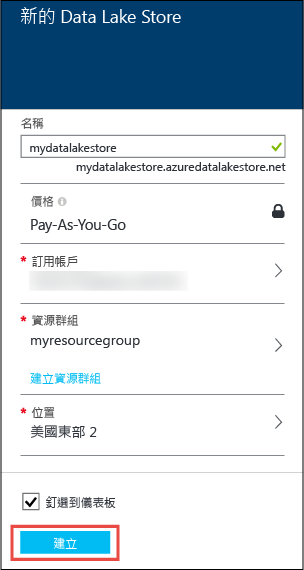
   
   * **名稱**。 輸入 Data Lake Store 帳戶的唯一名稱。
   * **訂用帳戶**。 選取您想要建立新 Data Lake Store 帳戶所在的訂用帳戶。
   * **資源群組**。 選取現有的資源群組，或選取 [建立新的] 選項來建立一個。 資源群組是保留應用程式相關資源的容器。 如需詳細資訊，請參閱 [Azure 中的資源群組](../azure-resource-manager/resource-group-overview.md#resource-groups)。
   * **位置**：選取您要建立資料湖存放區帳戶的位置。
   * **加密設定**。 您可以選擇是否要加密 Data Lake Store 帳戶。 如果您選擇要加密，您還可以指定如何管理您要用來加密帳戶資料的主要加密金鑰。
     
     * (選擇性) 從下拉式清單選取 [不啟用加密] 以選擇不要加密。
     * (預設值) 如果您想要讓 Azure Data Lake Store 管理加密金鑰，請選取 [使用由 Azure Data Lake 管理的金鑰]。
       
         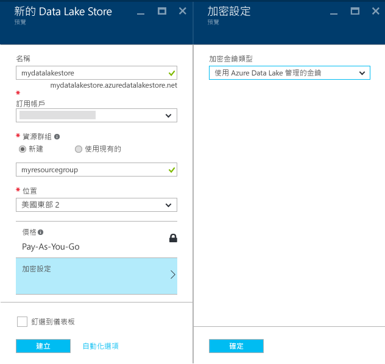
     * (選擇性) 如果您想要使用 Azure 金鑰保存庫中的自有金鑰，請選取 [從 Azure 金鑰保存庫選擇金鑰]。 使用此選項時，您還可以建立金鑰保存庫帳戶和金鑰 (如果您還沒有這些項目)。
       
         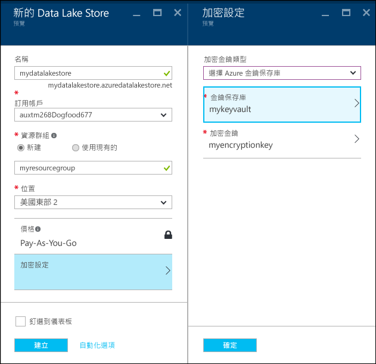
       
       按一下 [加密設定] 刀鋒視窗中的 [確定]。
       
       > [!NOTE]
       > 如果您使用 Azure 金鑰保存庫中的金鑰為 Data Lake Store 帳戶設定加密，您必須為 Azure Data Lake Store 帳戶指派用來存取 Azure 金鑰保存庫的權限。 如需其操作方式的指示，請參閱[指派 Azure 金鑰保存庫的權限](#assign-permissions-to-the-azure-key-vault)
       > 
       > 
4. 按一下 [建立] 。 如果您選擇將帳戶釘選到儀表板，您會回到儀表板，並且可以看到 Data Lake Store 帳戶的佈建進度。 一旦佈建資料湖存放區帳戶，帳戶刀鋒視窗就會出現。

## 指派 Azure 金鑰保存庫的權限
如果您使用 Azure 金鑰保存庫中的金鑰對 Data Lake Store 帳戶設定加密，您必須設定 Data Lake Store 帳戶和 Azure 金鑰保存庫帳戶之間的存取權。 請執行下列步驟來進行此作業。

1. 如果您使用 Azure 金鑰保存庫中的金鑰，Data Lake Store 帳戶的刀鋒視窗上方會顯示警告。 按一下警告即可開啟 [設定金鑰保存庫權限] 刀鋒視窗。
   
    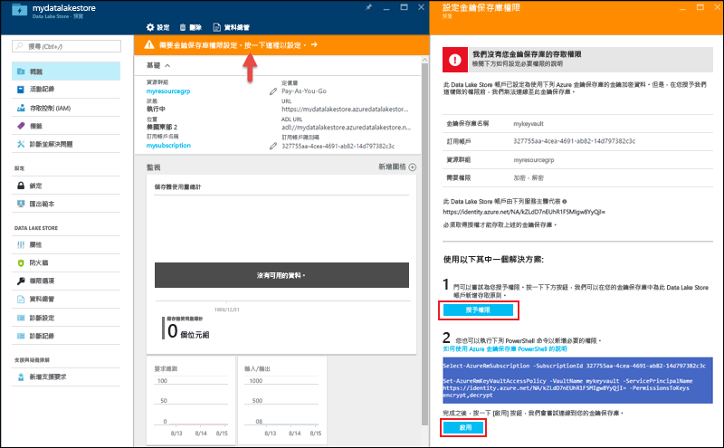
2. 刀鋒視窗中會顯示兩個用來設定存取權的選項。
   
   * 在第一個選項中，按一下 [授與權限] 以設定存取權。 只有當建立 Data Lake Store 帳戶的使用者也是 Azure 金鑰保存庫的系統管理員時，才會啟用第一個選項。
   * 另一個選項是執行刀鋒視窗上顯示的 PowerShell Cmdlet。 您必須是 Azure 金鑰保存庫的擁有者，或擁有對 Azure 金鑰保存庫授與權限的能力。 執行此 Cmdlet 之後，請返回刀鋒視窗，然後按一下 [啟用] 以設定存取權。

## 在 Azure 資料湖存放區帳戶中建立資料夾
您可以在您的 Azure 資料湖存放區帳戶下建立資料夾，用於管理與存放資料。

1. 開啟您剛建立的資料湖存放區帳戶。 從左窗格按一下 [瀏覽]，按一下 [Data Lake Store]，然後從 [Data Lake Store] 刀鋒視窗中，按一下您要在其下建立資料夾的帳戶名稱。 如果您將帳戶釘選到開始面板，請按一下該帳戶磚。
2. 在您的 [資料湖儲存區帳戶] 刀鋒視窗中，按一下 [資料總管] 。
   
    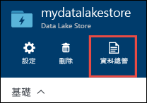
3. 在您的 [Data Lake Store] 刀鋒視窗中，按一下 [新增資料夾]，輸入新資料夾的名稱，然後按一下 [確定]。
   
    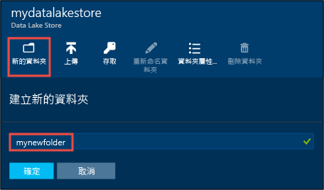
   
    新建立的資料夾將會列在 [資料總管]  刀鋒視窗中。 您可以建立任何層級的巢狀資料夾。
   
    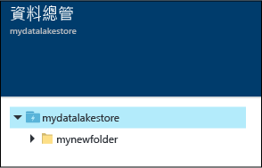

## 將資料上傳至 Azure 資料湖存放區帳戶
您可以直接在根層級將資料上傳至 Azure 資料湖存放區帳戶，或上傳至您在帳戶內建立的資料夾。 在下面的螢幕擷取畫面，遵循步驟從 [資料總管]  刀鋒視窗將檔案上傳至子資料夾。 在這個螢幕擷取畫面中，檔案會上傳到階層連結所示的子資料夾 (以紅色方塊標示)。

如果您正在尋找一些可上傳的範例資料，您可以從 **Azure 資料湖 Git 儲存機制** 取得 [Ambulance Data](https://github.com/MicrosoftBigData/usql/tree/master/Examples/Samples/Data/AmbulanceData)資料夾。

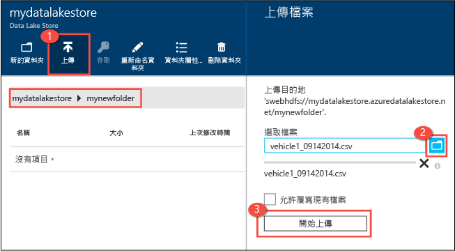

## 儲存資料的屬性和可用的動作
按一下新加入的檔案以開啟 [屬性]  刀鋒視窗。 此刀鋒視窗提供檔案相關聯的屬性，以及您可以對檔案執行的動作。 您也可以在 Azure 資料湖存放區帳戶中複製檔案的完整路徑，如以下的螢幕擷取畫面中紅色方塊的反白顯示。

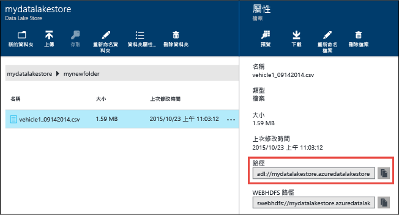

* 按一下 [預覽]  可直接從瀏覽器查看檔案的預覽。 您也可以指定預覽的格式。 按一下 [預覽]，按一下 [檔案預覽] 刀鋒視窗中的 [格式]，然後在 [檔案預覽格式] 刀鋒視窗中指定要顯示的資料列數目、使用的編碼、要使用的分隔符號等等選項。
  
  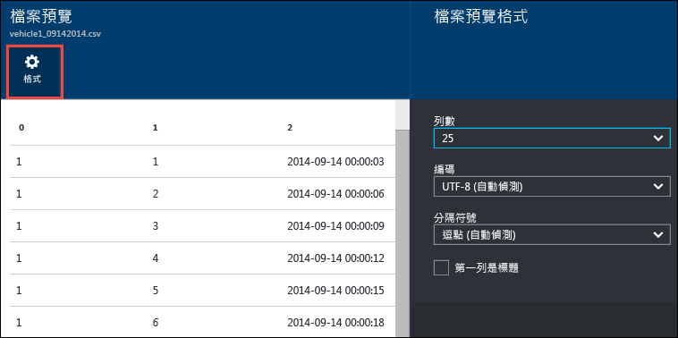
* 按一下 [下載]  將檔案下載到您的電腦。
* 按一下 [重新命名檔案]  來重新命名檔案。
* 按一下 [刪除檔案]  來刪除檔案。

## 保護您的資料
您可以在您的 Azure 資料湖存放區帳戶中使用 Azure Active Directory 和存取控制 (ACL) 保護儲存的資料。 如需如何執行此工作的指示，請參閱 [在 Azure 資料湖存放區中保護資料](data-lake-store-secure-data.md)。

## 刪除 Azure 資料湖存放區帳戶
若要刪除 Azure 資料湖存放區帳戶，請從 [資料湖存放區] 刀鋒視窗按一下 [刪除] 。 為了確認此動作，將提示您輸入您要刪除的帳戶名稱。 輸入帳戶的名稱，然後按一下 [刪除] 。

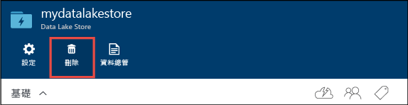

## 後續步驟
* [保護 Data Lake Store 中的資料](data-lake-store-secure-data.md)
* [搭配 Data Lake Store 使用 Azure Data Lake Analytics](../data-lake-analytics/data-lake-analytics-get-started-portal.md)
* [搭配資料湖存放區使用 Azure HDInsight](data-lake-store-hdinsight-hadoop-use-portal.md)
* [存取 Data Lake Store 的診斷記錄](data-lake-store-diagnostic-logs.md)

<!--HONumber=Jan17_HO4-->

