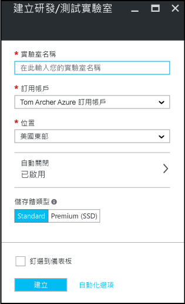

<properties
	pageTitle="在 Azure DevTest Labs 中建立實驗室 | Microsoft Azure"
	description="在 Azure DevTest Labs 中為虛擬機器建立實驗室"
	services="devtest-lab,virtual-machines"
	documentationCenter="na"
	authors="tomarcher"
	manager="douge"
	editor=""/>

<tags
	ms.service="devtest-lab"
	ms.workload="na"
	ms.tgt_pltfrm="na"
	ms.devlang="na"
	ms.topic="get-started-article"
	ms.date="09/12/2016"
	ms.author="tarcher"/>

# 在 Azure 研測實驗室中建立實驗室

## 必要條件

若要建立實驗室，您需要：

- Azure 訂用帳戶。若要深入了解 Azure 購買選項，請參閱[如何購買 Azure](https://azure.microsoft.com/pricing/purchase-options/) 或[免費試用一個月](https://azure.microsoft.com/pricing/free-trial/)。您必須是訂用帳戶的擁有者才能建立實驗室。

## 在 Azure DevTest Labs 中建立實驗室的步驟

下列步驟說明如何使用 Azure 入口網站在 Azure DevTest Labs 中建立實驗室。

1. 登入 [Azure 入口網站](http://go.microsoft.com/fwlink/p/?LinkID=525040)。

1. 選取 [更多服務]，然後從清單中選取 [DevTest Labs]。

1. 在 [DevTest Labs] 刀鋒視窗上，選取 [加入]。

    

1. 在 [建立 DevTest 實驗室] 刀鋒視窗上：

    1. 輸入新實驗室的**實驗室名稱**。
    
	1. 選取要與實驗室關聯的**訂用帳戶**。
    
	1. 選取用來儲存實驗室的 [位置]。
    
	1. 選取 [自動關機] 來指定是否要啟用所有實驗室 VM 的自動關閉，以及定義其參數。
	
	1. 選取 [儲存體類型]，指出實驗室 VM 的儲存體磁碟類型。
    
	1. 選取 [**建立**]。

    

[AZURE.INCLUDE [devtest-lab-try-it-out](../../includes/devtest-lab-try-it-out.md)]

## 後續步驟

建立您的實驗室之後，以下是要考慮的一些後續步驟：

- [安全存取實驗室](devtest-lab-add-devtest-user.md)。

- [設定實驗室原則](devtest-lab-set-lab-policy.md)。

- [建立實驗室範本](devtest-lab-create-template.md)。

- [為您的 VM 建立自訂成品](devtest-lab-artifact-author.md)。

- [將具有構件的 VM 加入實驗室](devtest-lab-add-vm-with-artifacts.md)。

<!---HONumber=AcomDC_0914_2016-->