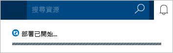
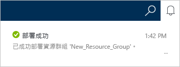
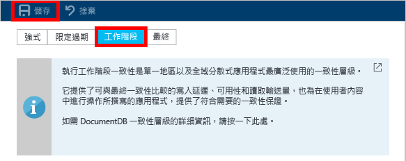

# 如何使用 Azure 入口網站建立 DocumentDB NoSQL 帳戶
> [!div class="op_single_selector"]
> * [Azure 入口網站](documentdb-create-account.md)
> * [Azure CLI 和 Azure Resource Manager](documentdb-automation-resource-manager-cli.md)
> 
> 

若要使用 Microsoft Azure DocumentDB 建立資料庫，您必須：

* 具有 Azure 帳戶。 您可以取得 [免費 Azure 帳戶](https://azure.microsoft.com/free) (若您尚無此帳戶)。 
* 建立 DocumentDB 帳戶。  

您可以使用 Azure 入口網站、Azure Resource Manager 範本或 Azure 命令列介面 (CLI) 來建立 DocumentDB 帳戶。 本文說明如何使用 Azure 入口網站建立 DocumentDB 帳戶。 若要使用 Azure Resource Manager 或 Azure CLI 建立帳戶，請參閱 [自動建立 DocumentDB 資料庫帳戶](documentdb-automation-resource-manager-cli.md)。

您是 DocumentDB 的新手嗎？ 觀看 Scott Hanselman 製作的 [這部](https://azure.microsoft.com/documentation/videos/create-documentdb-on-azure/) 四分鐘的影片，以了解如何在線上入口網站中完成最常見工作。

1. 登入 [Azure 入口網站](https://portal.azure.com/)。
2. 在 Jumpbar 中，按一下 [新增]，按一下 [資料庫]，然後按一下 [DocumentDB (NoSQL)]。 
   
   ![Azure 入口網站的螢幕擷取畫面，其中反白顯示 [其他服務] 和 DocumentDB (NoSQL)](./media/documentdb-create-account/create-nosql-db-databases-json-tutorial-1.png)  
3. 在 [新增帳戶]  刀鋒視窗中，指定想要的 DocumentDB 帳戶組態。
   
    ![[新增 DocumentDB] 刀鋒視窗的螢幕擷取畫面](./media/documentdb-create-account/create-nosql-db-databases-json-tutorial-2.png)
   
   * 在 [識別碼]  方塊中，輸入用來識別 DocumentDB 帳戶的名稱。  驗證 [識別碼] 時，[識別碼] 方塊中會出現綠色的核取記號。 [識別碼]  值會變成 URI 中的主機名稱。 此 [識別碼]  只能包含小寫字母、數字及 '-' 字元，且長度必須為 3 到 50 個字元。 請注意， *documents.azure.com* 會附加至您選擇的端點名稱後面，產生的結果會成為您的 DocumentDB 帳戶端點。
   * 在 [NoSQL API]  方塊中，選取要使用的程式設計模型：
     
     * **DocumentDB**：DocumentDB API 可以透過 .NET、Java、Node.js、Python 及 JavaScript 等 [SDK](documentdb-sdk-dotnet.md) 以及 HTTP [REST](https://msdn.microsoft.com/library/azure/dn781481.aspx) 取得，並提供所有 DocumentDB 功能的程式設計存取。 
     * **MongoDB**：DocumentDB 也針對 **MongoDB** API 提供[通訊協定層級的支援](documentdb-protocol-mongodb.md)。 當您選擇 MongoDB API 選項時，您可以使用現有的 MongoDB SDK 及 [工具](documentdb-mongodb-mongochef.md) 來和 DocumentDB 通訊。 您可以在[不需要進行任何程式碼變更](documentdb-connect-mongodb-account.md)的情況下，將現有的 MongoDB 應用程式[移轉為](documentdb-import-data.md)使用 DocumentDB，並充分利用受到完整管理，且具有無限制調整、全域複寫及其他功能的資料庫即服務。
   * 在 [訂用帳戶] 中，選取您要用於 DocumentDB 帳戶的 Azure 訂用帳戶。 如果您的帳戶只有一個訂用帳戶，預設會選取該帳戶。
   * 在 [資源群組] 中，選取或建立 DocumentDB 帳戶的資源群組。  依預設會建立新的資源群組。 如需詳細資訊，請參閱 [使用 Azure 入口網站管理 Azure 資源](../azure-portal/resource-group-portal.md)。
   * 使用 [位置]  指定將代管您的 DocumentDB 帳戶的地理位置。 
4. 設定新的 DocumentDB 帳戶選項之後，按一下 [建立] 。 如果要檢查部署狀態，請查看通知中樞。  
   
     
   
   
5. 建立好的 DocumentDB 帳戶可立即以預設值來使用。 DocumentDB 帳戶的預設一致性會設定為 [工作階段] 。  您可以藉由按一下資源功能表中的 [預設一致性]  ，調整預設一致性。 若要深入了解 DocumentDB 所提供的一致性層級，請參閱 [DocumentDB 中的一致性層級](documentdb-consistency-levels.md)。
   
   ![[資源群組] 刀鋒視窗的螢幕擷取畫面 - 開始進行應用程式開發](./media/documentdb-create-account/create-nosql-db-databases-json-tutorial-6.png)  
   
     

[作法：建立 DocumentDB 帳戶]: #Howto
[後續步驟]: #NextSteps
[documentdb-manage]:../articles/documentdb/documentdb-manage.md

## 後續步驟
您已有了 DocumentDB 帳戶，下一步是建立 DocumentDB 集合和資料庫。 

您可以使用下列其中一個動作來建立新的集合和資料庫：

* Azure 入口網站，如 [使用 Azure 入口網站建立 DocumentDB 集合](documentdb-create-collection.md)中所述。
* 包含以下項目之範例資料的完整內含教學課程：[.NET](documentdb-get-started.md)、[.NET MVC](documentdb-dotnet-application.md)、[Java](documentdb-java-application.md)、[Node.js](documentdb-nodejs-application.md) 或 [Python](documentdb-python-application.md)。
* 可於 GitHub 取得的 [.NET](documentdb-dotnet-samples.md#database-examples)、[Node.js](documentdb-nodejs-samples.md#database-examples) 或 [Python](documentdb-python-samples.md#database-examples) 範例程式碼。
* [.NET](documentdb-sdk-dotnet.md)、[Node.js](documentdb-sdk-node.md)、[Java](documentdb-sdk-java.md)、[Python](documentdb-sdk-python.md) 和 [REST](https://msdn.microsoft.com/library/azure/mt489072.aspx) SDK。

建立資料庫和集合之後, 您必須[新增文件](documentdb-view-json-document-explorer.md)至集合。

當您在集合中具有文件之後，您可以使用 [DocumentDB SQL](documentdb-sql-query.md) 來針對文件[執行查詢](documentdb-sql-query.md#executing-queries)。 您可以使用入口網站中的[查詢總管](documentdb-query-collections-query-explorer.md)、[REST API](https://msdn.microsoft.com/library/azure/dn781481.aspx)，或是這些 [SDK](documentdb-sdk-dotnet.md) 的其中之一來執行查詢。

### 詳細資訊
若要深入了解 DocumentDB，請探索以下資源：

* [DocumentDB 的學習路徑](https://azure.microsoft.com/documentation/learning-paths/documentdb/)
* [DocumentDB 階層式資源模型和概念](documentdb-resources.md)

<!--HONumber=Nov16_HO2-->

