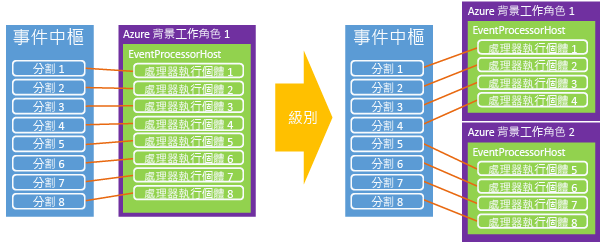

# <a name="event-hubs-programming-guide"></a>事件中樞程式設計指南
本文會討論一些使用 Azure 事件中樞和 Azure .NET SDK 來撰寫程式碼的常見案例。 它假設使用者對事件中樞已有初步了解。 如需事件中樞的概念概觀，請參閱 [事件中樞概觀](event-hubs-what-is-event-hubs.md)。

## <a name="event-publishers"></a>事件發佈者
您可以使用 HTTP POST 或透過 AMQP 1.0 連線，將事件傳送到事件中樞。 使用選擇取決於應用的特定案例。 AMQP 1.0 連線是以服務匯流排中的代理連線形式計量，其較適合經常出現大量訊息且需要低延遲的案例，因為它們可提供持續的傳訊通道。

您可以使用 [NamespaceManager][] 類別來建立及管理事件中樞。 在使用 .NET Managed API 時，用於將資料發佈到事件中樞的主要建構是 [EventHubClient](/dotnet/api/microsoft.servicebus.messaging.eventhubclient) 和 [EventData][] 類別。 [EventHubClient][] 提供將事件傳送到事件中樞時所透過的 AMQP 通訊通道。 [EventData][] 類別代表事件，可用來將訊息發佈到事件中樞。 這個類別包含主體、一些中繼資料，以及有關事件的標頭資訊。 當 [EventData][] 物件通過事件中樞時，系統會為它新增其他屬性。

## <a name="get-started"></a>開始使用
Microsoft.ServiceBus.dll 組件中會提供支援事件中樞的 .NET 類別。 要參考服務匯流排 API，並設定應用程式以使用所有服務匯流排相依性，最簡單方法是下載 [服務匯流排 NuGet 封裝](https://www.nuget.org/packages/WindowsAzure.ServiceBus)。 或者，您也可以在 Visual Studio 中使用 [Package Manager Console](http://docs.nuget.org/docs/start-here/using-the-package-manager-console) 。 若要這樣做，請在 [Package Manager Console](http://docs.nuget.org/docs/start-here/using-the-package-manager-console) 視窗中發出下列命令：

```
Install-Package WindowsAzure.ServiceBus
```

## <a name="create-an-event-hub"></a>建立事件中心
您可以使用 [NamespaceManager][] 類別來建立事件中樞。 例如：

```csharp
var manager = new Microsoft.ServiceBus.NamespaceManager("mynamespace.servicebus.windows.net");
var description = manager.CreateEventHub("MyEventHub");
```

在大部分情況下，建議您使用 [CreateEventHubIfNotExists][] 方法，以避免在服務重新啟動時產生例外狀況。 例如：

```csharp
var description = manager.CreateEventHubIfNotExists("MyEventHub");
```

所有事件中樞建立作業 (包括 [CreateEventHubIfNotExists][])，都需要論述之命名空間的 **管理** 權限。 如果您想要限制發佈者或取用者應用程式的權限，可以在使用有限權限認證時，於實際執行程式碼中避免這些建立作業呼叫。

[EventHubDescription](/dotnet/api/microsoft.servicebus.messaging.eventhubdescription) 類別含有事件中樞的相關詳細資料，包括授權規則、訊息保留間隔、資料分割識別碼、狀態及路徑。 您可以使用這個類別來更新事件中樞上的中繼資料。

## <a name="create-an-event-hubs-client"></a>建立事件中樞用戶端
與事件中樞互動的主要類別是 [Microsoft.ServiceBus.Messaging.EventHubClient][]。 這個類別提供傳送者和接收者功能。 您可以使用 [Create](/dotnet/api/microsoft.servicebus.messaging.eventhubclient.create) 方法來具現化這個類別，如以下範例所示。

```csharp
var client = EventHubClient.Create(description.Path);
```

這個方法會使用 App.config 檔案之 `appSettings` 區段中的服務匯流排連線資訊。 如需用來儲存服務匯流排連線資訊之 `appSettings` XML 的範例，請參閱 [Microsoft.ServiceBus.Messaging.EventHubClient.Create(System.String)](/dotnet/api/microsoft.servicebus.messaging.eventhubclient#Microsoft_ServiceBus_Messaging_EventHubClient_Create_System_String_) 方法的文件。

另一個選項是從連接字串建立用戶端。 這個選項適合用來搭配 Azure 背景工作角色，因為您可以將字串儲存在背景工作的組態屬性中。 例如：

```csharp
EventHubClient.CreateFromConnectionString("your_connection_string");
```

連接字串的格式與在前述方法之 App.config 檔案中的格式相同：

```
Endpoint=sb://[namespace].servicebus.windows.net/;SharedAccessKeyName=RootManageSharedAccessKey;SharedAccessKey=[key]
```

最後，它也可以建立從 [MessagingFactory](/dotnet/api/microsoft.servicebus.messaging.messagingfactory) 執行個體建立 [EventHubClient][] 物件，如以下範例所示。

```csharp
var factory = MessagingFactory.CreateFromConnectionString("your_connection_string");
var client = factory.CreateEventHubClient("MyEventHub");
```

請務必注意，從傳訊處理站執行個體建立的額外 [EventHubClient][] 物件，將重複使用相同的基礎 TCP 連線。 因此，這些物件對用戶端的輸送量將受到限制。 [Create](/dotnet/api/microsoft.servicebus.messaging.eventhubclient#Microsoft_ServiceBus_Messaging_EventHubClient_Create_System_String_) 方法會重複使用一個傳訊處理站。 如果您與單一傳送者之間需要大量輸送量，可以建立多個訊息處理站，並從每個傳訊處理站建立一個 [EventHubClient][] 物件。

## <a name="send-events-to-an-event-hub"></a>將事件傳送到事件中樞
您可以藉由建立 [EventData][] 執行個體並透過 [Send](/dotnet/api/microsoft.servicebus.messaging.eventhubclient#Microsoft_ServiceBus_Messaging_EventHubClient_Send_Microsoft_ServiceBus_Messaging_EventData_) 方法傳送它，將事件傳送到事件中樞。 這個方法會採用單一 [EventData][] 執行個體參數，並以同步方式將它傳送到事件中樞。

## <a name="event-serialization"></a>事件序列化
[EventData][] 類別具有[四個多載建構函式](/dotnet/api/microsoft.servicebus.messaging.eventdata#constructors_)，它們會採用許多不同的參數，如物件和序列化程式、位元組陣列或串流。 您也可以具現化 [EventData][] 類別，並在之後設定內文串流。 在搭配使用 JSON 和 [EventData][]時，您可以使用 **Encoding.UTF8.GetBytes()** 來擷取 JSON 編碼字串的位元組陣列。

## <a name="partition-key"></a>資料分割索引鍵
[EventData][] 類別具有 [PartitionKey][] 屬性，可讓傳送者指定雜湊的值，以便產生資料分割指派。 使用資料分割索引鍵可確保將所有具有相同索引鍵的事件，都傳送到事件中樞內的相同資料分割。 常見的資料分割索引鍵包含使用者工作階段識別碼和唯一的傳送者識別碼。 [PartitionKey][] 屬性是選擇性的，您可以在使用 [Microsoft.ServiceBus.Messaging.EventHubClient.Send(Microsoft.ServiceBus.Messaging.EventData)](/dotnet/api/microsoft.servicebus.messaging.eventhubclient#Microsoft_ServiceBus_Messaging_EventHubClient_Send_Microsoft_ServiceBus_Messaging_EventData_) 或 [Microsoft.ServiceBus.Messaging.EventHubClient.SendAsync(Microsoft.ServiceBus.Messaging.EventData)](/dotnet/api/microsoft.servicebus.messaging.eventhubclient#Microsoft_ServiceBus_Messaging_EventHubClient_SendAsync_Microsoft_ServiceBus_Messaging_EventData_) 方法時提供。 如果您未提供 [PartitionKey][]值，系統會使用循環配置資源模型將傳送的事件散佈到多個資料分割。

### <a name="availability-considerations"></a>可用性考量

您可以選擇使用資料分割索引鍵，至於是否要使用，請您慎重考慮。 在許多情況下，如果事件的順序很重要，您最好選擇使用資料分割索引鍵。 當您使用資料分割索引鍵時，這些資料分割必須在單一節點上可供使用，但經過一段時間後，節點有可能會發生中斷，例如在計算節點重新開機及修補時。 因此，如果您設定了資料分割識別碼，但該資料分割因為某些緣故變得無法使用，您就無法嘗試存取該資料分割中的資料。 如果您最重視的是高可用性，請勿指定資料分割索引鍵，因為在該情況下，事件會使用先前所述的循環配置資源模型傳送到資料分割。 在此案例中，您必須在可用性 (沒有資料分割識別碼) 和一致性 (將事件繫結至資料分割識別碼) 之間做出明確抉擇。

另一項考量是對處理事件的延遲進行處理。 有時候，捨棄資料並重試會比試著跟上處理腳步來得好，因為後者可能會導致下游處理延遲得更久。 例如，拿股票行情即時看板來說，等待完整的最新資料會比較好，但在即時聊天或 VOIP 的案例中，您會寧願先收到資料，即便資料並不完整也沒關係。

有鑑於上述可用性考量，您可能會在這些案例中選擇下列其中一個錯誤處理策略︰

- 停止 (停止讀取事件中樞，直到情況獲得修正)
- 捨棄 (訊息並不重要，將其卸除)
- 重試 (視情況重試訊息)
- [無效信件](../service-bus-messaging/service-bus-dead-letter-queues.md) (使用佇列或另一個事件中樞，以只將您無法處理的訊息設為無效)

## <a name="batch-event-send-operations"></a>批次事件傳送作業
分批傳送事件能大幅增加輸送量。 [SendBatch](/dotnet/api/microsoft.servicebus.messaging.eventhubclient#Microsoft_ServiceBus_Messaging_EventHubClient_SendBatch_System_Collections_Generic_IEnumerable_Microsoft_ServiceBus_Messaging_EventData__) 方法會採用 [EventData][] 類型的 **IEnumerable** 參數，並將整個批次以不可部分完成的作業形式傳送到事件中樞。

```csharp
public void SendBatch(IEnumerable<EventData> eventDataList);
```

請注意，單一批次不能超過每個事件 256 KB 的限制。 此外，批次中的每個訊息都會使用相同的身分識別。 確保批次未超過最大事件大小是傳送者的責任。 如果超過的話，系統會產生用戶端 **Send** 錯誤。

## <a name="send-asynchronously-and-send-at-scale"></a>以非同步方式傳送和大規模傳送
您也可以採用非同步方式將事件傳送到事件中樞。 以非同步方式傳送可以增加用戶端傳送事件的速率。 [Send](/dotnet/api/microsoft.servicebus.messaging.eventhubclient#Microsoft_ServiceBus_Messaging_EventHubClient_Send_Microsoft_ServiceBus_Messaging_EventData_) 和 [SendBatch](/dotnet/api/microsoft.servicebus.messaging.eventhubclient#Microsoft_ServiceBus_Messaging_EventHubClient_SendBatch_System_Collections_Generic_IEnumerable_Microsoft_ServiceBus_Messaging_EventData__) 這兩個方法都有會傳回 [Task](https://msdn.microsoft.com/library/system.threading.tasks.task.aspx) 物件的非同步版本。 雖然這項技術可以增加輸送量，不過如果實作不當，可能會造成用戶端在受到事件中樞服務節流的情況下繼續傳送事件，導致用戶端發生失敗或遺失訊息。 此外，您還可以在用戶端上使用 [RetryPolicy](/dotnet/api/microsoft.servicebus.messaging.cliententity#Microsoft_ServiceBus_Messaging_ClientEntity_RetryPolicy) 屬性來控制用戶端重試選項。

## <a name="create-a-partition-sender"></a>建立資料分割的傳送者
雖然最常見的情況是不使用資料分割索引鍵就將事件傳送到事件中樞，不過在某些情況下，您可能會想要將事件直接傳送到指定的資料分割。 例如：

```csharp
var partitionedSender = client.CreatePartitionedSender(description.PartitionIds[0]);
```

[CreatePartitionedSender](/dotnet/api/microsoft.servicebus.messaging.eventhubclient#Microsoft_ServiceBus_Messaging_EventHubClient_CreatePartitionedSender_System_String_) 會傳回 [EventHubSender](/dotnet/api/microsoft.servicebus.messaging.eventhubsender) 物件，可供您用來將事件發佈到特定的事件中樞資料分割。

## <a name="event-consumers"></a>事件取用者
事件中樞有兩個主要的事件取用模型：直接接收者和較高層級的抽象 (如 [EventProcessorHost][])。 直接接收者負責自行協調消費者群組內之資料分割的存取。

### <a name="direct-consumer"></a>直接消費者
要讀取消費者群組內的資料分割，最直接的方式是使用 [EventHubReceiver](/dotnet/apie/microsoft.servicebus.messaging.eventhubreceiver) 類別。 若要建立這個類別的執行個體，您必須使用 [EventHubConsumerGroup](/dotnet/api/microsoft.servicebus.messaging.eventhubconsumergroup) 類別的執行個體。 在以下範例中，您必須在建立消費者群組的接收者時指定資料分割識別碼。

```csharp
EventHubConsumerGroup group = client.GetDefaultConsumerGroup();
var receiver = group.CreateReceiver(client.GetRuntimeInformation().PartitionIds[0]);
```

[CreateReceiver](/dotnet/api/microsoft.servicebus.messaging.eventhubconsumergroup#methods_summary) 方法有幾個有助於控制所建立之讀取器的多載。 這些方法包括將位移指定為字串或時間戳記，以及讓您指定要在傳回的資料流中包括指定位移，或是在位移之後開始。 建立接收者後，您可以開始接收有關傳回之物件的事件。 [Receive](/dotnet/api/microsoft.servicebus.messaging.eventhubreceiver#methods_summary) 方法有四個控制接收作業參數的多載，如批次大小和等待時間。 若要增加消費者的輸送量，您可以使用這些方法的非同步版本。 例如：

```csharp
bool receive = true;
string myOffset;
while(receive)
{
    var message = receiver.Receive();
    myOffset = message.Offset;
    string body = Encoding.UTF8.GetString(message.GetBytes());
    Console.WriteLine(String.Format("Received message offset: {0} \nbody: {1}", myOffset, body));
}
```

對特定資料分割來說，訊息的接收順序與傳送到事件中樞時的順序相同。 位移是一種字串語彙基元，它能用來識別資料分割中的訊息。

請注意，消費者群組內的單一資料分割一律不能擁有超過 5 個已連接的並行讀取器。 當讀取器連接或中斷連線時，其工作階段可能會維持作用中狀態達數分鐘之久，服務才能辨識出它們已經中斷連線。 在這段時間內，讀取器可能會無法重新連接資料分割。 如需撰寫事件中樞之直接接收者的完整範例，請參閱[事件中樞直接接收者](https://code.msdn.microsoft.com/Event-Hub-Direct-Receivers-13fa95c6)範例。

### <a name="event-processor-host"></a>事件處理器主機
[EventProcessorHost][] 類別能處理來自事件中樞的資料。 在 .NET 平台上建置事件讀取器時，您應該使用這項實作。 [EventProcessorHost][] 能為事件處理器實作提供安全執行緒、多處理序、安全的執行階段環境，進而提供檢查點和資料分割租用管理。

若要使用 [EventProcessorHost][] 類別，您可以實作 [IEventProcessor](/dotnet/api/microsoft.servicebus.messaging.ieventprocessor)。 這個介面包含三個方法：

* [OpenAsync](/dotnet/api/microsoft.servicebus.messaging.ieventprocessor#Microsoft_ServiceBus_Messaging_IEventProcessor_OpenAsync_Microsoft_ServiceBus_Messaging_PartitionContext_)
* [CloseAsync](/dotnet/api/microsoft.servicebus.messaging.ieventprocessor#Microsoft_ServiceBus_Messaging_IEventProcessor_CloseAsync_Microsoft_ServiceBus_Messaging_PartitionContext_Microsoft_ServiceBus_Messaging_CloseReason_)
* [ProcessEventsAsync](/dotnet/api/microsoft.servicebus.messaging.ieventprocessor#Microsoft_ServiceBus_Messaging_IEventProcessor_ProcessEventsAsync_Microsoft_ServiceBus_Messaging_PartitionContext_System_Collections_Generic_IEnumerable_Microsoft_ServiceBus_Messaging_EventData__)

若要啟動事件處理，請將 [EventProcessorHost][] 具現化，其中需為事件中樞提供適當的參數。 接著，呼叫 [RegisterEventProcessorAsync](/dotnet/api/microsoft.servicebus.messaging.eventprocessorhost#Microsoft_ServiceBus_Messaging_EventProcessorHost_RegisterEventProcessorAsync__1) 以向執行階段註冊 [IEventProcessor](/dotnet/api/microsoft.servicebus.messaging.ieventprocessor) 實作。 此時，主機會嘗試使用「窮盡」演算法來取得事件中樞內每個磁碟分割的租用。 這些租用將延續一段指定時間，然後必須更新。 本案例中，當新節點上線時，背景工作執行個體會保留租用，而每當取得更多租用的嘗試發生時，負載會隨著在節點之間轉移。



經過一段時間後，均衡的局面將會出現。 此動態功能可讓您將 CPU 架構自動調整套用至消費者，以便進行向上和向下調整。 由於事件中樞沒有直接的訊息計數概念，因此平均 CPU 使用率通常是測量後端或消費者規模最合適的機制。 如果發佈者發佈的事件數量開始超出消費者的處理能力，消費者上增加的 CPU 可用來引發背景工作執行個體計數自動調整。

[EventProcessorHost][] 類別還能實作以 Azure 儲存體為基礎的檢查點機制。 這項機制能儲存每個磁碟分割的位移，方便各個消費者判斷前一個消費者的最後一個檢查點。 由於資料分割會透過租用在節點之間轉換，因此這是能促進負載移位的同步處理機制。

## <a name="publisher-revocation"></a>發佈者撤銷
除了 [EventProcessorHost][]的進階執行階段功能之外，「事件中樞」還能讓您撤銷發佈者，以防止特定發佈者將事件傳送到到事件中樞。 當發佈者權杖遭到洩露，或軟體更新造成發佈者出現不當行為時，這些功能特別有用。 在這些情況下，您可以封鎖發佈者 SAS 權杖中的發佈者身分識別，避免它們發佈事件。

如需有關發佈者撤銷，以及如何以發佈者身分傳送到事件中樞的詳細資訊，請參閱[事件中樞大規模安全發佈](https://code.msdn.microsoft.com/Service-Bus-Event-Hub-99ce67ab)範例。

## <a name="next-steps"></a>後續步驟
若要深入了解事件中樞案例，請造訪下列連結：

* [事件中樞 API 概觀](event-hubs-api-overview.md)
* [何謂事件中樞](event-hubs-what-is-event-hubs.md)
* [事件處理器主機 API 參考](/dotnet/api/microsoft.servicebus.messaging.eventprocessorhost)

[NamespaceManager]: /dotnet/api/microsoft.servicebus.namespacemanager
[EventHubClient]: /dotnet/api/microsoft.servicebus.messaging.eventhubclient
[EventData]: /dotnet/api/microsoft.servicebus.messaging.eventdata
[CreateEventHubIfNotExists]: /dotnet/api/microsoft.servicebus.namespacemanager.createeventhubifnotexists
[PartitionKey]: /dotnet/api/microsoft.servicebus.messaging.eventdata#Microsoft_ServiceBus_Messaging_EventData_PartitionKey
[EventProcessorHost]: /dotnet/api/microsoft.servicebus.messaging.eventprocessorhost

