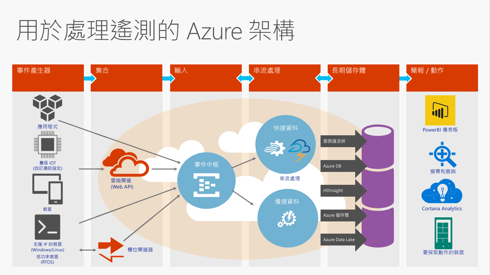
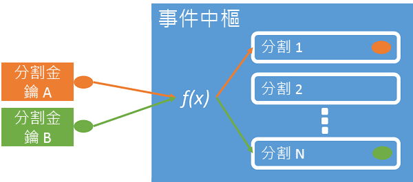
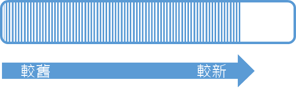
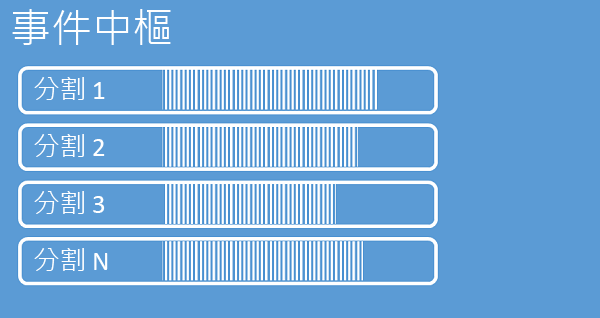
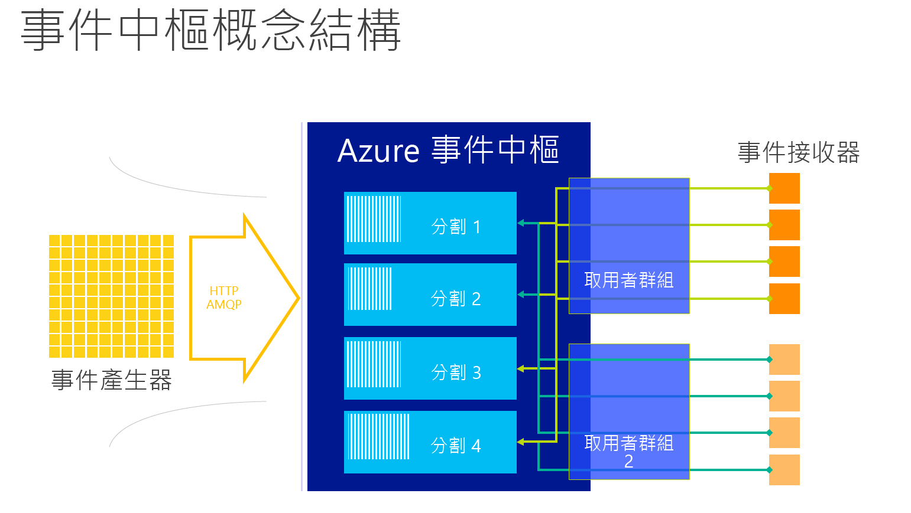

# <a name="what-is-azure-event-hubs"></a>Azure 事件中樞是什麼？
事件中樞是可高度調整的資料串流平台，每秒能夠內嵌數百萬個事件。 傳送至事件中樞的資料可以透過任何即時分析提供者或批次/儲存體配接器來轉換和儲存。 藉由提供大規模的低延遲發佈訂閱功能，事件中樞能成為引進巨量資料的途徑。

## <a name="why-use-event-hubs"></a>為何使用事件中樞？
事件中樞的事件和遙測處理功能特別適用於︰

* 應用程式檢測
* 使用者經驗或工作流程處理
* 物聯網 (IoT) 案例

事件中樞還能追蹤行動應用程式中的行為、接收 Web 伺服陣列的流量資訊、擷取遊戲機遊戲中的遊戲內部事件，或是從產業用機器或連接之車輛收集遙測。

## <a name="azure-event-hubs-overview"></a>Azure 事件中樞概觀
事件中樞在解決方案架構中經常扮演事件管線的「大門」角色 (通常稱為「事件擷取器」)。 事件擷取器是介於事件發佈者和事件取用者之間的元件或服務，它能將事件串流的生產與這些事件的取用彼此脫鉤。



Azure 事件中樞是事件處理服務，支援內嵌雲端級別的事件和遙測，具備低延遲和高可靠性。 事件中樞提供訊息串流處理能力，特性迴異於傳統企業傳訊。 事件中樞功能是以高輸送量和事件處理案例為重點。 因此，事件中樞並不實作一些可用於傳訊實體 (例如主題) 的傳訊功能。

事件中樞建立在命名空間層級上，使用 AMQP 和 HTTP 做為主要 API 介面。

## <a name="event-publishers"></a>事件發佈者
任何將資料傳送至事件中樞的實體就稱為「事件發佈者」。 事件發佈者可以使用 HTTPS 或 AMQP 1.0 發佈事件。 事件發佈者使用共用存取簽章 (SAS) 權杖向事件中樞辨識自己的身分，而且可以擁有唯一的身分識別，或使用一般 SAS 權杖。

### <a name="publishing-an-event"></a>發佈事件
您可以透過 AMQP 1.0 或 HTTPS 來發佈事件。 服務匯流排提供 [EventHubClient](https://docs.microsoft.com/dotnet/api/microsoft.servicebus.messaging.eventhubclient) 類別，以供您從 .NET 用戶端將事件發佈到事件中樞。 對於其他執行階段和平台，您可以使用任何 AMQP 1.0 用戶端 (如 [Apache Qpid](http://qpid.apache.org/))。 您可以單獨發佈事件，或以批次方式進行。 不論是單一事件或批次，單次發行 (事件資料執行個體) 的上限為 256KB。 發佈大於此限制的事件會導致錯誤。 發佈者最好別顧慮事件中樞內的資料分割，他們只需要指定 *資料分割索引鍵* (下一節將加以介紹)，或透過其 SAS 權杖指定身分識別即可。

使用 AMQP 或 HTTPS 的選擇因使用案例而異。 除了傳輸層級安全性 (TLS) 或 SSL/TLS 之外，AMQP 還需要建立持續性的雙向通訊端。 AMQP 初始化工作階段時的網路成本較高，但 HTTPS 需要額外的 SSL 工作負荷來處理每個要求。 對於頻繁的發行者，AMQP 的效能較高。



事件中樞能確保所有共用相同資料分割索引鍵值的事件依序傳遞至同一個資料分割。 如果資料分割索引鍵與發佈者原則搭配使用，發佈者的身分識別與資料分割索引鍵的值必須相符， 否則便會發生錯誤。

### <a name="publisher-policy"></a>發佈者原則
事件中樞可讓您透過發佈者 原則更精確地控制事件發佈者。 發佈者原則是為了協助大量獨立事件發佈者而設計的執行階段功能。 有了發佈者原則，當每位發佈者使用下列機制將事件發佈到事件中樞時，都能使用自己的唯一識別碼：

```
//[my namespace].servicebus.windows.net/[event hub name]/publishers/[my publisher name]
```

您不需要事先建立發佈者名稱，不過這些名稱必須符合發佈事件時使用的 SAS 權杖，以確保發佈者身分識別是獨立的。 在使用發佈者原則時，系統會將 **PartitionKey** 值設定為發佈者名稱。 為了正常運作，這些值必須相符。

## <a name="partitions"></a>分割數
事件中樞透過分割取用者模式來提供訊息串流，每位取用者只會讀取訊息串流的特定子集 (即資料分割)。 此模式能水平擴充事件處理規模，並提供佇列和主題缺少的其他串流導向功能。

資料分割是經過排序且保存在事件中樞內的事件序列。 當較新的事件送達時，系統會將它們加入序列的結尾。 您可以將資料分割視為一種「認可記錄」。



事件中樞會將資料保留一段設定的保留時間，這段時間在事件中樞的所有資料分割上都一樣。 事件會隨著時間經過而到期，因此您無法明確地予以刪除。 資料分割各自獨立，只包含其本身的資料序列，通常會以不同的速度成長。



資料分割數目是在建立時指定，值必須介於 2 到 32 之間。 資料分割計數不可變更，您在設定資料分割計數時，應該考慮長期的規模。 資料分割是一種資料組織機制，與取用端應用程式所需的下游平行處理原則有關。 事件中樞內的資料分割數目，與您預期有的並行讀取器數目直接相關。 您可以連絡事件中樞小組，將資料分割數目提高到 32 個以上。

雖然可以識別並直接傳送至資料分割，但不建議這樣做。 相反地，您可以使用[事件發佈者](#event-publishers)和[容量](#capacity)章節中介紹的較高階建構。

資料分割中會填入一連串事件資料，內含事件本文、使用者定義屬性包，以及中繼資料，例如在資料分割中的位移和串流序列中的編號。

### <a name="partition-key"></a>資料分割索引鍵
您可以使用資料分割索引鍵，將內送事件對映至特定的資料分割來組織資料。 資料分割索引鍵是由傳送者提供的值。系統會將它傳遞到事件中樞， 然後透過靜態雜湊函式加以處理，而建立資料分割指派。 如果您在發佈事件時未指定資料分割索引鍵，系統會使用循環配置資源指派。

事件發佈行者只會知道資料分割索引鍵，不會知道事件發佈的目的地資料分割。 索引鍵和資料分割脫鉤的這種機制，讓傳送者不需要知道太多有關下游處理的細節。 每部裝置或每位使用者的唯一身分識別能成為有效的資料分割索引鍵，不過像地理位置之類的其他屬性也能用來將相關事件歸納成一個資料分割。

## <a name="sas-tokens"></a>SAS 權杖
事件中樞使用命名空間和事件中樞層級可用的「共用存取簽章」。 SAS 權杖可自 SAS 金鑰產生，它是經過特定格式編碼的 URL SHA 雜湊。 事件中樞可以使用金鑰 (原則) 的名稱和權杖來重新產生雜湊，藉此驗證傳送者。 一般而言，建立的事件發佈者 SAS 權杖只具備特定事件中樞的 **傳送** 權限。 此 SAS 權杖 URL 機制是導入發佈者原則之發佈者識別的基礎。 如需使用 SAS 的詳細資訊，請參閱[使用服務匯流排的共用存取簽章驗證](../service-bus-messaging/service-bus-shared-access-signature-authentication.md)。

## <a name="event-consumers"></a>事件取用者
任何從事件中樞讀取事件資料的實體就稱為「事件取用者」。 所有事件中樞取用者都透過 AMQP 1.0 工作階段連接，而可供取用的事件都透過工作階段傳遞。 用戶端不需要輪詢資料可用性。

### <a name="consumer-groups"></a>用戶群組
事件中樞的發佈/訂閱機制可透過「取用者群組」啟用。 取用者群組是檢視整個事件中樞 (狀態、位置或位移) 的窗口。 取用者群組能讓多個取用應用程式擁有自己的事件串流檢視，以及按照自己的步調及運用自己的位移自行讀取串流。

在串流處理架構中，每個下游應用程式等同於一個取用者群組。 如果您想要將事件資料寫入長期存放區，該存放裝置寫入器應用程式即是取用者群組。 複雜的事件處理可以由另一個獨立的取用者群組來執行。 您只能透過取用者群組來存取資料分割。 每個資料分割一次只能有**給定取用者群組**中的一個作用中讀取器。 每個事件中樞永遠有一個預設的取用者群組，而您可以為標準層事件中樞建立最多 20 個取用者群組。

以下是取用者群組 URI 慣例的範例：

```
//[my namespace].servicebus.windows.net/[event hub name]/[Consumer Group #1]
//[my namespace].servicebus.windows.net/[event hub name]/[Consumer Group #2]
```



### <a name="stream-offsets"></a>串流位移
「位移」是事件在資料分割內的位置。 您可以將位移視為用戶端指標。 位移是事件的位元組編號。 這可讓事件取用者 (讀取器) 在事件串流中指定某個點，以便從該點開始讀取事件。 您可以指定時間戳記或位移值等形式的位移。 取用者需負責將自己的位移值儲存在事件中樞服務之外。 在資料分割內，每個事件都含有一個位移。


### <a name="checkpointing"></a>檢查點
*設立檢查點* 是讀取器在資料分割事件序列中標記或認可其位置的程序。 設立檢查點是取用者的責任，這項作業會在取用者群組內依照資料分割來進行。 這表示在每個取用者群組內，每個資料分割讀取器必須追蹤自己目前在事件串流中的位置，而當它們認為資料串流完成時，可以通知服務。

如果讀取器與資料分割中斷連線，當它重新連線時，會從該取用者群組中該資料分割最後一個讀取器先前提交的檢查點開始讀取。 當讀取器連線時，它會將此位移傳遞給事件中樞，以指定要開始讀取的位置。 如此一來，檢查點能成為下游應用程式標記事件「完成」的方法，也能針對在不同機器上執行的讀取器提供容錯移轉發生時的恢復功能。 從這個檢查點處理程序中指定較低的位移，即可回到較舊的資料。 透過這項機制，檢查點可提供容錯移轉彈性，並支援事件串流重播。

### <a name="common-consumer-tasks"></a>常見的取用者工作
所有事件中樞取用者都透過 AMQP 1.0 工作階段和狀態感知的雙向通訊通道來連接。 每個資料分割都有 AMQP 1.0 工作階段，有助於傳輸資料分割所隔離的事件。

#### <a name="connect-to-a-partition"></a>連接資料分割
連接至資料分割時，常見的做法是使用租用機制來協調讀取器至特定資料分割的連接。 如此一來，取用者群組中的每個資料分割便可能只會有一個作用中的讀取器。 使用 .NET 用戶端的 [EventProcessorHost](https://docs.microsoft.com/dotnet/api/microsoft.servicebus.messaging.eventprocessorhost) 類別可以簡化檢查點檢查、租用和管理讀取器。 [EventProcessorHost](https://docs.microsoft.com/dotnet/api/microsoft.servicebus.messaging.eventprocessorhost) 是智慧型取用者代理程式。

#### <a name="read-events"></a>讀取事件
在開啟特定資料分割的 AMQP 1.0 工作階段和連結後，事件中樞服務會將事件傳遞至 AMQP 1.0 用戶端。 相較於以提取為基礎的機制 (如 HTTP GET)，這個傳遞機制能產生更高的輸送量和較低的延遲。 將事件傳送到用戶端時，每個事件資料執行個體都包含如位移和序號等有助於在事件序列上設立檢查點的重要中繼資料。

事件資料︰
* Offset
* 序號
* 內文
* 使用者屬性
* 系統屬性

您必須負責管理位移。

## <a name="capacity"></a>容量
事件中樞具有可高度調整的平行架構，在調整和縮放規模時需要考慮許多重要因素。

### <a name="throughput-units"></a>輸送量單位
事件中樞的輸送量容量受「輸送量單位」所控制。 輸送量單位是預先購買的容量單位。 一個輸送量單位包括：

* 輸入：每秒最多 1 MB 或 1000 個事件 (以先達到者為準)
* 輸出：每秒最多 2 MB。

超出所購買輸送量單位的容量時，輸入就開始節流，並傳回 [ServerBusyException](https://docs.microsoft.com/dotnet/api/microsoft.azure.eventhubs.serverbusyexception)。 輸出不會產生節流例外狀況，但仍受限於所購買輸送量單位的容量。 如果您收到發佈速率例外狀況，或輸出速率低於預期，請務必檢查您為命名空間所購買的輸送量單位數目。 在 [Azure 入口網站][Azure portal]中，您可以在命名空間的 [調整規模] 刀鋒視窗管理輸送量單位。 您可以使用 Azure API，以程式設計方式完成這件事。

輸送量單位是以每小時計費，採預先購買制。 一經購買，您至少必須支付一個小時的輸送量單位費用。 最多可以為一個事件中樞命名空間購買 20 個輸送量單位，讓命名空間中的所有事件中樞共用。

您可以連絡 Azure 支援中心，以 20 個為一組購買更多輸送量單位，最多 100 個輸送量單位。 之後，您還可以購買以 100 個輸送量為單位的區塊。

建議您保持輸送量單位和資料分割之間的平衡，以達到最佳規模。 每個資料分割有一個輸送量單位的規模上限。 輸送量單位的數目應該要小於或等於事件中樞內的資料分割數目。

如需詳細定價資訊，請參閱 [事件中樞定價](https://azure.microsoft.com/pricing/details/event-hubs/)。

## <a name="next-steps"></a>後續步驟

* 開始使用[事件中樞教學課程][Event Hubs tutorial]
* [使用事件中樞的完整範例應用程式]
* [事件中樞程式設計指南](event-hubs-programming-guide.md)
* [事件中樞常見問題集](event-hubs-faq.md)

[Event Hubs tutorial]: event-hubs-csharp-ephcs-getstarted.md
[使用事件中樞的完整範例應用程式]: https://code.msdn.microsoft.com/Service-Bus-Event-Hub-286fd097
[Azure portal]: https://portal.azure.com


<!--HONumber=Feb17_HO1-->


