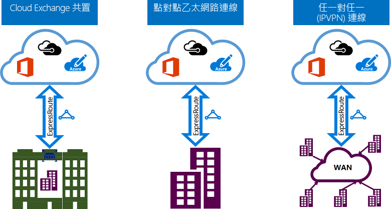

# ExpressRoute 連線模型
有三種方法可以在內部部署網路與 Microsoft Cloud 之間建立連線：[CloudExchange 共置](#CloudExchange)、[點對點乙太網路連線](#Ethernet)和[任意點對任意點 (IPVPN) 連線](#IPVPN)。 連線提供者可以提供一或多個連線模型。 您可以洽詢連線提供者來選擇最適合您的模型。
  

## 共置於雲端 Exchange
如果您共置於具有雲端交換的設施中，您可以訂購虛擬交叉連接，透過共置提供者的乙太網路交換而連接至 Microsoft 雲端。 共置提供者可以在您於共置設施中的基礎結構與 Microsoft 雲端之間，提供第 2 層交叉連接或受管理的第 3 層交叉連接。

## 點對點乙太網路連線
您可以透過點對點乙太網路連結，將內部部署資料中心/辦公室連接到 Microsoft 雲端。 點對點乙太網路提供者可以在您的網路與 Microsoft 雲端之間，提供第 2 層連線或受管理的第 3 層連線。

## 任意點對任意點 (IPVPN) 網路
您可以整合 WAN 與 Microsoft 雲端。 IPVPN 提供者 (通常是 MPLS VPN) 在您的分公司與資料中心之間提供任意點對任意點連線。 Microsoft 雲端可以相互連接到您的 WAN，看起來就像任何其他分公司一樣。 WAN 提供者通常會提供受管理的第 3 層連線能力。 在上述所有連線模型中，ExpressRoute 功能與特性完全相同。 

## 後續步驟
* 了解 ExpressRoute 連線和路由網域。 請參閱 [ExpressRoute 線路和路由網域](expressroute-circuit-peerings.md)。
* 了解 ExpressRoute 功能。 請參閱 [ExpressRoute 技術概觀](expressroute-introduction.md)
* 尋找服務提供者。 請參閱 [ExpressRoute 合作夥伴和對等位置](expressroute-locations.md)。
* 請確定符合所有必要條件。 請參閱 [ExpressRoute 必要條件](expressroute-prerequisites.md)。
* 請參閱[路由](expressroute-routing.md)、[NAT](expressroute-nat.md) 和 [QoS](expressroute-qos.md) 的需求。
* 設定 ExpressRoute 連線。
  * [建立 ExpressRoute 線路](expressroute-howto-circuit-portal-resource-manager.md)
  * [設定路由](expressroute-howto-routing-portal-resource-manager.md)
  * [將 VNet 連結到 ExpressRoute 線路](expressroute-howto-linkvnet-portal-resource-manager.md)

<!--HONumber=Feb17_HO2-->

