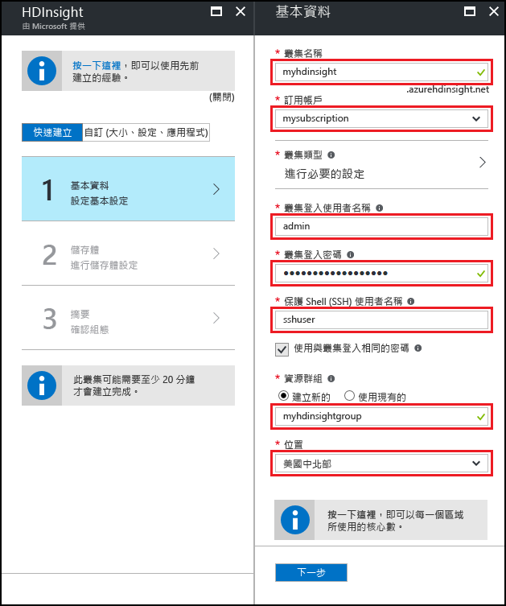
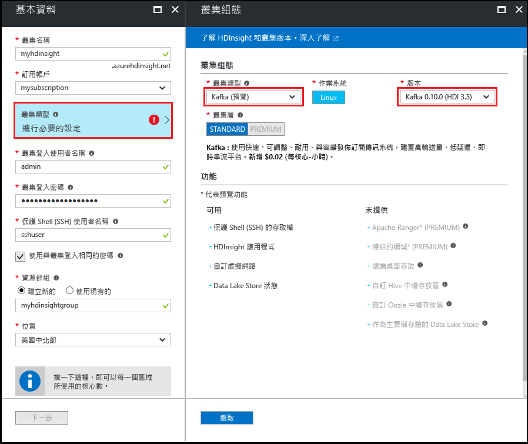
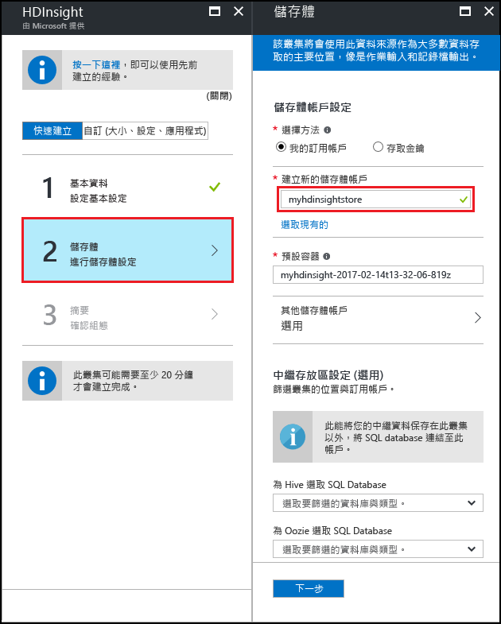
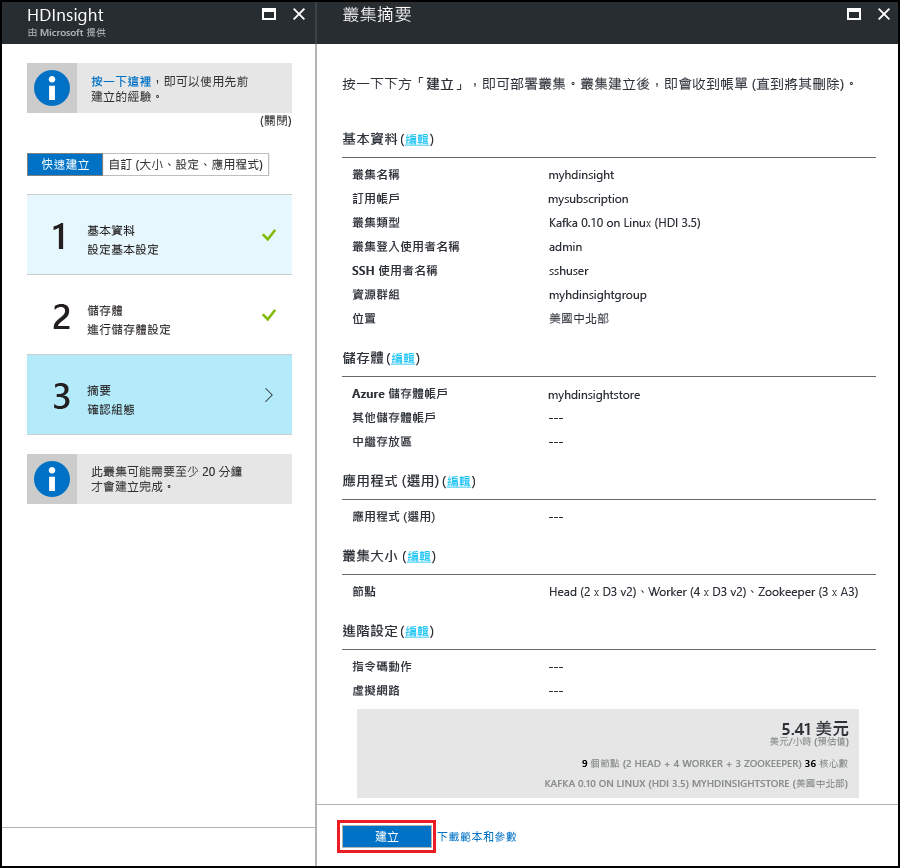

<a id="start-with-apache-kafka-preview-on-hdinsight" class="xliff"></a>

# 開始在 HDInsight 上使用 Apache Kafka (預覽)

了解如何在 Azure HDInsight 上建立和使用 [Apache Kafka](https://kafka.apache.org) 叢集。 Kafka 是 HDInsight 提供的開放原始碼分散式串流平台。 它通常作為訊息代理程式，因為它提供了類似於發佈-訂閱訊息佇列的功能。

> [!NOTE]
> HDInsight 目前提供兩個 Kafka 版本：0.9.0 (HDInsight 3.4) 和 0.10.0 (HDInsight 3.5)。 本文件中的步驟假設您使用 Kafka on HDInsight 3.5。

[!INCLUDE [delete-cluster-warning](../../includes/hdinsight-delete-cluster-warning.md)]

<a id="prerequisites" class="xliff"></a>

## 必要條件

* [Java JDK 8](http://www.oracle.com/technetwork/java/javase/downloads/index.html) 或同等功能版本，例如 OpenJDK。

* [Apache Maven](http://maven.apache.org/) 

<a id="create-a-kafka-cluster" class="xliff"></a>

## 建立 Kafka 叢集

請使用下列步驟建立 Kafka on HDInsight：

1. 從 [Azure 入口網站](https://portal.azure.com)選取 [+ 新增]、[情報 + 分析] 及 [HDInsight]，然後選取 [HDInsight]。
   
    

2. 在 [基本概念] 刀鋒視窗中，輸入下列資訊：

    * **叢集名稱**︰HDInsight 叢集的名稱。
    * **訂用帳戶**：選取要使用的訂用帳戶。
    * **叢集登入使用者名稱**和**叢集登入密碼**：透過 HTTPS 存取叢集時使用的登入資訊。 您會使用這些認證來存取例如 Ambari Web UI 或 REST API 等服務。
    * **安全殼層 (SSH) 使用者名稱**：透過 SSH 存取叢集時使用的登入資訊。 依預設，密碼要與叢集登入密碼相同。
    * **資源群組**：在其中建立叢集的資源群組。
    * **位置**：在其中建立叢集的 Azure 區域。
   
    

3. 選取 [叢集類型]，並且在 [叢集組態] 刀鋒視窗中設定下列值︰
   
    * **叢集類型**：Kafka

    * **版本**：Kafka 0.10.0 (HDI 3.5)

    * **叢集層**：標準
     
    最後，使用 [選取] 按鈕來儲存設定。
     
    

4. 選取叢集類型之後，請使用 [選取] 按鈕來設定叢集類型。 接下來，使用 [下一步] 按鈕來完成基本組態。

5. 從 [儲存體] 刀鋒視窗中，選取或建立儲存體帳戶。 本文件的步驟是，將此刀鋒視窗中的其他欄位保留為預設值。 使用 [下一步] 按鈕以儲存儲存體組態。

    

6. 從 [應用程式 (選擇性)] 刀鋒視窗中，選取 [下一步] 以繼續。 這個範例不需要任何應用程式。

7. 從 [叢集大小] 刀鋒視窗中，選取 [下一步] 以繼續。

    > [!WARNING]
    > 若要保證 Kafka 在 HDInsight 上的可用性，您的叢集必須包含至少三個背景工作角色節點。

    

    > [!NOTE]
    > 每個背景工作角色節點項目的磁碟會控制 HDInsight 上的 Kafka 延展性。 如需詳細資訊，請參閱[設定 HDInsight 上 Kafka 的儲存體和延展性](hdinsight-apache-kafka-scalability.md)。

8. 從 [進階設定] 刀鋒視窗中，選取 [下一步]以繼續。

9. 從 [摘要] 刀鋒視窗中，檢閱叢集組態。 使用 [編輯] 連結來變更所有不正確的設定。 最後，使用 [建立] 按鈕來建立叢集。
   
    
   
    > [!NOTE]
    > 建立叢集可能需要花費 20 分鐘的時間。

<a id="connect-to-the-cluster" class="xliff"></a>

## 連接到叢集

從您的用戶端，使用 SSH 連線到叢集：

```ssh SSHUSER@CLUSTERNAME-ssh.azurehdinsight.net```

將 **SSHUSER** 取代為您在叢集建立期間提供的 SSH 使用者名稱。 將 **CLUSTERNAME** 取代為叢集的名稱。

出現提示時，輸入您用於 SSH 帳戶的密碼。

如需相關資訊，請參閱[搭配 HDInsight 使用 SSH](hdinsight-hadoop-linux-use-ssh-unix.md)。

## <a id="getkafkainfo"></a>取得 Zookeeper 和訊息代理程式主機資訊

使用 Kafka 時，您必須知道兩個主機值；Zookeeper 主機和訊息代理程式主機。 這些主機可搭配 Kafka API 以及 Kafka 隨附的許多公用程式使用。

使用下列步驟來建立包含主機資訊的環境變數。 這些環境變數使用於本文件中的步驟。

1. 在連往叢集的 SSH 連線中，使用下列命令來安裝 `jq` 公用程式。 此公用程式用來剖析 JSON 文件，而且在擷取訊息代理程式主機資訊時很有用︰
   
    ```bash
    sudo apt -y install jq
    ```

2. 使用下列命令，以擷取自 Ambari 的資訊設定環境變數。 將 __CLUSTERNAME__ 取代為 Kafka 叢集的名稱。 將 __PASSWORD__ 取代為您在建立叢集時使用的登入 (admin) 密碼。

    ```bash
    export KAFKAZKHOSTS=`curl --silent -u admin:'PASSWORD' -G https://CLUSTERNAME.azurehdinsight.net/api/v1/clusters/CLUSTERNAME/services/ZOOKEEPER/components/ZOOKEEPER_SERVER | jq -r '["\(.host_components[].HostRoles.host_name):2181"] | join(",")'`

    export KAFKABROKERS=`curl --silent -u admin:'PASSWORD' -G https://CLUSTERNAME.azurehdinsight.net/api/v1/clusters/CLUSTERNAME/services/KAFKA/components/KAFKA_BROKER | jq -r '["\(.host_components[].HostRoles.host_name):9092"] | join(",")'`

    echo '$KAFKAZKHOSTS='$KAFKAZKHOSTS
    echo '$KAFKABROKERS='$KAFKABROKERS
    ```

    以下文字是 `$KAFKAZKHOSTS` 的內容範例：
   
    `zk0-kafka.eahjefxxp1netdbyklgqj5y1ud.ex.internal.cloudapp.net:2181,zk2-kafka.eahjefxxp1netdbyklgqj5y1ud.ex.internal.cloudapp.net:2181,zk3-kafka.eahjefxxp1netdbyklgqj5y1ud.ex.internal.cloudapp.net:2181`
   
    以下文字是 `$KAFKABROKERS` 的內容範例：
   
    `wn1-kafka.eahjefxxp1netdbyklgqj5y1ud.cx.internal.cloudapp.net:9092,wn0-kafka.eahjefxxp1netdbyklgqj5y1ud.cx.internal.cloudapp.net:9092`
   
    > [!WARNING]
    > 請勿認為從此工作階段傳回的資訊永遠都正確無誤。 如果您調整叢集，則會新增或移除新的訊息代理程式。 如果發生失敗且節點被更換，則節點的主機名稱可能會變更。
    >
    > 您應在使用 Zookeeper 和訊息代理程式主機資訊不久前擷取該資訊，以確保您具備有效的資訊。

<a id="create-a-topic" class="xliff"></a>

## 建立主題

Kafka 會將資料串流儲存在名為 *topics* 的類別中。 在連往叢集前端節點的 SSH 連線中，使用 Kafka 所提供的指令碼來建立主題︰

```bash
/usr/hdp/current/kafka-broker/bin/kafka-topics.sh --create --replication-factor 3 --partitions 8 --topic test --zookeeper $KAFKAZKHOSTS
```

此命令會使用 `$KAFKAZKHOSTS` 中儲存的主機資訊連接到 Zookeeper，然後建立名為 **test** 的 Kafka 主題。 您可以確認使用下列指令碼建立的主題可列出主題︰

```bash
/usr/hdp/current/kafka-broker/bin/kafka-topics.sh --list --zookeeper $KAFKAZKHOSTS
```

此命令的輸出會列出 Kafka 主題，其中包含 **test** 主題。

<a id="produce-and-consume-records" class="xliff"></a>

## 產生和取用記錄

Kafka 會在主題中儲存「記錄」。 記錄是由「產生者」產生，並由「取用者」取用。 產生者會從 Kafka「訊息代理程式」擷取記錄。 HDInsight 叢集中的每個背景工作節點都是 Kafka 訊息代理程式。

使用下列步驟，將記錄儲存至您稍早建立的 test 主題，然後利用取用者進行讀取︰

1. 在 SSH 工作階段中，使用 Kafka 提供的指令碼將記錄寫入主題︰
   
    ```bash
    /usr/hdp/current/kafka-broker/bin/kafka-console-producer.sh --broker-list $KAFKABROKERS --topic test
    ```
   
    您不會在此命令後返回提示字元。 反而，輸入一些文字訊息，然後使用 **Ctrl + C** 停止傳送至主題。 每一行都會以個別的記錄傳送。

2. 使用 Kafka 提供的指令碼來讀取主題中的記錄︰
   
    ```bash
    /usr/hdp/current/kafka-broker/bin/kafka-console-consumer.sh --bootstrap-server $KAFKABROKERS --topic test --from-beginning
    ```
   
    此命令會擷取主題中的記錄並加以顯示。 使用 `--from-beginning` 告知取用者從串流的開頭開始，所以會擷取所有的記錄。

3. 使用 __Ctrl + C__ 來停止取用者。

<a id="producer-and-consumer-api" class="xliff"></a>

## 產生者和取用者 API

您也可以利用 [Kafka API](http://kafka.apache.org/documentation#api)，以程式設計方式產生和取用記錄。 使用下列步驟進行下載，並建置 Java 型生產者和取用者︰

1. 從 [https://github.com/Azure-Samples/hdinsight-kafka-java-get-started](https://github.com/Azure-Samples/hdinsight-kafka-java-get-started) 下載範例。 在生產者/取用者範例中，使用 `Producer-Consumer` 目錄中的專案。 範例包含下列類別：
   
    * **執行** - 由取用者或生產者開始。

    * **產生者** - 將 1,000,000 筆記錄儲存至主題。

    * **取用者** - 讀取主題中的記錄。

2. 將目錄變更為範例的 `Producer-Consumer` 目錄位置，然後使用下列命令來建立 jar 套件︰

    ```
    mvn clean package
    ```

    此命令會建立名為 `target` 的目錄，其中包含名為 `kafka-producer-consumer-1.0-SNAPSHOT.jar` 的檔案。

3. 使用下列命令將 `kafka-producer-consumer-1.0-SNAPSHOT.jar` 檔案複製到 HDInsight 叢集：
   
    ```bash
    scp ./target/kafka-producer-consumer-1.0-SNAPSHOT.jar SSHUSER@CLUSTERNAME-ssh.azurehdinsight.net:kafka-producer-consumer.jar
    ```
   
    以叢集的 SSH 使用者取代 **USERNAME**，並以叢集的名稱取代 **CLUSTERNAME**。 出現提示時，請輸入 SSH 使用者的密碼。

4. `scp` 命令完成檔案複製後，請使用 SSH 連線到叢集： 使用下列命令將記錄寫入測試主題：

    ```bash
    ./kafka-producer-consumer.jar producer $KAFKABROKERS
    ```

    您可以在顯示的計數器中查看已寫入多少筆記錄。

    > [!NOTE]
    > 如果您收到權限遭拒錯誤，請使用下列命令讓檔案得以執行︰```chmod +x kafka-producer-consumer.jar```

5. 完成此程序後，請使用下列命令從主題讀取︰
   
    ```bash
    ./kafka-producer-consumer.jar consumer $KAFKABROKERS
    ```
   
    已讀取的記錄以及記錄計數隨即顯示。 您可能會看到已記錄 1,000,000 筆以上，因為您是使用先前步驟中的指令碼將數筆記錄傳送至主題。

6. 使用 __Ctrl + C__ 來結束取用者。

<a id="multiple-consumers" class="xliff"></a>

### 多個取用者

Kafka 的重要概念是取用者會在讀取記錄時使用取用者群組 (依群組識別碼定義)。 多個取用者使用相同群組會導致從主題讀取負載平衡。 群組中的每個取用者都會收到一部分的記錄。 若要查看此程序的運作情況，請使用下列步驟︰

1. 開啟連往叢集的新 SSH 工作階段，您便有兩個工作階段。 在每個工作階段中，使用下列命令來啟動具有相同取用者群組識別碼的取用者︰
   
    ```bash
    ./kafka-producer-consumer.jar consumer $KAFKABROKERS mygroup
    ```

    > [!NOTE]
    > 使用[取得 Zookeeper 和訊息代理程式主機資訊](#getkafkainfo)一節中的命令來設定此 SSH 工作階段的 `$KAFKABROKERS`。

2. 觀看每個工作階段計算其從主題接收的記錄。 這兩個工作階段的總數應該與您先前從一個取用者收到的數量相同。

透過主題的資料分割處理相同群組內的用戶端取用。 稍早建立的 `test` 主題有 8 個資料分割。 如果您開啟 8 個 SSH 工作階段並在所有工作階段中啟動某個取用者，則每個取用者都會從主題的單一資料分割讀取記錄。

> [!IMPORTANT]
> 一個取用者群組中的取用者執行個體不得超過資料分割。 在此範例中，一個取用者群組可以包含最多 8 個取用者，因為這是主題中的資料分割數目。 或者，您可以有多個取用者群組，其各有不超過 8 個取用者。

Kafka 中儲存的記錄會依照其在資料分割內接收的順序儲存。 若要達到依序傳遞「資料分割內」的記錄，請建立取用者群組，其中的取用者執行個體數目與資料分割數目相符。 若要達到依序傳遞「主題內」的記錄，請建立只有一個取用者執行個體的取用者群組。

<a id="streaming-api" class="xliff"></a>

## 串流 API

串流 API 已新增至 0.10.0 版中的 Kafka；舊版依賴 Apache Spark 或 Storm 進行串流處理。

1. 若尚未這樣做，請從 [https://github.com/Azure-Samples/hdinsight-kafka-java-get-started](https://github.com/Azure-Samples/hdinsight-kafka-java-get-started) 將範例下載到您的開發環境。 在串流範例中，使用 `streaming` 目錄中的專案。
   
    此專案只包含一個類別 (`Stream`)，該類別會從先前建立的 `test` 主題讀取記錄。 它會計算已讀取的字數，並發出每個單字並計入名為 `wordcounts` 的主題。 本節中稍後的步驟會建立 `wordcounts` 主題。

2. 從開發環境中的命令列，將目錄變更至 `Streaming` 目錄的位置，然後使用下列命令來建立 jar 套件︰

    ```bash
    mvn clean package
    ```

    此命令會建立名為 `target` 的目錄，其中包含名為 `kafka-streaming-1.0-SNAPSHOT.jar` 的檔案。

3. 使用下列命令將 `kafka-streaming-1.0-SNAPSHOT.jar` 檔案複製到 HDInsight 叢集：
   
    ```bash
    scp ./target/kafka-streaming-1.0-SNAPSHOT.jar SSHUSER@CLUSTERNAME-ssh.azurehdinsight.net:kafka-streaming.jar
    ```
   
    以叢集的 SSH 使用者取代 **USERNAME**，並以叢集的名稱取代 **CLUSTERNAME**。 出現提示時，請輸入 SSH 使用者的密碼。

4. `scp` 命令完成檔案複製後，請使用 SSH 連接到叢集，然後使用下列命令來建立 `wordcounts` 主題：

    ```bash
    /usr/hdp/current/kafka-broker/bin/kafka-topics.sh --create --replication-factor 3 --partitions 8 --topic wordcounts --zookeeper $KAFKAZKHOSTS
    ```

5. 接著，使用下列命令來啟動串流程序：
   
    ```bash
    ./kafka-streaming.jar $KAFKABROKERS $KAFKAZKHOSTS 2>/dev/null &
    ```
   
    此命令會在背景中啟動串流程序。

6. 使用下列命令將訊息傳送至 `test` 主題。 這些訊息會依以下串流範例進行處理：
   
    ```bash
    ./kafka-producer-consumer.jar producer $KAFKABROKERS &>/dev/null &
    ```

7. 使用下列命令來檢視由串流程序寫入到 `wordcounts` 主題的輸出︰
   
    ```bash
    /usr/hdp/current/kafka-broker/bin/kafka-console-consumer.sh --zookeeper $KAFKAZKHOSTS --topic wordcounts --from-beginning --formatter kafka.tools.DefaultMessageFormatter --property print.key=true --property key.deserializer=org.apache.kafka.common.serialization.StringDeserializer --property value.deserializer=org.apache.kafka.common.serialization.LongDeserializer
    ```
   
    > [!NOTE]
    > 若要檢視資料，您必須請取用者列印金鑰和金鑰與值所使用的還原序列化程式。 金鑰名稱為文字，而金鑰值則包含計數。
   
    輸出大致如下：
   
        dwarfs  13635
        ago     13664
        snow    13636
        dwarfs  13636
        ago     13665
        a       13803
        ago     13666
        a       13804
        ago     13667
        ago     13668
        jumped  13640
        jumped  13641
        a       13805
        snow    13637
   
    > [!NOTE]
    > 每次遇到一個單字，計數就會遞增。

7. 使用 __Ctrl + C__ 結束取用者，然後使用 `fg` 命令將串流背景工作帶回前景。 使用 __Ctrl + C__ 將它結束。

<a id="delete-the-cluster" class="xliff"></a>

## 刪除叢集

[!INCLUDE [delete-cluster-warning](../../includes/hdinsight-delete-cluster-warning.md)]

<a id="troubleshoot" class="xliff"></a>

## 疑難排解

如果您在建立 HDInsight 叢集時遇到問題，請參閱[存取控制需求](hdinsight-administer-use-portal-linux.md#create-clusters)。

<a id="next-steps" class="xliff"></a>

## 後續步驟

在本文件中，您已學會使用 Apache Kafka on HDInsight 的基本概念。 使用下列各項來深入了解 Kafka 的使用方式︰

* [使用 HDInsight 上的 Kafka 確保您資料的高可用性](hdinsight-apache-kafka-high-availability.md)
* [使用 HDInsight 上的 Kafka 設定受控磁碟來提高延展性](hdinsight-apache-kafka-scalability.md)
* kafka.apache.org 上的 [Apache Kafka 文件](http://kafka.apache.org/documentation.html)。
* [使用 MirrorMaker 建立 Apache Kafka on HDInsight 複本](hdinsight-apache-kafka-mirroring.md)
* [使用 Apache Storm 搭配 HDInsight 上的 Kafka](hdinsight-apache-storm-with-kafka.md)
* [使用 Apache Spark 搭配 Kafka on HDInsight](hdinsight-apache-spark-with-kafka.md)
* [透過 Azure 虛擬網路連線至 Kafka](hdinsight-apache-kafka-connect-vpn-gateway.md)

