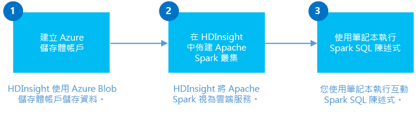
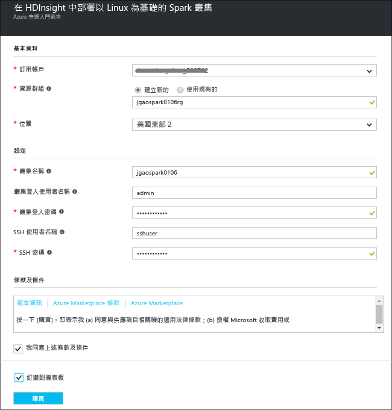
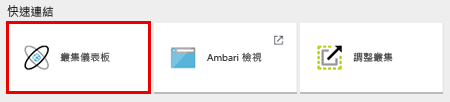

# 開始使用：在 Azure HDInsight 中建立 Apache Spark 叢集並使用 Spark SQL 執行互動式查詢

了解在 HDInsight 中建立 [Apache Spark](hdinsight-apache-spark-overview.md) 叢集，然後使用 [Jupyter](https://jupyter.org) Notebook 對 Spark 叢集執行 Spark SQL 互動式查詢。

   

## 必要條件
* **Azure 訂用帳戶**。 開始進行本教學課程之前，您必須擁有 Azure 訂用帳戶。 請參閱[立即建立免費的 Azure 帳戶](https://azure.microsoft.com/free)。

## 建立 Spark 叢集
在本節中，您會在 HDInsight 中使用 [Azure Resource Manager 範本](https://azure.microsoft.com/resources/templates/101-hdinsight-spark-linux/)建立 Spark 叢集。 如需其他叢集建立方法，請參閱 [建立 HDInsight 叢集](hdinsight-hadoop-provision-linux-clusters.md)。

1. 按一下以下影像，在 Azure 入口網站中開啟範本。         

    

2. 輸入下列值：

    

    * **訂用帳戶**：針對此叢集選取您的 Azure 訂用帳戶。
    * **資源群組**：建立資源群組，或選取現有的資源群組。 資源群組用來管理專案的 Azure 資源。
    * **位置**：選取資源群組的位置。  這個位置也用於預設叢集儲存體和 HDInsight 叢集。
    * **ClusterName**：輸入您將建立的 Hadoop 叢集的名稱。
    * **Spark 版本**︰選取您想要在叢集上安裝的 Spark 版本。
    * 叢集登入名稱和密碼：預設登入名稱是 admin。
    * SSH 使用者名稱和密碼。

   請記下這些值。  稍後在教學課程中需要這些資訊。

3. 選取 [我同意上方所述的條款及條件]，選取 [釘選到儀表板]，然後按一下 [購買]。 您可以看到新的圖格，標題為「提交範本部署的部署」。 大約需要 20 分鐘的時間來建立叢集。

> [!NOTE]
> 本文建立使用 [Azure 儲存體 Blob 做為叢集儲存體](hdinsight-hadoop-use-blob-storage.md)的 Spark 叢集。 除了使用 Azure 儲存體 Blob 做為預設儲存體外，您也可以建立使用 [Azure Data Lake Store](../data-lake-store/data-lake-store-overview.md) 做為額外儲存體的 Spark 叢集。 如需指示，請參閱 [建立具有 Data Lake Store 的 HDInsight 叢集](../data-lake-store/data-lake-store-hdinsight-hadoop-use-portal.md)。
>
>

## 執行 Spark SQL 查詢

在本節中，您會使用 Jupyter Notebook 來針對 Spark 叢集執行 Spark SQL 查詢。 HDInsight Spark 叢集提供三種核心，可讓您用於 Jupyter Notebook。 它們是：

* **PySpark** (適用於以 Python 撰寫的應用程式)
* **PySpark3** (適用於以 Python3 撰寫的應用程式)
* **Spark** (適用於以 Scala 撰寫的應用程式)

在本文中，您會使用 **PySpark** 核心。 如需核心的詳細資訊，請參閱[在 HDInsight 中搭配使用 Jupyter Notebook 核心與 Apache Spark 叢集](hdinsight-apache-spark-jupyter-notebook-kernels.md)。 使用 PySpark 核心的幾個主要優點包括：

* 系統會自動設定 Spark 和 Hive 的內容。
* 使用 cell magic (例如 `%%sql`) 直接執行 SQL 或 Hive 查詢，而不需要任何前置的程式碼片段。
* SQL 或 Hive 查詢的輸出會自動視覺化。

### 使用 PySpark 核心建立 Jupyter Notebook

1. 開啟 [Azure 入口網站](https://portal.azure.com/)。

2. 如果您選擇將叢集釘選至儀表板，從儀表板按一下 [叢集] 圖格以啟動叢集刀鋒視窗。

    如果您未將叢集釘選至儀表板，從左窗格中按一下 [HDInsight 叢集]，然後按一下您建立的叢集。

3. 從 [快速連結]，按一下 [叢集儀表板]，然後按一下 [Jupyter Notebook]。 出現提示時，輸入叢集的系統管理員認證。

   

   > [!NOTE]
   > 您也可以在瀏覽器中開啟下列 URL，來連接到您的叢集的 Jupyter Notebook。 使用您叢集的名稱取代 **CLUSTERNAME** ：
   >
   > `https://CLUSTERNAME.azurehdinsight.net/jupyter`
   >
   >
3. 建立 Notebook。 按一下 [新增]，然後按一下 [PySpark]。

   

   新的 Notebook 隨即建立並以 Untitled(Untitled.pynb) 名稱開啟。

4. 按一下頂端的 Notebook 名稱，然後輸入好記的名稱。

    

5. 將以下程式碼貼入空白儲存格，然後按下 **SHIFT + ENTER** 鍵以執行此程式碼。 此程式碼會匯入此案例所需的類型：

        from pyspark.sql.types import *

    您使用 PySpark 核心建立 Notebook，因此不需要明確建立任何內容。 當您執行第一個程式碼儲存格時，系統會自動為您建立 Spark 和 Hive 內容。

    

    每當您在 Jupyter 中執行作業時，網頁瀏覽器視窗標題將會顯示 Notebook 標題和 **(忙碌)** 狀態。 您也會在右上角的 **PySpark** 文字旁看到一個實心圓。 作業完成後，實心圓將變成空心圓。

6. 執行下列程式碼，以註冊範例資料集做為暫存資料表 (**hvac**)。

        # Load the data
        hvacText = sc.textFile("wasbs:///HdiSamples/HdiSamples/SensorSampleData/hvac/HVAC.csv")

        # Create the schema
        hvacSchema = StructType([StructField("date", StringType(), False),StructField("time", StringType(), False),StructField("targettemp", IntegerType(), False),StructField("actualtemp", IntegerType(), False),StructField("buildingID", StringType(), False)])

        # Parse the data in hvacText
        hvac = hvacText.map(lambda s: s.split(",")).filter(lambda s: s[0] != "Date").map(lambda s:(str(s[0]), str(s[1]), int(s[2]), int(s[3]), str(s[6]) ))

        # Create a data frame
        hvacdf = sqlContext.createDataFrame(hvac,hvacSchema)

        # Register the data frame as a table to run queries against
        hvacdf.registerTempTable("hvac")

    HDInsight 中的 Spark 叢集隨附範例資料檔案 **hvac.csv** (位於 **\HdiSamples\HdiSamples\SensorSampleData\hvac**)。

7. 執行下列程式碼以查詢資料。

        %%sql
        SELECT buildingID, (targettemp - actualtemp) AS temp_diff, date FROM hvac WHERE date = \"6/1/13\"

   由於您使用的是 PySpark 核心，因此現在可在您剛才使用 `%%sql` magic 建立的暫存資料表 **hvac** 上執行 SQL 查詢。 如需 `%%sql` magic 及 PySpark 核心提供的其他 magic 的詳細資訊，請參閱 [使用 Spark HDInsight 叢集之 Jupyter Notebook 上可用的核心](hdinsight-apache-spark-jupyter-notebook-kernels.md#parameters-supported-with-the-sql-magic)。

   預設會顯示下列表格式輸出。

     

    您也可以查看其他視覺效果中的結果。 例如，相同輸出的區域圖看起來會如下所示。

    

9. 應用程式執行完畢之後，請關閉 Notebook 來釋放叢集資源。 若要這樣做，請從 Notebook 的 [檔案] 功能表中，按一下 [關閉並停止]。

## 疑難排解

以下是使用 HDInsight 叢集時可能會遇到的一些常見問題。

### 存取控制需求
[!INCLUDE [access-control](../../includes/hdinsight-access-control-requirements.md)]

## 刪除叢集
[!INCLUDE [delete-cluster-warning](../../includes/hdinsight-delete-cluster-warning.md)]

## 另請參閱
* [概觀：Azure HDInsight 上的 Apache Spark](hdinsight-apache-spark-overview.md)

### 案例
* [Spark 和 BI：在 HDInsight 中搭配使用 Spark 和 BI 工具執行互動式資料分析](hdinsight-apache-spark-use-bi-tools.md)
* [Spark 和機器學習服務：使用 HDInsight 中的 Spark，利用 HVAC 資料來分析建築物溫度](hdinsight-apache-spark-ipython-notebook-machine-learning.md)
* [Spark 和機器學習服務：使用 HDInsight 中的 Spark 來預測食品檢查結果](hdinsight-apache-spark-machine-learning-mllib-ipython.md)
* [Spark 串流：使用 HDInsight 中的 Spark 來建置即時串流應用程式](hdinsight-apache-spark-eventhub-streaming.md)
* [使用 HDInsight 中的 Spark 進行網站記錄分析](hdinsight-apache-spark-custom-library-website-log-analysis.md)
* [HDInsight 中使用 Spark 的 Application Insight 遙測資料分析](hdinsight-spark-analyze-application-insight-logs.md)

### 建立及執行應用程式
* [使用 Scala 建立獨立應用程式](hdinsight-apache-spark-create-standalone-application.md)
* [利用 Livy 在 Spark 叢集上遠端執行作業](hdinsight-apache-spark-livy-rest-interface.md)

### 工具和擴充功能
* [使用 IntelliJ IDEA 的 HDInsight Tools 外掛程式來建立和提交 Spark Scala 應用程式](hdinsight-apache-spark-intellij-tool-plugin.md)
* [使用 IntelliJ IDEA 的 HDInsight Tools 外掛程式遠端偵錯 Spark 應用程式](hdinsight-apache-spark-intellij-tool-plugin-debug-jobs-remotely.md)
* [利用 HDInsight 上的 Spark 叢集來使用 Zeppelin Notebook](hdinsight-apache-spark-use-zeppelin-notebook.md)
* [HDInsight 的 Spark 叢集中 Jupyter Notebook 可用的核心](hdinsight-apache-spark-jupyter-notebook-kernels.md)
* [搭配 Jupyter Notebook 使用外部套件](hdinsight-apache-spark-jupyter-notebook-use-external-packages.md)
* [在電腦上安裝 Jupyter 並連接到 HDInsight Spark 叢集](hdinsight-apache-spark-jupyter-notebook-install-locally.md)

### 管理資源
* [在 Azure HDInsight 中管理 Apache Spark 叢集的資源](hdinsight-apache-spark-resource-manager.md)
* [追蹤和偵錯在 HDInsight 中的 Apache Spark 叢集上執行的作業](hdinsight-apache-spark-job-debugging.md)

[hdinsight-versions]: hdinsight-component-versioning.md
[hdinsight-upload-data]: hdinsight-upload-data.md
[hdinsight-storage]: hdinsight-hadoop-use-blob-storage.md

[azure-purchase-options]: http://azure.microsoft.com/pricing/purchase-options/
[azure-member-offers]: http://azure.microsoft.com/pricing/member-offers/
[azure-free-trial]: http://azure.microsoft.com/pricing/free-trial/
[azure-management-portal]: https://manage.windowsazure.com/
[azure-create-storageaccount]: storage-create-storage-account.md

