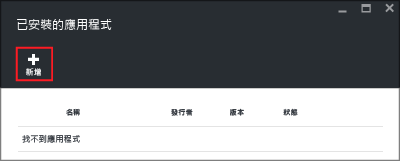
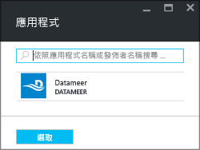
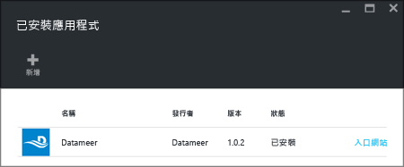

# 在 Azure HDInsight 上安裝協力廠商 Hadoop 應用程式

在本文中，您將學習如何在 Azure HDInsight 上安裝已發佈的協力廠商 Hadoop 應用程式。 如需您自己的應用程式的安裝指示，請參閱[安裝自訂 HDInsight 應用程式](hdinsight-apps-install-custom-applications.md)。

HDInsight 應用程式是使用者可以在以 Linux 為基礎的 HDInsight 叢集上安裝的應用程式。 Microsoft 獨立軟體廠商 (ISV) 或您可以自己開發這些應用程式。  

目前有四個已發佈的應用程式：

* **HDInsight 上的 DATAIKU DDS**：Dataiku DSS (Data Science Studio) 是一套軟體，可讓資料專業人員 (資料科學家、商業分析師、開發人員...) 製作原型、建置及部署非常特定的服務，以將未經處理資料轉換成有影響力的商務預測。
* **Datameer**： [Datameer](http://www.datameer.com/documentation/display/DAS50/Home?ls=Partners&lsd=Microsoft&c=Partners&cd=Microsoft) 會提供互動方式，讓分析師探索、分析和視覺化巨量資料的結果。 輕鬆拉進其他資料來源，以探索新的關聯性並迅速取得您所需的答案。
* **適用於 HDInsight 的 Streamsets 資料收集器**提供功能完整的整合式開發環境 (IDE)，可讓您設計、測試、部署和管理任意至任意內嵌管線 (它會協調資料流與批次資料)，並包括各種資料流內轉換，而完全不必撰寫自訂程式碼。 
* **適用於 HDInsight 的 Cask CDAP 3.5** 提供第一個巨量資料統一整合平台，可減少資料應用程式與 Data Lake 80% 的產出時間。 此應用程式僅支援 Standard HBase 3.4 叢集。

本文提供的指示將使用 Azure 入口網站。 您也可以從入口網站匯出 Azure Resource Manager 範本或從廠商取得 Resource Manage 範本的複本，然後使用 Azure PowerShell 和 Azure CLI 來部署範本。  請參閱 [使用 Resource Manager 範本在 HDInsight 中建立以 Linux 為基礎的 Hadoop 叢集](hdinsight-hadoop-create-linux-clusters-arm-templates.md)。

## 必要條件
如果您想要在現有的 HDInsight 叢集上安裝 HDInsight 應用程式，您必須有 HDInsight 叢集。 若要建立叢集，請參閱 [建立叢集](hdinsight-hadoop-linux-tutorial-get-started.md#create-cluster)。 您也可以在建立 HDInsight 叢集時安裝 HDInsight 應用程式。

## 將應用程式安裝到現有的叢集
下列程序示範如何將 HDInsight 應用程式安裝到現有的 HDInsight 叢集。

**安裝 HDInsight 應用程式**

1. 登入 [Azure 入口網站](https://portal.azure.com)。
2. 按一下左側功能表中的 [HDInsight 叢集]  。  如果沒看到該功能表，請按一下 [更多服務]，然後按一下 [HDInsight 叢集]。
3. 按一下 HDInsight 叢集。  如果您沒有叢集，則必須先建立一個。  請參閱 [建立叢集](hdinsight-hadoop-linux-tutorial-get-started.md#create-cluster)。
4. 按一下 [設定] 類別下的 [應用程式]。 您可以看見已安裝應用程式的清單 (如果有的話)。 如果您無法找到 [應用程式]，就表示沒有任何應用程式適用於這個版本的 HDInsight 叢集。
   
    
5. 按一下刀鋒視窗功能表中的 [新增]  。 
   
    
   
    您可以看到現有 HDInsight 應用程式的清單。
   
    
6. 按一下其中一個應用程式，接受法律條款，然後按一下 [選取] 。

您可以從入口網站通知看到安裝狀態 (按一下入口網站頂端的鈴鐺圖示)。 安裝應用程式之後，應用程式會出現在 [已安裝的應用程式] 刀鋒視窗上。

## 在叢集建立期間安裝應用程式
您可以選擇在建立叢集時安裝 HDInsight 應用程式。 在此過程中，HDInsight 應用程式會在叢集建立並處於執行中狀態後安裝。 下列程序示範如何在建立叢集時安裝 HDInsight 應用程式。

**安裝 HDInsight 應用程式**

1. 登入 [Azure 入口網站](https://portal.azure.com)。
2. 依序按一下 [新增]、[資料 + 分析] 及 [HDInsight]。
3. 輸入 **叢集名稱**：此名稱必須是全域唯一的。
4. 按一下 [訂用帳戶]  ，以選取將用於此叢集的 Azure 訂用帳戶。
5. 按一下 [選取叢集類型] ，然後選取︰
   
   * **叢集類型**︰如果您不知道要選擇哪一個項目，請選取 [Hadoop]。 它是最受歡迎的叢集類型。
   * **作業系統**：選取 [Linux]。
   * **版本**︰ 如果您不知道要選擇哪一個項目，請使用預設版本。 如需詳細資訊，請參閱 [HDInsight 叢集版本](hdinsight-component-versioning.md)。
   * **叢集層**：Azure HDInsight 提供兩種類型的巨量資料雲端提供項目：標準層和進階層。 如需詳細資訊，請參閱 [叢集層](hdinsight-hadoop-provision-linux-clusters.md#cluster-tiers)。
6. 依序按一下 [應用程式]、其中一個已發佈的應用程式，然後按一下 [選取]。
7. 按一下 [認證]  ，然後輸入 admin 使用者的密碼。 您也必須輸入 [SSH 使用者名稱] 以及 [密碼] 或 [公開金鑰]，這將會用來驗證 SSH 使用者。 建議使用公開金鑰的方法。 按一下底部的 [選取]  以儲存認證組態。
8. 按一下 [資料來源] ，選取其中一個現有的儲存體帳戶，或建立新的儲存體帳戶，以做為叢集的預設儲存體帳戶。
9. 按一下 [資源群組名稱] 以選取現有的資源群組，或按一下 [新增] 以建立一個新的資源群組
10. 在 [新的 HDInsight 叢集] 刀鋒視窗中，確認已選取 [釘選到「開始面板」]，然後按一下 [建立]。 

## 列出已安裝的 HDInsight 應用程式和屬性
入口網站會顯示叢集的已安裝 HDInsight 應用程式清單，以及每個已安裝應用程式的屬性。

**列出 HDInsight 應用程式並顯示屬性**

1. 登入 [Azure 入口網站](https://portal.azure.com)。
2. 按一下左側功能表中的 [HDInsight 叢集]  。  如果沒有看到該功能表，請按一下 [瀏覽]，然後按一下 [HDInsight 叢集]。
3. 按一下 HDInsight 叢集。
4. 在 [設定] 刀鋒視窗中，按一下 [一般] 類別之下的 [應用程式]。 [已安裝的應用程式] 刀鋒視窗會列出所有已安裝的應用程式。 
   
    
5. 按一下其中一個已安裝的應用程式，以顯示屬性。 屬性刀鋒視窗會列出︰
   
   * 應用程式名稱：應用程式名稱。
   * 狀態︰應用程式狀態。 
   * 網頁︰您已部署到邊緣節點的 Web 應用程式的 URL (如果有的話)。 此認證與您針對叢集設定的 HTTP 使用者認證相同。
   * HTTP 端點︰此認證與您針對叢集設定的 HTTP 使用者認證相同。 
   * SSH 端點︰您可以使用 [SSH](hdinsight-hadoop-linux-use-ssh-unix.md) 連接到邊緣節點。 SSH 認證與您針對叢集設定的 SSH 使用者認證相同。
6. 若要刪除應用程式，請以滑鼠右鍵按一下應用程式，然後按一下內容功能表中的 [刪除]  。

## 連接到邊緣節點
您可以使用 HTTP 和 SSH 連接到邊緣節點。 您可以在 [入口網站](#list-installed-hdinsight-apps-and-properties)中找到端點資訊。 如需使用 SSH 的詳細資訊，請參閱 [從 Linux、Unix 或 OS X 在 HDInsight 上搭配使用 SSH 與以 Linux 為基礎的 Hadoop](hdinsight-hadoop-linux-use-ssh-unix.md)。 

HTTP 端點認證是您已針對 HDInsight 叢集設定的 HTTP 使用者認證；SSH 端點認證就是您已針對 HDInsight 叢集設定的 SSH 認證。

## 疑難排解
請參閱[針對安裝問題進行疑難排解](hdinsight-apps-install-custom-applications.md#troubleshoot-the-installation)。

## 後續步驟
* [安裝自訂 HDInsight 應用程式](hdinsight-apps-install-custom-applications.md)︰了解如何將未發佈的 HDInsight 應用程式部署到 HDInsight。
* [發佈 HDInsight 應用程式](hdinsight-apps-publish-applications.md)︰了解如何將自訂 HDInsight 應用程式發佈至 Azure Marketplace。
* [MSDN：安裝 HDInsight 應用程式](https://msdn.microsoft.com/library/mt706515.aspx)︰了解如何定義 HDInsight 應用程式。
* [使用指令碼動作自訂以 Linux 為基礎的 HDInsight 叢集](hdinsight-hadoop-customize-cluster-linux.md)：了解如何使用指令碼動作來安裝其他應用程式。
* [使用 Resource Manager 範本在 HDInsight 中建立以 Linux 為基礎的 Hadoop 叢集](hdinsight-hadoop-create-linux-clusters-arm-templates.md)︰了解如何呼叫 Resource Manager 範本來建立 HDInsight 叢集。
* [在 HDInsight 中使用空白邊緣節點](hdinsight-apps-use-edge-node.md)︰了解如何使用空白邊緣節點來存取 HDInsight 叢集、測試 HDInsight 應用程式，以及裝載 HDInsight 應用程式。

