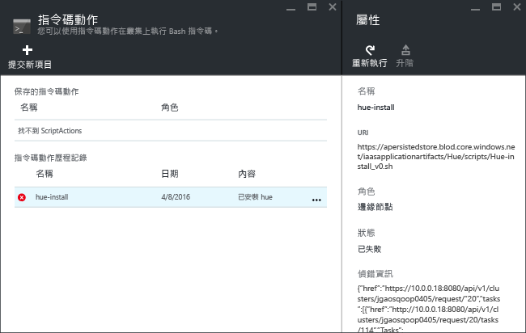

# 在 Azure HDInsight 上安裝自訂 Hadoop 應用程式

在本文中，您將學習如何在 Azure HDInsight 上安裝尚未發佈至 Azure 入口網站的 Hadoop 應用程式。 在本文中，您將安裝的應用程式是 [Hue](http://gethue.com/)。

HDInsight 應用程式是使用者可以在以 Linux 為基礎的 HDInsight 叢集上安裝的應用程式。  Microsoft 獨立軟體廠商 (ISV) 或您可以自己開發這些應用程式。  

如需其他相關文章，請參閱：

* [安裝 HDInsight 應用程式](hdinsight-apps-install-applications.md)︰了解如何將 HDInsight 應用程式安裝到您的叢集。
* [發佈 HDInsight 應用程式](hdinsight-apps-publish-applications.md)︰了解如何將自訂 HDInsight 應用程式發佈至 Azure Marketplace。
* [MSDN：安裝 HDInsight 應用程式](https://msdn.microsoft.com/library/mt706515.aspx)︰了解如何定義 HDInsight 應用程式。

## 必要條件
如果您想要在現有的 HDInsight 叢集上安裝 HDInsight 應用程式，您必須有 HDInsight 叢集。 若要建立叢集，請參閱 [建立叢集](hdinsight-hadoop-linux-tutorial-get-started.md#create-cluster)。 您也可以在建立 HDInsight 叢集時安裝 HDInsight 應用程式。

## 安裝 HDInsight 應用程式
HDInsight 應用程式可以在您建立叢集時安裝，或安裝至現有的 HDInsight 叢集。 如需定義 Azure Resource Manager 範本，請參閱 [MSDN：安裝 HDInsight 應用程式](https://msdn.microsoft.com/library/mt706515.aspx)。

部署此應用程式 (Hue) 所需的檔案︰

* [azuredeploy.json](https://github.com/hdinsight/Iaas-Applications/blob/master/Hue/azuredeploy.json)：可供安裝 HDInsight 應用程式的 Resource Manager 範本。 如需開發您自己的 Resource Manager 範本，請參閱 [MSDN：安裝 HDInsight 應用程式](https://msdn.microsoft.com/library/mt706515.aspx) 。
* [hue-install_v0.sh](https://github.com/hdinsight/Iaas-Applications/blob/master/Hue/scripts/Hue-install_v0.sh)：Resource Manager 範本為了設定邊緣節點所呼叫的指令碼動作。
* [hue-binaries.tgz](https://hdiconfigactions.blob.core.windows.net/linuxhueconfigactionv01/hue-binaries-14-04.tgz)︰從 hui-install_v0.sh 呼叫的 Hue 二進位檔。
* [hue-binaries-14-04.tgz](https://hdiconfigactions.blob.core.windows.net/linuxhueconfigactionv01/hue-binaries-14-04.tgz)︰從 hui-install_v0.sh 呼叫的 Hue 二進位檔。
* [webwasb-tomcat.tar.gz](https://hdiconfigactions.blob.core.windows.net/linuxhueconfigactionv01/webwasb-tomcat.tar.gz)：從 hui-install_v0.sh 呼叫的範例 Web 應用程式 (Tomcat)。

**將 Hue 安裝至現有的 HDInsight 叢集**

1. 按一下以下影像，在 Azure 入口網站中登入 Azure 並開啟 Resource Manager 範本。

    

    此按鈕會在 Azure 入口網站上開啟 Resource Manager 範本。  Resource Manager 範本位於 [https://github.com/hdinsight/Iaas-Applications/tree/master/Hue](https://github.com/hdinsight/Iaas-Applications/tree/master/Hue)。  若要了解如何撰寫此 Resource Manager 範本，請參閱 [MSDN：安裝 HDInsight 應用程式](https://msdn.microsoft.com/library/mt706515.aspx)。
2. 從 [參數]  刀鋒視窗，輸入下列項目：

   * **ClusterName**：輸入您要安裝應用程式的叢集名稱。 此叢集必須是現有的叢集。
3. 按一下 [確定]  儲存參數。
4. 從 [自訂部署] 刀鋒視窗，輸入 [資源群組]。  資源群組是聚集叢集、相依儲存體帳戶和其他資源的容器。 必須使用與叢集相同的資源群組。
5. 按一下 [法律條款]，然後按一下 [建立]。
6. 確認已選取 [釘選到儀表板] 核取方塊，然後按一下 [建立]。 您可以從釘選到入口網站儀表板和入口網站通知的圖格查看安裝狀態 (按一下入口網站頂端的鈴鐺圖示)。  安裝此應用程式需要 10 分鐘左右。

**在建立叢集時安裝 Hue**

1. 按一下以下影像，在 Azure 入口網站中登入 Azure 並開啟 Resource Manager 範本。

    

    此按鈕會在 Azure 入口網站上開啟 Resource Manager 範本。  Resource Manager 範本位於 [https://hditutorialdata.blob.core.windows.net/hdinsightapps/create-linux-based-hadoop-cluster-in-hdinsight.json](https://hditutorialdata.blob.core.windows.net/hdinsightapps/create-linux-based-hadoop-cluster-in-hdinsight.json)。  若要了解如何撰寫此 Resource Manager 範本，請參閱 [MSDN：安裝 HDInsight 應用程式](https://msdn.microsoft.com/library/mt706515.aspx)。
2. 請依照指示來建立叢集和安裝 Hue。 如需建立 HDInsight 叢集的詳細資訊，請參閱 [在 HDInsight 中建立以 Linux 為基礎的 Hadoop 叢集](hdinsight-hadoop-provision-linux-clusters.md)。

除了 Azure 入口網站，您也可以使用 [Azure PowerShell](hdinsight-hadoop-create-linux-clusters-arm-templates.md#deploy-with-powershell) 和 [Azure CLI](hdinsight-hadoop-create-linux-clusters-arm-templates.md#deploy-with-cli) 來呼叫 Resource Manager 範本。

## 驗證安裝
您可以在 Azure 入口網站上檢查應用程式狀態以驗證應用程式安裝。 此外，您也可以驗證所有如預期般出現的 HTTP 端點及網頁 (如果有的話)︰

**開啟 Hue 入口網站**

1. 登入 [Azure 入口網站](https://portal.azure.com)。
2. 按一下左側功能表中的 [HDInsight 叢集]  。  如果沒有看到該功能表，請按一下 [瀏覽]，然後按一下 [HDInsight 叢集]。
3. 按一下您已安裝應用程式的叢集。
4. 在 [設定] 刀鋒視窗中，按一下 [一般] 類別之下的 [應用程式]。 您應該會看到 **Hue** 列在 [已安裝的應用程式] 刀鋒視窗中。
5. 按一下清單中的 **Hue** 以列出相關屬性。  
6. 按一下 [網頁] 連結來驗證網站；在瀏覽器中開啟 HTTP 端點以驗證 Hue Web UI，使用 [PuTTY](hdinsight-hadoop-linux-use-ssh-windows.md) 或其他 [SSH 用戶端](hdinsight-hadoop-linux-use-ssh-unix.md)開啟 SSH 端點。

## 安裝疑難排解
您可以從入口網站通知檢查應用程式安裝狀態 (按一下入口網站頂端的鈴鐺圖示)。

如果應用程式安裝失敗，您可以從 3 個地方查看錯誤訊息和偵錯資訊︰

* HDInsight 應用程式︰一般錯誤資訊。

    從入口網站中開啟叢集，然後從 [設定] 刀鋒視窗按一下 [應用程式]︰

    
* HDInsight 指令碼動作︰如果 HDInsight 應用程式的錯誤訊息指出指令碼動作失敗，則 [指令碼動作] 窗格會顯示指令碼失敗的詳細資訊。

    從 [設定] 刀鋒視窗按一下 [指令碼動作]。 指令碼動作歷程記錄會顯示錯誤訊息

    
* Ambari Web UI︰如果安裝指令碼是失敗的原因，請使用 Ambari Web UI 來檢查有關安裝指令碼的完整記錄檔。

    如需詳細資訊，請參閱 [疑難排解](hdinsight-hadoop-customize-cluster-linux.md#troubleshooting)。

## 移除 HDInsight 應用程式
有幾種方式可以刪除 HDInsight 應用程式。

### 使用入口網站
**使用入口網站移除應用程式**

1. 登入 [Azure 入口網站](https://portal.azure.com)。
2. 按一下左側功能表中的 [HDInsight 叢集]  。  如果沒有看到該功能表，請按一下 [瀏覽]，然後按一下 [HDInsight 叢集]。
3. 按一下您已安裝應用程式的叢集。
4. 在 [設定] 刀鋒視窗中，按一下 [一般] 類別之下的 [應用程式]。 您應該會看到已安裝的應用程式清單。 在此教學課程中，**hue** 列在 [已安裝的應用程式] 刀鋒視窗中。
5. 以滑鼠右鍵按一下您想要移除的應用程式，然後按一下 [刪除] 。
6. 按一下 [ **是** ] 以確認。

在入口網站中，您也可以刪除叢集，或刪除包含應用程式的資源群組。

### 使用 Azure PowerShell
使用 Azure PowerShell，您就可以刪除叢集或刪除資源群組。 請參閱 [使用 Azure PowerShell 刪除叢集](hdinsight-administer-use-powershell.md#delete-clusters)。

### 使用 Azure CLI
使用 Azure CLI，您就可以刪除叢集或刪除資源群組。 請參閱 [使用 Azure CLI 刪除叢集](hdinsight-administer-use-command-line.md#delete-clusters)。

## 後續步驟
* [MSDN：安裝 HDInsight 應用程式](https://msdn.microsoft.com/library/mt706515.aspx)︰了解如何開發 Resource Manager 範本以供部署 HDInsight 應用程式。
* [安裝 HDInsight 應用程式](hdinsight-apps-install-applications.md)︰了解如何將 HDInsight 應用程式安裝到您的叢集。
* [發佈 HDInsight 應用程式](hdinsight-apps-publish-applications.md)︰了解如何將自訂 HDInsight 應用程式發佈至 Azure Marketplace。
* [使用指令碼動作自訂以 Linux 為基礎的 HDInsight 叢集](hdinsight-hadoop-customize-cluster-linux.md)：了解如何使用指令碼動作來安裝其他應用程式。
* [使用 Resource Manager 範本在 HDInsight 中建立以 Linux 為基礎的 Hadoop 叢集](hdinsight-hadoop-create-linux-clusters-arm-templates.md)︰了解如何呼叫 Resource Manager 範本來建立 HDInsight 叢集。
* [在 HDInsight 中使用空白邊緣節點](hdinsight-apps-use-edge-node.md)︰了解如何使用空白邊緣節點來存取 HDInsight 叢集、測試 HDInsight 應用程式，以及裝載 HDInsight 應用程式。

