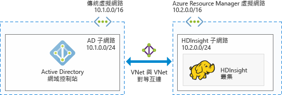
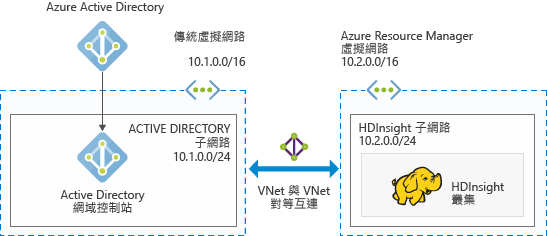

# 規劃 HDInsight 中已加入網域的 Azure Hadoop 叢集

傳統的 Hadoop 是單一使用者叢集。 它適合大部分以小型應用程式團隊建置大型資料工作負載的公司。 隨著 Hadoop 日益普及，許多企業都轉而採用由 IT 團隊管理叢集，且多個應用程式團隊共用叢集的模式。 因此，Azure HDInsight 中呼聲最高的就是涉及多使用者叢集的功能。

HDInsight 不會建置自己的多使用者驗證和授權，而是依賴最受歡迎的識別提供者 -- Azure Active Directory (Azure AD)。 Azure AD 強大的安全性功能可用來管理 HDInsight 中的多使用者授權。 藉由整合 HDInsight 與 Azure AD，您可以使用 Azure AD 認證來與叢集通訊。 HDInsight 會將 Azure AD 使用者對應至本機 Hadoop 使用者，讓通過驗證的使用者能在 HDInsight 上順暢地執行 Ambari、Hive 伺服器、Ranger、Spark Thrift 伺服器等所有服務。

## 整合 HDInsight 與 Azure AD

藉由整合 HDInsight 與 Azure AD，HDInsight 叢集節點會加入 Azure AD 網域。 HDInsight 會針對在叢集上執行的 Hadoop 服務建立服務主體，並將它們放在 Azure AD 中指定的組織單位 (OU) 內。 HDInsight 也會針對加入網域的節點 IP 位址，在 Azure AD 網域中建立反向 DNS 對應。

您可以使用多個架構來達到這種設定。 您可以選擇下列架構。

**HDInsight 與 Azure IaaS 上執行的 AD 整合**

這是最簡單的 HDInsight 與 Azure AD 整合架構。 Azure AD 網域控制站會在 Azure 中的一部 (或多部) 虛擬機器 (VM) 上執行。 這些 VM 通常位於虛擬網路中。 您可為 HDInsight 叢集設定另一個虛擬網路。 為了讓 HDInsight 能與 Azure AD 通訊，您必須使用 [VNet 對 VNet 對等互連](../virtual-network/virtual-networks-create-vnetpeering-arm-portal.md)來對等互連這些虛擬網路。

> [!NOTE]
> 在此架構中，您無法搭配使用 Azure Data Lake Store 與 HDInsight 叢集。

Azure AD 的必要條件：

* 您必須建立[組織單位](../active-directory-domain-services/active-directory-ds-admin-guide-create-ou.md)，以在其中放置叢集所用的 HDInsight 叢集 VM 和服務主體。
* 必須設定[輕量型目錄存取通訊協定](../active-directory-domain-services/active-directory-ds-admin-guide-configure-secure-ldap.md) (LDAP)，才能與 Azure AD 進行通訊。 用來設定 LDAPS 的憑證必須是真正的憑證 (而非自我簽署憑證)。
* 必須在網域上建立反向 DNS 區域，以供 HDInsight 子網路的 IP 位址範圍使用 (例如上一張圖中的 10.2.0.0/24)。
* 需要服務帳戶或使用者帳戶。 使用此帳戶來建立 HDInsight 叢集。 此帳戶必須具備下列權限：

    - 在組織單位內建立服務主體物件和電腦物件的權限
    - 建立反向 DNS Proxy 規則的權限
    - 將電腦加入 Active Directory 網域的權限

**HDInsight 與僅限雲端的 Azure AD 整合**

若為僅限雲端的 Azure AD，請設定網域控制站，讓 HDInsight 可以與 Azure AD 整合。 使用 [Azure Active Directory Domain Dervices](../active-directory-domain-services/active-directory-ds-overview.md) (Azure AD DS) 即可達成此目的。 Azure AD DS 可在雲端建立網域控制站電腦，並提供 IP 位址。 它會建立兩個網域控制站，以達到高可用性。

目前，Azure AD DS 只存在於傳統虛擬網路。 只能使用 Azure 傳統入口網站來存取。 HDInsight 虛擬網路存在於 Azure 入口網站，必須使用 VNet 對 VNet 對等互連來與傳統虛擬網路對等互連。

> [!NOTE]
> 傳統虛擬網路與 Azure Resource Manager 虛擬網路之間對等互連時，兩個虛擬網路必須位於相同區域中，而且在相同 Azure 訂用帳戶之下。

Azure AD 的必要條件：

* 您必須建立[組織單位](../active-directory-domain-services/active-directory-ds-admin-guide-create-ou.md)，以在其中放置叢集所用的 HDInsight 叢集 VM 和服務主體。
* 您必須在設定 Azure AD DS 時設定 [LDAPS](../active-directory-domain-services/active-directory-ds-admin-guide-configure-secure-ldap.md)。 必須使用真正的憑證 (而非自我簽署憑證) 來設定 LDAPS 的憑證。
* 必須在網域上建立反向 DNS 區域，以供 HDInsight 子網路的 IP 位址範圍使用 (例如上一張圖中的 10.2.0.0/24)。
* [密碼雜湊](../active-directory-domain-services/active-directory-ds-getting-started-password-sync.md)必須從 Azure AD 同步處理至 Azure AD DS。
* 需要服務帳戶或使用者帳戶。 使用此帳戶來建立 HDInsight 叢集。 此帳戶必須具備下列權限：

    - 在組織單位內建立服務主體物件和電腦物件的權限
    - 建立反向 DNS Proxy 規則的權限
    - 將電腦加入 Azure AD 網域的權限

## 後續步驟
* 若要設定已加入網域的 HDInsight 叢集，請參閱[設定已加入網域的 HDInisight 叢集](hdinsight-domain-joined-configure.md)。
* 若要管理已加入網域的 HDInsight 叢集，請參閱[管理已加入網域的 HDInisight 叢集](hdinsight-domain-joined-manage.md)。
* 若要設定 Hive 原則和執行 Hive 查詢，請參閱[針對已加入網域的 HDInsight 叢集設定 Hive 原則](hdinsight-domain-joined-run-hive.md)。
* 若要在已加入網域的 HDInsight 叢集上使用 SSH 執行 Hive 查詢，請參閱[搭配 HDInsight 使用 SSH](hdinsight-hadoop-linux-use-ssh-unix.md)。

