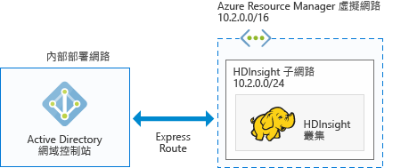

# 規劃 HDInsight 中已加入網域的 Azure Hadoop 叢集

傳統的 Hadoop 是單一使用者叢集。 它適合於大部分以小型應用程式小組建置其巨量資料工作負載的公司。 隨著 Hadoop 日益普及，許多企業都轉而採用下模型：由 IT 團隊管理叢集，而且多個應用程式小組共用叢集。 因此，多使用者叢集是 HDInsight 中最常要求的功能之一。

HDInsight 不會建置自己的多使用者驗證和授權，而是依賴最受歡迎的識別提供者 – Active Directory (AD)。 Active Directory 中的強大安全性群組功能可用來管理 HDInsight 中的多使用者授權。 藉由整合 HDInsight 與 Active Directory，Active Directory 使用者可以使用其 Active Directory 認證來與叢集通訊。 HDInsight 會將 Active Directory 使用者對應至本機 Hadoop 使用者，以便在 HDInsight 上執行的所有服務 (Ambari、Hive 伺服器、Ranger、Spark Thrift 伺服器等) 能針對經過驗證的使用者順暢運作。

## 整合 HDInsight 與 Active Directory

藉由整合 HDInsight 與 Active Directory，HDInsight 叢集節點會加入 Active Directory 網域。 HDInsight 會針對在叢集上執行的 Hadoop 服務建立服務主體，並將它們放在 Active Directory 中指定的組織單位 (OU) 內。 HDInsight 也會針對加入網域的節點 IP 位址，在 Active Directory 網域中建立反向 DNS 對應。

若要達成此設定，有多個架構可供您遵循。 您必須決定哪個架構比較適合您。

**1.HDInsight 已與在 Azure IAAS 上執行的 AD 整合**

這是最簡單的 HDInsight 與 Active Directory 整合架構。 Active Directory 網域控制站會在 Azure 中的一部 (或多部) 虛擬機器 (VM) 上執行。 這些 VM 通常位於虛擬網路內。 您可為 HDInsight 叢集設定另一個虛擬網路。 為了讓 HDInsight 能與 Active Directory 通訊，您必須使用 [VNet 對 VNet 對等互連](../virtual-network/virtual-networks-create-vnetpeering-arm-portal.md)來對等互連這些虛擬網路。

> [!NOTE]
> 在此架構中，您無法搭配使用 Azure Data Lake Store 與 HDInsight 叢集。
 

Active Directory 的必要條件︰

* 您必須建立[組織單位](../active-directory-domain-services/active-directory-ds-admin-guide-create-ou.md)，以在其中放置叢集所用的 HDInsight 叢集 VM 和服務主體。
* 必須設定 [LDAPS](../active-directory-domain-services/active-directory-ds-admin-guide-configure-secure-ldap.md)，以便與 Active Directory 進行通訊。 用來設定 LDAPS 的憑證必須是真正的憑證 (而非自我簽署憑證)。
* 必須在網域上建立反向 DNS 區域，以供 HDInsight 子網路的 IP 位址範圍使用 (例如上一張圖中的 10.2.0.0/24)。
* 需要服務帳戶或使用者帳戶，以便用來建立 HDInsight 叢集。 此帳戶必須具備下列權限：

    - 在組織單位內建立服務主體物件和電腦物件的權限。
    - 建立反向 DNS Proxy 規則的權限
    - 將電腦加入 Active Directory 網域的權限。

**2.HDInsight 已與僅限雲端的 Azure AD 整合**

對於僅限雲端的 Azure Active Directory (Azure AD)，您必須設定網域控制站，HDInsight 才能與 Azure Active Directory 整合。 使用 [Azure Active Directory Domain Services](../active-directory-domain-services/active-directory-ds-overview.md) (Azure AD DS) 即可達成此目的。 Azure AD DS 可在雲端建立網域控制站電腦，並為您提供其 IP 位址。 它會建立兩個網域控制站，以達到高可用性。

目前，Azure AD DS 只存在於傳統 VNet。 它只能使用傳統 Azure 入口網站存取。 HDInsight VNet 存在於 Azure 入口網站，它必須使用 VNet 對 VNet 對等互連來與傳統 VNet 對等互連。

> [!NOTE]
> 傳統 VNet 與 Azure Resource Manager VNet 之間的對等互連要求兩個 VNet 位於相同區域中，而且這兩個 VNet 位於相同 Azure 訂用帳戶之下。

Active Directory 的必要條件︰

* 您必須建立[組織單位](../active-directory-domain-services/active-directory-ds-admin-guide-create-ou.md)，以在其中放置叢集所用的 HDInsight 叢集 VM 和服務主體。 
* 您必須在設定 AD DS 時設定 [LDAPS](../active-directory-domain-services/active-directory-ds-admin-guide-configure-secure-ldap.md)。 用來設定 LDAPS 的憑證必須是真正的憑證 (而非自我簽署憑證)。
* 必須在網域上建立反向 DNS 區域，以供 HDI 子網路的 IP 位址範圍使用 (例如上一張圖中的 10.2.0.0/24)。 
* [密碼雜湊](../active-directory-domain-services/active-directory-ds-getting-started-password-sync.md)必須從 Azure AD 同步處理至 AD DS。
* 需要服務帳戶或使用者帳戶，以便用來建立 HDInsight 叢集。 此帳戶必須具備下列權限：

    - 在組織單位內建立服務主體物件和電腦物件的權限。
    - 建立反向 DNS Proxy 規則的權限
    - 將電腦加入 Active Directory 網域的權限。

**3.HDInsight 已透過 VPN 與內部部署 AD 整合**

此架構類似於第 1 種架構。 唯一的差別在於，Active Directory 會在內部部署，而且 HDInsight 與 Active Directory 之間的通訊是透過[從 Azure 到內部部署網路的 VPN 連線](../expressroute/expressroute-introduction.md)來達成。

> [!NOTE]
> 在此架構中，您無法搭配使用 Azure Data Lake Store 與 HDInsight 叢集。

Active Directory 的必要條件︰

* 您必須建立[組織單位](../active-directory-domain-services/active-directory-ds-admin-guide-create-ou.md)，以在其中放置叢集所用的 HDInsight 叢集 VM 和服務主體。
* 必須設定 [LDAPS](../active-directory-domain-services/active-directory-ds-admin-guide-configure-secure-ldap.md)，以便與 Active Directory 進行通訊。 用來設定 LDAPS 的憑證必須是真正的憑證 (而非自我簽署憑證)。
* 必須在網域上建立反向 DNS 區域，以供 HDI 子網路的 IP 位址範圍使用 (例如上一張圖中的 10.2.0.0/24)。
* 需要服務帳戶或使用者帳戶，以便用來建立 HDInsight 叢集。 此帳戶必須具備下列權限：

    - 在組織單位內建立服務主體物件和電腦物件的權限。
    - 建立反向 DNS Proxy 規則的權限
    - 將電腦加入 Active Directory 網域的權限。

**4.HDInsight 已與同步處理至 Azure AD 的內部部署 AD 整合**

此架構類似於第 2 種架構。 唯一的差別在於，內部部署 Active Directory 已同步處理至 Azure Active Directory。 您必須在雲端設定網域控制站，HDInsight 才能與 Azure Active Directory 整合。 使用 [Azure Active Directory Domain Services](../active-directory-domain-services/active-directory-ds-overview.md) (AD DS) 即可達成此目的。 AD DS 可在雲端建立網域控制站電腦，並為您提供其 IP 位址。 它會建立兩個網域控制站，以達到高可用性。

目前，Azure AD DS 只存在於傳統 VNet。 它只能使用傳統 Azure 入口網站存取。 HDInsight VNet 存在於 Azure 入口網站，它必須使用 VNet 對 VNet 對等互連來與傳統 VNet 對等互連。

> [!NOTE]
> 傳統 VNet 與 Azure Resource Manager VNet 之間的對等互連要求兩個 VNet 位於相同區域中，而且這兩個 VNet 位於相同 Azure 訂用帳戶之下。

Active Directory 的必要條件︰

* 您必須建立[組織單位](../active-directory-domain-services/active-directory-ds-admin-guide-create-ou.md)，以在其中放置叢集所用的 HDInsight 叢集 VM 和服務主體。 
* 您必須在設定 AD DS 時設定 [LDAPS](../active-directory-domain-services/active-directory-ds-admin-guide-configure-secure-ldap.md)。 用來設定 LDAPS 的憑證必須是真正的憑證 (而非自我簽署憑證)。
* 必須在網域上建立反向 DNS 區域，以供 HDI 子網路的 IP 位址範圍使用 (例如上一張圖中的 10.2.0.0/24)。 
* [密碼雜湊](../active-directory-domain-services/active-directory-ds-getting-started-password-sync.md)必須從 Azure AD 同步處理至 AD DS。
* 需要服務帳戶或使用者帳戶，以便用來建立 HDInsight 叢集。 此帳戶必須具備下列權限：

    - 在組織單位內建立服務主體物件和電腦物件的權限。
    - 建立反向 DNS Proxy 規則的權限
    - 將電腦加入 Active Directory 網域的權限。

**5.HDInsight 已與非預設 Azure AD 整合 (建議僅用於測試和開發)**

此架構類似於第 2 種架構。 對大部分公司而言，Active Directory 的系統管理存取權受限於特定個人。 因此，當您想要進行概念性驗證，或只要嘗試建立已加入網域的叢集，而不是等待系統管理員設定 Active Directory 的必要條件時，只是在訂用帳戶中建立新 Azure Active Directory 很有幫助。 由於這是您建立的 Azure AD，所以您有此 Azure AD 的完整權限可設定 AD DS。

AD DS 可在雲端建立網域控制站電腦，並為您提供其 IP 位址。 它會建立兩個網域控制站，以達到高可用性。

AD DS 目前只存在於傳統 VNet 中，因此您需要存取傳統入口網站，而且需要建立傳統 VNet 才能設定 AD DS。 HDInsight VNet 存在於 Azure 入口網站，它必須使用 VNet 對 VNet 對等互連來與傳統 VNet 對等互連。

> [!NOTE]
> 傳統與 Azure Resource Manager VNet 之間的對等互連要求兩個 VNet 位於相同區域中，而且這兩個 VNet 位於相同 Azure 訂用帳戶之下。

Active Directory 的必要條件︰

* 您必須建立[組織單位](../active-directory-domain-services/active-directory-ds-admin-guide-create-ou.md)，以在其中放置叢集所用的 HDInsight 叢集 VM 和服務主體。 
* 您必須在設定 AD DS 時設定 [LDAPS](../active-directory-domain-services/active-directory-ds-admin-guide-configure-secure-ldap.md)。 您可以建立[自我簽署的憑證](../active-directory-domain-services/active-directory-ds-admin-guide-configure-secure-ldap.md)以設定 LDAPS。 不過，若要使用自我簽署的憑證，您需要從 <a href="mailto:hdipreview@microsoft.com">hdipreview@microsoft.com</a> 要求例外狀況。
* 必須在網域上建立反向 DNS 區域，以供 HDI 子網路的 IP 位址範圍使用 (例如上一張圖中的 10.2.0.0/24)。 
* [密碼雜湊](../active-directory-domain-services/active-directory-ds-getting-started-password-sync.md)必須從 Azure AD 同步處理至 AD DS。
* 需要服務帳戶或使用者帳戶，以便用來建立 HDInsight 叢集。 此帳戶必須具備下列權限：

    - 在組織單位內建立服務主體物件和電腦物件的權限。
    - 建立反向 DNS Proxy 規則的權限
    - 將電腦加入 Active Directory 網域的權限。

## 後續步驟
* 如需設定已加入網域的 HDInsight 叢集，請參閱[設定已加入網域的 HDInisight 叢集](hdinsight-domain-joined-configure.md)。
* 如需管理已加入網域的 HDInsight 叢集，請參閱[管理已加入網域的 HDInisight 叢集](hdinsight-domain-joined-manage.md)。
* 如需設定 Hive 原則和執行 Hive 查詢，請參閱[針對已加入網域的 HDInisight 叢集設定 Hive 原則](hdinsight-domain-joined-run-hive.md)。
* 如需使用 SSH 在已加入網域的 HDInsight 叢集上執行 Hive 查詢，請參閱 [從 Linux、Unix 或 OS X 在 HDInsight 上搭配使用 SSH 與以 Linux 為基礎的 Hadoop](hdinsight-hadoop-linux-use-ssh-unix.md)。

<!--HONumber=Feb17_HO1-->

