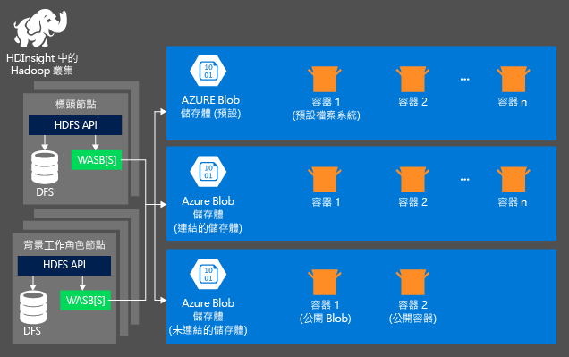
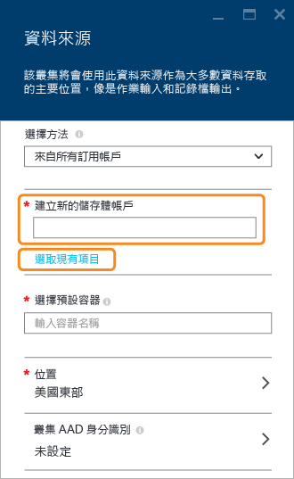

# 在 HDInsight 上搭配 Hadoop 使用 HDFS 相容的儲存體

若要分析 HDInsight 叢集中的資料，您可以在 Azure 儲存體、Azure Data Lake Store，或兩者中儲存資料。 這兩種儲存體選項都可讓您安全地刪除用於計算的 HDInsight 叢集，而不會遺失使用者資料。

Hadoop 支援預設檔案系統的概念。 預設檔案系統意指預設配置和授權。 也可用來解析相對路徑。 進行 HDInsight 叢集建立程序時，您可以指定 Azure Blob 儲存體中的 Blob 容器作為預設檔案系統，或在使用 HDInsight 3.5 時，選取 Azure 儲存體或 Azure Data Lake Store 做為預設檔案系統。

在本文中，您將了解這兩個儲存體選項如何使用 HDInsight 叢集。 如需關於建立 HDInsight 叢集的詳細資訊，請參閱[開始使用 HDInsight](hdinsight-hadoop-linux-tutorial-get-started.md)。

## 搭配 HDInsight 叢集使用 Azure 儲存體

Azure 儲存體是強大的一般用途儲存體解決方案，其完美整合了 HDInsight。 HDInsight 可以使用 Azure 儲存體中的 Blob 容器做為叢集的預設檔案系統。 透過 Hadoop 分散式檔案系統 (HDFS) 介面，HDInsight 中的完整元件集可直接處理儲存為 Blob 的結構化或非結構化資料。

> [!WARNING]
> 建立 Azure 儲存體帳戶時，有數個選項可供使用。 下表提供 HDInsight 所支援選項的相關資訊︰
> 
> | 儲存體帳戶類型 | 儲存層 | 支援 HDInsight |
> | ------- | ------- | ------- |
> | 一般用途的儲存體帳戶 | 標準 | __是__ |
> | &nbsp; | 進階 | 否 |
> | Blob 儲存體帳戶 | 經常性存取 | 否 |
> | &nbsp; | 非經常性存取 | 否 |

### HDInsight 儲存架構
下圖提供 HDInsight 儲存架構的摘要檢視：

HDInsight 可以存取本機連接至計算節點的分散式檔案系統。 可使用完整 URI 來存取此檔案系統，例如：

    hdfs://<namenodehost>/<path>

此外，HDInsight 也能夠存取儲存在 Azure 儲存體中的資料。 語法為：

    wasb[s]://<containername>@<accountname>.blob.core.windows.net/<path>

以下是搭配 HDInsight 叢集使用 Azure 儲存體帳戶時的一些考量。

* **儲存體帳戶中連線至叢集的容器：** 因為在建立期間帳戶名稱和金鑰會與叢集相關聯，所以您對這些容器中的 Blob 具有完整存取權。

* **儲存體帳戶中未連線至叢集的公用容器或公用 Blob：** 您對容器中的 Blob 只有唯讀權限。
  
  > [!NOTE]
  > 公用容器可讓您取得該容器中所有可用的 Blob 清單，並取得容器中繼資料。 公用 Blob 只在您知道確切的 URL 時才可讓您存取 Blob。 如需詳細資訊，請參閱<a href="http://msdn.microsoft.com/library/windowsazure/dd179354.aspx">限制對容器和 Blob 的存取</a>。
  > 
  > 
* **儲存體帳戶中未連接至叢集的私人容器：** 除非在提交 WebHCat 工作時定義儲存體帳戶，否則不能存取容器中的 Blob。 稍後在本文中會加以說明。

建立程序及其金鑰中定義的儲存體帳戶會儲存在叢集節點的 %HADOOP_HOME%/conf/core-site.xml 中。 HDInsight 的預設行為是使用 core-site.xml 檔案中定義的儲存體帳戶。 因為叢集前端節點 (主要) 有可能會隨時重新安裝映像或進行移轉，屆時將不會保留對這個檔案所做的任何變更，所以我們不建議您直接編輯 core-site.xml 檔案。

多個 WebHCat 工作 (包括 Hive、MapReduce、Hadoop 資料流和 Pig) 可隨身夾帶儲存體帳戶的說明和中繼資料。 (目前適用於含儲存體帳戶的 Pig，但不適用於中繼資料)。在本文的[使用 Azure PowerShell 存取 Blob](#powershell) 一節中，提供了此功能的範例。 如需詳細資訊，請參閱 [在其他儲存體帳戶和 Metastores 上使用 HDInsight 叢集](http://social.technet.microsoft.com/wiki/contents/articles/23256.using-an-hdinsight-cluster-with-alternate-storage-accounts-and-metastores.aspx)。

Blob 可使用於結構化和非結構化資料。 Blob 容器以機碼/值組來儲存資料，沒有目錄階層。 但是，機碼名稱中可使用 ( / ) 斜線字元，使檔案變成好像儲存在目錄結構中一樣。 例如，Blob 的機碼可能是 *input/log1.txt*。 實際上， *input* 目錄並不存在，只是因為機碼名稱中有斜線字元，才形成檔案路徑的樣子。

### Azure 儲存體的優點
計算叢集和儲存體叢集未並存於同處所隱含的效能損失，可經由將計算叢集建立到靠近 Azure 區域內的儲存體帳戶資源來彌補，其中的高速網路可讓計算節點非常有效率地存取 Azure 儲存體內的資料。

將資料儲存在 Azure 儲存體而非 HDFS 有許多優點：

* **資料重複使用和共用：** HDFS 中的資料位於計算叢集內。 只有可存取計算叢集的應用程式，才能利用 HDFS API 來使用資料。 可透過 HDFS API 或 [Blob 儲存體 REST API][blob-storage-restAPI] 來存取 Azure 儲存體中的資料。 因此，許多應用程式 (包括其他 HDInsight 叢集) 和工具都可用來產生和取用資料。
* **資料封存：** 將資料儲存在 Azure 儲存體中，可安全地刪除用於計算的 HDInsight 叢集，而不會遺失使用者資料。
* **資料儲存成本：** 長期將資料儲存在 DFS 中的成本高於將資料儲存在 Azure 儲存體中，因為計算叢集的成本高於 Azure 儲存體的成本。 此外，因為不需要每次產生計算叢集時都重新載入資料，也能節省資料載入成本。
* **彈性向外延展：** 雖然HDFS 提供向外延展的檔案系統，但延展程度取決於您建立給叢集的節點數目。 變更延展程度較為複雜，可改用 Azure 儲存體自動提供的彈性延展功能。
* **異地複寫：**Azure 儲存體可以進行異地複寫。 雖然這樣可支援地理位置復原和資料備援，但容錯移轉至異地複寫的位置會嚴重影響效能，且可能產生額外的成本。 因此，只有在資料的價值大於額外成本時，才建議您明智地選擇地理區域複寫。

某些 MapReduce 工作和封裝可能會產生中繼結果，但您並不真的想要將這些結果儲存在 Azure 儲存體中。 在此情況下，您仍可選擇將資料儲存在本機 HDFS。 事實上，在 Hive 工作和其他程序中，HDInsight 會使用 DFS 來儲存許多這些中繼結果。

> [!NOTE]
> 大部分 HDFS 命令 (例如，<b>ls</b>、<b>copyFromLocal</b> 和 <b>mkdir</b>) 仍可正常運作。 只有原生 HDFS 實作 (稱為 DFS) 的特定命令 (例如 <b>fschk</b> 和 <b>dfsadmin</b>) 才會在 Azure 儲存體上出現不同的行為。
> 
> 

### 建立 Blob 容器
若要使用 Blob，您必須先建立 [Azure 儲存體帳戶][azure-storage-create]。 在這個過程中，您可以指定建立儲存體帳戶所在的 Azure 區域。 叢集與儲存體帳戶必須在相同區域內託管。 Hive 中繼存放區 SQL Server 資料庫和 Oozie 中繼存放區 SQL Server 資料庫也必須位在相同的區域內。

您所建立的每個 Blob 不論位於何處，都屬於 Azure 儲存體帳戶中的某個容器。 此容器可能是在 HDInsight 外建立的現有 Blob，也可能是為 HDInsight 叢集建立的容器。

預設 Blob 容器會儲存叢集特定資訊，例如工作歷程記錄和記錄檔。 不要與多個 HDInsight 叢集共用預設 Blob 容器。 這可能會損毀作業歷程記錄。 建議您為每個叢集使用不同的容器，並在所有相關叢集的部署中指定的連結儲存體帳戶 (而不是預設儲存體帳戶) 上放置共用的資料。 如需如何設定連結儲存體帳戶的詳細資訊，請參閱[建立 HDInsight 叢集][hdinsight-creation]。 不過，在刪除原始的 HDInsight 叢集後，您可以重複使用預設儲存容器。 至於 HBase 叢集，您可以利用被刪除的 HBase 叢集使用的預設 Blob 容器來建立一個新的 HBase 叢集，藉此實際保留 HBase 資料表結構描述和資料。

#### 使用 Azure 入口網站
從入口網站建立 HDInsight 叢集時，您可以選擇要提供的儲存體帳戶詳細資料 (如下所示)。 您也可以指定是否要將其他儲存體帳戶與叢集相關聯，若是如此，可從 Data Lake Store 或另一個 Azure 儲存體 Blob 擇一做為額外的儲存體。

#### 使用 Azure CLI
[!INCLUDE [use-latest-version](../../includes/hdinsight-use-latest-cli.md)]

如果您已 [安裝和設定 Azure CLI](../xplat-cli-install.md)，下列命令即可用於儲存體帳戶和容器。

    azure storage account create <storageaccountname> --type LRS

> [!NOTE]
> `--type` 參數表示儲存體帳戶的複寫方式。 如需詳細資訊，請參閱 [Azure 儲存體複寫](../storage/storage-redundancy.md)。 請勿使用 ZRS，因為 ZRS 不支援分頁 Blob、檔案、資料表或佇列。
> 
> 

系統會提示您指定將建立儲存體帳戶的地理區域。 您應該在您計劃建立 HDInsight 叢集的相同區域中建立儲存體帳戶。

建立儲存體帳戶後，使用下列命令來抓取儲存體帳戶金鑰：

    azure storage account keys list <storageaccountname>

若要建立容器，請使用下列命令：

    azure storage container create <containername> --account-name <storageaccountname> --account-key <storageaccountkey>

#### 使用 Azure PowerShell
如果您已[安裝和設定 Azure PowerShell][powershell-install]，您可以從 Azure PowerShell 提示字元使用下列程式碼來建立儲存體帳戶和容器：

[!INCLUDE [upgrade-powershell](../../includes/hdinsight-use-latest-powershell.md)]

    $SubscriptionID = "<Your Azure Subscription ID>"
    $ResourceGroupName = "<New Azure Resource Group Name>"
    $Location = "EAST US 2"

    $StorageAccountName = "<New Azure Storage Account Name>"
    $containerName = "<New Azure Blob Container Name>"

    Add-AzureRmAccount
    Select-AzureRmSubscription -SubscriptionId $SubscriptionID

    # Create resource group
    New-AzureRmResourceGroup -name $ResourceGroupName -Location $Location

    # Create default storage account
    New-AzureRmStorageAccount -ResourceGroupName $ResourceGroupName -Name $StorageAccountName -Location $Location -Type Standard_LRS 

    # Create default blob containers
    $storageAccountKey = (Get-AzureRmStorageAccountKey -ResourceGroupName $resourceGroupName -StorageAccountName $StorageAccountName)[0].Value
    $destContext = New-AzureStorageContext -StorageAccountName $storageAccountName -StorageAccountKey $storageAccountKey  
    New-AzureStorageContainer -Name $containerName -Context $destContext

### 定址 Azure 儲存體中的檔案
從 HDInsight 存取 Azure 儲存體中的檔案的 URI 配置如下：

    wasb[s]://<BlobStorageContainerName>@<StorageAccountName>.blob.core.windows.net/<path>

URI 配置提供未加密存取 (使用 wasb: 首碼) 和 SSL 加密存取 (使用 wasbs)。 建議盡可能使用 wasbs  ，即使存取 Azure 中相同區域內的資料也一樣。

&lt;BlobStorageContainerName&gt; 可識別 Azure 儲存體中的 Blob 容器名稱。
&lt;StorageAccountName&gt; 可識別 Azure 儲存體帳戶名稱。 需要使用完整網域名稱 (FQDN)。

如果 &lt;BlobStorageContainerName&gt; 和 &lt;StorageAccountName&gt; 都未指定，則會使用預設檔案系統。 對於預設檔案系統上的檔案，您可以使用相對路徑或絕對路徑。 例如，可使用下列語法來參考 HDInsight 叢集隨附的 *hadoop-mapreduce-examples.jar* 檔案：

    wasbs://mycontainer@myaccount.blob.core.windows.net/example/jars/hadoop-mapreduce-examples.jar
    wasbs:///example/jars/hadoop-mapreduce-examples.jar
    /example/jars/hadoop-mapreduce-examples.jar

> [!NOTE]
> 在 HDInsight 2.1 和 1.6 版叢集中的檔案名稱是 <i>hadoop-examples.jar</i>。
> 
> 

&lt;path&gt; 是檔案或目錄 HDFS 路徑名稱。 因為 Azure 儲存體中的容器僅是機碼值存放區，所以並沒有真正的階層式檔案系統。 Blob 機碼內的斜線字元 ( / ) 會被解釋為目錄分隔符號。 例如， *hadoop-mapreduce-examples.jar* 的 Blob 名稱為：

    example/jars/hadoop-mapreduce-examples.jar

> [!NOTE]
> 在 HDInsight 外部使用 Blob 時，大部分的公用程式無法辨識 WASB 格式而改為預期基本的路徑格式，例如 `example/jars/hadoop-mapreduce-examples.jar`。
> 
> 

### 使用 Azure CLI 存取 Blob
請使用下列命令來列出 Blob 相關的命令：

    azure storage blob

**使用 Azure CLI 上傳檔案的範例**

    azure storage blob upload <sourcefilename> <containername> <blobname> --account-name <storageaccountname> --account-key <storageaccountkey>

**使用 Azure CLI 下載檔案的範例**

    azure storage blob download <containername> <blobname> <destinationfilename> --account-name <storageaccountname> --account-key <storageaccountkey>

**使用 Azure CLI 刪除檔案的範例**

    azure storage blob delete <containername> <blobname> --account-name <storageaccountname> --account-key <storageaccountkey>

**使用 Azure CLI 列出檔案的範例**

    azure storage blob list <containername> <blobname|prefix> --account-name <storageaccountname> --account-key <storageaccountkey>

### 使用 Azure PowerShell 存取 Blob
> [!NOTE]
> 本章中的命令會提供使用 PowerShell 來存取儲存在 Blob 中的資料的基本範例。 如需使用 HDInsight 的更完整範例，請參閱 [HDInsight 工具](https://github.com/Blackmist/hdinsight-tools)。
> 
> 

請使用下列命令來列出 Blob 相關的 Cmdlet：

    Get-Command *blob*

![與 Blob 相關的 Power Shell Cmdlet 清單。][img-hdi-powershell-blobcommands]

#### 上傳檔案
請參閱[將資料上傳至 HDInsight][hdinsight-upload-data]。

#### 下載檔案
下列指令碼會將區塊 Blob 下載至目前的資料夾。 執行指令碼之前，請將目錄變更為您具有寫入權限的資料夾。

    $resourceGroupName = "<AzureResourceGroupName>"
    $storageAccountName = "<AzureStorageAccountName>"   # The storage account used for the default file system specified at creation.
    $containerName = "<BlobStorageContainerName>"  # The default file system container has the same name as the cluster.
    $blob = "example/data/sample.log" # The name of the blob to be downloaded.

    # Use Add-AzureAccount if you haven't connected to your Azure subscription
    Login-AzureRmAccount 
    Select-AzureRmSubscription -SubscriptionID "<Your Azure Subscription ID>"

    Write-Host "Create a context object ... " -ForegroundColor Green
    $storageAccountKey = (Get-AzureRmStorageAccountKey -ResourceGroupName $resourceGroupName -Name $storageAccountName)[0].Value
    $storageContext = New-AzureStorageContext -StorageAccountName $storageAccountName -StorageAccountKey $storageAccountKey  

    Write-Host "Download the blob ..." -ForegroundColor Green
    Get-AzureStorageBlobContent -Container $ContainerName -Blob $blob -Context $storageContext -Force

    Write-Host "List the downloaded file ..." -ForegroundColor Green
    cat "./$blob"

提供資源群組名稱和叢集名稱，您可以使用下列程式碼：

    $resourceGroupName = "<AzureResourceGroupName>"
    $clusterName = "<HDInsightClusterName>"
    $blob = "example/data/sample.log" # The name of the blob to be downloaded.

    $cluster = Get-AzureRmHDInsightCluster -ResourceGroupName $resourceGroupName -ClusterName $clusterName
    $defaultStorageAccount = $cluster.DefaultStorageAccount -replace '.blob.core.windows.net'
    $defaultStorageAccountKey = (Get-AzureRmStorageAccountKey -ResourceGroupName $resourceGroupName -Name $defaultStorageAccount)[0].Value
    $defaultStorageContainer = $cluster.DefaultStorageContainer
    $storageContext = New-AzureStorageContext -StorageAccountName $defaultStorageAccount -StorageAccountKey $defaultStorageAccountKey 

    Write-Host "Download the blob ..." -ForegroundColor Green
    Get-AzureStorageBlobContent -Container $defaultStorageContainer -Blob $blob -Context $storageContext -Force

#### 刪除檔案
    Remove-AzureStorageBlob -Container $containerName -Context $storageContext -blob $blob

#### 列出檔案
    Get-AzureStorageBlob -Container $containerName -Context $storageContext -prefix "example/data/"

#### 使用未定義的儲存體帳戶執行 Hive 查詢
本範例說明如何從未在建立程序期間定義的儲存體帳戶列出資料夾。
$clusterName = "<HDInsightClusterName>"

    $undefinedStorageAccount = "<UnboundedStorageAccountUnderTheSameSubscription>"
    $undefinedContainer = "<UnboundedBlobContainerAssociatedWithTheStorageAccount>"

    $undefinedStorageKey = Get-AzureStorageKey $undefinedStorageAccount | %{ $_.Primary }

    Use-AzureRmHDInsightCluster $clusterName

    $defines = @{}
    $defines.Add("fs.azure.account.key.$undefinedStorageAccount.blob.core.windows.net", $undefinedStorageKey)

    Invoke-AzureRmHDInsightHiveJob -Defines $defines -Query "dfs -ls wasbs://$undefinedContainer@$undefinedStorageAccount.blob.core.windows.net/;"

### 使用其他儲存體帳戶

在建立 HDInsight 叢集時，您會指定要與它相關聯的 Azure 儲存體帳戶。 除了此儲存體帳戶，您也可以在建立過程中或在叢集建立後，從相同或不同的 Azure 訂用帳戶中新增其他儲存體帳戶。 如需關於新增其他儲存體帳戶的指示，請參閱[建立 HDInsight 叢集](hdinsight-hadoop-provision-linux-clusters.md)。

## 搭配 HDInsight 叢集使用 Azure Data Lake Store

HDInsight 叢集可以兩種方式使用 Azure Data Lake Store︰

* Azure Data Lake Store 做為預設儲存體
* Azure Data Lake Store 做為其他儲存體，搭配 Azure 儲存體 Blob 做為預設儲存體。

> [!NOTE]
> Azure Data Lake Store 一律透過安全通道存取，因此不會有 `adls` 檔案系統配置名稱。 您會一律使用 `adl`。
> 
> 

### 使用 Azure Data Lake Store 做為預設儲存體

使用 Azure Data Lake Store 做為預設儲存體部署 HDInsight 時，儲存在 Azure Data Lake Store 中的叢集相關檔案會位在下列位置︰

    adl://mydatalakestore/<cluster_root_path>/

其中 `<cluster_root_path>` 是您在 Azure Data Lake Store 中建立的資料夾名稱。 藉由指定每個叢集的根路徑，您可針對多個叢集使用相同的 Azure Data Lake Store 帳戶。 因此在您的設定中︰

* Cluster1 可以使用路徑 `adl://mydatalakestore/cluster1storage`
* Cluster2 可以使用路徑 `adl://mydatalakestore/cluster2storage`

請注意，這兩個叢集都使用相同的 Data Lake Store 帳戶 **mydatalakestore**。 每個叢集都會在 Data Lake Store 中存取自己的根檔案系統。 特別是 Azure 入口網站的部署經驗會提示您使用像是 **/clusters/\<clustername >** 的資料夾名稱做為根路徑。

#### 從叢集存取檔案

有數種方式可讓您從 HDInsight 叢集存取 Azure Data Lake Store 中的檔案。

* **使用完整格式名稱**。 使用這種方法，您可以針對想要存取的檔案提供完整路徑。

        adl://mydatalakestore.azuredatalakestore.net/<cluster_root_path>/<file_path>

* **使用簡短路徑格式**。 使用這種方法，您可以利用 adl:/// 將路徑向上取代至叢集根目錄。 因此在上述範例中，您可以將 `adl://mydatalakestore.azuredatalakestore.net/<cluster_root_path>/`取代為 `adl:///`。

        adl:///<file path>

* **使用相對路徑**。 使用這種方法，您可以針對想要存取的檔案，只提供相對路徑。 例如，如果檔案的完整路徑如下︰

        adl://mydatalakestore.azuredatalakestore.net/<cluster_root_path>/example/data/sample.log

    您可以改用此相對路徑來存取相同的 sample.log 檔案。

        /example/data/sample.log

### 使用 Azure Data Lake Store 做為其他儲存體

您也可以使用 Data Lake Store 做為叢集的其他儲存體。 在這種情況下，叢集預設儲存體可以是 Azure 儲存體 Blob 或 Azure Data Lake Store 帳戶。 如果您正在做為其他儲存體的 Azure Data Lake Store 上針對其儲存的資料執行 HDInsight 作業，您必須使用檔案的完整路徑。 例如：

    adl://mydatalakestore.azuredatalakestore.net/<file_path>

請注意，現在 URL 中沒有任何 **cluster_root_path**。 這是因為在此情況下 Data Lake Store 不是預設儲存體，因此您只需要提供檔案的路徑。

### 建立可存取 Data Lake Store 的 HDInsight 叢集

如需如何建立可存取 Data Lake Store 的 HDInsight 叢集詳細指示，請遵循下列連結。

* [使用入口網站](../data-lake-store/data-lake-store-hdinsight-hadoop-use-portal.md)
* [使用 PowerShell (搭配 Data Lake Store 做為預設儲存體)](../data-lake-store/data-lake-store-hdinsight-hadoop-use-powershell-for-default-storage.md)
* [使用 PowerShell (搭配 Data Lake Store 做為其他儲存體)](../data-lake-store/data-lake-store-hdinsight-hadoop-use-powershell.md)
* [使用 Azure 範本](../data-lake-store/data-lake-store-hdinsight-hadoop-use-resource-manager-template.md)

## 後續步驟
在本文中，您已了解如何搭配 HDInsight 使用 HDFS 相容的 Azure 儲存體和 Azure Data Lake Store。 這可讓您建立可調整、長期封存的資料取得解決方案，並利用 HDInsight 來揭開儲存的結構化和非結構化資料內的資訊。

如需詳細資訊，請參閱：

* [開始使用 Azure HDInsight][hdinsight-get-started]
* [開始使用 Azure Data Lake Store](../data-lake-store/data-lake-store-get-started-portal.md)
* [將資料上傳至 HDInsight][hdinsight-upload-data]
* [搭配 HDInsight 使用 Hivet][hdinsight-use-hive]
* [搭配 HDInsight 使用 Pig][hdinsight-use-pig]
* [使用 Azure 儲存體共用存取簽章來限制使用 HDInsight 對資料的存取][hdinsight-use-sas]

[hdinsight-use-sas]: hdinsight-storage-sharedaccesssignature-permissions.md
[powershell-install]: /powershell/azureps-cmdlets-docs
[hdinsight-creation]: hdinsight-hadoop-provision-linux-clusters.md
[hdinsight-get-started]: hdinsight-hadoop-linux-tutorial-get-started.md
[hdinsight-upload-data]: hdinsight-upload-data.md
[hdinsight-use-hive]: hdinsight-use-hive.md
[hdinsight-use-pig]: hdinsight-use-pig.md

[blob-storage-restAPI]: http://msdn.microsoft.com/library/windowsazure/dd135733.aspx
[azure-storage-create]: ../storage/storage-create-storage-account.md

[img-hdi-powershell-blobcommands]: ./media/hdinsight-hadoop-use-blob-storage/HDI.PowerShell.BlobCommands.png
[img-hdi-quick-create]: ./media/hdinsight-hadoop-use-blob-storage/HDI.QuickCreateCluster.png
[img-hdi-custom-create-storage-account]: ./media/hdinsight-hadoop-use-blob-storage/HDI.CustomCreateStorageAccount.png  

