# 開始使用 Log Analytics 工作區
您可以使用 Azure Log Analytics 快速啟動並執行，以協助您評估從 IT 基礎結構收集到的營運情報。 運用本文，您可以輕鬆地開始對您所收集的資料進行瀏覽、分析並採取動作，一切「免費」。

本文會簡介 Log Analytics，透過簡短的教學課程，逐步引導您在 Azure 中完成最小型的部署，以便您可以開始使用此服務。 Azure 中用來儲存管理資料的邏輯容器稱為工作區。 在檢閱過此資訊並完成您自己的評估後，您可以移除評估工作區。 本文屬教學課程，因此不會探討業務需求、規劃或架構方面的指引。

>[!NOTE]
>如果您是使用 Microsoft Azure Government 雲端，請改用 [Azure Government 監視和管理文件](https://docs.microsoft.com/azure/azure-government/documentation-government-services-monitoringandmanagement#log-analytics)。

以下是開始使用程序的快速概覽︰

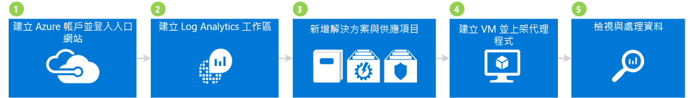

## 1 建立 Azure 帳戶並登入

如果您還沒有 Azure 帳戶，請建立一個帳戶以使用 Log Analytics。 您可以建立可使用 30 天的[免費帳戶](https://azure.microsoft.com/free/)，以便存取任何 Azure 服務。

### 建立免費帳戶並登入
1. 遵循[建立免費的 Azure 帳戶](https://azure.microsoft.com/free/)中的指示。
2. 前往 [Azure 入口網站](https://portal.azure.com)並登入。

## 2 建立工作區

下一個步驟是建立工作區。

1. 在 Azure 入口網站中，搜尋 Marketplace 服務清單以找到 *Log Analytics*，然後選取 **Log Analytics**。  
    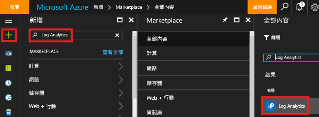
2. 按一下 [建立]，然後選取下列項目：
   * **OMS 工作區** - 輸入工作區的名稱。
   * **訂用帳戶** - 如果您有多個訂用帳戶，請選擇想要與新工作區建立關聯的帳戶。
   * **資源群組**
   * **位置**
   * **定價層**  
       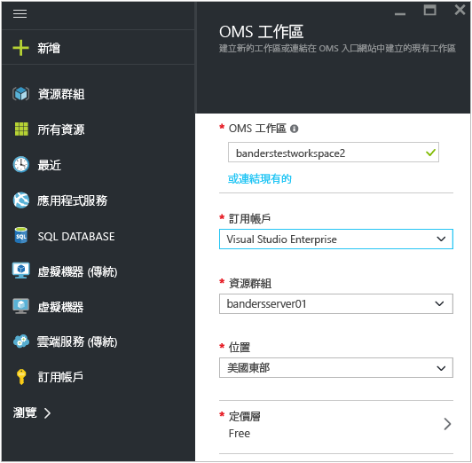
3. 按一下 [確定] 以查看工作區清單。
4. 選取工作區以查看其在 Azure 入口網站中的詳細資料。       
    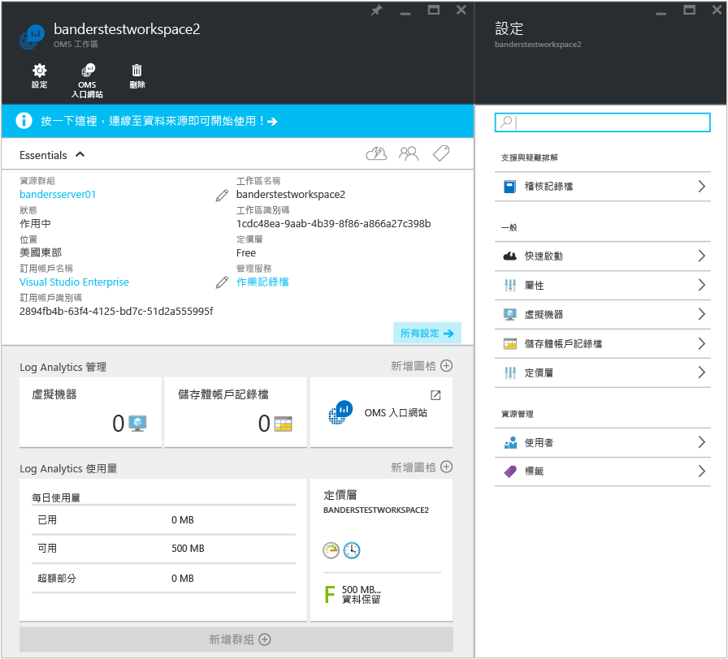         

## 3 新增解決方案和解決方案供應項目

接下來，新增管理解決方案和解決方案供應項目。 管理解決方案是邏輯、視覺效果和資料擷取規則的集合，可提供針對特定問題領域進行計量的樞紐分析。 解決方案供應項目是管理解決方案的組合。

在工作區中新增解決方案可讓 Log Analytics 使用代理程式，從連線到工作區的電腦收集各種類型的資料。 我們會於稍後討論如何啟用代理程式。

### 新增解決方案和解決方案供應項目

1. 在 Azure 入口網站中按一下 [新增]，接著在 [搜尋 Marketplace] 方塊中輸入**活動 Log Analytics**，然後按 ENTER。
2. 在 [所有項目] 刀鋒視窗中選取 [活動 Log Analytics]，然後按一下 [建立]。  
    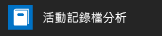  
3. 在 [管理解決方案名稱] 刀鋒視窗中，選取要與管理解決方案相關聯的工作區。
4. 按一下 [建立] 。  
    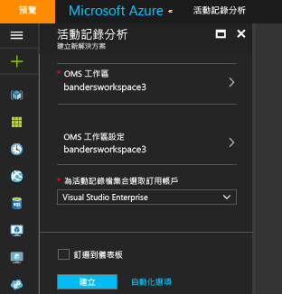  
5. 重複步驟 1 - 4 以新增下列項目：
    - **安全性與合規性**服務供應項目，內含反惡意程式碼評估以及安全性和稽核解決方案。
    - **自動化與控制**服務供應項目，內含自動化混合式背景工作角色、變更追蹤和系統更新評估 (也稱為更新管理) 解決方案。 當您在新增解決方案供應項目時，您必須建立自動化帳戶。  
        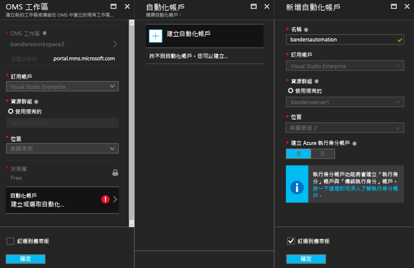  
6. 您可以瀏覽至 [Log Analytics] > [訂用帳戶] > [工作區名稱] > [概觀]，以檢視您新增至工作區的管理解決方案。 您所新增之管理解決方案的圖格會隨即顯示出來。  
    >[!NOTE]
    >我們尚未將任何代理程式連線至工作區，因此您不會看見所新增的解決方案出現任何資料。  

    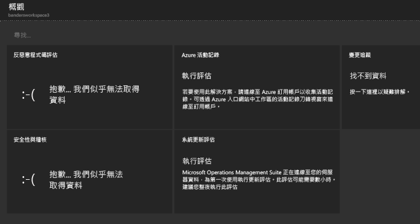

## 4 建立 VM 並啟用代理程式

接下來，在 Azure 中建立簡單的虛擬機器。 在建立 VM 後，請啟用 OMS 代理程式。 啟用代理程式後，便會開始從 VM 收集資料，並將資料傳送到 Log Analytics。

### 建立虛擬機器

- 遵循[在 Azure 入口網站中建立第一個 Windows 虛擬機器](../virtual-machines/virtual-machines-windows-hero-tutorial.md)中的指示，並啟動新的虛擬機器。

### 將虛擬機器連線到 Log Analytics

- 遵循[將 Azure 虛擬機器連接到 Log Analytics](log-analytics-azure-vm-extension.md)中的指示，使用 Azure 入口網站將 VM 連接到 Log Analytics。

## 5 檢視和處理資料

之前您已啟用活動 Log Analytics 解決方案、安全性與合規性以及自動化與控制服務供應項目。 接下來，我們要開始查看解決方案所收集的資料和記錄搜尋中的結果。

一開始，請先查看從解決方案內顯示的資料。 然後，查看一些透過記錄搜尋所取得的記錄搜尋。 記錄檔搜尋可讓您結合和相互關聯您環境內多個來源的任何電腦資料。 如需詳細資訊，請參閱 [Log Analytics 中的記錄搜尋](log-analytics-log-searches.md)。 最後，處理我們使用 OMS 入口網站 (在 Azure 入口網站外部) 所找到的資料。

### 檢視反惡意程式碼資料

1. 在 Azure 入口網站中，瀏覽至 [Log Analytics] > [您的工作區]。
2. 在工作區的刀鋒視窗中，按一下 [一般] 底下的 [概觀]。  
    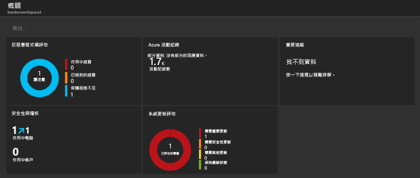
3. 按一下 [反惡意程式碼評估] 圖格。 在此範例中，您可以看到電腦上已安裝 Windows Defender，但其簽章已過期。  
    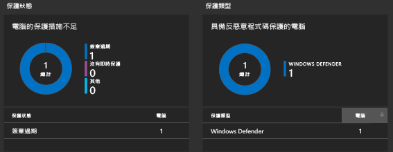
4. 針對此範例，請按一下 [保護狀態] 底下的 [簽章已過期]，開啟記錄搜尋並檢視簽章已過期之電腦的詳細資料。 請注意，在此範例中，電腦命名為 getstarted。 如果簽章已過期的電腦不只一部，它們全都會顯示在記錄搜尋結果中。  
    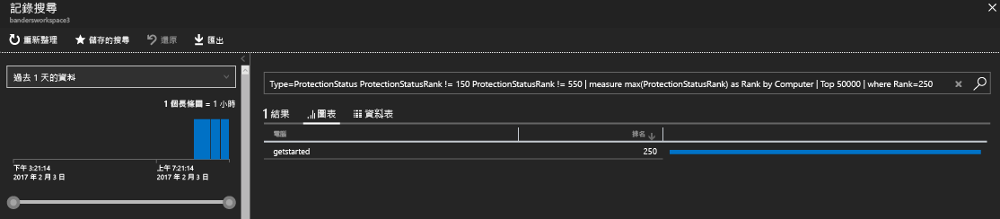

### 檢視安全性和稽核資料

1. 在工作區的刀鋒視窗中，按一下 [一般] 底下的 [概觀]。  
2. 按一下 [安全性和稽核] 圖格。 在此範例中，您會看到兩個值得注意的問題︰有一部電腦遺漏重大更新，另有一部電腦的保護不足。  
    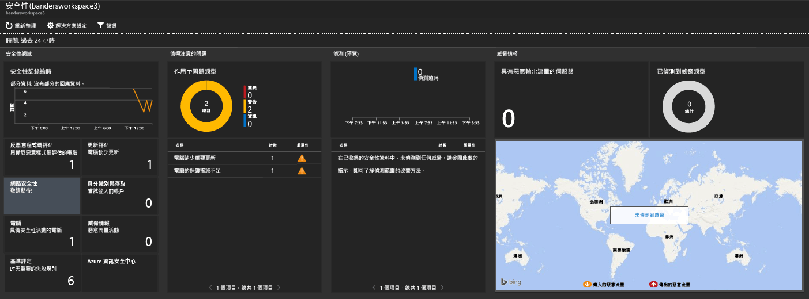
3. 針對此範例，請按一下 [值得注意的問題] 底下的 [遺漏重大更新的電腦]，開啟記錄搜尋並檢視遺漏重大更新之電腦的詳細資料。 在此範例中，總共遺漏了 1 個重大更新和 63 個其他更新。  
    

### 檢視及處理系統更新資料

1. 在工作區的刀鋒視窗中，按一下 [一般] 底下的 [概觀]。  
2. 按一下 [系統更新評估] 圖格。 在此範例中，您會看到有一部名為 getstarted 的 Windows 電腦需要重大更新，另有一部電腦需要定義更新。  
    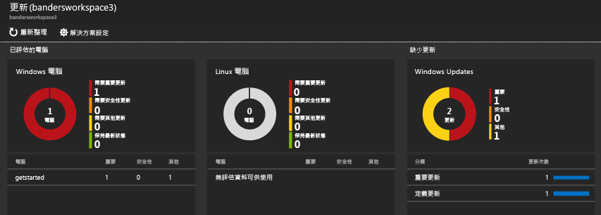
3. 針對此範例，請按一下 [遺漏更新] 底下的 [重大更新]，開啟記錄搜尋並檢視遺漏重大更新之電腦的詳細資料。 在此範例中，有一個遺漏的更新以及一個必要更新。  
    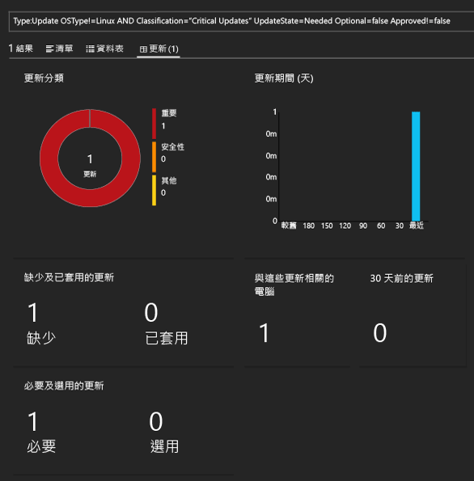
4. 移至 [Operations Management Suite](http://microsoft.com/oms) 網站並使用 Azure 帳戶登入。 在登入時，請注意解決方案資訊會類似於您在 Azure 入口網站中看到的內容。  
    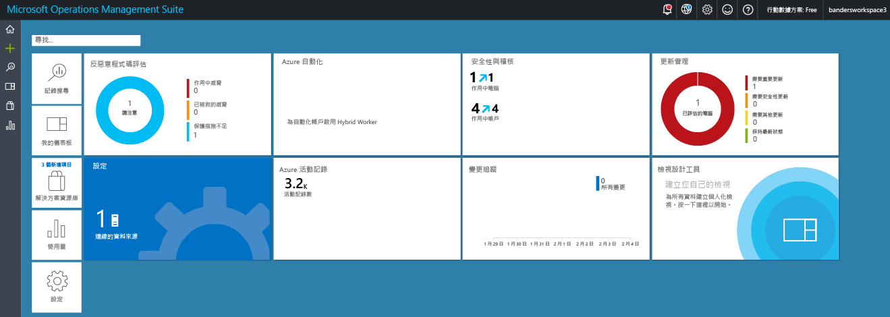
5. 按一下 [更新管理] 圖格。
6. 在更新管理儀表板中，請注意系統更新資訊會類似於您在 Azure 入口網站中看到的系統更新資訊。 不過，[管理更新部署] 是新的圖格。 按一下 [管理更新部署] 圖格。  
    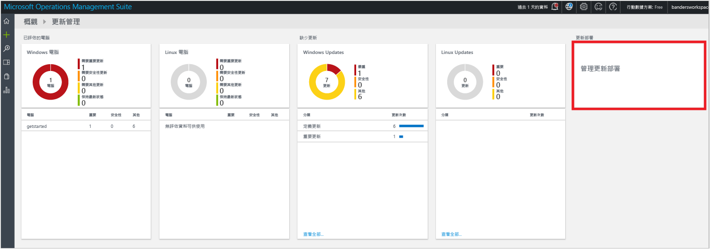
7. 在 [更新部署] 頁面上，按一下 [新增] 以建立「更新執行」。  
    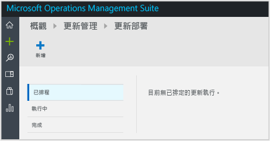
8.  在 [新增更新部署] 頁面上，輸入更新部署的名稱，選取要更新的電腦 (在此範例中為 getstarted)，選擇排程，然後按一下 [儲存]。  
      
    在儲存更新部署後，您會看到已排程的更新。  
    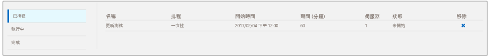  
    更新執行完成後，狀態會顯示 [已完成]。
    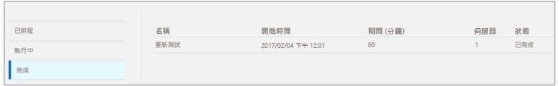
9. 更新執行完成後，您可以檢視執行是否成功，並可檢視所套用之更新的詳細資料。

## 評估之後

在本教學課程中，您已在虛擬機器上安裝代理程式，並快速開始使用。 您所遵循的步驟既快速又簡單。 不過，大型組織和企業的內部部署 IT 基礎結構大多較複雜。 因此，要從這些複雜的環境中收集資料，必須比本教學課程進行更多的規劃與精力。 請檢閱隨後的＜後續步驟＞一節中的資訊，以取得實用文章的連結。

您可以選擇移除在本教學課程中建立的工作區。

## 後續步驟
* 了解如何將 [Windows 代理程式](log-analytics-windows-agents.md)連線到 Log Analytics。
* 了解如何將 [Operations Manager 代理程式](log-analytics-om-agents.md)連線到 Log Analytics。
* [從方案庫加入 Log Analytics 方案](log-analytics-add-solutions.md) ，以加入功能和收集資料。
* 熟悉 [記錄搜尋](log-analytics-log-searches.md) 以檢視方案所收集的詳細資訊。

