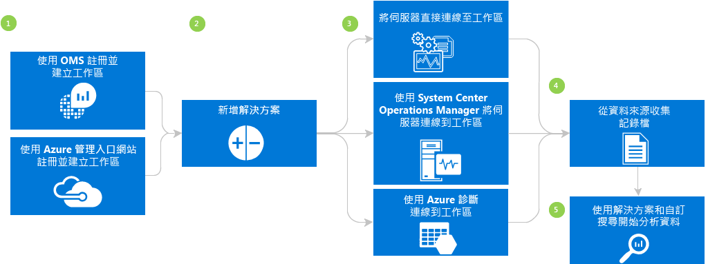
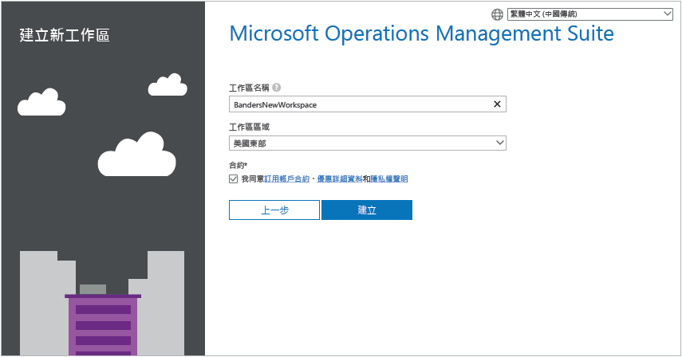
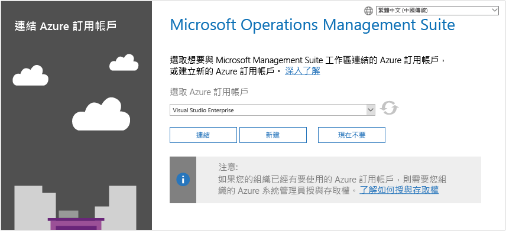
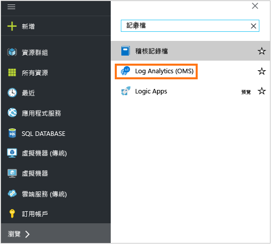
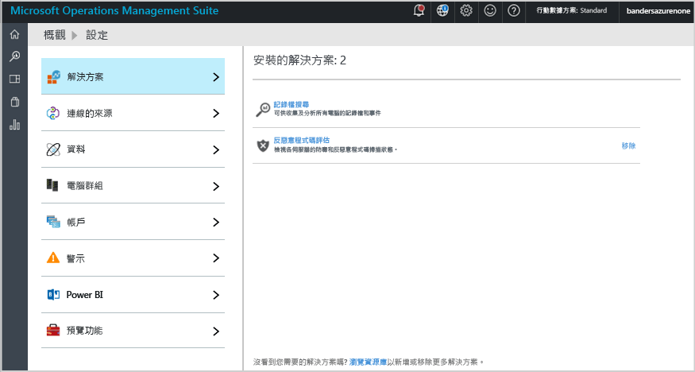
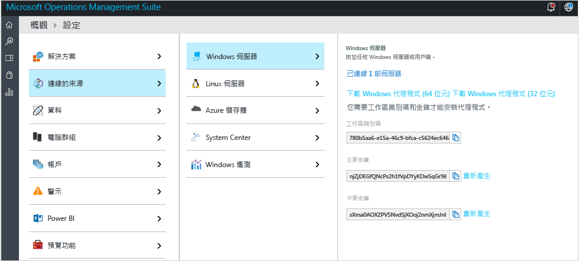
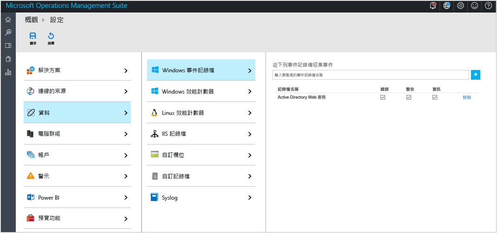
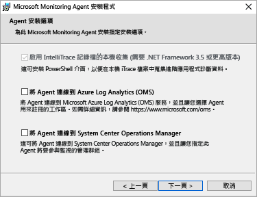
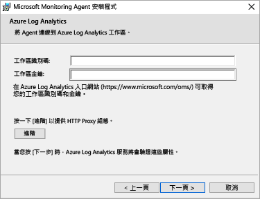
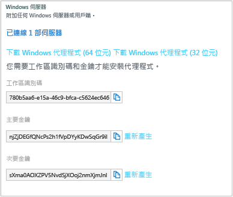

<properties
    pageTitle="開始使用 Log Analytics | Microsoft Azure"
    description="您可以使用 Microsoft Operations Management Suite (OMS) 在幾分鐘內啟動並執行 Log Analytics。"
    services="log-analytics"
    documentationCenter=""
    authors="bandersmsft"
    manager="jwhit"
    editor=""/>

<tags
    ms.service="log-analytics"
    ms.workload="na"
    ms.tgt_pltfrm="na"
    ms.devlang="na"
    ms.topic="get-started-article"
    ms.date="10/10/2016"
    ms.author="banders"/>

# 開始使用 Log Analytics

您可以使用 Microsoft Operations Management Suite (OMS) 在幾分鐘內啟動並執行 Log Analytics。 在選擇 OMS 工作區的建立方式時，您有兩個選項，就像建立帳戶一樣：

- Microsoft Operations Management Suite 網站
- Microsoft Azure 訂用帳戶

您可以使用 OMS 網站建立免費 OMS 工作區。 也可以使用 Microsoft Azure 訂用帳戶建立 OMS 工作區。 這兩個工作區的功能相同，差別在於免費 OMS 工作區每天只能傳送 500 MB 的資料給 OMS 服務。 如果您使用 Azure 訂用帳戶，也可以使用該訂用帳戶來存取其他 Azure 服務。 不論建立工作區的方法為何，您都會使用 Microsoft 帳戶或組織帳戶來建立工作區。

以下就來看看此程序：

## Log Analytics 先決條件和部署考量

- 您需要付費的 Microsoft Azure 訂用帳戶，才能充分利用 Log Analytics。 如果您沒有 Azure 訂用帳戶，請建立 [免費帳戶](https://azure.microsoft.com/free/) ，以便存取任何 Azure 服務。 或者，您也可以在 [Operations Management Suite](http://microsoft.com/oms) 網站按一下 [免費試用]，以建立免費 OMS 帳戶。
- OMS 工作區
- 您想要從中收集資料的每一部 Windows 電腦，必須執行 Windows Server 2008 SP1 或更新版本
- [防火牆](log-analytics-proxy-firewall.md) 存取 OMS Web 服務的位址
- [OMS Log Analytics 轉寄站](https://blogs.technet.microsoft.com/msoms/2016/03/17/oms-log-analytics-forwarder) (閘道器) 伺服器，將流量從伺服器轉送到 OMS (如果電腦沒有網際網路存取)
- 如果您使用 Operations Manager，Log Analytics 支援 Operations Manager 2012 SP1 UR6 和更新版本，以及 Operations Manager 2012 R2 UR2 和更新版本。 Operations Manager 2012 SP1 UR7 和 Operations Manager 2012 R2 UR3 中已加入 Proxy 支援。 決定它如何與 OMS 整合。
- 決定您的電腦是否可直接存取網際網路。 如果不是，它們需要閘道伺服器才能存取 OMS Web 服務網站。 所有存取都是透過 HTTPS。
- 決定哪些技術和伺服器會將資料傳送至 OMS。 例如，網域控制站、SQL Server 等。
- 授權給 OMS 和 Azure 中的使用者。
- 如果您擔心資料使用量，請個別部署每個方案，並在加入其他方案之前先測試效能影響。
- 當您將方案和功能加入至 Log Analytics 時，請檢閱資料使用量和效能。 這包括事件收集、記錄檔收集、效能資料收集等。一開始最好先少量收集，直到確認資料使用量或效能影響為止。
- 確認 Windows 代理程式也並未受到 Operations Manager 管理，否則會產生重複的資料。 這也適用於已啟用 Azure 診斷的 Azure 型代理程式。
- 安裝代理程式之後，請確認代理程式運作正常。 如果不是，請使用群組原則來檢查，確定「密碼編譯 API：新一代 (CNG)」金鑰隔離未停用。
- 某些 Log Analytics 方案還有其他需求

## 使用 Operations Management Suite 的 3 個註冊步驟

1. 移至 [Operations Management Suite](http://microsoft.com/oms) 網站並按一下 [免費試用]。 登入 Microsoft 帳戶 (如 Outlook.com)，或登入貴公司或教育機構所提供，用來搭配 Office 365 或其他 Microsoft 服務的組織帳戶。
2. 提供唯一的工作區名稱。 工作區是儲存管理資料的邏輯容器。 它提供在不同組織團隊之間分割資料的方法，因為資料為其工作區專有。 指定電子郵件地址和資料的儲存區域。  
    
3. 接下來，您可以建立新的 Azure 訂用帳戶或連結現有的 Azure 訂用帳戶。 如果您想要繼續使用免費試用版，請按一下 [不是現在] 。  
  

您已準備好開始使用 Operations Management Suite 入口網站。

在 [管理對 Log Analytics 的存取](log-analytics-manage-access.md)中，您可以深入了解設定工作區，以及將現有 Azure 帳戶連結至以 Operations Management Suite 建立的工作區。

## 使用 Microsoft Azure 快速註冊

1. 移至 [Azure 入口網站](https://portal.azure.com)並登入，瀏覽服務清單，然後選取 [Log Analytics (OMS)]。  
    
2. 按一下 [加入] ，然後選取下列項目：
    - **OMS 工作區** 名稱
    - **訂用帳戶** - 如果您有多個訂用帳戶，請選擇想要與新工作區建立關聯的帳戶。
    - **資源群組**
    - **位置**
    - **定價層**  
        
3. 按一下 [建立]  ，即會在 Azure 入口網站中看到工作區的詳細資料。       
             
4. 按一下 [OMS 入口網站]  連結，即可開啟包含新工作區的 Operations Management Suite 網站。

您現在已經準備就緒，可以開始使用 Operations Management Suite 入口網站。

在 [管理對 Log Analytics 的存取](log-analytics-manage-access.md)中，您可以深入了解設定工作區，以及將現有工作區連結至以 Operations Management Suite 建立的 Azure 訂用帳戶。

## 開始使用 Operations Management Suite 入口網站
若要選擇方案及連接要管理的伺服器，請按一下 [設定]  圖格，然後遵循本節的步驟操作。  

  

1. **新增解決方案** - 檢視已安裝的解決方案。  
      
    按一下 [瀏覽資源庫] 以新增更多解決方案。  
      
    選取解決方案，然後按一下 [新增]。
2. **連接來源** - 選擇收集資料的伺服器環境連接方式：
    - 藉由安裝代理程式來直接連接任何 Windows Server 或用戶端。
    - 透過適用於 Linux 的 OMS 代理程式連接 Linux 伺服器。
    - 使用採用 Windows 或 Linux Azure 診斷 VM 延伸模組設定的 Azure 儲存體帳戶。
    - 使用 System Center Operations Manager 來附加管理群組或整個 Operations Manager 部署。
    - 啟用 Windows 遙測，以使用升級分析。
            

3. **收集資料**設定至少一個資料來源，以在您的工作區中填入資料。 完成時，按一下 [儲存]。    

        

## (選擇性) 藉由安裝代理程式來直接連接伺服器和 Operations Management Suite

下列範例示範如何安裝 Windows 代理程式。

1. 依序按一下 [設定] 圖格、[連接的來源] 索引標籤、您要新增的來源類型索引標籤，然後下載代理程式或了解如何啟用代理程式。 例如，按一下 [下載 Windows 代理程式 (64 位元)]。 對於 Windows 代理程式，您只能將代理程式安裝在 Windows Server 2008 SP1 或更新版本，亦或是 Windows 7 SP1 或更新版本。
2. 將代理程式安裝在一或多部伺服器上。 您可以逐一安裝代理程式、使用搭配 [自訂指令碼](log-analytics-windows-agents.md)的自動化方法，也可以使用現有的軟體散發解決方案。
3. 在同意授權合約及選擇安裝資料夾之後，請選取 [將代理程式連接至 Azure Log Analytics (OMS)]。   
    

4. 在下一個頁面中，系統會詢問您的工作區識別碼和工作區金鑰。 您的工作區 ID 和金鑰會顯示在下載代理程式檔案的畫面上。  
      

    
5. 在安裝期間，您可以按一下 [進階]  以選擇性地設定 Proxy 伺服器及提供驗證資訊。 按 [下一步]  按鈕返回工作區資訊畫面。
6. 按 [下一步]  驗證工作區識別碼和金鑰。 如果您發現任何錯誤，可以按一下 [上一頁]  予以修正。 當工作區識別碼和金鑰通過驗證後，請按一下 [安裝]  來完成代理程式安裝。
7. 在 [控制台] 中，按一下 [Microsoft Monitoring Agent] > [Azure Log Analytics (OMS)] 索引標籤。 當代理程式與 Operations Management Suite 服務通訊時，會出現綠色核取記號圖示。 剛開始的時候，這需要大約 5-10 分鐘。

>[AZURE.NOTE] 直接連接 Operations Management Suite 的伺服器目前不支援容量管理和組態評估解決方案。

您也可以將代理程式連接到 System Center Operations Manager 2012 SP1 和更新版本。 若要這樣做，請選取 [將代理程式連接至 System Center Operations Manager] 。 如果您選擇該選項，可以在不需要額外硬體或對管理群組造成額外負荷的情況下將資料傳送到服務。

若要深入了解將代理程式連接到 Operations Management Suite 的資訊，請參閱 [將 Windows 電腦連接到 Log Analytics](log-analytics-windows-agents.md)。

## (選擇性) 使用 System Center Operations Manager 連接伺服器

1. 在 Operations Manager 主控台內選取 [管理] 。
2. 展開 [Operational Insights] 節點，然後選取 [Operational Insights 連接]。

  >[AZURE.NOTE] 根據您所使用的 SCOM 更新彙總套件而定，您可能會看到 *System Center Advisor*、*Operational Insights* 或 *Operations Management Suite* 節點。

3. 按一下右上方的 [註冊至 Operational Insights]  連結，並遵循指示執行作業。
4. 完成註冊精靈之後，按一下 [新增電腦/群組]  連結。
5. 在 [電腦搜尋]  對話方塊中，您可以搜尋 Operations Manager 監視的電腦或群組。 選取要上架到 Log Analytics 的電腦或群組，按一下 [新增]，然後按一下 [確定]。 您只要前往 Operations Management Suite 入口網站的 [使用量]  圖格，即可驗證 OMS 服務是否正在接收資料。 資料應該會在大約 5-10 分鐘之後出現。

若要深入了解將 Operations Manager 連接到 Operations Management Suite 的資訊，請參閱[將 Operations Manager 連接至 Log Analytics](log-analytics-om-agents.md)。

## (選擇性) 分析 Microsoft Azure 之雲端服務的資料

利用 Operations Management Suite，您可以啟用 Azure 雲端服務診斷來快速搜尋雲端服務和虛擬機器的事件和 IIS 記錄檔。 您也可以安裝 Microsoft Monitoring Agent，取得有關 Azure 虛擬機器的額外見解。 若要深入了解如何設定 Azure 環境以使用 Operations Management Suite 的資訊，請參閱 [將 Azure 儲存體連接至 Log Analytics](log-analytics-azure-storage.md)。

## 後續步驟

- [從方案庫加入 Log Analytics 方案](log-analytics-add-solutions.md) ，以加入功能和收集資料。
- 熟悉 [記錄檔搜尋](log-analytics-log-searches.md) 以檢視方案所收集的詳細資訊。
- 使用 [儀表板](log-analytics-dashboards.md) 以儲存和顯示您自己的自訂搜尋。

<!--HONumber=Oct16_HO2-->

