# 管理工作區

若要管理對 Log Analytics 的存取，請執行與工作區相關的各種系統管理工作。 本文提供您要用來以不同帳戶類型管理工作區的最佳做法建議和程序。 工作區本質上是一個容器，包含帳戶資訊和帳戶的簡單組態資訊。 您或組織的其他成員可能會使用多個工作區來管理從所有或部分 IT 基礎結構收集而來的不同資料。

若要建立工作區，您需要︰

1. 擁有 Azure 訂用帳戶。
2. 選擇工作區名稱。
3. 建立工作區與訂用帳戶的關聯。
4. 選擇地理位置。

## 判斷您需要的工作區數目
工作區是一種 Azure 資源，也是 Azure 入口網站中收集、彙總、分析及呈現資料的容器。

您可以建立多個工作區，讓使用者可以存取一或多個工作區。 將工作區數目減到最少，可讓您查詢最多資料並使之相互關聯。 本節描述何時有利於建立多個工作區。

現今的工作區可提供︰

* 資料儲存體的地理位置
* 計費的細微度
* 資料隔離

根據上述特性，您在下列情況下可能想要建立多個工作區︰

* 您是一家全球性公司，基於資料主權或合規性理由，您需要將資料儲存在特定區域。
* 您使用 Azure，想要將工作區和它所管理的 Azure 資源放在相同區域中，以避免輸出資料傳輸費用。
* 您想要根據不同部門或事業群的使用量來配置費用。 當您建立每個部門或事業群的工作區時，Azure 帳單和用量表會個別顯示每個工作區的費用。
* 您是受管理的服務提供者，需要將您管理的每個客戶的 Log Analytics 資料和其他客戶的資料保持隔離。
* 您管理多個客戶，想要讓每個客戶/部門/事業群只看到他們自己的資料，而不是其他客戶/部門/事業群的資料。

使用代理程式收集資料時，您可以設定每個代理程式向一或多個工作區回報。

如果您使用 System Center Operations Manager，每個 Operations Manager 管理群組只能連接一個工作區。 您可以將 Microsoft Monitoring Agent 安裝在 Operations Manager 所管理的電腦上，由代理程式向 Operations Manager 和不同的 Log Analytics 工作區回報。

### 工作區資訊

您可以在 Azure 入口網站中檢視工作區的相關詳細資料。 您也可以在 OMS 入口網站中檢視詳細資料。

#### 在 Azure 入口網站中檢視工作區資訊

1. 如果您尚未這麼做，請使用 Azure 訂用帳戶登入 [Azure 入口網站](https://portal.azure.com)。
2. 在 [中樞] 功能表上按一下 [更多服務]，然後在資源清單中輸入 **Log Analytics**。 當您開始輸入時，清單將會根據您輸入的文字進行篩選。 按一下 [Log Analytics]。  
    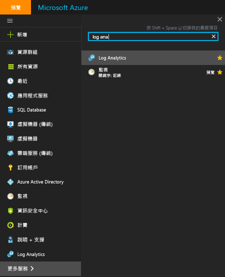  
3. 在 [Log Analytics 訂用帳戶] 刀鋒視窗中選取工作區。
4. [工作區] 刀鋒視窗會顯示工作區的詳細資料和其他資訊的連結。  
    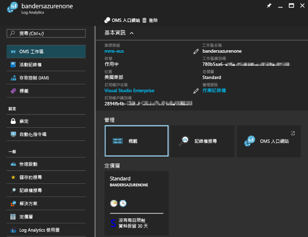  

## 管理帳戶和使用者
每個工作區可以有多個相關聯的使用者帳戶，而每個使用者帳戶 (Microsoft 帳戶或組織帳戶) 可以存取多個工作區。

根據預設，用來建立工作區的 Microsoft 帳戶或組織帳戶會變成工作區的管理員。 然後管理員可以邀請其他 Microsoft 帳戶或從 Azure Active Directory 挑選使用者。

可以在兩個位置控制如何將工作區的存取權授與使用者：

* 在 Azure 中，您可以使用 Azure 角色型存取控制來允許存取 Azure 訂用帳戶和相關聯的 Azure 資源。 這些權限也用於 PowerShell 和 REST API 存取。
* 在 OMS 入口網站中，僅限於存取 OMS 入口網站，而不能存取相關聯的 Azure 訂用帳戶。

如果您僅將 OMS 入口網站存取權授與使用者，而非它所連結的 Azure 訂用帳戶，則使用者在備份和 Site Recovery 方案圖格中看不到資料。
若要允許所有使用者看到這些方案中的資料，請確定他們至少有連結到工作區之備份保存庫和 Site Recovery 保存庫的**讀者**存取權。   

### 使用 Azure 入口網站管理對 Log Analytics 的存取
如果您允許使用者利用 Azure 權限存取 Log Analytics 工作區 (例如在 Azure 入口網站中)，則相同的使用者也可存取 Log Analytics 入口網站。 如果使用者在 Azure 入口網站中，他們在檢視 Log Analytics 工作區資源時，只要按一下 [OMS 入口網站 ] 工作，即可瀏覽至 OMS 入口網站。

請留意 Azure 入口網站的下列幾點︰

* 這不是*角色型存取控制*。 如果您在 Azure 入口網站中具有 Log Analytics 的「讀者」存取權限，則可利用 OMS 入口網站進行變更。 OMS 入口網站具有系統管理員、參與者和唯讀使用者的概念。 如果您登入的帳戶位於連結到工作區的 Azure Active Directory 中，則您是 OMS 入口網站中的系統管理員，否則為參與者。
* 當您使用 http://mms.microsoft.com 登入 OMS 入口網站時，預設會看到 [選取工作區] 清單。 它只包含使用 OMS 入口網站新增的工作區。 若要查看您可利用 Azure 訂用帳戶存取的工作區，則必須將租用戶指定為 URL 的一部分。 例如：

  `mms.microsoft.com/?tenant=contoso.com` 租用戶識別碼通常是您用來登入的電子郵件地址的最後一部分。
* 如果您用來登入的帳戶是租用戶 Azure Active Directory 中的帳戶，則您是 OMS 入口網站中的「系統管理員」。 除非您以 CSP 身分登入，否則通常會是這種情況。  如果您的帳戶不在租用戶 Azure Active Directory 中，則您是 OMS 入口網站中的「使用者」。
* 如果您想要利用 Azure 權限直接瀏覽到您有存取權的入口網站，您需要在 URL 中指定此資源。 就可以使用 PowerShell 取得此 URL。

  例如， `(Get-AzureRmOperationalInsightsWorkspace).PortalUrl`。

  URL 看起來像這樣：`https://eus.mms.microsoft.com/?tenant=contoso.com&resource=%2fsubscriptions%2faaa5159e-dcf6-890a-a702-2d2fee51c102%2fresourcegroups%2fdb-resgroup%2fproviders%2fmicrosoft.operationalinsights%2fworkspaces%2fmydemo12`

### 在 OMS 入口網站中管理使用者
您可以在 [設定] 頁面中 [帳戶] 索引標籤之下的 [管理使用者] 索引標籤上管理使用者與群組。   

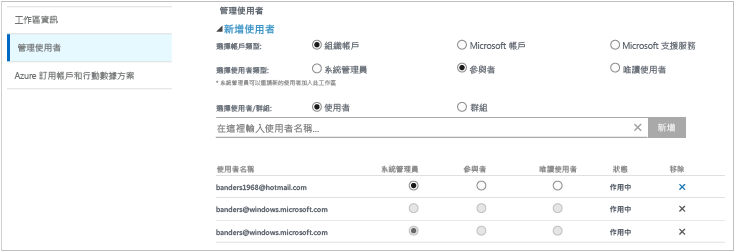

#### 新增使用者到現有的工作區
使用下列步驟，將使用者或群組新增至工作區。

1. 在 OMS 入口網站中，按一下 [設定] 圖格。
2. 按一下 [帳戶] 索引標籤，然後按一下 [管理使用者] 索引標籤。
3. 在 [管理使用者] 區段中，選擇要新增的帳戶類型：[組織帳戶]、[Microsoft 帳戶]、[Microsoft 支援服務]。

   * 如果您選擇 [Microsoft 帳戶]，請輸入與該 Microsoft 帳戶相關聯的使用者電子郵件地址。
   * 如果您選擇 [組織帳戶]，則可以輸入使用者或群組的部分名稱或電子郵件別名，而且相符使用者和群組的清單會顯示在下拉式方塊中。 選取使用者或群組。
   * 使用「Microsoft 支援服務」讓 Microsoft 支援服務工程師或其他 Microsoft 員工暫時存取您的工作區，以協助進行疑難排解。

     > [!NOTE]
     > 為了獲得最佳效能結果，請將與單一 OMS 帳戶相關聯的 Active Directory 群組數目限制為三個：一個給系統管理員、一個給參與者、一個給唯讀使用者。 使用太多群組可能會影響 Log Analytics 的效能。
     >
     >
4. 選擇要新增的使用者或群組類型：[系統管理員]、[參與者] 或 [唯讀使用者]。  
5. 按一下 [新增] 。

   如果您新增 Microsoft 帳戶，系統將會傳送一封加入工作區的邀請至您提供的電子郵件。 使用者遵循邀請中的指示加入 OMS 之後，使用者就可以存取此工作區。
   如果您要新增組織帳戶，則使用者可以立即存取 Log Analytics。  

#### 編輯現有的使用者類型
您可以為與您的 OMS 帳戶相關聯的使用者變更帳戶角色。 您有下列角色選項：

* *管理員*：可以管理使用者、檢視和處理所有警示，以及新增和移除伺服器
* *參與者*：可以檢視和處理所有警示，以及新增和移除伺服器
* *唯讀使用者*︰標示為唯讀的使用者無法︰

  1. 新增/移除解決方案。 方案庫會隱藏起來。
  2. 在 [我的儀表板] 上新增/修改/移除圖格。
  3. 檢視 [設定] 頁面。 這些頁面會隱藏起來。
  4. 在 [搜尋] 檢視中，PowerBI 組態、已儲存的搜尋和警示工作會隱藏起來。

#### 編輯帳戶
1. 在 OMS 入口網站中，按一下 [設定] 圖格。
2. 按一下 [帳戶] 索引標籤，然後按一下 [管理使用者] 索引標籤。
3. 選取您要變更的使用者角色。
4. 在確認對話方塊中，按一下 [是]。

### 從工作區移除使用者
使用下列步驟，從工作區移除使用者。 移除使用者並不會關閉工作區。 而會移除使用者與工作區之間的關聯。 如果使用者與多個工作區相關聯，該使用者還是可以登入 OMS，並看到其他工作區。

1. 在 OMS 入口網站中，按一下 [設定] 圖格。
2. 按一下 [帳戶] 索引標籤，然後按一下 [管理使用者] 索引標籤。
3. 按一下您要移除之使用者名稱旁邊的 [移除]。
4. 在確認對話方塊中，按一下 [是]。

### 將群組加入現有的工作區
1. 遵循上面＜將使用者加入現有的工作區＞中的步驟 1 -4。
2. 在 [選擇使用者/群組] 下方，選取 [群組]。  
   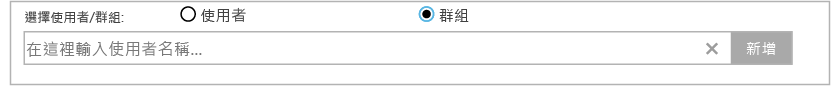
3. 輸入您想要加入之群組的顯示名稱或電子郵件地址。
4. 在清單結果中選取群組，然後按一下 [加入] 。

## 將現有的工作區連結到 Azure 訂用帳戶
建立時，所有在 2016 年 9 月 26 日之後建立的工作區都必須連結到 Azure 訂用帳戶。 下次登入時，在這個日期之前建立的工作區必須連結到工作區。 如果您從 Azure 入口網站建立工作區，或將工作區連結到 Azure 訂用帳戶，則會連結 Azure Active Directory 作為您的組織帳戶。

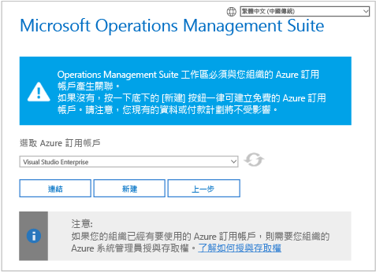

> [!IMPORTANT]
> 若要連結工作區，您的 Azure 帳戶必須已經能夠存取您想要連結的工作區。  換句話說，您用來存取 Azure 入口網站的帳戶必須與用來存取工作區的帳戶**相同**。 否則，請參閱[將使用者新增至現有工作區](#add-a-user-to-an-existing-workspace)。
>
>

### 在 OMS 入口網站中將工作區連結到 Azure 訂用帳戶
若要在 OMS 入口網站中將工作區連結到 Azure 訂用帳戶，登入的使用者必須已有付費的 Azure 帳戶。

1. 在 OMS 入口網站中，按一下 [設定] 圖格。
2. 按一下 [帳戶] 索引標籤，然後按一下 [Azure 訂用帳戶和行動數據方案] 索引標籤。
3. 按一下您要使用的行動數據方案。
4. 按一下 [儲存] 。  
   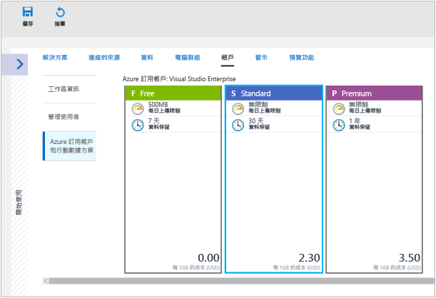

新的行動數據方案會顯示在網頁頂端的 OMS 入口網站功能區中。

### 在 Azure 入口網站中將工作區連結到 Azure 訂用帳戶
1. 登入 [Azure 入口網站](http://portal.azure.com)。
2. 瀏覽 **Log Analytics**，然後加以選取。
3. 您會看到現有工作區清單。 按一下 [新增] 。  
   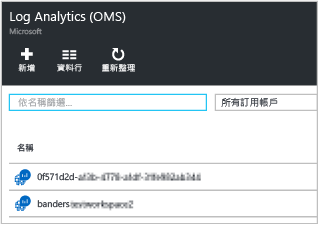
4. 在 [OMS 工作區] 下方，按一下 [或連結現有的]。  
   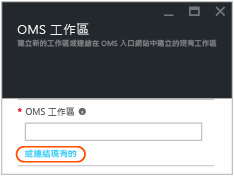
5. 按一下 [進行必要設定] 。  
   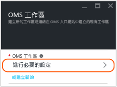
6. 您會看到尚未連結到您 Azure 帳戶的工作區清單。 選取工作區。  
   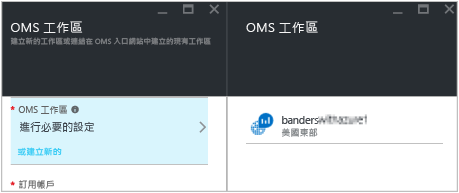
7. 需要時，您可以變更下列項目的值：
   * 訂閱
   * 資源群組
   * 位置
   * 定價層   
     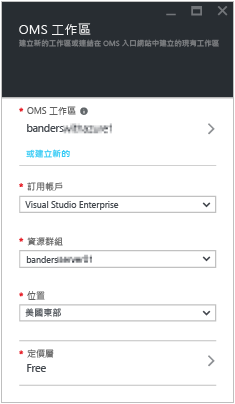
8. 按一下 [確定] 。 工作區現在已連結到您的 Azure 帳戶。

> [!NOTE]
> 如果您看不到想要連結的工作區，則您的 Azure 訂用帳戶沒有使用 OMS 網站建立之工作區的存取權。  您需要從 OMS 入口網站授與此帳戶的存取權。 若要這樣做，請參閱 [新增使用者到現有的工作區](#add-a-user-to-an-existing-workspace)。
>
>

## 將工作區升級為付費方案
OMS 有三種工作區方案類型：[免費]、[獨立] 和 [OMS]。  如果您是使用「免費」方案，則每天傳送至 Log Analytics 的限制是 500 MB 的資料。  如果您超過此數量，則需要將工作區變更為付費方案，避免收集不到超出此限制的資料。 您隨時都可以變更方案類型。  如需 OMS 定價的詳細資訊，請參閱[價格詳細資料](https://www.microsoft.com/en-us/cloud-platform/operations-management-suite-pricing)。

### 使用 OMS 訂用帳戶的權利
若要使用來自購買 OMS E1、OMS E2 OMS 或 OMS Add-On for System Center 的權利，請選擇 OMS Log Analytics 的 [OMS] 方案。

當您購買 OMS 訂用帳戶時，會將權利新增至 Enterprise 合約。 依此合約建立的任何 Azure 訂用帳戶都享有此權利。 例如，這可讓您的多個工作區使用 OMS 訂用帳戶的權利。

若要確保將工作區的使用量套用到 OMS 訂用帳戶的權利，您需要︰

1. 在 Azure 訂用帳戶中建立工作區，這個 Azure 訂用帳戶屬於包含 OMS 訂用帳戶的 Enterprise 合約
2. 選取工作區的 [OMS] 方案

> [!NOTE]
> 如果您的工作區是在 2016 年 9 月 26 日之前建立，而且您的 Log Analytics 定價方案是 [高階]，此工作區將會使用 OMS Add-On for System Center 的權利。 變更為 [OMS] 定價層，也可以使用權利。
>
>

在 Azure 或 OMS 入口網站中看不到 OMS 訂用帳戶權利。 您可以看到企業版入口網站中的權利和使用量。  

如果需要變更工作區所連結的 Azure 訂用帳戶，則可以使用 Azure PowerShell [Move-AzureRmResource](https://msdn.microsoft.com/library/mt652516.aspx) Cmdlet。

### 透過 Enterprise 合約使用 Azure 承諾
如果您沒有 OMS 訂用帳戶，則會分別支付 OMS 的每個元件，而且使用量會出現在您的 Azure 帳單上。

在您的 Azure 訂用帳戶連結的企業註冊上，如果您還有 Azure 承諾用量金額，則 Log Analytics 的任何使用量會自動從剩餘的任何承諾用量金額中扣抵。

如果需要變更工作區所連結的 Azure 訂用帳戶，則可以使用 Azure PowerShell [Move-AzureRmResource](https://msdn.microsoft.com/library/mt652516.aspx) Cmdlet。  

### 將工作區變更為付費資料方案
1. 登入 [Azure 入口網站](http://portal.azure.com)。
2. 瀏覽 **Log Analytics**，然後加以選取。
3. 您會看到現有工作區清單。 選取工作區。  
4. 在 [工作區] 刀鋒視窗的 [一般] 下方，按一下 [定價層]。  
5. 在 [定價層] 下方，按一下 [選取行動數據方案]，然後按一下 [選取]。  
    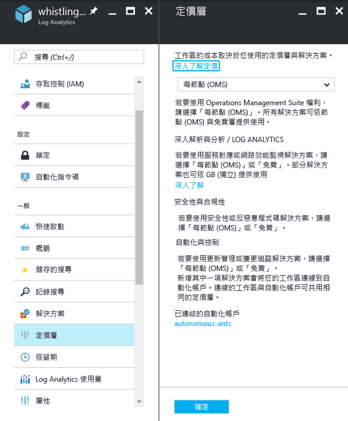
6. 重新整理您在 Azure 入口網站中的檢視時，會看到所選取方案的 [定價層] 已更新。  
    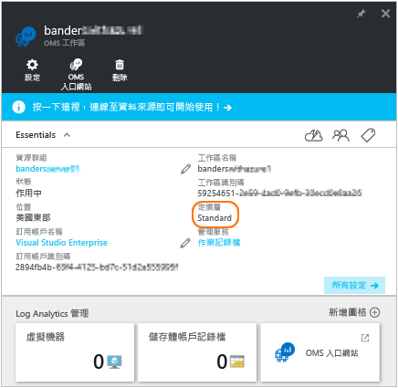

## 變更 Log Analytics 儲存資料的時間長度

在免費定價層，Log Analytics 會提供過去七天的資料。
在標準定價層，Log Analytics 會提供過去 30 天的資料。
在進階定價層，Log Analytics 會提供過去 365 天的資料。
在獨立和 OMS 定價層，Log Analytics 預設會提供過去 31 天的資料。

當您使用獨立和 OMS 定價層時，您最多可以保留 2 年的資料 (730 天)。 儲存超過預設值 31 天的資料會產生資料保留費用。 如需價格的詳細資訊，請參閱[超額費用](https://azure.microsoft.com/pricing/details/log-analytics/)。

若要變更資料保留的長度：

1. 登入 [Azure 入口網站](http://portal.azure.com)。
2. 瀏覽 **Log Analytics**，然後加以選取。
3. 您會看到現有工作區清單。 選取工作區。  
4. 在 [工作區] 刀鋒視窗的 [一般] 下方，按一下 [保留]。  
5. 使用滑桿來增加或減少保留天數，然後按一下 [儲存]****
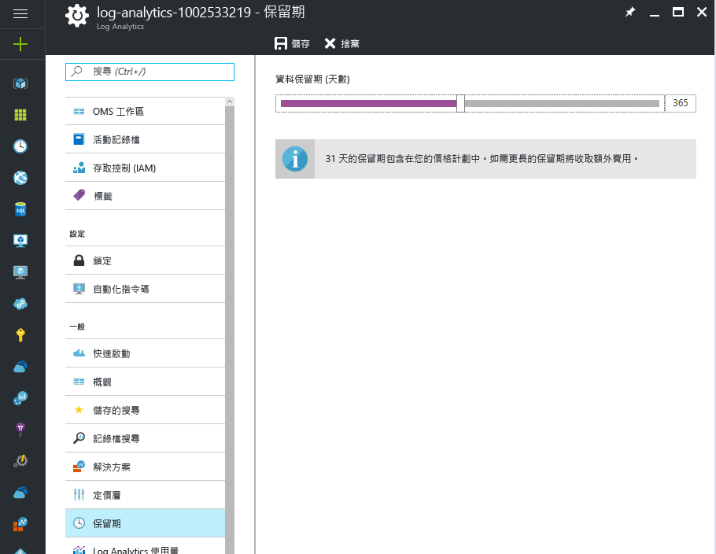

## 變更工作區的 Azure Active Directory 組織

您可以變更工作區的 Azure Active Directory 組織。 變更 Azure Active Directory 組織可讓您將該目錄中的使用者和群組新增至工作區。

### 變更工作區的 Azure Active Directory 組織

1. 在 OMS 入口網站的 [設定] 頁面上，按一下 [帳戶]，然後按一下 [管理使用者] 索引標籤。  
2. 檢閱組織帳戶的資訊，然後按一下 [變更組織]。  
    
3. 輸入您 Azure Active Directory 網域之系統管理員的身分識別資訊。 之後，您會看到通知，指出您的工作區連結到 Azure Active Directory 網域。  
    

## 刪除 Log Analytics 工作區
當您刪除 Log Analytics 工作區時，會在 30 天內從 OMS 服務中刪除所有與您工作區相關的資料。

如果您是管理員，而且有多位使用者與工作區關聯，則這些使用者與工作區之間的關聯將會中斷。 如果使用者與其他工作區相關聯，則他們可以繼續搭配使用 OMS 與其他工作區。 不過，如果使用者未與其他工作區相關聯，則他們必須建立工作區才能使用 OMS。

### 刪除工作區
1. 登入 [Azure 入口網站](http://portal.azure.com)。
2. 瀏覽 **Log Analytics**，然後加以選取。
3. 您會看到現有工作區清單。 選取您想要刪除的工作區。
4. 在 [工作區] 刀鋒視窗中，按一下 [刪除]。  
    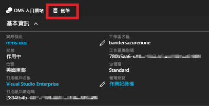
5. 在 [刪除工作區] 確認對話方塊中，按一下 [是]。

## 後續步驟
* 請參閱 [將 Windows 電腦連接到 Log Analytics](log-analytics-windows-agents.md) ，以加入代理程式和收集資料。
* [從方案庫加入 Log Analytics 方案](log-analytics-add-solutions.md) ，以加入功能和收集資料。
* [在 Log Analytics 中設定 Proxy 和防火牆設定](log-analytics-proxy-firewall.md) ，讓代理程式可與 Log Analytics 服務通訊。

<!--HONumber=Jan17_HO1-->

