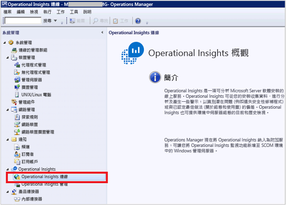
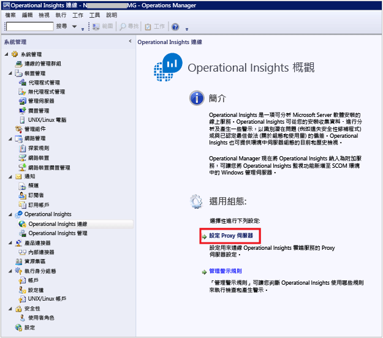
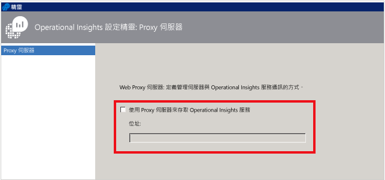
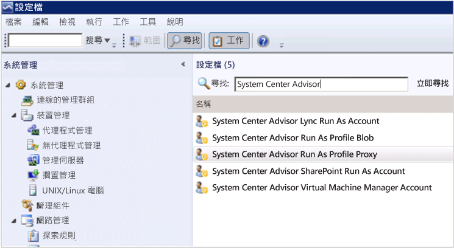
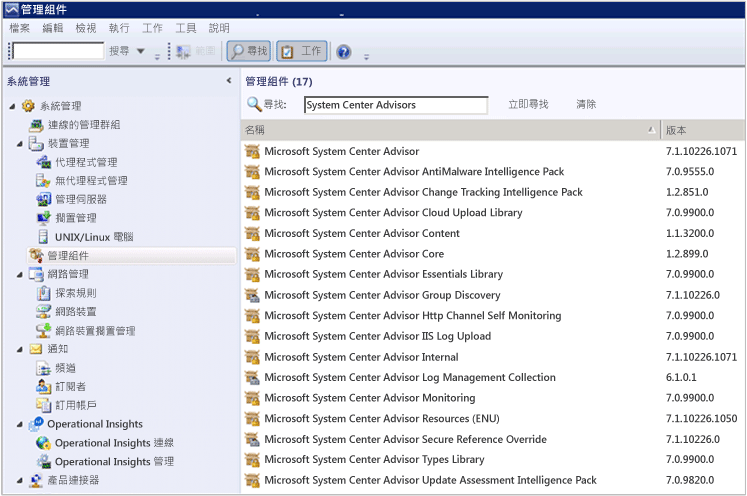
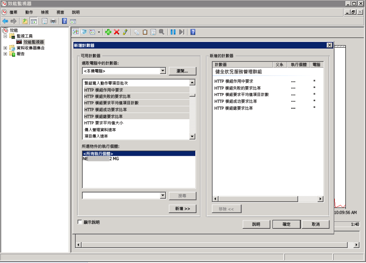
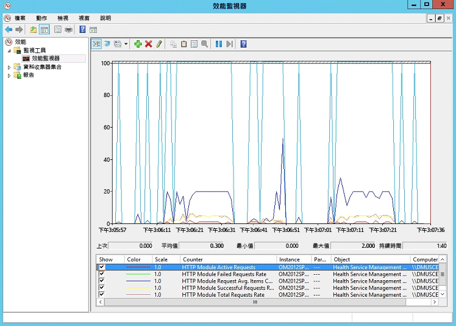

<properties
    pageTitle="在 Log Analytics 中設定 Proxy 和防火牆設定 | Microsoft Azure"
    description="當您的代理程式或 OMS 服務需要使用特定連接埠時，請設定 Proxy 和防火牆設定。"
    services="log-analytics"
    documentationCenter=""
    authors="bandersmsft"
    manager="jwhit"
    editor=""/>

<tags
    ms.service="log-analytics"
    ms.workload="na"
    ms.tgt_pltfrm="na"
    ms.devlang="na"
    ms.topic="get-started-article"
    ms.date="08/23/2016"
    ms.author="banders;magoedte"/>


# <a name="configure-proxy-and-firewall-settings-in-log-analytics"></a>在 Log Analytics 中設定 Proxy 和防火牆設定

相較於直接連線至伺服器的 Microsoft Monitoring Agent，當您使用 Operations Manager 及其代理程式時，在 OMS 中為 Log Analytics 設定 Proxy 和防火牆設定時須執行的動作是不一樣的。 請檢閱下列章節，以了解您所使用的代理程式類型。

## <a name="configure-proxy-and-firewall-settings-with-the-microsoft-monitoring-agent"></a>使用 Microsoft Monitoring Agent 設定 Proxy 和防火牆設定

如果要讓 Microsoft Monitoring Agent 連線並註冊 OMS 服務，該代理程式必須能夠存取您網域的連接埠號碼和 URL。 如果您使用 Proxy 伺服器在代理程式和 OMS 服務之間進行通訊，您必須確保可以存取適當的資源。 如果您使用防火牆來限制網際網路存取，您需要設定防火牆以允許存取 OMS。 下表列出 OMS 需要的連接埠。

|**代理程式資源**|**連接埠**|**略過 HTTPS 檢查**|
|--------------|-----|--------------|
|\*.ods.opinsights.azure.com|443|是|
|\*.oms.opinsights.azure.com|443|是|
|\*.blob.core.windows.net|443|是|
|ods.systemcenteradvisor.com|443| |

您可以使用以下程序來使用控制台為 Microsoft Monitoring Agent 設定 Proxy 設定。 您將需要針對每部伺服器使用此程序。 如果您需要設定許多伺服器，使用指令碼將此程序自動化會比較容易。 如果是，請參閱下一個程序 [使用指令碼設定 Microsoft Monitoring Agent 的 Proxy 設定](#to-configure-proxy-settings-for-the-microsoft-monitoring-agent-using-a-script)。

### <a name="to-configure-proxy-settings-for-the-microsoft-monitoring-agent-using-control-panel"></a>使用控制台設定 Microsoft Monitoring Agent 的 Proxy 設定

1. 開啟 [ **控制台**]。

2. 開啟 [ **Microsoft Monitoring Agent**].

3. 按一下 [ **Proxy 設定** ] 索引標籤。<br>  
  ![[Proxy 設定] 索引標籤](./media/log-analytics-proxy-firewall/proxy-direct-agent-proxy.png)

4. 選取 [ **使用 Proxy 伺服器** ] 並輸入 URL 與連接埠號碼 (如果需要)，如範例所示。 如果您的 Proxy 伺服器需要驗證，請輸入使用者名稱與密碼以存取 Proxy 伺服器。

使用下列程序以建立 PowerShell 指令碼，您可以執行該指令碼以設定直接連接到伺服器之每個代理程式的 Proxy 設定。

### <a name="to-configure-proxy-settings-for-the-microsoft-monitoring-agent-using-a-script"></a>使用指令碼設定 Microsoft Monitoring Agent 的 Proxy 設定

複製下列範例、以您的環境的特定資訊進行更新、儲存為 PS1 副檔名，然後在直接連接到 OMS 服務的每一部電腦上執行指令碼。

        
    param($ProxyDomainName="http://proxy.contoso.com:80", $cred=(Get-Credential))

    # First we get the Health Service configuration object.  We need to determine if we
    #have the right update rollup with the API we need.  If not, no need to run the rest of the script.
    $healthServiceSettings = New-Object -ComObject 'AgentConfigManager.MgmtSvcCfg'

    $proxyMethod = $healthServiceSettings | Get-Member -Name 'SetProxyInfo'

    if (!$proxyMethod)
    {
         Write-Output 'Health Service proxy API not present, will not update settings.'
         return
    }

    Write-Output "Clearing proxy settings."
    $healthServiceSettings.SetProxyInfo('', '', '')

    $ProxyUserName = $cred.username

    Write-Output "Setting proxy to $ProxyDomainName with proxy username $ProxyUserName."
    $healthServiceSettings.SetProxyInfo($ProxyDomainName, $ProxyUserName, $cred.GetNetworkCredential().password)
        

## <a name="configure-proxy-and-firewall-settings-with-operations-manager"></a>使用 Operations Manager 設定 Proxy 和防火牆設定

Operations Manager 管理群組必須能夠存取您的網域和 URL 的連接埠號碼，才能連接 OMS 服務來註冊。 如果您使用 Proxy 伺服器在 Operations Manager 管理伺服器和 OMS 服務之間進行通訊，您必須確保可以存取適當的資源。 如果您使用防火牆來限制網際網路存取，您需要設定防火牆以允許存取 OMS。 即使 Operations Manager 管理伺服器不在 Proxy 伺服器後方，但可能它的代理程式可能在後方。 在此情況下，Proxy 伺服器和代理程式應該以相同方式設定，才能讓安全性與記錄管理方案資料傳送到 OMS Web 服務。

為了讓 Operations Manager 代理程式與 OMS 服務進行通訊，Operations Manager 基礎結構 (包括代理程式) 應該具有正確的 Proxy 設定和版本。 代理程式的 Proxy 設定是在 Operations Manager 主控台中指定。 您的版本必須是下列其中一項：

- Operations Manager 2012 SP1 更新彙總套件 7 或更新版本
- Operations Manager 2012 R2 更新彙總套件 3 或更新版本


下表列出這些工作相關的連接埠。

>[AZURE.NOTE] 部分的下列資源提及 Advisor 和 Operational Insights，兩者均為 OMS 的先前版本。 不過，列出的資源將會在未來變更。

以下是代理程式資源和連接埠的清單︰<br>

|**代理程式資源**|**連接埠**|
|--------------|-----|
|\*.ods.opinsights.azure.com|443|
|\*.oms.opinsights.azure.com|443|
|\*.blob.core.windows.net/\*|443|
|ods.systemcenteradvisor.com|443|
<br>
以下是管理伺服器資源和連接埠的清單︰<br>

|**管理伺服器資源**|**連接埠**|**略過 HTTPS 檢查**|
|--------------|-----|--------------|
|service.systemcenteradvisor.com|443| |
|\*.service.opinsights.azure.com|443| |
|\*.blob.core.windows.net|443|是| 
|data.systemcenteradvisor.com|443| | 
|ods.systemcenteradvisor.com|443| | 
|\*.ods.opinsights.azure.com|443|是| 
<br>
以下是 OMS 和 Operations Manager 主控台資源和連接埠的清單。<br>

|**OMS 和 Operations Manager 主控台資源**|**連接埠**|
|----|----|
|service.systemcenteradvisor.com|443|
|\*.service.opinsights.azure.com|443|
|\*.live.com|連接埠 80 和 443|
|\*.microsoft.com|連接埠 80 和 443|
|\*.microsoftonline.com|連接埠 80 和 443|
|\*.mms.microsoft.com|連接埠 80 和 443|
|login.windows.net|連接埠 80 和 443|
<br>

使用下列程序以將您的 Operations Manager 管理群組註冊至 OMS 服務。 如果您有管理群組和 OMS 服務之間的通訊問題，請使用驗證程序來針對 OMS 服務的資料傳輸進行疑難排解。

### <a name="to-request-exceptions-for-the-oms-service-endpoints"></a>要求 OMS 服務端點的例外狀況

1. 使用先前顯示的第一個表格中的資訊，以確定可以透過您具有的任何防火牆存取 Operations Manager 管理伺服器所需的資源。
2. 使用先前顯示的第二個表格中的資訊，以確定可以透過您具有的任何防火牆存取 Operations Manager 和 OMS 之 Operations 主控台所需的資源。
3. 如果您透過 Internet Explorer 使用 Proxy 伺服器，請確定它已設定且運作正常。 若要確認，您可以開啟安全的 Web 連線 (HTTPS)，例如 [https://bing.com](https://bing.com)。 如果安全的 Web 連線無法在瀏覽器中運作，可能是不適用於具有雲端中 Web 服務的 Operations Manager 管理主控台。

### <a name="to-configure-the-proxy-server-in-the-operations-manager-console"></a>在 Operations Manager 主控台中設定 Proxy 伺服器

1. 開啟 Operations Manager 主控台，然後選取 [ **管理** ] 工作區。

2. 展開 [Operational Insights]，然後選取 [Operational Insights 連線]。<br>  
    
3. 在 [OMS 連線] 檢視中，按一下 [設定 Proxy 伺服器] 。<br>  
    
4. 在 [Operational Insights 設定精靈：Proxy 伺服器] 中，選取 [使用 Proxy 伺服器來存取 Operational Insights Web 服務]，然後輸入具有連接埠號碼的 URL，例如，**http://myproxy:80**。<br>  
    


### <a name="to-specify-credentials-if-the-proxy-server-requires-authentication"></a>在 Proxy 伺服器需要驗證時指定認證
 Proxy 伺服器認證和設定需要傳播到將向 OMS 回報的受管理電腦。 這些伺服器應該在 *Microsoft System Center Advisor 監控伺服器群組*中。 認證在群組中的每個伺服器的登錄中會加密。

1. 開啟 Operations Manager 主控台，然後選取 [ **管理** ] 工作區。
2. 在 [RunAs 組態] 底下，選取 [設定檔]。
3. 開啟 [ **System Center Advisor 執行身份設定檔 Proxy** ] 設定檔。  
    
4. 在 [執行身分設定檔精靈] 中，按一下 [ **新增** ] 以使用執行身分帳戶。 您可以建立新的執行身分帳戶，或使用現有的帳戶。 此帳戶必須有足夠的權限，才能通過 Proxy 伺服器。  
    ![[執行身份設定檔精靈] 的影像](./media/log-analytics-proxy-firewall/proxy-proxyacct2.png)
5. 若要設定帳戶來管理，請選擇 [ **選取的類別、群組或物件** ] 來開啟 [物件搜尋] 方塊。  
    ![[執行身份設定檔精靈] 的影像](./media/log-analytics-proxy-firewall/proxy-proxyacct2-1.png)
6. 搜尋並選取 [ **Microsoft System Center Advisor 監控伺服器群組**]。  
    ![[物件搜尋] 方塊的影像](./media/log-analytics-proxy-firewall/proxy-proxyacct3.png)
7. 按一下 [確定]  以關閉 [加入執行身分帳戶] 方塊。  
    ![[執行身份設定檔精靈] 的影像](./media/log-analytics-proxy-firewall/proxy-proxyacct4.png)
8. 完成精靈並儲存變更。  
    ![[執行身份設定檔精靈] 的影像](./media/log-analytics-proxy-firewall/proxy-proxyacct5.png)


### <a name="to-validate-that-oms-management-packs-are-downloaded"></a>驗證 OMS 管理組件已下載

如果您已將方案加入 OMS 中，可以在 Operations Manager 主控台的 [管理] 底下以管理組件檢視它們。 搜尋 *System Center Advisor* 以快速找出它們。  
    或者，您也可以使用 Operations Manager 管理伺服器中的下列 Windows PowerShell 命令，檢查 OMS 管理組件：

    ```
    Get-ScomManagementPack | where {$_.DisplayName -match 'Advisor'} | select Name,DisplayName,Version,KeyToken
    ```

### <a name="to-validate-that-operations-manager-is-sending-data-to-the-oms-service"></a>驗證 Operations Manager 已將資料傳送至 OMS 服務

1. 在 Operations Manager 管理伺服器中，開啟效能監視器 (perfmon.exe)，然後選取 [ **效能監視器**]。
2. 按一下 [新增]，然後選取 [健康情況服務管理群組]。
3. 加入開頭為 **HTTP**的所有計數器。  
    
4. 如果您的 Operations Manager 組態良好，您會看到健全狀況服務管理計數器的事件和其他資料項目的活動，根據您在 OMS 中加入的管理組件和設定的記錄收集原則。  
    


## <a name="next-steps"></a>後續步驟

- [從方案庫加入 Log Analytics 方案](log-analytics-add-solutions.md) ，以加入功能和收集資料。
- 熟悉 [記錄搜尋](log-analytics-log-searches.md) 以檢視方案所收集的詳細資訊。


<!--HONumber=Oct16_HO2-->


