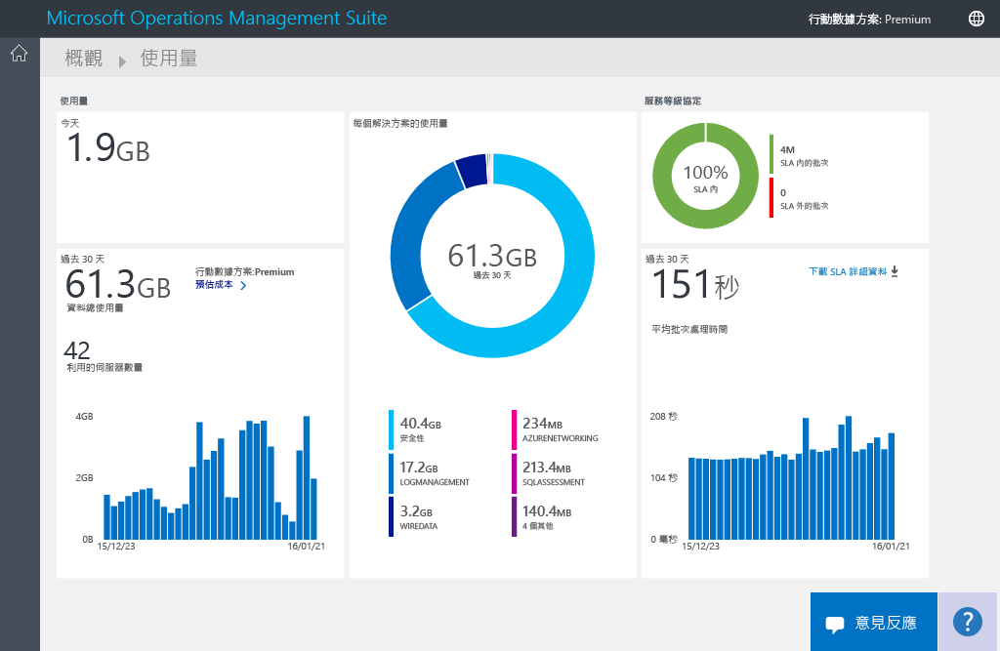
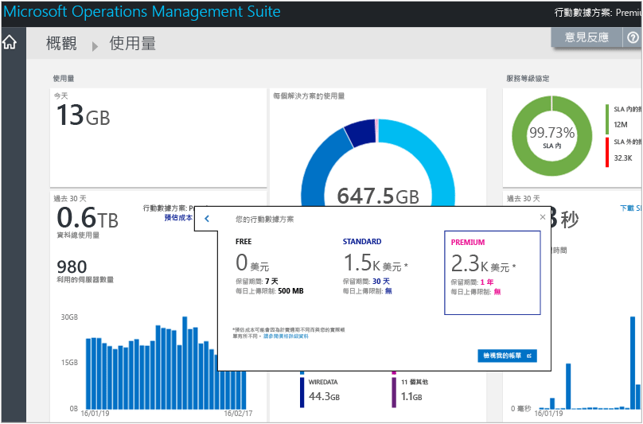
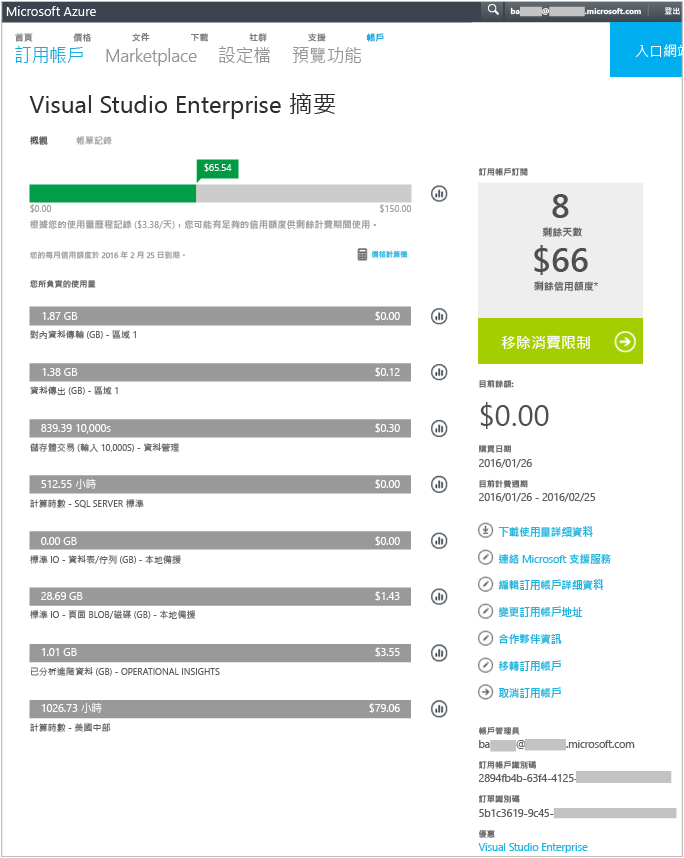
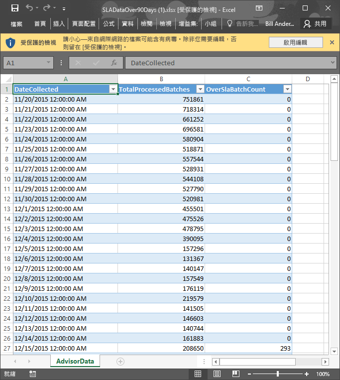

# 在 Log Analytics 中分析資料使用量
Operations Management Suite (OMS) 中的 Log Analytics 會收集資料，並定期傳送給 OMS 服務。  您可以使用 [使用量]  頁面，檢視正在傳送給 OMS 服務的資料量。 [使用量]  頁面也會顯示方案每日正在傳送的資料量，及您的伺服器正在傳送資料的頻率。

> [!NOTE]
> 如果您有一個使用 [OMS 網站](http://www.microsoft.com/oms)建立的免費帳戶，您每天只能將 500 MB 的資料傳送給 OMS 服務。 如果達到每日限制，資料分析會停止並在隔天開頭繼續分析。 您也需要重新傳送 OMS 不接受或未處理的資料。
> 
> 

您可以在 OMS 的 [概觀] 儀表板，使用 [使用量] 圖格來檢視您的使用量。

如果您已超過每日使用量上限，或如果接近限制，您可以選擇性地移除方案來減少傳送至 OMS 服務的資料量。 如需移除方案的詳細資訊，請參閱 [從方案庫加入 Log Analytics 方案](log-analytics-add-solutions.md)。

[使用量]  頁面會顯示以下資訊：

* 每日平均使用量
* 過去 30 天每個方案的資料使用量
* 您環境中的伺服器在過去 30 天傳送多少資料給 OMS 服務
* 您的行動數據方案定價層和預估成本
* 服務等級協定 (SLA) 的相關資訊，包括 OMS 處理您的資料所需的時間

## 處理使用量資料
1. 在 [概觀] 頁面上，按一下 [使用量] 圖格。
2. 在 [使用量]  頁面上檢視使用量類別，其顯示您關注的領域。
3. 如果您的方案會耗用太多每日上傳配額，可以考慮移除該方案。

## 檢視您的預估成本和帳單資訊
1. 在 [概觀] 頁面上，按一下 [使用量] 圖格。
2. 在 [使用量] 頁面的 [使用量] 下，按一下 [預估成本] 旁邊的 > 形箭號 (**>**)。
3. 在展開的 [行動數據方案]  詳細資訊中，您可以看到預估每月成本。  
    
4. 如果您想要檢視您的帳單資訊，請按一下 [檢視我的帳單]  來檢視您的訂用帳戶資訊。
   * 在 [訂用帳戶] 頁面中，按一下您的訂用帳戶，以檢視詳細資料和使用量的明細項目清單。  
       
   * 在您訂用帳戶的 [摘要] 頁面上，可以執行各種工作來管理和檢視您的訂用帳戶的更多詳細資料。  
       

## 檢視您的 SLA 的資料批次
1. 在 [概觀] 頁面上，按一下 [使用量] 圖格。
2. 在 [服務等級協定] 下，按一下 [下載 SLA 詳細資料]。
3. 會下載 Excel XLSX 檔案供您檢閱。  
    

## 後續步驟
* 請參閱 [Log Analytics 中的記錄搜尋](log-analytics-log-searches.md) 以檢視方案所收集的詳細資訊。

<!--HONumber=Oct16_HO2-->

