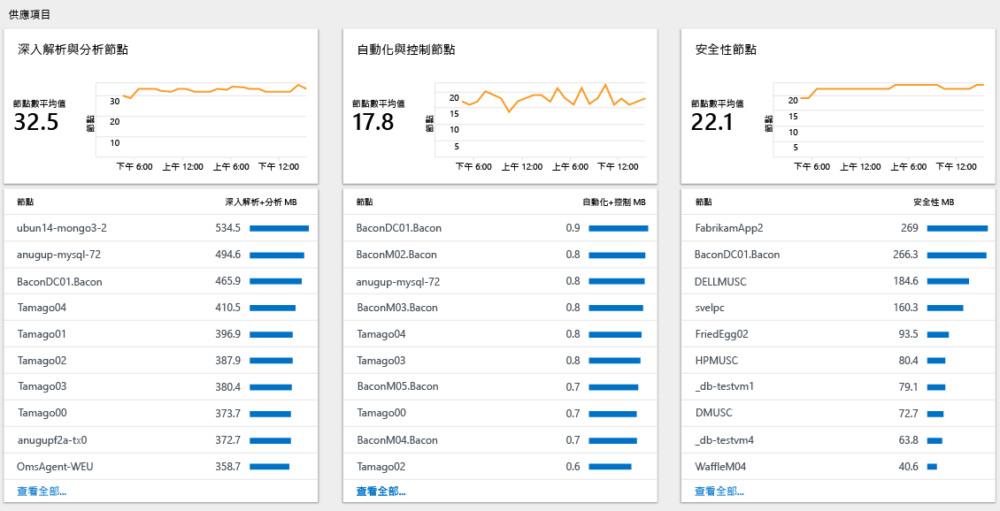

# 在 Log Analytics 中分析資料使用量
Log Analytics 會收集資料，並定期傳送給 OMS 服務。  您可以使用 [Log Analytics 使用量] 儀表板，檢視正在傳送給 OMS 服務的資料量。 儀表板也會顯示方案正在傳送的資料量，及您的伺服器正在傳送資料的頻率。

> [!NOTE]
> 如果您擁有的是免費帳戶，每天只能將 500 MB 的資料傳送給 OMS 服務。 如果達到每日限制，資料分析會停止並在隔天開頭繼續分析。 在這種情況下，您需要重新傳送 OMS 不接受或未處理的資料。

如果您已超過或接近每日使用量限制，可以選擇性地移除方案來減少傳送至 OMS 服務的資料量。 如需移除方案的詳細資訊，請參閱 [從方案庫加入 Log Analytics 方案](log-analytics-add-solutions.md)。

[Log Analytics 使用量] 儀表板會顯示下列資訊：

- 資料量
    - 一段時間 (根據您目前的時間範圍) 的資料量
    - 依方案分類的資料量
    - 與電腦不相關的資料
- 電腦
    - 傳送資料的電腦
    - 過去 24 小時內沒有資料的電腦
- 供應項目
    - 深入解析和分析節點
    - 自動化和控制節點
    - 安全性節點
- 效能
    - 收集資料和編制索引所花費的時間
- 查詢清單

## 了解 OMS 供應項目的節點

如果您是在「每節點 (OMS)」定價層上，系統便會根據您已啟用的節點和解決方案數目來向您收費。 您可以在使用量儀表板的 [供應項目] 區段中，查看每個供應項目目前使用的節點數。

## 處理使用量資料
1. 如果您尚未這麼做，請使用 Azure 訂用帳戶登入 [Azure 入口網站](https://portal.azure.com)。
2. 在 [中樞] 功能表上按一下 [更多服務]，然後在資源清單中輸入 **Log Analytics**。 當您開始輸入時，清單會根據您輸入的文字進行篩選。 按一下 [Log Analytics]。  
    
3. [Log Analytics] 儀表板會顯示您的工作區清單。 選取工作區。
4. 在 [工作區] 儀表板中，按一下 [Log Analytics 使用量]。
5. 在 [Log Analytics 使用量] 儀表板中，按一下 [時間︰過去 24 小時] 以變更時間間隔。  
    
6. 檢視顯示您感興趣之領域的使用量類別刀鋒視窗。 選擇刀鋒視窗，然後在其中按一下某個項目以在 [記錄檔搜尋] 中檢視詳細資料。  
    
7. 在 [記錄檔搜尋] 儀表板中，檢閱搜尋傳回的結果。  
    

## 後續步驟
* 查閱 [Log Analytics 中的記錄檔搜尋](log-analytics-log-searches.md)，以檢視功能和方案收集和傳送給 OMS 的詳細資訊。

